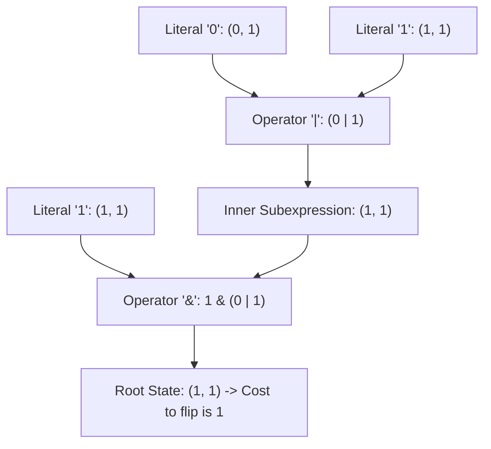

# Guided Example: Minimum Cost to Change the Final Value of Expression

We trace the boolean expression tree evaluation and dual-state inversion cost propagation on a representative logic instance:

- **Input:** `expression = "1&(0|1)"` (alongside `expression = "(0&0)&(0&0&0)"`)
- **Required Output:** `1` (and `3` for the second instance)

This instance demonstrates parsing boolean operator precedence with explicit parentheses, computing the natural evaluation value of each subexpression, tracking the minimum operation cost to flip the subexpression's truth value ($0 \leftrightarrow 1$), and synthesizing parent states via dynamic programming.

---

## 1. Instance & Teaching Goal

We are given a valid boolean expression consisting of `'0'`, `'1'`, `'&'`, `'|'`, `'('`, and `')'`.
In one operation, we may:
- Turn `'0'` into `'1'`, or `'1'` into `'0'`.
- Turn `'&'` into `'|'`, or `'|'` into `'&'`.

We want to find the minimum number of operations to change the boolean value of the entire expression.

For `expression = "1&(0|1)"`:
- Evaluate inner subexpression: `(0|1) = 1`.
- Evaluate full expression: `1 & 1 = 1`.
- Natural evaluated value: `1`.
- We want to change the final value from `1` to `0`.
- Option A: Change the leading literal `'1'` to `'0'`: `"0&(0|1)" = 0 & 1 = 0` (Cost: 1).
- Option B: Change `'&'` to `'|'`: `"1|(0|1)" = 1 | 1 = 1` (Doesn't change final value to 0).
- Option C: Change inner subexpression `(0|1)` from `1` to `0`: requires changing `'1'` to `'0'` and leaving `'|'`, giving `"0|0" = 0` (Cost: 1), so `"1&0" = 0` (Total cost: 1).
- Minimal cost to achieve a value of `0` is $1$.

The teaching goal is to understand **tree-based dynamic programming over boolean grammars**:
1. How every node in the expression tree can be summarized by a tuple $(v, c)$, where $v \in \{0, 1\}$ is its natural value and $c \ge 1$ is the minimum cost to invert $v \to 1 - v$.
2. How to combine two child states $(v_1, c_1)$ and $(v_2, c_2)$ under operator $op \in \{\&, \mid\}$.
3. Parsing the expression linearly using operator-precedence stacks in $\mathcal{O}(n)$ time.

---

## 2. Conceptual Foundation & Invariants

### Boolean Parse Tree Synthesis & Minimax Inversion Cost DP Theorem

> **Boolean Parse Tree Synthesis & Minimax Inversion Cost DP Theorem.**
> 1. *Dual State Representation:* For any subexpression $E$, let its state be represented as $(v, c) \in \{0, 1\} \times \mathbb{Z}^+$, where $v$ is the ground-truth boolean evaluation of $E$, and $c$ is the minimum operations required to make $E$ evaluate to $1 - v$.
> 2. *Leaf Base Cases:*
>    - Literal `'0'`: Natural value $0$, cost to become $1$ is $1$ (invert digit) $\implies (0, 1)$.
>    - Literal `'1'`: Natural value $1$, cost to become $0$ is $1$ (invert digit) $\implies (1, 1)$.
> 3. *Conjunction Composition ($op = \&$):*
>    - Natural value: $v = v_1 \land v_2$.
>    - Inversion cost to achieve $1 - v$:
>      - If $(v_1, v_2) = (1, 1)$ ($v = 1 \to 0$): Changing either child to 0 suffices without changing the operator:
>        $$c = \min(c_1, c_2)$$
>      - If $(v_1, v_2) = (0, 1)$ ($v = 0 \to 1$): We can flip child 1 to 1 ($c_1$), OR change $\&$ to $\mid$ ($1$ operation, since $0 \mid 1 = 1$):
>        $$c = \min(c_1, 1) = 1$$
>      - If $(v_1, v_2) = (1, 0)$ ($v = 0 \to 1$): Similarly, $c = \min(c_2, 1) = 1$.
>      - If $(v_1, v_2) = (0, 0)$ ($v = 0 \to 1$): We can flip both children ($c_1 + c_2$), OR flip operator to $\mid$ and flip either child ($1 + \min(c_1, c_2)$):
>        $$c = \min(c_1 + c_2, \; 1 + \min(c_1, c_2)) = 1 + \min(c_1, c_2)$$
> 4. *Disjunction Composition ($op = \mid$):* By De Morgan duality:
>    - If $(v_1, v_2) = (0, 0)$ ($v = 0 \to 1$): $c = \min(c_1, c_2)$.
>    - If $(v_1, v_2) \in \{(0, 1), (1, 0)\}$ ($v = 1 \to 0$): $c = 1$.
>    - If $(v_1, v_2) = (1, 1)$ ($v = 1 \to 0$): $c = 1 + \min(c_1, c_2)$.
> 5. *Complexity:* Parsing and evaluating via stacks takes $\mathcal{O}(n)$ time and $\mathcal{O}(n)$ auxiliary space.

---

## 3. Step-by-Step Worked Execution

We trace the bottom-up stack evaluation for `expression = "1&(0|1)"`:

---

### Step 1: Process Characters Left to Right
- Character 0: `'1'` $\implies$ Push operand state $(v=1, c=1)$ to operand stack.
- Character 1: `'&'` $\implies$ Push operator `'&'` to operator stack.
- Character 2: `'('` $\implies$ Push `'('` to operator stack.
- Character 3: `'0'` $\implies$ Push operand state $(v=0, c=1)$ to operand stack.
- Character 4: `'|'` $\implies$ Push operator `'|'` to operator stack.
- Character 5: `'1'` $\implies$ Push operand state $(v=1, c=1)$ to operand stack.

---

### Step 2: Evaluate Inside Parentheses Upon Seeing `')'`
At character 6 `')'`:
- Pop right child: $(v_2=1, c_2=1)$.
- Pop operator: `'|'`.
- Pop left child: $(v_1=0, c_1=1)$.
- Pop `'('` from operator stack.

Synthesize disjunction:
- Child values: $v_1 = 0, v_2 = 1$.
- Natural value: $v = 0 \lor 1 = 1$.
- Inversion cost: Since $(v_1, v_2) = (0, 1)$, we need value $0$.
  - Changing operator to $\&$ makes $0 \& 1 = 0$ (cost $1$).
  - Inversion cost: $c = 1$.
- Subexpression state: $(v=1, c=1)$.
- Push $(1, 1)$ back to operand stack.

---

### Step 3: Evaluate Top Conjunction
Operand stack now holds:
- Left child: $(v_1=1, c_1=1)$ (from initial `'1'`).
- Right child: $(v_2=1, c_2=1)$ (from `(0|1)`).
- Operator: `'&'`.

Synthesize conjunction:
- Child values: $v_1 = 1, v_2 = 1$.
- Natural value: $v = 1 \land 1 = 1$.
- Inversion cost: To invert $1 \to 0$ under $\&$, it suffices to invert either child:
  $$c = \min(c_1, c_2) = \min(1, 1) = 1$$
- Root state: $(v = 1, c = 1)$.

---

### Step 4: Final Result
- The final expression evaluates to `1`.
- The minimum operations to change the final value to `0` is $c = 1$.

---

## 4. Complete Execution Trace

| Step | Token | Operand Stack | Operator Stack | Action Taken |
|:---:|:---:|:---:|:---:|:---:|
| 1 | `'1'` | `[(1, 1)]` | `[]` | Push literal |
| 2 | `'&'` | `[(1, 1)]` | `['&']` | Push operator |
| 3 | `'('` | `[(1, 1)]` | `['&', '(']` | Push open parenthesis |
| 4 | `'0'` | `[(1, 1), (0, 1)]` | `['&', '(']` | Push literal |
| 5 | `'\|'` | `[(1, 1), (0, 1)]` | `['&', '(', '\|']` | Push operator |
| 6 | `'1'` | `[(1, 1), (0, 1), (1, 1)]` | `['&', '(', '\|']` | Push literal |
| 7 | `')'` | `[(1, 1), (1, 1)]` | `['&']` | Reduce `(0 \| 1)` $\to (1, 1)$ |
| 8 | End | `[(1, 1)]` | `[]` | Reduce `1 & (1, 1)` $\to (1, 1)$ |
| **Output** | - | - | - | **Extract inversion cost: 1** |

---

## 5. Algorithmic Correctness

**Soundness.** For each node, the state $(v, c)$ captures the exact truth value and the minimal perturbation cost. The case analysis covers all possible ways to invert the parent: flipping the operator, flipping child 1, flipping child 2, or both.

**Completeness.** By processing subexpressions according to standard operator precedence and parentheses scoping, every subtree is collapsed strictly bottom-up. No valid modification strategy is omitted.

---

## 6. Traps This Instance Exposes

- **Parentheses Reduction Timing:** In boolean expressions, `&` and `|` have the same precedence in LeetCode expressions (left-to-right evaluation within the same parenthetical depth). Parentheses must be matched and reduced immediately upon encountering `')'`.
- **Operator Flip vs Operand Flip:** For $(0, 1)$ under $\&$, one might assume inverting child 1 (cost $c_1$) is required, forgetting that simply changing $\&$ to $\mid$ yields $0 \mid 1 = 1$ with cost $1$. Taking the minimum $\min(c_1, 1) = 1$ ensures optimality.
- **Both Children Matching Target:** For $(0, 0)$ under $\&$, turning the expression into $1$ requires either flipping both children ($c_1 + c_2$), or flipping the operator and *one* child ($1 + \min(c_1, c_2)$). Both paths must be compared.

---

## 7. Complexity Derivation

- **Time Complexity:** $\mathcal{O}(n)$, where $n$ is the length of `expression`. Each character is pushed and popped from the stacks at most once.
- **Auxiliary Space Complexity:** $\mathcal{O}(n)$ to store the operand and operator stacks proportional to the expression depth.