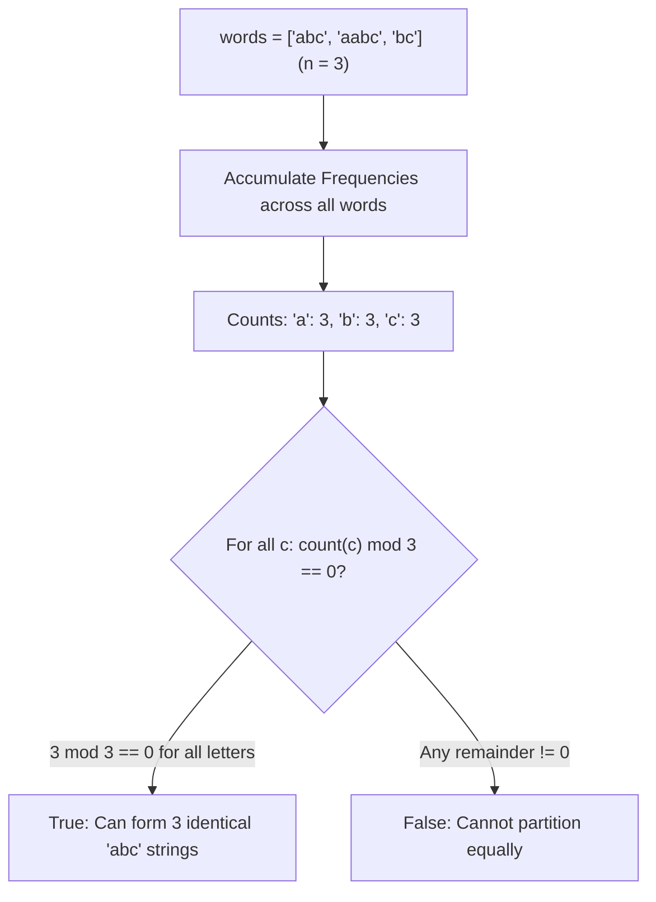

# Guided Example: Redistribute Characters to Make All Strings Equal

We trace multiset character frequency counting and modular divisibility checking on representative word collections:

- **Input:** `words = ["abc", "aabc", "bc"]` (alongside `words = ["ab", "a"]`)
- **Required Output:** `true` (and `false` for the counterexample)

This instance demonstrates counting global character occurrences across all strings, testing the necessary and sufficient condition that every distinct character count is an exact integer multiple of the array length $n$, and proving equal redistribution feasibility.

---

## 1. Instance & Teaching Goal

We are given an array of $n$ strings `words`. In one move, we can pick any character from any string and move it to any position in any other string (or the same string). We want to determine if all $n$ strings can be made identical.

For `words = ["abc", "aabc", "bc"]` ($n = 3$):
- Global characters present:
  - String 0 (`"abc"`): `'a' \to 1`, `'b' \to 1`, `'c' \to 1`
  - String 1 (`"aabc"`): `'a' \to 2`, `'b' \to 1`, `'c' \to 1`
  - String 2 (`"bc"`): `'a' \to 0`, `'b' \to 1`, `'c' \to 1`
- Aggregating across the corpus:
  - Total `'a'`: $1 + 2 + 0 = 3$
  - Total `'b'`: $1 + 1 + 1 = 3$
  - Total `'c'`: $1 + 1 + 1 = 3$
- Divisibility by $n = 3$:
  - $3 \pmod 3 = 0$ for `'a'`
  - $3 \pmod 3 = 0$ for `'b'`
  - $3 \pmod 3 = 0$ for `'c'`
- Every character can be partitioned into 3 equal shares of 1 `'a'`, 1 `'b'`, and 1 `'c'`, yielding three identical strings `"abc"`. The answer is `true`.

For `words = ["ab", "a"]` ($n = 2$):
- Total `'a'`: $1 + 1 = 2$ ($2 \pmod 2 = 0$)
- Total `'b'`: $1 + 0 = 1$ ($1 \pmod 2 = 1 \neq 0$)
- Character `'b'` cannot be distributed equally among 2 strings $\implies$ Output is `false`.

The teaching goal is to understand **multiset partition invariants**:
1. Why character moves preserve the total count of each character.
2. Why equality across $n$ strings requires each character count to be a multiple of $n$.
3. Verifying the condition in $\mathcal{O}(L)$ time where $L$ is the total number of characters.

---

## 2. Conceptual Foundation & Invariants

### Character Equipartition & Modular Divisibility Invariant Theorem

> **Character Equipartition & Modular Divisibility Invariant Theorem.**
> 1. *Multiset Conservation Invariant:* Character moves alter spatial arrangements but leave the global character multiset $\mathcal{M} = \biguplus_{i=0}^{n-1} words[i]$ strictly invariant.
> 2. *Equipartition Necessary Condition:* Suppose all $n$ strings can be made equal to a common target string $T$. Then every character $c \in \Sigma$ must appear in $T$ with frequency $k_c \ge 0$. The total occurrences of $c$ in the entire input is:
>    $$\text{count}(c) = n \cdot k_c \implies \text{count}(c) \equiv 0 \pmod n$$
> 3. *Equipartition Sufficient Condition:* If every character count satisfies $\text{count}(c) \equiv 0 \pmod n$, we can construct $n$ identical strings by allocating exactly $k_c = \text{count}(c) / n$ copies of each character $c$ to every string.
> 4. *Exact Decision Rule:*
>    $$\text{Feasible} \iff \forall c \in \Sigma, \quad \text{count}(c) \pmod n == 0$$
> 5. *Complexity:* Scanning all strings takes $\mathcal{O}(\sum |words[i]|)$ time. Checking divisibility takes $\mathcal{O}(|\Sigma|) = \mathcal{O}(26)$ time. Auxiliary space is $\mathcal{O}(|\Sigma|) = \mathcal{O}(1)$.

---

## 3. Step-by-Step Worked Execution

We trace `words = ["abc", "aabc", "bc"]`:
- Array size: $n = 3$.
- Alphabet: lowercase English letters $\Sigma = \{a \dots z\}$.

---

### Step 1: Accumulate Frequency Map
Initialize frequency counters to $0$.
- Process `words[0] = "abc"`:
  - $\text{count}['a'] \leftarrow 1$
  - $\text{count}['b'] \leftarrow 1$
  - $\text{count}['c'] \leftarrow 1$
- Process `words[1] = "aabc"`:
  - $\text{count}['a'] \leftarrow 1 + 2 = 3$
  - $\text{count}['b'] \leftarrow 1 + 1 = 2$
  - $\text{count}['c'] \leftarrow 1 + 1 = 2$
- Process `words[2] = "bc"`:
  - $\text{count}['b'] \leftarrow 2 + 1 = 3$
  - $\text{count}['c'] \leftarrow 2 + 1 = 3$

Final non-zero character counts:
- `'a'`: $3$
- `'b'`: $3$
- `'c'`: $3$

---

### Step 2: Test Divisibility by $n = 3$
- Character `'a'`:
  $$3 \pmod 3 = 0 \quad (\textbf{Pass})$$
- Character `'b'`:
  $$3 \pmod 3 = 0 \quad (\textbf{Pass})$$
- Character `'c'`:
  $$3 \pmod 3 = 0 \quad (\textbf{Pass})$$

All character counts are exact multiples of $3$.
Output: `true`.

---

## 4. Complete Execution Trace

| Character $c$ | In `"abc"` | In `"aabc"` | In `"bc"` | Total Count | Modular Check ($3 \pmod 3$) | Divisible? |
|:---:|:---:|:---:|:---:|:---:|:---:|:---:|
| `'a'` | 1 | 2 | 0 | **3** | $3 \pmod 3 = 0$ | **Yes** |
| `'b'` | 1 | 1 | 1 | **3** | $3 \pmod 3 = 0$ | **Yes** |
| `'c'` | 1 | 1 | 1 | **3** | $3 \pmod 3 = 0$ | **Yes** |
| **Conclusion** | - | - | - | - | All residues 0 | **Return true** |

---

## 5. Algorithmic Correctness

**Soundness.** The total count of each character is an invariant under any move. If all $n$ strings are identical, every character must appear an integer number of times in each string, which forces the global count to be a multiple of $n$.

**Completeness.** Divisibility is sufficient because characters can be placed anywhere. Distributing $k_c$ copies of each character $c$ to each string constructs $n$ identical strings.

---

## 6. Traps This Instance Exposes

- **Position Constraints:** The problem allows moving characters to *any* position in *any* string. Therefore, original string lengths and character orders do not constrain the outcome; only total character counts matter.
- **Single String Input ($n = 1$):** When $n = 1$, any number modulo $1$ is $0$, correctly returning `true` since a single string is already identical to itself.
- **Early Exit:** As soon as any character count has $\text{count}(c) \pmod n \neq 0$, the check can immediately terminate and return `false`.

---

## 7. Complexity Derivation

- **Time Complexity:** $\mathcal{O}(L)$, where $L = \sum |words[i]|$ is the total number of characters across all words. Aggregating frequencies takes linear time, and checking 26 alphabet buckets takes $\mathcal{O}(1)$ time.
- **Auxiliary Space Complexity:** $\mathcal{O}(1)$ auxiliary space, using a fixed-size frequency array of 26 integers.
