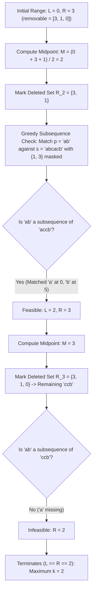

# Guided Example: Maximum Number of Removable Characters

We trace binary search over removal counts and two-pointer greedy subsequence validation on representative deletion instances:

- **Input:** `s = "abcacb"`, `p = "ab"`, `removable = [3, 1, 0]`
- **Required Output:** `2`

This instance demonstrates modeling the removable prefix length $k$ as a monotonic decision problem, constructing the active character mask for candidate $k$, validating whether $p$ remains a subsequence using two pointers in linear time, and finding the maximal valid $k$ via binary search.

---

## 1. Instance & Teaching Goal

We are given two strings `s` and `p` (where `p` is initially a subsequence of `s`), and an array `removable` of distinct indices from `s`.
We must choose the largest integer $k \in [0, |\text{removable}|]$ such that after removing the characters at indices $\text{removable}[0 \dots k - 1]$ from `s`, `p` is still a subsequence of `s`.

For `s = "abcacb"`, `p = "ab"`, and `removable = [3, 1, 0]`:
- String indices:
  - Index 0: `'a'`
  - Index 1: `'b'`
  - Index 2: `'c'`
  - Index 3: `'a'`
  - Index 4: `'c'`
  - Index 5: `'b'`
- Testing $k = 2$:
  - Remove indices $\text{removable}[0 \dots 1] = \{3, 1\}$.
  - Deleted: `'b'` at index 1 and `'a'` at index 3.
  - Surviving characters: index 0 (`'a'`), index 2 (`'c'`), index 4 (`'c'`), index 5 (`'b'`).
  - Surviving string: `"accb"`.
  - Is `"ab"` a subsequence of `"accb"`?
    - Match `'a'` at surviving index 0.
    - Match `'b'` at surviving index 5.
    - All characters of `p` matched in order $\implies$ **Feasible**.
- Testing $k = 3$:
  - Remove indices $\{3, 1, 0\}$.
  - Deleted: `'a'` at index 3, `'b'` at index 1, `'a'` at index 0.
  - Surviving characters: `"ccb"`.
  - Can `"ab"` be formed? There are no `'a'` characters remaining! $\implies$ **Infeasible**.
- The maximum achievable $k$ is $2$.

The teaching goal is to understand **bisection over monotone subsequence preservation**:
1. Proving that if $p$ survives removing $k$ characters, it strictly survives removing any $k' < k$ characters (Monotonicity).
2. Using binary search over $k \in [0, |\text{removable}|]$ to reduce candidate evaluations from $\mathcal{O}(|\text{removable}|)$ to $\mathcal{O}(\log |\text{removable}|)$.
3. Evaluating the feasibility of a candidate $k$ in $\mathcal{O}(|s|)$ time via a two-pointer greedy match.

---

## 2. Conceptual Foundation & Invariants

### Subsequence Monotonicity & Removable Index Bisection Theorem

> **Subsequence Monotonicity & Removable Index Bisection Theorem.**
> 1. *Deletion Set Monotonicity:* Let $R_k = \{ \text{removable}[0], \dots, \text{removable}[k-1] \}$ denote the set of deleted indices for prefix length $k$. For any $k_1 < k_2$:
>    $$R_{k_1} \subset R_{k_2} \implies (s \setminus R_{k_2}) \text{ is a subsequence of } (s \setminus R_{k_1})$$
> 2. *Monotonic Predicate:* Define the feasibility predicate $P(k)$ as:
>    $$P(k) \iff p \text{ is a subsequence of } (s \setminus R_k)$$
>    Since the subsequence relation is transitive, $P(k_2) = \text{True} \implies P(k_1) = \text{True}$. Hence $P(k)$ is a non-increasing boolean function over $k \in [0, |\text{removable}|]$.
> 3. *Maximal Boundary Bisection:* There exists a unique boundary $k^*$ such that $P(k) = \text{True}$ for all $k \le k^*$ and $P(k) = \text{False}$ for all $k > k^*$. Bisection identifies $k^*$ in $\lfloor \log_2 |\text{removable}| \rfloor + 1$ evaluations.
> 4. *Greedy Subsequence Validation:* Given mask $R_k$, matching $p$ against surviving characters of $s$ greedily at the earliest available match is optimal and runs in $\mathcal{O}(|s|)$ time.
> 5. *Complexity:* Total time is $\mathcal{O}(|s| \log |\text{removable}|)$. Auxiliary space is $\mathcal{O}(|s|)$ for the deletion boolean mask.

---

## 3. Step-by-Step Worked Execution

We trace `s = "abcacb"`, `p = "ab"`, `removable = [3, 1, 0]`:
- Length of `removable`: $m = 3$.
- Search range: $L = 0, R = 3$.

---

### Step 1: Iteration 1 ($L = 0, R = 3$)
- Candidate midpoint:
  $$M = \left\lfloor \frac{0 + 3 + 1}{2} \right\rfloor = 2$$
- Mask indices: $R_2 = \{\text{removable}[0], \text{removable}[1]\} = \{3, 1\}$.
- Two-pointer traversal over $s$:
  - Pointer $i = 0$: $0 \notin R_2$, $s[0] = 'a' == p[0] = 'a'$. Match! Advance $p$ pointer to $j = 1$.
  - Pointer $i = 1$: $1 \in R_2$ (Deleted, skip).
  - Pointer $i = 2$: $2 \notin R_2$, $s[2] = 'c' \neq p[1] = 'b'$. Advance $i$.
  - Pointer $i = 3$: $3 \in R_2$ (Deleted, skip).
  - Pointer $i = 4$: $4 \notin R_2$, $s[4] = 'c' \neq p[1] = 'b'$. Advance $i$.
  - Pointer $i = 5$: $5 \notin R_2$, $s[5] = 'b' == p[1] = 'b'$. Match! Advance $p$ pointer to $j = 2$.
- All $|p| = 2$ characters matched! $P(2) = \text{True}$.
- Contract search space to upper half: $L = M = 2$.

---

### Step 2: Iteration 2 ($L = 2, R = 3$)
- Candidate midpoint:
  $$M = \left\lfloor \frac{2 + 3 + 1}{2} \right\rfloor = 3$$
- Mask indices: $R_3 = \{3, 1, 0\}$.
- Two-pointer traversal over $s$:
  - Pointer $i = 0$: $0 \in R_3$ (Deleted, skip).
  - Pointer $i = 1$: $1 \in R_3$ (Deleted, skip).
  - Pointer $i = 2$: $2 \notin R_3$, $s[2] = 'c' \neq p[0] = 'a'$.
  - Pointer $i = 3$: $3 \in R_3$ (Deleted, skip).
  - Pointer $i = 4$: $4 \notin R_3$, $s[4] = 'c' \neq p[0] = 'a'$.
  - Pointer $i = 5$: $5 \notin R_3$, $s[5] = 'b' \neq p[0] = 'a'$.
- End of string reached with $j = 0 < 2$. $P(3) = \text{False}$.
- Contract search space to lower half: $R = M - 1 = 2$.

---

### Step 3: Termination
- Pointers converge: $L = 2, R = 2$.
- Maximal removable characters: $k = 2$.

---

## 4. Complete Execution Trace

| Iteration | Range $[L, R]$ | Midpoint $M$ | Deleted Indices $R_M$ | Surviving String Sequence | Matched Characters of $p$ | Feasible? | Next Range |
|:---:|:---:|:---:|:---:|:---:|:---:|:---:|:---:|
| 1 | $[0, 3]$ | 2 | $\{3, 1\}$ | `s[0]='a', s[2]='c', s[4]='c', s[5]='b'` | `'a'` (idx 0), `'b'` (idx 5) | **Yes** | $[2, 3]$ |
| 2 | $[2, 3]$ | 3 | $\{3, 1, 0\}$ | `s[2]='c', s[4]='c', s[5]='b'` | None (looking for `'a'`) | No | $[2, 2]$ |
| **End** | $[2, 2]$ | - | - | - | - | - | **Return 2** |

---

## 5. Algorithmic Correctness

**Soundness.** A candidate $k$ is marked feasible only if the two-pointer scan explicitly verifies that each character of $p$ appears in order among the surviving characters of $s$.

**Completeness.** Monotonicity ensures that if removing $M$ characters breaks the subsequence property, removing any $M' > M$ characters will also fail. Thus, discarding $k \ge M$ preserves the optimal solution.

---

## 6. Traps This Instance Exposes

- **Linear Removal Simulation:** Re-building the surviving string as a new string of size $|s| - k$ at each step takes $\mathcal{O}(|s|)$ string allocations. Using an indexed boolean mask array avoids allocation overhead.
- **Midpoint Ceiling Bias:** When searching for the maximum value in a range $[L, R]$, the standard lower midpoint $M = \lfloor (L + R) / 2 \rfloor$ can loop infinitely when $R = L + 1$ if $L$ is assigned $M$. Using $M = \lfloor (L + R + 1) / 2 \rfloor$ ensures progress.
- **Subsequence vs Substring:** `p` must be a *subsequence* (characters appear in order, not necessarily contiguously). In `"accb"`, `'a'` and `'b'` are separated by `'c'`s, but form a valid subsequence.

---

## 7. Complexity Derivation

- **Time Complexity:** $\mathcal{O}(|s| \log |\text{removable}|)$. The binary search runs in $\mathcal{O}(\log |\text{removable}|)$ steps, and each step scans $s$ once in $\mathcal{O}(|s|)$ time.
- **Auxiliary Space Complexity:** $\mathcal{O}(|s|)$ auxiliary space for the boolean array indicating deleted positions.
