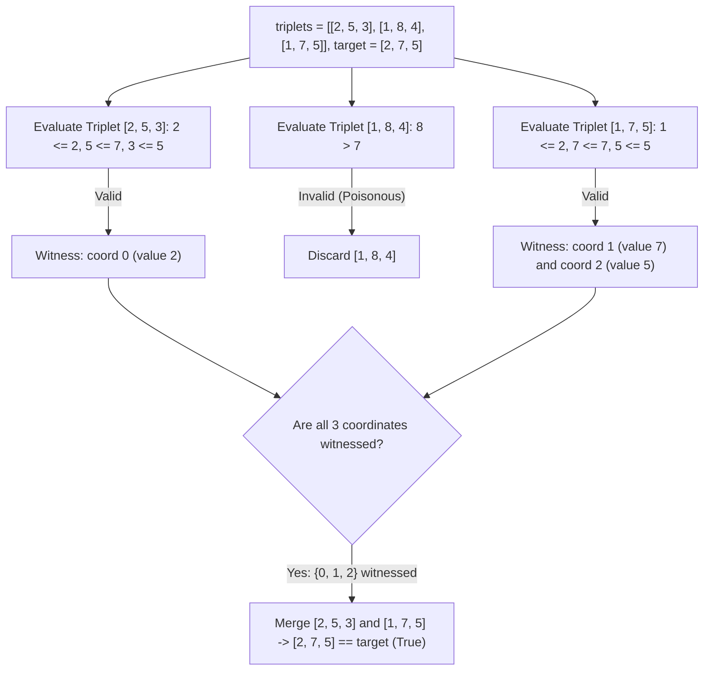

# Guided Example: Merge Triplets to Form Target Triplet

We trace coordinate dominance pruning, safe triplet filtering, and coordinate-wise supremum aggregation on representative triplet collections:

- **Input:** `triplets = [[2, 5, 3], [1, 8, 4], [1, 7, 5]]`, `target = [2, 7, 5]` (alongside `triplets = [[3, 4, 5], [4, 5, 6]]`, `target = [3, 2, 5]`)
- **Required Output:** `true` (and `false` for the second instance)

This instance demonstrates identifying and discarding invalid triplets that exceed any coordinate of `target`, accumulating component-wise maximums over all admissible triplets, and verifying whether all three coordinates of `target` are simultaneously attained.

---

## 1. Instance & Teaching Goal

We are given a list of 3D integer vectors `triplets` and a target vector `target = [x, y, z]`. We can repeatedly pick any two triplets $u$ and $v$ and replace them with their element-wise maximum:
$$w = [\max(u_0, v_0), \max(u_1, v_1), \max(u_2, v_2)]$$
We want to determine if `target` can be formed.

For `triplets = [[2, 5, 3], [1, 8, 4], [1, 7, 5]]` and `target = [2, 7, 5]`:
- Consider triplet `[1, 8, 4]`:
  - The second component is $8 > 7$.
  - Because the merge operation uses $\max$, any combination that includes `[1, 8, 4]` will permanently have a second component $\ge 8$. It can never be reduced to $7$.
  - Thus, `[1, 8, 4]` is **poisonous** and cannot be used in any valid merge.
- Consider triplet `[2, 5, 3]`:
  - Components $2 \le 2, 5 \le 7, 3 \le 5$. All within target boundaries $\implies$ **Admissible**.
  - Matches the first target coordinate: $2 == x$.
- Consider triplet `[1, 7, 5]`:
  - Components $1 \le 2, 7 \le 7, 5 \le 5$. All within target boundaries $\implies$ **Admissible**.
  - Matches the second target coordinate: $7 == y$, and third: $5 == z$.
- Merging the two admissible triplets:
  $$[\max(2, 1), \max(5, 7), \max(3, 5)] = [2, 7, 5]$$
- Exactly matches `target`! The output is `true`.

The teaching goal is to understand **component-wise monotonic filtering**:
1. Why any triplet with $a_i > x \lor b_i > y \lor c_i > z$ must be strictly discarded.
2. Why all surviving triplets can be safely merged together without penalty.
3. Reducing the decision problem to checking whether each target coordinate is witnessed by at least one admissible triplet in a single linear pass.

---

## 2. Conceptual Foundation & Invariants

### Monotonic Supremum Preservation & Coordinate-Wise Feasibility Theorem

> **Monotonic Supremum Preservation & Coordinate-Wise Feasibility Theorem.**
> 1. *Coordinate Monotonicity:* The binary merge operator $\oplus: \mathbb{R}^3 \times \mathbb{R}^3 \to \mathbb{R}^3$ defined by $(u \oplus v)_k = \max(u_k, v_k)$ is monotonic:
>    $$\forall k \in \{0, 1, 2\}, \quad (u \oplus v)_k \ge u_k \quad \text{and} \quad (u \oplus v)_k \ge v_k$$
> 2. *Admissibility Filter:* If a triplet $t$ has $t_k > \text{target}_k$ for any coordinate $k$, then any composite vector $W$ containing $t$ will satisfy $W_k \ge t_k > \text{target}_k$. Hence, $t$ cannot participate in forming `target`. The admissible candidate pool is:
>    $$\mathcal{A} = \{ t \in \text{triplets} \mid t_0 \le x \land t_1 \le y \land t_2 \le z \}$$
> 3. *Supremum Closure:* Because all elements in $\mathcal{A}$ are bounded above by `target`, merging any subset of $\mathcal{A}$ never exceeds `target`. In particular, merging all vectors in $\mathcal{A}$ achieves the coordinate-wise supremum:
>    $$S_k = \max_{t \in \mathcal{A}} t_k \le \text{target}_k$$
> 4. *Decoupled Witness Condition:* `target` is achievable if and only if every coordinate achieves its upper bound:
>    $$S_0 = x \land S_1 = y \land S_2 = z \iff \exists t^{(0)}, t^{(1)}, t^{(2)} \in \mathcal{A} \text{ s.t. } t^{(0)}_0 = x, \; t^{(1)}_1 = y, \; t^{(2)}_2 = z$$
> 5. *Complexity:* Filtering and tracking coordinate witnesses takes $\mathcal{O}(n)$ time and $\mathcal{O}(1)$ auxiliary space.

---

## 3. Step-by-Step Worked Execution

We trace `triplets = [[2, 5, 3], [1, 8, 4], [1, 7, 5]]` with `target = [2, 7, 5]`:
- Target bounds: $x = 2, y = 7, z = 5$.
- Witness flags: $\text{found}_0 = \text{False}, \text{found}_1 = \text{False}, \text{found}_2 = \text{False}$.

---

### Step 1: Process Triplet 0 `[2, 5, 3]`
- Coordinate bounds check:
  - $2 \le 2$ (Satisfied)
  - $5 \le 7$ (Satisfied)
  - $3 \le 5$ (Satisfied)
  - Triplet is **Admissible**.
- Check coordinate matches:
  - $2 == x \implies \text{found}_0 = \text{True}$.
  - $5 \neq y$ (No match for coordinate 1).
  - $3 \neq z$ (No match for coordinate 2).
- Witness status: $\text{found} = [\text{True}, \text{False}, \text{False}]$.

---

### Step 2: Process Triplet 1 `[1, 8, 4]`
- Coordinate bounds check:
  - $1 \le 2$ (Satisfied)
  - $8 > 7$ (**Violation!** Component 1 exceeds target $y = 7$)
- Discard `[1, 8, 4]` completely.
- Witness status remains: $\text{found} = [\text{True}, \text{False}, \text{False}]$.

---

### Step 3: Process Triplet 2 `[1, 7, 5]`
- Coordinate bounds check:
  - $1 \le 2$ (Satisfied)
  - $7 \le 7$ (Satisfied)
  - $5 \le 5$ (Satisfied)
  - Triplet is **Admissible**.
- Check coordinate matches:
  - $1 \neq x$ (No match for coordinate 0).
  - $7 == y \implies \text{found}_1 = \text{True}$.
  - $5 == z \implies \text{found}_2 = \text{True}$.
- Witness status: $\text{found} = [\text{True}, \text{True}, \text{True}]$.

---

### Step 4: Decision Evaluation
- All three coordinates are witnessed by admissible triplets:
  - Coordinate 0 witnessed by `[2, 5, 3]`.
  - Coordinate 1 witnessed by `[1, 7, 5]`.
  - Coordinate 2 witnessed by `[1, 7, 5]`.
- Output: `true`.

---

## 4. Complete Execution Trace

| Triplet | $a \le 2$? | $b \le 7$? | $c \le 5$? | Admissible? | Matches $x = 2$? | Matches $y = 7$? | Matches $z = 5$? | Witness Status |
|:---:|:---:|:---:|:---:|:---:|:---:|:---:|:---:|:---:|
| `[2, 5, 3]` | Yes | Yes | Yes | **Yes** | **Yes** | No | No | `[True, False, False]` |
| `[1, 8, 4]` | Yes | **No** ($8 > 7$) | Yes | *Discarded* | - | - | - | `[True, False, False]` |
| `[1, 7, 5]` | Yes | Yes | Yes | **Yes** | No | **Yes** | **Yes** | `[True, True, True]` |
| **Result** | - | - | - | - | - | - | - | **Return true** |

---

## 5. Algorithmic Correctness

**Soundness.** Discarding triplets with any coordinate strictly exceeding the target is mandatory because the $\max$ operation cannot decrease coordinate values. Any merged subset of admissible triplets is guaranteed never to exceed target.

**Completeness.** Since the merge of all admissible triplets yields the maximal possible value in each coordinate without exceeding target, finding at least one admissible triplet achieving the exact target value for each coordinate guarantees that their composite merge equals `target`.

---

## 6. Traps This Instance Exposes

- **Greedy Pair Selection Trap:** One does not need to search for a pair of triplets. Any number of admissible triplets can be merged sequentially. The problem reduces to independent boolean coverage across the three coordinates.
- **Poisonous Triplet with Matching Values:** A triplet might match a target coordinate (e.g. $[2, 9, 1]$ has $2 == x$), but because its second component exceeds $y$ ($9 > 7$), it cannot be used. Validating admissibility *before* counting matches is crucial.
- **Early Exit:** Once all three flags `[True, True, True]` are set, the algorithm can terminate immediately without inspecting remaining triplets.

---

## 7. Complexity Derivation

- **Time Complexity:** $\mathcal{O}(n)$, where $n$ is the number of triplets. Each triplet is verified and processed in $\mathcal{O}(1)$ time.
- **Auxiliary Space Complexity:** $\mathcal{O}(1)$, requiring only three boolean flags.
