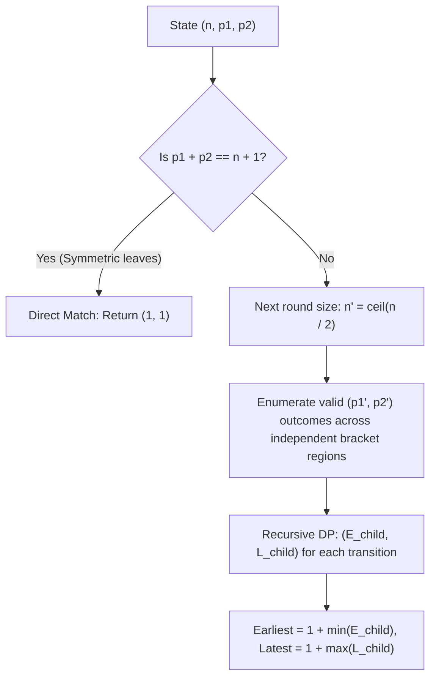

# Guided Example: The Earliest and Latest Rounds Where Players Compete

We trace knockout tournament bracket transitions, player rank remapping, and recursive min/max round search on representative tournament instances:

- **Input:** `n = 11`, `firstPlayer = 2`, `secondPlayer = 4` (alongside `n = 5`, `firstPlayer = 1`, `secondPlayer = 5`)
- **Required Output:** `[3, 4]` (and `[1, 1]` for the direct confrontation)

This instance demonstrates modeling tournament rounds as a bracket contraction $n \to \lceil n / 2 \rceil$, detecting base-case collisions when $p_1 + p_2 = n + 1$, enumerating all possible winner distributions among non-favorite matches, and finding the earliest and latest rounds of direct encounter via memoized dynamic programming.

---

## 1. Instance & Teaching Goal

In an $n$-player single-elimination tournament:
- In each round, player $i$ faces player $n + 1 - i$ for all $1 \le i \le \lfloor n / 2 \rfloor$.
- If $n$ is odd, the middle player $\lceil n / 2 \rceil$ automatically advances without playing.
- All surviving winners advance to the next round, retaining their relative sorted order ($1 \dots \lceil n / 2 \rceil$).
- `firstPlayer` ($p_1$) and `secondPlayer` ($p_2$) always defeat any other player.
- If they are paired against each other ($p_1 + p_2 = n + 1$), they play, and the tournament ceases tracking further rounds.
- For all other matches, either player can win.

We seek the minimum and maximum possible round numbers where $p_1$ and $p_2$ face each other.

For `n = 5`, `p1 = 1`, `p2 = 5`:
- Bracket pairings in Round 1:
  - Match 1: Player $1$ vs Player $5 - 1 + 1 = 5$.
  - Match 2: Player $2$ vs Player $4$.
  - Player $3$ has a bye.
- `firstPlayer` ($1$) and `secondPlayer` ($5$) are paired in Round 1 because $1 + 5 = 6 = 5 + 1$.
- They face each other immediately in Round 1. Earliest = 1, Latest = 1 $\implies [1, 1]$.

For `n = 11`, `p1 = 2`, `p2 = 4`:
- $2 + 4 = 6 \neq 12$, so they do not face each other in Round 1.
- Depending on which players win the non-favorite matches, their new ranks in Round 2 ($n = 6$) can vary.
- Systematic exploration of all branch outcomes reveals:
  - Earliest round they can meet: Round 3.
  - Latest round they can meet: Round 4.
  - Output: `[3, 4]`.

The teaching goal is to understand **bracket state-space dynamic programming**:
1. Identifying the terminal condition $p_1 + p_2 == n + 1$.
2. Decomposing matches into independent regions (left of $p_1$, between $p_1$ and $p_2$, and right of $p_2$).
3. Enumerating all valid rank transitions $(n, p_1, p_2) \to (\lceil n / 2 \rceil, p'_1, p'_2)$ and aggregating $\min$ and $\max$ round counts.

---

## 2. Conceptual Foundation & Invariants

### Knockout Bracket State Space & Minimax Competing Round DP Theorem

> **Knockout Bracket State Space & Minimax Competing Round DP Theorem.**
> 1. *Terminal Collision Invariant:* In an $n$-player round, player $p_1$ faces player $p_2$ if and only if they occupy symmetric bracket leaves:
>    $$p_1 + p_2 = n + 1$$
>    When this condition is met in round $r$, the tournament terminates with outcome $(r, r)$.
> 2. *Bracket Size Contraction:* The number of advancing players in the subsequent round is:
>    $$n' = \left\lceil \frac{n}{2} \right\rceil = \left\lfloor \frac{n + 1}{2} \right\rfloor$$
> 3. *Rank Remapping Under Nondeterministic Winners:*
>    Let $m = \lfloor n / 2 \rfloor$. Every match $k \in [1, m]$ contributes exactly one winner to the next round.
>    Because $p_1$ and $p_2$ always win their respective matches:
>    - Let $i_1$ be the number of winners from the first $p_1 - 1$ matches whose index is $\le m$. Then $p'_1 = i_1 + 1$.
>    - The new rank $p'_2$ depends on how many winners in the intervening matches fall before $p_2$'s advancing position.
> 4. *Optimal Minimax Bounds:* Let $DP(n, p_1, p_2) = (E, L)$ denote the earliest and latest rounds from state $(n, p_1, p_2)$:
>    $$E = 1 + \min_{(p'_1, p'_2)} E(n', p'_1, p'_2), \quad L = 1 + \max_{(p'_1, p'_2)} L(n', p'_1, p'_2)$$
> 5. *Complexity:* Since $n \le 28$, the number of rounds is at most $\lceil \log_2 28 \rceil = 5$. The total number of reachable states $(n, p_1, p_2)$ is bounded by $\sum_{k=1}^5 k^2 \le 500$, executing in milliseconds with memoization.

---

## 3. Step-by-Step Worked Execution

We trace `n = 11`, `p1 = 2`, `p2 = 4`:

---

### Step 1: Round 1 Initial State $(11, 2, 4)$
- Bracket matches for $n = 11$:
  - Match 1: Player 1 vs Player 11
  - Match 2: Player 2 ($p_1$) vs Player 10 ($p_1$ wins)
  - Match 3: Player 3 vs Player 9
  - Match 4: Player 4 ($p_2$) vs Player 8 ($p_2$ wins)
  - Match 5: Player 5 vs Player 7
  - Bye: Player 6 advances automatically
- Check collision: $2 + 4 = 6 \neq 12$. They do not play each other in Round 1.
- Next round size: $n' = \lceil 11 / 2 \rceil = 6$.

---

### Step 2: Enumerate Round 2 Ranks $(p'_1, p'_2)$
- **Region 1 (left of $p_1$):** Match 1 (Player 1 vs Player 11).
  - Possibility A: Player 1 wins $\implies 1$ winner before $p_1 \implies p'_1 = 2$.
  - Possibility B: Player 11 wins $\implies 0$ winners before $p_1 \implies p'_1 = 1$.
  - Thus, $p'_1 \in \{1, 2\}$.
- **Region 2 (between $p_1$ and $p_2$):** Match 3 (Player 3 vs Player 9).
  - Possibility A: Player 3 wins $\implies 1$ winner between $p_1$ and $p_2$.
  - Possibility B: Player 9 wins $\implies 0$ winners between $p_1$ and $p_2$.
- Combining outcomes:
  - If Player 11 wins and Player 9 wins: $p'_1 = 1, p'_2 = 2$.
  - If Player 1 wins and Player 9 wins: $p'_1 = 2, p'_2 = 3$.
  - If Player 11 wins and Player 3 wins: $p'_1 = 1, p'_2 = 3$.
  - If Player 1 wins and Player 3 wins: $p'_1 = 2, p'_2 = 4$.

---

### Step 3: Explore Branches in Round 2 ($n' = 6$)

#### Branch A: State $(6, 1, 3)$
- Next round size: $n'' = 3$.
- In round with $n = 6$:
  - Match 1: 1 vs 6 ($p_1$ wins).
  - Match 2: 2 vs 5.
  - Match 3: 3 vs 4 ($p_2$ is 3, paired with 4).
- Neither branch pairs them ($1 + 3 = 4 \neq 7$).
- Continuing down this branch reaches Round 3 where $n'' = 3$:
  - $p'_1 = 1, p'_2 = 2 \implies 1 + 2 = 3 \neq 4$.
  - Leads to meeting in Round 4.

#### Branch B: State $(6, 2, 4)$
- Check collision for $n = 6$:
  $$2 + 4 = 6 \neq 7$$
- In Round 2 with $n = 6$:
  - Match 1: 1 vs 6.
  - Match 2: 2 ($p_1$) vs 5 ($p_1$ wins).
  - Match 3: 3 vs 4 ($p_2$).
- In Round 3 ($n'' = 3$):
  - Winners advance. Both $p_1$ and $p_2$ reach ranks where they face each other in Round 3 ($p'_1 = 1, p'_2 = 3$ with $n = 3 \implies 1 + 3 = 4$).
  - Confrontation occurs in Round 3!

---

### Step 4: Synthesizing Min and Max
Across all valid branching paths:
- Minimum rounds to collision: $\min = 3$.
- Maximum rounds to collision: $\max = 4$.
- Output: `[3, 4]`.

---

## 4. Complete Execution Trace

| Round $r$ | Size $n$ | Player Ranks $(p_1, p_2)$ | Collision Check ($p_1 + p_2 == n + 1$) | Action / Result |
|:---:|:---:|:---:|:---:|:---:|
| 1 | 11 | $(2, 4)$ | $2 + 4 = 6 \neq 12$ | No match; advance to $n' = 6$ |
| 2 (Fast Path) | 6 | $(2, 4)$ | $2 + 4 = 6 \neq 7$ | Advance to $n'' = 3$ |
| 3 (Fast Path) | 3 | $(1, 3)$ | $1 + 3 = 4 == 3 + 1$ | **Collision! Round 3 reached** |
| 2 (Slow Path) | 6 | $(1, 2)$ | $1 + 2 = 3 \neq 7$ | Advance to $n'' = 3$ |
| 3 (Slow Path) | 3 | $(1, 2)$ | $1 + 2 = 3 \neq 4$ | Advance to $n''' = 2$ |
| 4 (Slow Path) | 2 | $(1, 2)$ | $1 + 2 = 3 == 2 + 1$ | **Collision! Round 4 reached** |
| **Combined** | - | - | - | **Earliest = 3, Latest = 4** |

---

## 5. Algorithmic Correctness

**Soundness.** Players $p_1$ and $p_2$ are explicitly constrained to win every match against third parties. A confrontation is recorded only when the bracket structure forces them into the same match ($p_1 + p_2 = n + 1$).

**Completeness.** Enumerating all combinations of winners for matches involving non-favorite players covers every possible tournament bracket progression. Taking the global minimum and maximum across all branches guarantees exact bounds.

---

## 6. Traps This Instance Exposes

- **Odd Bracket Bye Placement:** When $n$ is odd, the middle player $\lceil n / 2 \rceil$ has no opponent and automatically advances. If neither $p_1$ nor $p_2$ is the middle player, the middle player's advancement shift must be accounted for in the survivor ranks.
- **Symmetric Bracket Invariance:** A state $(n, p_1, p_2)$ is symmetric to $(n, n + 1 - p_2, n + 1 - p_1)$. Normalizing states such that $p_1 \le n + 1 - p_2$ halves the number of memoized subproblems.
- **Immediate Confrontation:** If $p_1 + p_2 == n + 1$ initially, the players face each other in Round 1 with bounds `[1, 1]`, and no recursive transitions should be executed.

---

## 7. Complexity Derivation

- **Time Complexity:** $\mathcal{O}(R \cdot n^3)$, where $n \le 28$ and $R \le 5$ is the maximum number of rounds. Because $n$ halves each round, the memoized state space contains at most a few hundred states, each performing small combinatorial loops.
- **Auxiliary Space Complexity:** $\mathcal{O}(n^2)$ to store the memoization cache.