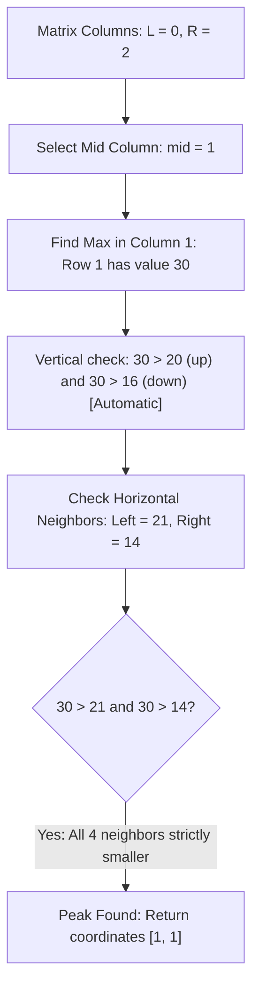

# Guided Example: Find a Peak Element II

We trace column-wise bisection, global column maximum selection, and horizontal gradient pruning on a representative 2D matrix instance:

- **Input:**
  $$\text{mat} = \begin{pmatrix}
  10 & 20 & 15 \\
  21 & 30 & 14 \\
  7 & 16 & 32
  \end{pmatrix}$$
- **Required Output:** `[1, 1]`

This instance demonstrates finding a peak element strictly greater than all its adjacent orthogonal neighbors in $\mathcal{O}(m \log n)$ time without scanning all $m \times n$ cells.

---

## 1. Instance & Teaching Goal

We are given an $m \times n$ matrix `mat` where no two adjacent cells share the same value. A cell `mat[r][c]` is a **peak** if it is strictly greater than its four orthogonal neighbors (cells outside the grid are treated as $-\infty$).

For the $3 \times 3$ matrix:
- Look at cell $(1, 1)$ containing $30$:
  - Up: $mat[0][1] = 20 < 30$
  - Down: $mat[2][1] = 16 < 30$
  - Left: $mat[1][0] = 21 < 30$
  - Right: $mat[1][2] = 14 < 30$
- $30$ is strictly greater than all four neighbors $\implies [1, 1]$ is a valid peak.

While an exhaustive $\mathcal{O}(m \cdot n)$ search could locate a peak, the problem requires a sub-linear column traversal in $\mathcal{O}(m \log n)$.

The teaching goal is to understand **gradient-guided 2D bisection**:
1. Why finding the global maximum in a chosen column automatically satisfies the vertical neighbor conditions.
2. How the horizontal gradient at that column maximum determines which half of the grid is guaranteed to contain at least one peak.
3. Why this guarantees convergence to a valid peak in $\mathcal{O}(m \log n)$ time.

---

## 2. Conceptual Foundation & Invariants

### Column-Maximal Gradient Bisection & 2D Peak Existence Theorem

> **Column-Maximal Gradient Bisection & 2D Peak Existence Theorem.**
> 1. *Vertical Supremum Invariant:* Let $c$ be any column. Let $r^* = \arg\max_{0 \le r < m} mat[r][c]$ be the row containing the maximum element in column $c$. By definition:
>    $$mat[r^*][c] > mat[r^* - 1][c] \quad \text{and} \quad mat[r^*][c] > mat[r^* + 1][c]$$
>    Hence, the vertical neighbor conditions for a peak are satisfied unconditionally at $(r^*, c)$.
> 2. *Horizontal Gradient Direction:*
>    - If $mat[r^*][c] > mat[r^*][c - 1]$ and $mat[r^*][c] > mat[r^*][c + 1]$, then $(r^*, c)$ is strictly greater than all four orthogonal neighbors and is a peak.
>    - If $mat[r^*][c - 1] > mat[r^*][c]$, then because $mat[r^*][c - 1]$ is strictly greater than the column-maximum of column $c$, any strictly increasing path starting at $(r^*, c - 1)$ cannot cross back into column $c$. By topological compactness, this path must terminate at a peak within columns $[0, c - 1]$.
>    - By symmetry, if $mat[r^*][c + 1] > mat[r^*][c]$, a peak is guaranteed to exist within columns $[c + 1, n - 1]$.
> 3. *Logarithmic Column Reduction:* Bisection over columns $[L, R]$ halves the search space in each step, taking $\lfloor \log_2 n \rfloor + 1$ iterations.
> 4. *Complexity:* Each iteration scans one column of height $m$ in $\mathcal{O}(m)$ time. Total time is $\mathcal{O}(m \log n)$. Auxiliary space is $\mathcal{O}(1)$.

---

## 3. Step-by-Step Worked Execution

We trace `mat = [[10, 20, 15], [21, 30, 14], [7, 16, 32]]`:
- Matrix dimensions: $m = 3, n = 3$.
- Column search range: $L = 0, R = 2$.

---

### Step 1: Evaluate Midpoint Column
- Current range: $[L = 0, R = 2]$.
- Midpoint column:
  $$\text{mid} = \left\lfloor \frac{0 + 2}{2} \right\rfloor = 1$$

---

### Step 2: Find Maximum Element in Column $\text{mid} = 1$
Scan column 1:
- Row 0: $mat[0][1] = 20$
- Row 1: $mat[1][1] = 30$
- Row 2: $mat[2][1] = 16$
- Maximum element in column 1 is located at row $r^* = 1$ with value $30$.

---

### Step 3: Test Horizontal Orthogonal Neighbors
Compare $mat[1][1] = 30$ against its horizontal neighbors:
- **Left Neighbor:**
  $$mat[1][0] = 21 < 30 \quad (\textbf{Pass})$$
- **Right Neighbor:**
  $$mat[1][2] = 14 < 30 \quad (\textbf{Pass})$$
- **Vertical Neighbors:**
  - $mat[0][1] = 20 < 30$ (Guaranteed by column maximality).
  - $mat[2][1] = 16 < 30$ (Guaranteed by column maximality).

Because $30$ is strictly greater than all four neighbors, $(1, 1)$ is a peak.
Terminate search and return `[1, 1]`.

---

## 4. Complete Execution Trace

| Iteration | Column Range $[L, R]$ | Mid Column | Elements in Mid Column | Max Row $r^*$ | Max Value | Left Neighbor | Right Neighbor | Decision |
|:---:|:---:|:---:|:---:|:---:|:---:|:---:|:---:|:---:|
| 1 | $[0, 2]$ | 1 | $[20, 30, 16]$ | 1 | **30** | 21 | 14 | **Peak Found! Return [1, 1]** |

---

## 5. Algorithmic Correctness

**Soundness.** A cell $(r^*, \text{mid})$ is accepted if and only if it strictly exceeds both its left and right neighbors. Because $r^*$ was selected as the global maximum of column $\text{mid}$, it strictly exceeds its upper and lower neighbors, satisfying all four peak conditions simultaneously.

**Completeness.** If the horizontal neighbors do not satisfy the condition, stepping toward the strictly larger neighbor guarantees a strictly increasing trajectory that can never escape the chosen column subset, guaranteeing that a local peak exists in that subgrid.

---

## 6. Traps This Instance Exposes

- **Local vs Global Column Maximum:** Selecting an arbitrary local vertical peak in column $\text{mid}$ does not guarantee the divide-and-conquer invariant; only the *global* maximum of column $\text{mid}$ prevents increasing paths from crossing backwards.
- **Boundary Cells ($c = 0$ or $c = n - 1$):** When testing column $0$, the left neighbor is outside the grid and treated as $-\infty$. When testing column $n - 1$, the right neighbor is outside and treated as $-\infty$.
- **Multiple Peaks:** A matrix may contain several peaks (such as $32$ at $(2, 2)$). The problem accepts *any* valid peak, and binary search is guaranteed to find one.

---

## 7. Complexity Derivation

- **Time Complexity:** $\mathcal{O}(m \log n)$. The binary search iterates at most $\lfloor \log_2 n \rfloor + 1$ times. In each iteration, scanning the column takes $\mathcal{O}(m)$ time.
- **Auxiliary Space Complexity:** $\mathcal{O}(1)$ auxiliary space, needing only loop counters and coordinates.