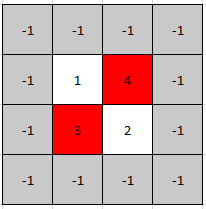
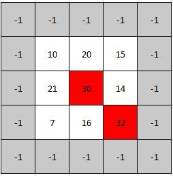

### 1. Description

A **peak** element in a 2D grid is an element that is **strictly greater** than all of its **adjacent **neighbors to the left, right, top, and bottom.

Given a **0-indexed** `m x n` matrix `mat` where **no two adjacent cells are equal**, find **any** peak element $\text{mat}[i][j]$ and return *the length 2 array *`[i,j]`.

You may assume that the entire matrix is surrounded by an **outer perimeter** with the value `-1` in each cell.

You must write an algorithm that runs in `O(m log(n))` or `O(n log(m))` time.

### 2. Function Contract

- `n`: Input parameter.
- Returns expected result.

### 3. Examples

#### Example 1

- **Input:** $mat = [[1,4],[3,2]]$
- **Output:** `[0,1]`
- **Explanation:** Both 3 and 4 are peak elements so [1,0] and [0,1] are both acceptable answers.
#### Example 2

**

**

- **Input:** $mat = [[10,20,15],[21,30,14],[7,16,32]]$
- **Output:** `[1,1]`
- **Explanation:** Both 30 and 32 are peak elements so [1,1] and [2,2] are both acceptable answers.

### 4. Constraints

- $m = \text{mat.length}$

- $n = \text{mat}[i].length$

- $1 \le m, n \le 500$

- $1 \le \text{mat}[i][j] \le 10^{5}$

- No two adjacent cells are equal.