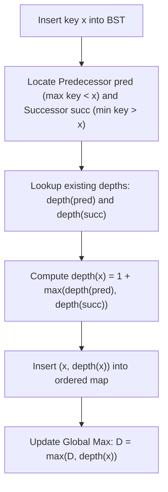

# Guided Example: Depth of BST Given Insertion Order

We trace predecessor-successor bounding, ancestor depth induction, and balanced map lookup on representative BST insertion sequences:

- **Input:** `order = [2, 1, 4, 3]` (alongside `order = [2, 1, 3, 4]`)
- **Required Output:** `3`

This instance demonstrates avoiding degenerate $\mathcal{O}(n^2)$ tree construction by determining the exact depth of each newly inserted node from its immediate in-order predecessor and successor in $\mathcal{O}(\log n)$ time.

---

## 1. Instance & Teaching Goal

We are given a permutation `order` of integers $1 \dots n$ describing the sequence in which nodes are inserted into an initially empty Binary Search Tree (BST). We want to find the maximum depth of the resulting tree (where the root has depth 1).

For `order = [2, 1, 4, 3]`:
- Step 1: Insert `2` as root $\implies \text{depth}(2) = 1$.
- Step 2: Insert `1`. Since $1 < 2$, `1` becomes the left child of `2` $\implies \text{depth}(1) = 1 + 1 = 2$.
- Step 3: Insert `4`. Since $4 > 2$, `4` becomes the right child of `2` $\implies \text{depth}(4) = 1 + 1 = 2$.
- Step 4: Insert `3`.
  - In the BST, $3 > 2$ (so it lies in the right subtree of $2$) and $3 < 4$ (so it lies in the left subtree of $4$).
  - `3` attaches directly as the left child of `4` $\implies \text{depth}(3) = 1 + \text{depth}(4) = 1 + 2 = 3$.
- The maximum depth across all nodes is $\max(1, 2, 2, 3) = 3$.

While building the explicit tree node-by-node works for balanced inputs, worst-case inputs (e.g., sorted arrays) degrade naive insertion to $\mathcal{O}(n^2)$ time.

The teaching goal is to understand **BST ancestor depth induction**:
1. Proving why a newly inserted node $x$ must attach as a child of either its in-order predecessor $pred$ or successor $succ$.
2. Proving why the parent is always whichever neighbor has the strictly greater depth.
3. Using an ordered dictionary or balanced search tree to achieve $\mathcal{O}(n \log n)$ total time.

---

## 2. Conceptual Foundation & Invariants

### Adjacency Interval Parentage & BST Depth Induction Theorem

> **Adjacency Interval Parentage & BST Depth Induction Theorem.**
> 1. *In-Order Adjacency Invariant:* In any binary search tree, the in-order traversal of keys is strictly monotonic. When a new key $x$ is inserted:
>    - Let $pred$ be the predecessor of $x$ (largest key already in the BST with $pred < x$).
>    - Let $succ$ be the successor of $x$ (smallest key already in the BST with $succ > x$).
> 2. *Unique Parent Characterization:* Because no existing keys lie between $pred$ and $succ$, the insertion position for $x$ is topologically adjacent to both $pred$ and $succ$. In any valid BST, one of $pred$ or $succ$ is an ancestor of the other. The node lower in the tree (having greater depth) must have an available child slot facing $x$ (the right child of $pred$ if $\text{depth}(pred) > \text{depth}(succ)$, or the left child of $succ$ if $\text{depth}(succ) > \text{depth}(pred)$).
> 3. *Depth Recurrence:*
>    $$\text{depth}(x) = 1 + \max(\text{depth}(pred), \; \text{depth}(succ))$$
>    where $\text{depth}(\emptyset) = 0$ if predecessor or successor does not exist.
> 4. *Global Tree Depth:*
>    $$D = \max_{x \in \text{order}} \text{depth}(x)$$
> 5. *Complexity:* Querying and inserting $(x, \text{depth}(x))$ into an ordered structure takes $\mathcal{O}(\log n)$ time per element. Total time is $\mathcal{O}(n \log n)$ and auxiliary space is $\mathcal{O}(n)$.

---

## 3. Step-by-Step Worked Execution

We trace `order = [2, 1, 4, 3]`:
- Maintain an ordered map $\mathcal{T}$ mapping `key -> depth`.
- Global maximum depth initialized to $D = 0$.

---

### Step 1: Insert Key `2`
- Map $\mathcal{T} = \emptyset$.
- Predecessor: None ($0$).
- Successor: None ($0$).
- Node depth:
  $$\text{depth}(2) = 1 + \max(0, 0) = 1$$
- Insert into map: $\mathcal{T} = \{2: 1\}$.
- Update global max: $D = \max(0, 1) = 1$.

---

### Step 2: Insert Key `1`
- Query $\mathcal{T} = \{2: 1\}$:
  - Predecessor ($< 1$): None ($0$).
  - Successor ($> 1$): Key `2` with depth $1$.
- Node depth:
  $$\text{depth}(1) = 1 + \max(0, 1) = 2$$
- Insert into map: $\mathcal{T} = \{1: 2, \; 2: 1\}$.
- Update global max: $D = \max(1, 2) = 2$.

---

### Step 3: Insert Key `4`
- Query $\mathcal{T} = \{1: 2, \; 2: 1\}$:
  - Predecessor ($< 4$): Key `2` with depth $1$.
  - Successor ($> 4$): None ($0$).
- Node depth:
  $$\text{depth}(4) = 1 + \max(1, 0) = 2$$
- Insert into map: $\mathcal{T} = \{1: 2, \; 2: 1, \; 4: 2\}$.
- Update global max: $D = \max(2, 2) = 2$.

---

### Step 4: Insert Key `3`
- Query $\mathcal{T} = \{1: 2, \; 2: 1, \; 4: 2\}$:
  - Predecessor ($< 3$): Key `2` with depth $1$.
  - Successor ($> 3$): Key `4` with depth $2$.
- Node depth:
  $$\text{depth}(3) = 1 + \max(\text{depth}(2), \; \text{depth}(4)) = 1 + \max(1, 2) = 3$$
- Insert into map: $\mathcal{T} = \{1: 2, \; 2: 1, \; 3: 3, \; 4: 2\}$.
- Update global max: $D = \max(2, 3) = 3$.

---

### Step 5: Final Result
- All insertions completed.
- Maximum depth is $3$.

---

## 4. Complete Execution Trace

| Step | Key Inserted | Predecessor $pred$ | Depth of $pred$ | Successor $succ$ | Depth of $succ$ | Computed $\text{depth}(x)$ | Global Max $D$ |
|:---:|:---:|:---:|:---:|:---:|:---:|:---:|:---:|
| 1 | **2** | None | 0 | None | 0 | $1 + \max(0, 0) = \mathbf{1}$ | 1 |
| 2 | **1** | None | 0 | 2 | 1 | $1 + \max(0, 1) = \mathbf{2}$ | 2 |
| 3 | **4** | 2 | 1 | None | 0 | $1 + \max(1, 0) = \mathbf{2}$ | 2 |
| 4 | **3** | 2 | 1 | 4 | 2 | $1 + \max(1, 2) = \mathbf{3}$ | **3** |
| **Output** | - | - | - | - | - | - | **Return 3** |

---

## 5. Algorithmic Correctness

**Soundness.** Every key inserted into a BST lands as a child of an existing node whose key is closest to it in value. The deeper of the two adjacent nodes ($pred$ and $succ$) is guaranteed to be a descendant of the shallower node, leaving its corresponding child pointer empty to receive $x$.

**Completeness.** Since every node's parent is correctly identified and the root is initialized at depth 1, the induction accurately computes the exact depth of every node without needing explicit tree pointers.

---

## 6. Traps This Instance Exposes

- **Worst-Case Skewed Tree:** If `order = [1, 2, 3, 4, ..., n]`, an explicit BST creates a degenerate line where each insertion traverses the entire chain, causing $\mathcal{O}(n^2)$ time. The ordered map approach resolves each insertion in $\mathcal{O}(\log n)$ time unconditionally.
- **Root and Boundary Nodes:** When inserting the very first node or an extreme minimum/maximum, either the predecessor, successor, or both will be absent. Missing neighbors must have depth $0$.
- **Tie-Breaking Depth:** Predecessor and successor in a BST never have identical depths if one is an ancestor of the other; thus $\max(\text{depth}(pred), \text{depth}(succ))$ is unambiguous.

---

## 7. Complexity Derivation

- **Time Complexity:** $\mathcal{O}(n \log n)$, where $n$ is the number of elements in `order`. For each of the $n$ elements, locating the predecessor and successor in a self-balancing binary search tree or ordered map takes $\mathcal{O}(\log n)$ time.
- **Auxiliary Space Complexity:** $\mathcal{O}(n)$ to store the keys and depths in the ordered map.
