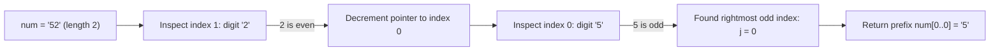

# Guided Example: Largest Odd Number in String

We trace base-10 integer parity properties, prefix numeric dominance, and backward suffix truncation on representative decimal digit strings:

- **Input:** `num = "52"` (alongside `num = "4206"` and `num = "35427"`)
- **Required Output:** `"5"` (and `""` for the all-even instance)

This instance demonstrates finding the largest-valued odd substring in linear time by showing that the optimal odd substring must start at index 0 and terminate at the rightmost odd digit.

---

## 1. Instance & Teaching Goal

We are given a string `num` representing a large non-negative integer. We seek the largest-valued odd integer (as a string) that is a contiguous substring of `num`. If no odd integer exists, return `""`.

For `num = "52"`:
- Substrings of `"52"`:
  - Length 1: `"5"` (odd, value 5), `"2"` (even, value 2)
  - Length 2: `"52"` (even, value 52)
- Among all odd substrings, `"5"` is the only one, with value 5.
- Output: `"5"`.

For `num = "4206"`:
- Digits: 4 (even), 2 (even), 0 (even), 6 (even).
- Every non-empty substring ends in an even digit, hence every substring is even.
- Output: `""`.

For `num = "35427"`:
- The last digit is `'7'`, which is odd.
- The entire string `"35427"` is odd, representing the largest possible substring.

The teaching goal is to understand **parity-preserving prefix maximality**:
1. Why an integer's parity depends exclusively on its rightmost digit.
2. Why any candidate substring starting at index 0 strictly dominates any substring starting at index $i > 0$.
3. How scanning backward from right to left finds the optimal prefix in $\mathcal{O}(n)$ time.

---

## 2. Conceptual Foundation & Invariants

### Base-10 Parity Invariance & Rightmost Odd Suffix Truncation Theorem

> **Base-10 Parity Invariance & Rightmost Odd Suffix Truncation Theorem.**
> 1. *Base-10 Parity Invariant:* For any integer represented by digit string $S = d_0 d_1 \dots d_{k-1}$:
>    $$\text{val}(S) = \sum_{j=0}^{k-1} d_j \cdot 10^{k-1-j} \equiv d_{k-1} \pmod 2$$
>    Thus, $\text{val}(S)$ is odd if and only if its terminal digit $d_{k-1} \in \{1, 3, 5, 7, 9\}$.
> 2. *Prefix Dominance:* For any two substrings ending at the same odd digit index $j$, let $S_1 = num[0 \dots j]$ and $S_2 = num[i \dots j]$ with $i > 0$:
>    $$\text{val}(S_1) \ge 10^i \cdot \text{val}(S_2) > \text{val}(S_2)$$
>    Hence, to maximize value, the optimal substring must have its left bound anchored at index 0.
> 3. *Rightmost Odd Terminal Selection:* For any two prefixes $num[0 \dots j_1]$ and $num[0 \dots j_2]$ with $j_1 < j_2$:
>    $$\text{val}(num[0 \dots j_2]) > \text{val}(num[0 \dots j_1])$$
>    Therefore, the maximum odd substring is uniquely determined by selecting the largest index $j^*$ such that $num[j^*]$ is an odd digit.
> 4. *Complexity:* Scanning backward from index $|num| - 1$ down to 0 takes $\mathcal{O}(n)$ time and $\mathcal{O}(1)$ auxiliary space.

---

## 3. Step-by-Step Worked Execution

We trace `num = "52"`:
- Length: $n = 2$.
- Indices: $0 \dots 1$.

---

### Step 1: Inspect Rightmost Character ($i = 1$)
- Character at index 1: `'2'`.
- Convert character to integer digit: $2$.
- Test parity:
  $$2 \pmod 2 = 0 \quad (\textbf{Even})$$
- A substring ending at index 1 cannot be odd.
- Decrement index: $i \leftarrow 0$.

---

### Step 2: Inspect Character ($i = 0$)
- Character at index 0: `'5'`.
- Convert character to integer digit: $5$.
- Test parity:
  $$5 \pmod 2 = 1 \quad (\textbf{Odd})$$
- Found the rightmost odd digit at index $j^* = 0$.

---

### Step 3: Construct Optimal Prefix
- The largest odd integer substring is the prefix ending at $j^* = 0$:
  $$num[0 \dots 0] = \text{"5"}$$
- Output: `"5"`.

---

## 4. Complete Execution Trace

| Index $i$ | Character | Numeric Digit | Digit Parity | Action | Prefix Result |
|:---:|:---:|:---:|:---:|:---:|:---:|
| 1 | `'2'` | 2 | Even | Skip and continue backward | - |
| 0 | `'5'` | 5 | **Odd** | **Found rightmost odd digit** | `"5"` |
| **Output** | - | - | - | - | **"5"** |

---

## 5. Algorithmic Correctness

**Soundness.** A string prefix is returned if and only if its last digit is an odd integer, which proves that the numeric value represented is odd.

**Completeness.** Since prefix value increases strictly with length and any substring not starting at index 0 has strictly fewer digits than the full prefix, the longest prefix ending in an odd digit is mathematically guaranteed to be the largest possible odd substring.

---

## 6. Traps This Instance Exposes

- **Integer Overflow:** The string `num` can be up to $10^5$ digits long. Converting the string (or any large substring) to a standard machine integer causes numeric overflow. All reasoning must operate on string slices and character digit parity.
- **Exhaustive Substring Generation:** Generating all $\mathcal{O}(n^2)$ substrings leads to Time Limit Exceeded on strings of length $10^5$. Linear backward scanning is required.
- **No Odd Digits:** When all digits are even (e.g. `"4206"`), the backward loop terminates at $i < 0$, correctly returning the empty string `""`.

---

## 7. Complexity Derivation

- **Time Complexity:** $\mathcal{O}(n)$, where $n$ is the length of `num`. The algorithm performs at most $n$ character inspections from right to left, and slicing the prefix takes $\mathcal{O}(n)$ time.
- **Auxiliary Space Complexity:** $\mathcal{O}(1)$ auxiliary space beyond the returned prefix slice.
