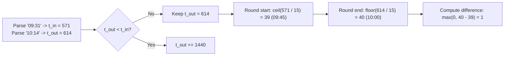

# Guided Example: The Number of Full Rounds You Have Played

We trace minute-level time conversion, midnight interval unwrapping, and 15-minute epoch quantization on representative gaming session intervals:

- **Input:** `loginTime = "09:31"`, `logoutTime = "10:14"` (alongside `loginTime = "21:30"`, `logoutTime = "03:00"`)
- **Required Output:** `1` (and `22` for the overnight session)

This instance demonstrates converting formatted time strings into linear minutes from midnight, handling overnight sessions crossing midnight by adding 1440 minutes, rounding arrival up to the next 15-minute mark and departure down to the previous 15-minute mark, and computing the count of complete 15-minute game rounds in $\mathcal{O}(1)$ time.

---

## 1. Instance & Teaching Goal

A game starts a new round every 15 minutes at minutes 00, 15, 30, and 45 of each hour. A round takes 15 minutes. We are given `loginTime` and `logoutTime` in 24-hour format `"HH:MM"`. A round is counted if and only if the player was present for the entire 15-minute duration. If `logoutTime < loginTime`, the player logged out on the following day.

For `loginTime = "09:31"`, `logoutTime = "10:14"`:
- `loginTime` is 9 hours and 31 minutes $\implies 9 \times 60 + 31 = 571$ minutes.
- `logoutTime` is 10 hours and 14 minutes $\implies 10 \times 60 + 14 = 614$ minutes.
- The 15-minute round intervals during this period:
  - $[09:30, 09:45]$ ($[570, 585]$): Player arrived at 09:31, missing the first minute $\implies$ **Partial (excluded)**.
  - $[09:45, 10:00]$ ($[585, 600]$): Player present from 09:45 to 10:00 $\implies$ **Full Round 1**.
  - $[10:00, 10:15]$ ($[600, 615]$): Player logged out at 10:14, missing the final minute $\implies$ **Partial (excluded)**.
- Exactly 1 complete round played.

For `loginTime = "21:30"`, `logoutTime = "03:00"`:
- $t_{\text{in}} = 21 \times 60 + 30 = 1290$.
- $t_{\text{out}} = 3 \times 60 + 0 = 180$.
- Since $t_{\text{out}} < t_{\text{in}}$, the session crossed midnight. We unwrap the departure time: $t_{\text{out}} = 180 + 1440 = 1620$.
- Total full rounds $= \frac{1620 - 1290}{15} = \frac{330}{15} = 22$.

The teaching goal is to understand **discrete temporal epoch quantization**:
1. Mapping cyclic 24-hour time to a monotonically increasing linear minute scale.
2. Formulating arrival rounding as ceiling division and departure rounding as floor division.
3. Handling sub-round durations gracefully by non-negativity clamping.

---

## 2. Conceptual Foundation & Invariants

### Discrete 15-Minute Epoch Projection & Modulo-24 Temporal Unwrapping Theorem

> **Discrete 15-Minute Epoch Projection & Modulo-24 Temporal Unwrapping Theorem.**
> 1. *Linear Minute Projection:* A time string `"HH:MM"` maps to absolute minutes from midnight:
>    $$t = 60 \cdot H + M \in [0, 1439]$$
> 2. *Midnight Crossing Unwrapping:* If $t_{\text{out}} < t_{\text{in}}$, the session spans two calendar dates. Because sessions never exceed 24 hours, the true timeline interval is:
>    $$[t_{\text{in}}, \; t_{\text{out}} + 1440]$$
> 3. *Epoch Quantization:* A round $k$ corresponds to the continuous time interval $[15k, 15(k+1)]$. A round is fully contained in $[t_{\text{in}}, t_{\text{out}}]$ if and only if:
>    $$15k \ge t_{\text{in}} \iff k \ge \left\lceil \frac{t_{\text{in}}}{15} \right\rceil = \left\lfloor \frac{t_{\text{in}} + 14}{15} \right\rfloor$$
>    $$15(k+1) \le t_{\text{out}} \iff k+1 \le \left\lfloor \frac{t_{\text{out}}}{15} \right\rfloor$$
> 4. *Round Count Closed Form:* Let $r_{\text{start}} = \lceil t_{\text{in}} / 15 \rceil$ and $r_{\text{end}} = \lfloor t_{\text{out}} / 15 \rfloor$. The total count of fully enclosed rounds is:
>    $$\text{Rounds} = \max(0, \; r_{\text{end}} - r_{\text{start}})$$
> 5. *Complexity:* The calculation requires fixed arithmetic evaluations, running in $\mathcal{O}(1)$ time and $\mathcal{O}(1)$ auxiliary space.

---

## 3. Step-by-Step Worked Execution

We trace `loginTime = "09:31"`, `logoutTime = "10:14"`:

---

### Step 1: Parse Inputs to Absolute Minutes
- `loginTime = "09:31"`:
  $$H_{\text{in}} = 9, \quad M_{\text{in}} = 31$$
  $$t_{\text{in}} = 9 \times 60 + 31 = 540 + 31 = 571$$
- `logoutTime = "10:14"`:
  $$H_{\text{out}} = 10, \quad M_{\text{out}} = 14$$
  $$t_{\text{out}} = 10 \times 60 + 14 = 600 + 14 = 614$$

---

### Step 2: Midnight Check
- Compare arrival and departure:
  $$t_{\text{out}} \ge t_{\text{in}} \quad (614 \ge 571)$$
- The session does not cross midnight; $t_{\text{out}}$ remains $614$.

---

### Step 3: Quantize Round Boundaries
- **First Full Round Start:**
  The player can only start a full round at or after arrival:
  $$r_{\text{start}} = \left\lceil \frac{571}{15} \right\rceil = \left\lfloor \frac{571 + 14}{15} \right\rfloor = \left\lfloor \frac{585}{15} \right\rfloor = 39$$
  Corresponding minute: $39 \times 15 = 585$ (09:45).
- **Last Full Round End:**
  The player must finish a full round at or before departure:
  $$r_{\text{end}} = \left\lfloor \frac{614}{15} \right\rfloor = 40$$
  Corresponding minute: $40 \times 15 = 600$ (10:00).

---

### Step 4: Compute Completed Rounds
- Subtract indices and clamp to non-negative:
  $$\text{Rounds} = \max(0, \; r_{\text{end}} - r_{\text{start}}) = \max(0, \; 40 - 39) = 1$$
- Output: `1`.

---

## 4. Complete Execution Trace

| Parameter / Step | Session 1 (`"09:31"` to `"10:14"`) | Session 2 (`"21:30"` to `"03:00"`) |
|:---:|:---:|:---:|
| $t_{\text{in}}$ (minutes) | $9 \times 60 + 31 = \mathbf{571}$ | $21 \times 60 + 30 = \mathbf{1290}$ |
| $t_{\text{out}}$ (minutes) | $10 \times 60 + 14 = \mathbf{614}$ | $3 \times 60 + 0 = 180 \to \mathbf{1620}$ ($+1440$) |
| Midnight Crossing? | No ($614 \ge 571$) | **Yes** ($180 < 1290$) |
| Earliest Round Start $r_{\text{start}}$ | $\lceil 571 / 15 \rceil = \mathbf{39}$ (09:45) | $\lceil 1290 / 15 \rceil = \mathbf{86}$ (21:30) |
| Latest Round End $r_{\text{end}}$ | $\lfloor 614 / 15 \rfloor = \mathbf{40}$ (10:00) | $\lfloor 1620 / 15 \rfloor = \mathbf{108}$ (03:00) |
| Formula: $\max(0, r_{\text{end}} - r_{\text{start}})$ | $\max(0, 40 - 39) = \mathbf{1}$ | $\max(0, 108 - 86) = \mathbf{22}$ |
| **Output** | **1** | **22** |

---

## 5. Algorithmic Correctness

**Soundness.** A round index $k$ corresponds to the half-open interval $[15k, 15(k+1)]$. The round is fully played if and only if $15k \ge t_{\text{in}}$ (which forces $k \ge r_{\text{start}}$) and $15(k+1) \le t_{\text{out}}$ (which forces $k+1 \le r_{\text{end}}$). The number of such integer indices is exactly $\max(0, r_{\text{end}} - r_{\text{start}})$.

**Completeness.** Adding $1440$ when $t_{\text{out}} < t_{\text{in}}$ correctly handles the modular boundary at midnight without altering the relative time differences.

---

## 6. Traps This Instance Exposes

- **Sub-15 Minute Intra-Epoch Session:** If a player logs in at `"00:01"` and logs out at `"00:14"`, $r_{\text{start}} = \lceil 1 / 15 \rceil = 1$ and $r_{\text{end}} = \lfloor 14 / 15 \rfloor = 0$. The difference is $0 - 1 = -1$. Clamping via $\max(0, -1)$ correctly produces $0$.
- **Exact Boundary Arrivals:** If $t_{\text{in}} = 09:30$ ($570$), $\lceil 570 / 15 \rceil = 38$, so the player correctly receives credit for the full round $[09:30, 09:45]$.
- **Midnight Representation:** `"00:00"` is minute 0. When logging out at `"00:00"` having arrived earlier (e.g. `"23:00"`), $0 < 1380$ triggers the $+1440$ adjustment to minute 1440.

---

## 7. Complexity Derivation

- **Time Complexity:** $\mathcal{O}(1)$. String parsing, arithmetic multiplications, divisions, and boundary clamping execute in constant time.
- **Auxiliary Space Complexity:** $\mathcal{O}(1)$ auxiliary space.
