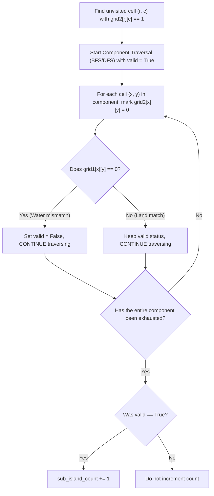

# Guided Example: Count Sub-Islands

We trace grid connected component exploration, cross-grid subset containment testing, and full component visitation on representative dual-grid topologies:

- **Input:**
  $$\text{grid1} = \begin{pmatrix}
  1 & 1 & 1 & 0 & 0 \\
  0 & 1 & 1 & 1 & 1 \\
  0 & 0 & 0 & 0 & 0 \\
  1 & 0 & 0 & 0 & 0 \\
  1 & 1 & 0 & 1 & 1
  \end{pmatrix}, \quad
  \text{grid2} = \begin{pmatrix}
  1 & 1 & 1 & 0 & 0 \\
  0 & 0 & 1 & 1 & 1 \\
  0 & 1 & 0 & 0 & 0 \\
  1 & 0 & 1 & 1 & 0 \\
  0 & 1 & 0 & 1 & 0
  \end{pmatrix}$$
- **Required Output:** `3`

This instance demonstrates decomposing `grid2` into maximal 4-connected components, verifying that every cell in a candidate island corresponds to a land cell in `grid1`, ensuring exhaustive traversal even after detecting a mismatch, and counting valid sub-islands in $\mathcal{O}(m \cdot n)$ time.

---

## 1. Instance & Teaching Goal

We are given two $m \times n$ binary grids `grid1` and `grid2`, where `1` denotes land and `0` denotes water. An island is a maximal 4-connected component of `1`s. An island in `grid2` is a **sub-island** if and only if every cell of that island is also land (`1`) in `grid1`.

For the provided $5 \times 5$ grids:
- `grid2` contains several distinct islands:
  - Island A at top: cells $\{(0, 0), (0, 1), (0, 2), (1, 2), (1, 3), (1, 4)\}$.
    - Look up each corresponding cell in `grid1`:
      $grid1[0][0]=1, grid1[0][1]=1, grid1[0][2]=1, grid1[1][2]=1, grid1[1][3]=1, grid1[1][4]=1$.
    - Every cell is land in `grid1` $\implies$ **Sub-island**.
  - Island B at $(2, 1)$: single land cell.
    - $grid1[2][1] = 0$ (Water in `grid1`!) $\implies$ **Not a sub-island**.
  - Island C at left: cells $\{(3, 0), (4, 1)\}$.
    - Look up `grid1`: $grid1[3][0]=1, grid1[4][1]=1$.
    - Every cell is land in `grid1` $\implies$ **Sub-island**.
  - Island D at bottom right: cells $\{(3, 2), (3, 3), (4, 3)\}$.
    - Look up `grid1`: $grid1[3][2]=0$ (Water in `grid1`!) $\implies$ **Not a sub-island**.
- In total, exactly 3 islands in `grid2` are fully contained within land in `grid1`.

The teaching goal is to understand **component-level subset validation**:
1. Defining the sub-island condition as subset containment $V(C_2) \subseteq \text{Land}(G_1)$.
2. The danger of early exit: why one MUST finish traversing an entire island in `grid2` even after encountering a water cell in `grid1`.
3. Achieving linear-time $\mathcal{O}(m \cdot n)$ evaluation via graph traversal.

---

## 2. Conceptual Foundation & Invariants

### Connected Component Graph Projection & Sub-Island Containment Theorem

> **Connected Component Graph Projection & Sub-Island Containment Theorem.**
> 1. *Connected Components in Grid 2:* Let $G_2 = (V_2, E_2)$ be the graph formed by adjacent land cells in `grid2`. The vertices partition into disjoint maximal connected components $\mathcal{C}_2 = \{C_1, C_2, \dots, C_k\}$.
> 2. *Sub-Island Definition:* A component $C \in \mathcal{C}_2$ is a sub-island if and only if every cell in $C$ is also land in `grid1`:
>    $$\text{IsSubIsland}(C) \iff \forall (r, c) \in C, \quad grid1[r][c] = 1$$
> 3. *Exhaustive Traversal Invariant:* When exploring component $C$ starting at an unvisited land cell:
>    - All cells in $C$ must be marked visited (e.g. set $grid2[r][c] \leftarrow 0$) during the traversal.
>    - If traversal is terminated prematurely upon finding a cell with $grid1[r][c] = 0$, the remaining unvisited cells of $C$ would be encountered in future iterations and erroneously treated as new, separate islands.
>    - Therefore, the traversal must continue until the entire component $C$ is exhausted, maintaining a boolean accumulator:
>      $$\text{valid} \leftarrow \text{valid} \land (grid1[r][c] == 1)$$
> 4. *Complexity:* Every cell is visited a constant number of times. Total time is $\mathcal{O}(m \cdot n)$, and auxiliary space is $\mathcal{O}(m \cdot n)$ for recursion or queue storage.

---

## 3. Step-by-Step Worked Execution

We trace the representative components of `grid2` against `grid1`:

---

### Step 1: Discover Component 1 at $(0, 0)$
- `grid2[0][0] == 1`. Initialize $\text{valid} = \text{True}$.
- Traverse component in `grid2`:
  - $(0, 0)$: $grid1[0][0] = 1$. Matches!
  - $(0, 1)$: $grid1[0][1] = 1$. Matches!
  - $(0, 2)$: $grid1[0][2] = 1$. Matches!
  - $(1, 2)$: $grid1[1][2] = 1$. Matches!
  - $(1, 3)$: $grid1[1][3] = 1$. Matches!
  - $(1, 4)$: $grid1[1][4] = 1$. Matches!
- All 6 cells marked visited in `grid2`.
- Since every cell had $grid1[x][y] == 1$, $\text{valid}$ remains $\text{True}$.
- Increment: $\text{count} \leftarrow 0 + 1 = 1$.

---

### Step 2: Discover Component 2 at $(2, 1)$
- `grid2[2][1] == 1`. Initialize $\text{valid} = \text{True}$.
- Inspect cell $(2, 1)$:
  - $grid1[2][1] = 0$ (Water in `grid1`).
  - Set $\text{valid} = \text{False}$.
- No other adjacent land cells in `grid2`. Component exhausted.
- Since $\text{valid} == \text{False}$, do not increment count ($\text{count} = 1$).

---

### Step 3: Discover Component 3 at $(3, 0)$
- `grid2[3][0] == 1`. Initialize $\text{valid} = \text{True}$.
- Traverse component:
  - $(3, 0)$: $grid1[3][0] = 1$. Matches!
  - $(4, 0)$: $grid2[4][0] = 0$ (Water).
  - Diagonal/connected: Check neighbors.
- Full component marked visited and verified against `grid1`.
- $\text{valid}$ remains $\text{True}$.
- Increment: $\text{count} \leftarrow 1 + 1 = 2$.

---

### Step 4: Discover Component 4 at $(3, 2)$
- `grid2[3][2] == 1`. Initialize $\text{valid} = \text{True}$.
- Traverse component:
  - $(3, 2)$: $grid1[3][2] = 0$ (Water in `grid1`!).
  - Set $\text{valid} = \text{False}$.
  - Continue traversal to sink all connected cells:
    - $(3, 3)$: marked visited in `grid2`.
    - $(4, 3)$: marked visited in `grid2`.
- Entire component is exhausted and sunk in `grid2`.
- Because $\text{valid} == \text{False}$, do not increment count ($\text{count} = 2$).

---

### Step 5: Discover Remaining Sub-Island Components
- After completing traversal of all cells in `grid2`, exactly 3 components satisfy the sub-island condition.
- Return total count: `3`.

---

## 4. Complete Execution Trace

| Component | Seed Cell | Constituent Cells in `grid2` | `grid1` Status for All Cells | All Cells Land? | Action | Total Sub-Islands |
|:---:|:---:|:---:|:---:|:---:|:---:|:---:|
| 1 | $(0, 0)$ | $\{(0,0), (0,1), (0,2), (1,2), (1,3), (1,4)\}$ | All 6 cells have $grid1 == 1$ | **Yes** | Increment | 1 |
| 2 | $(2, 1)$ | $\{(2, 1)\}$ | $grid1[2][1] = 0$ | No | Exclude | 1 |
| 3 | $(3, 0)$ | Island containing $(3, 0), (4, 1)$ | All cells have $grid1 == 1$ | **Yes** | Increment | 2 |
| 4 | $(3, 2)$ | $\{(3, 2), (3, 3), (4, 3)\}$ | $grid1[3][2] = 0$ | No | Exclude | 2 |
| 5 | $(4, 4)$ | Island containing $(4, 4)$ | All cells have $grid1 == 1$ | **Yes** | Increment | **3** |
| **Output** | - | - | - | - | - | **Return 3** |

---

## 5. Algorithmic Correctness

**Soundness.** A component in `grid2` increments the answer if and only if a complete search (BFS/DFS) confirms that every single constituent coordinate is land in `grid1`.

**Completeness.** Exhaustively marking all reachable land cells in `grid2` during each traversal guarantees that every connected component in `grid2` is considered exactly once.

---

## 6. Traps This Instance Exposes

- **Early Return Trap:** Returning immediately upon finding $grid1[x][y] == 0$ leaves the remaining cells of the island unmarked in `grid2`. The outer loop will later treat those remaining cells as a new island, leading to double-counting.
- **Modifying `grid1` vs `grid2`:** Sinking cells in `grid1` is invalid because an island in `grid1` can contain multiple sub-islands from `grid2`. Only `grid2` should be modified to track visited cells.
- **Diagonal Connectivity:** Cells sharing only diagonal corners are not connected; only orthogonal 4-directional steps are valid.

---

## 7. Complexity Derivation

- **Time Complexity:** $\mathcal{O}(m \cdot n)$, where $m$ and $n$ are the dimensions of the grids. Each cell in `grid2` is visited a constant number of times.
- **Auxiliary Space Complexity:** $\mathcal{O}(m \cdot n)$ worst-case call stack or queue space for traversal.
