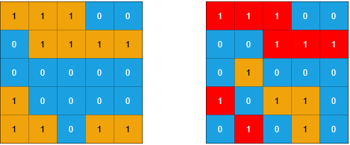
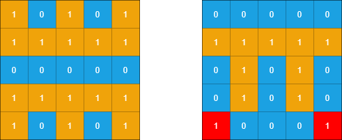

### 1. Description

You are given two `m x n` binary matrices `grid1` and `grid2` containing only `0`'s (representing water) and `1`'s (representing land). An **island** is a group of `1`'s connected **4-directionally** (horizontal or vertical). Any cells outside of the grid are considered water cells.

An island in `grid2` is considered a **sub-island **if there is an island in `grid1` that contains **all** the cells that make up **this** island in `grid2`.

Return the ***number** of islands in *`grid2` *that are considered **sub-islands***.

### 2. Function Contract

- `n`: Input parameter.
- Returns expected result.

### 3. Examples

#### Example 1

- **Input:** $grid1 = [[1,1,1,0,0],[0,1,1,1,1],[0,0,0,0,0],[1,0,0,0,0],[1,1,0,1,1]], grid2 = [[1,1,1,0,0],[0,0,1,1,1],[0,1,0,0,0],[1,0,1,1,0],[0,1,0,1,0]]$
- **Output:** `3`
- **Explanation:** In the picture above, the grid on the left is grid1 and the grid on the right is grid2.
The 1s colored red in grid2 are those considered to be part of a sub-island. There are three sub-islands.
#### Example 2

- **Input:** $grid1 = [[1,0,1,0,1],[1,1,1,1,1],[0,0,0,0,0],[1,1,1,1,1],[1,0,1,0,1]], grid2 = [[0,0,0,0,0],[1,1,1,1,1],[0,1,0,1,0],[0,1,0,1,0],[1,0,0,0,1]]$
- **Output:** `2`
- **Explanation:** In the picture above, the grid on the left is grid1 and the grid on the right is grid2.
The 1s colored red in grid2 are those considered to be part of a sub-island. There are two sub-islands.

### 4. Constraints

- $m = \text{grid1.length} = \text{grid2.length}$

- $n = \text{grid1}[i].length = \text{grid2}[i].length$

- $1 \le m, n \le 500$

- $\text{grid1}[i][j]$ and $\text{grid2}[i][j]$ are either `0` or `1`.