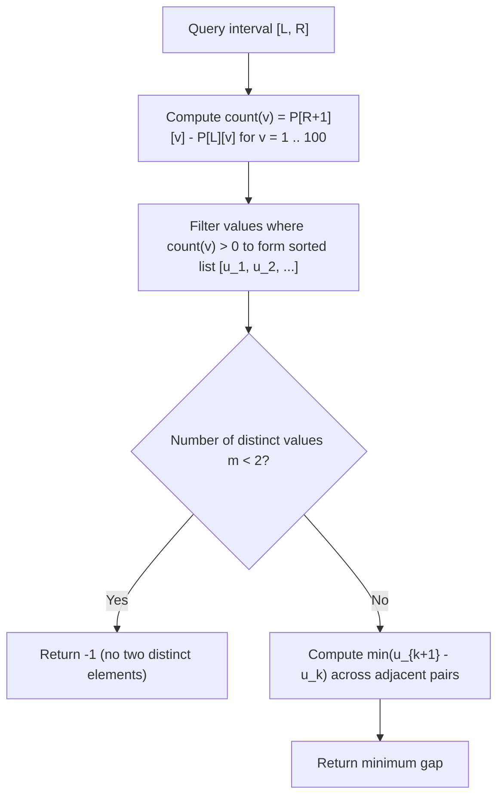

# Guided Example: Minimum Absolute Difference Queries

We trace value-domain prefix counting, $\mathcal{O}(1)$ range frequency filtering, and sorted adjacent gap evaluation on representative query intervals:

- **Input:** `nums = [1, 3, 4, 8]`, `queries = [[0, 1], [1, 2], [2, 3], [0, 3]]`
- **Required Output:** `[2, 1, 4, 1]`

This instance demonstrates exploiting the bounded value universe ($1 \le nums[i] \le 100$) to determine subarray presence via 2D prefix frequency tables and find the minimum absolute difference between distinct elements in $\mathcal{O}(V)$ time per query without sorting each subarray.

---

## 1. Instance & Teaching Goal

Given an integer array `nums` and a list of range queries $[L, R]$, for each query we must find the minimum absolute difference $|a - b|$ between any two **distinct** elements $a \neq b$ in the subarray `nums[L \dots R]`. If all elements in the subarray are equal, return $-1$.

For `nums = [1, 3, 4, 8]`:
- Query 0: range $[0, 1]$, subarray $[1, 3]$.
  - Distinct values: $1$ and $3$. Difference: $3 - 1 = 2$.
- Query 1: range $[1, 2]$, subarray $[3, 4]$.
  - Distinct values: $3$ and $4$. Difference: $4 - 3 = 1$.
- Query 2: range $[2, 3]$, subarray $[4, 8]$.
  - Distinct values: $4$ and $8$. Difference: $8 - 4 = 4$.
- Query 3: range $[0, 3]$, subarray $[1, 3, 4, 8]$.
  - Distinct values: $1, 3, 4, 8$.
  - Adjacent differences: $3 - 1 = 2$, $4 - 3 = 1$, $8 - 4 = 4$.
  - Minimum difference: $\min(2, 1, 4) = 1$.
- The aggregated results vector is `[2, 1, 4, 1]`.

Sorting each subarray naively would take $\mathcal{O}(q \cdot n \log n)$ time, which times out for $10^5$ queries.

The teaching goal is to understand **bounded alphabet frequency projection**:
1. How the small value domain $V = 100$ enables prefix frequency accumulation.
2. How scanning non-zero frequencies yields distinct values in strictly increasing sorted order in $\mathcal{O}(V)$ time.
3. Why the minimum difference between distinct elements is always achieved by adjacent elements in the sorted order.

---

## 2. Conceptual Foundation & Invariants

### Bounded Alphabet Prefix Frequency & Adjacent Rank Gap Theorem

> **Bounded Alphabet Prefix Frequency & Adjacent Rank Gap Theorem.**
> 1. *Bounded Domain Prefix Invariant:* Because $1 \le nums[i] \le 100$, let $V = 100$. Construct a 2D prefix count matrix $P$ of size $(n + 1) \times (V + 1)$ where:
>    $$P[i][v] = \sum_{k=0}^{i-1} \mathbf{1}_{\{nums[k] = v\}}$$
> 2. *Range Multiplicity Extraction:* For any subarray $nums[L \dots R]$, the occurrence count of value $v$ is given in $\mathcal{O}(1)$ time by:
>    $$\text{count}(v, L, R) = P[R + 1][v] - P[L][v]$$
> 3. *Implicit Sorting:* Scanning $v \in \{1, 2, \dots, V\}$ and collecting those with $\text{count}(v, L, R) > 0$ yields the sorted sequence of distinct values:
>    $$u_1 < u_2 < \dots < u_m$$
> 4. *Adjacent Gap Minimality:* For any subset of distinct real numbers, the minimum pairwise difference is achieved by at least one adjacent pair in the sorted order:
>    $$\min_{1 \le i < j \le m} |u_j - u_i| = \min_{1 \le k < m} (u_{k+1} - u_k)$$
>    - If $m < 2$, no distinct pair exists, and the answer is $-1$.
> 5. *Complexity:* Constructing the prefix table takes $\mathcal{O}(n \cdot V)$ time. Each query evaluates in $\mathcal{O}(V)$ time. Total time is $\mathcal{O}((n + q) \cdot V)$ and auxiliary space is $\mathcal{O}(n \cdot V)$.

---

## 3. Step-by-Step Worked Execution

We trace `nums = [1, 3, 4, 8]` with $n = 4$:

---

### Step 1: Precompute Prefix Frequency Table
Construct $P[i][v]$ for $0 \le i \le 4$ and $v \in \{1, 3, 4, 8\}$:
- $i = 0$: empty prefix $\implies$ all counts $0$.
- $i = 1$ ($nums[0] = 1$): $P[1] = \{1: 1\}$.
- $i = 2$ ($nums[1] = 3$): $P[2] = \{1: 1, \; 3: 1\}$.
- $i = 3$ ($nums[2] = 4$): $P[3] = \{1: 1, \; 3: 1, \; 4: 1\}$.
- $i = 4$ ($nums[3] = 8$): $P[4] = \{1: 1, \; 3: 1, \; 4: 1, \; 8: 1\}$.

---

### Step 2: Evaluate Query 0: `[0, 1]`
- Range: $L = 0, R = 1$.
- For each $v \in [1, 100]$, compute $\text{count}(v) = P[2][v] - P[0][v]$:
  - $v = 1$: $1 - 0 = 1 > 0 \implies$ present.
  - $v = 3$: $1 - 0 = 1 > 0 \implies$ present.
  - All other $v$: count is $0$.
- Sorted distinct values: $[1, 3]$.
- Pairwise gap: $3 - 1 = 2$.
- Result for Query 0: $2$.

---

### Step 3: Evaluate Query 1: `[1, 2]`
- Range: $L = 1, R = 2$.
- Compute $\text{count}(v) = P[3][v] - P[1][v]$:
  - $v = 1$: $1 - 1 = 0$.
  - $v = 3$: $1 - 0 = 1 > 0 \implies$ present.
  - $v = 4$: $1 - 0 = 1 > 0 \implies$ present.
- Sorted distinct values: $[3, 4]$.
- Pairwise gap: $4 - 3 = 1$.
- Result for Query 1: $1$.

---

### Step 4: Evaluate Query 2: `[2, 3]`
- Range: $L = 2, R = 3$.
- Compute $\text{count}(v) = P[4][v] - P[2][v]$:
  - $v = 4$: $1 - 0 = 1 > 0 \implies$ present.
  - $v = 8$: $1 - 0 = 1 > 0 \implies$ present.
- Sorted distinct values: $[4, 8]$.
- Pairwise gap: $8 - 4 = 4$.
- Result for Query 2: $4$.

---

### Step 5: Evaluate Query 3: `[0, 3]`
- Range: $L = 0, R = 3$.
- Compute $\text{count}(v) = P[4][v] - P[0][v]$:
  - Present values: $[1, 3, 4, 8]$.
- Adjacent differences:
  - $3 - 1 = 2$
  - $4 - 3 = 1$
  - $8 - 4 = 4$
- Minimum difference: $\min(2, 1, 4) = 1$.
- Result for Query 3: $1$.

---

## 4. Complete Execution Trace

| Query Index | Range $[L, R]$ | Subarray | Present Distinct Values | Adjacent Differences | Query Output |
|:---:|:---:|:---:|:---:|:---:|:---:|
| 0 | $[0, 1]$ | $[1, 3]$ | $[1, 3]$ | $3 - 1 = 2$ | **2** |
| 1 | $[1, 2]$ | $[3, 4]$ | $[3, 4]$ | $4 - 3 = 1$ | **1** |
| 2 | $[2, 3]$ | $[4, 8]$ | $[4, 8]$ | $8 - 4 = 4$ | **4** |
| 3 | $[0, 3]$ | $[1, 3, 4, 8]$ | $[1, 3, 4, 8]$ | $3-1=2, \; 4-3=1, \; 8-4=4$ | **1** |
| **Combined** | - | - | - | - | **[2, 1, 4, 1]** |

---

## 5. Algorithmic Correctness

**Soundness.** Since $P[R+1][v] - P[L][v]$ accurately counts occurrences of $v$ within $nums[L \dots R]$, the set of values checked with non-zero frequency represents precisely the distinct values in the subarray. In any sorted sequence of numbers, the minimum non-zero difference between distinct elements is achieved by consecutive terms.

**Completeness.** Every value between $1$ and $100$ is examined. No value in the subarray can be missed, ensuring optimal minimum difference calculation.

---

## 6. Traps This Instance Exposes

- **Identical Elements Trap:** The problem explicitly demands the difference between two **distinct** elements. If a subarray has duplicate values (e.g. $[2, 2, 5]$), the difference between identical $2$s is $0$, which is **invalid**. Collecting distinct values by testing $\text{count}(v) > 0$ automatically prevents comparing identical values.
- **Single Distinct Element Subarray:** If a subarray contains only identical numbers (e.g. $[7, 7, 7]$), only one distinct value exists ($m = 1$). The algorithm must detect $m < 2$ and return $-1$.
- **Sorting Pitfall:** Sorting subarrays directly costs $\mathcal{O}(q \cdot n \log n)$, whereas iterating across the fixed 100-element domain takes $\mathcal{O}(100)$ per query.

---

## 7. Complexity Derivation

- **Time Complexity:** $\mathcal{O}((n + q) \cdot V)$, where $n$ is the length of `nums`, $q$ is the number of queries, and $V = 100$ is the maximum value in `nums`. Building the prefix table takes $\mathcal{O}(n \cdot V)$, and each query inspects $V$ values in $\mathcal{O}(V)$ time.
- **Auxiliary Space Complexity:** $\mathcal{O}(n \cdot V)$ to store the 2D prefix count table.
