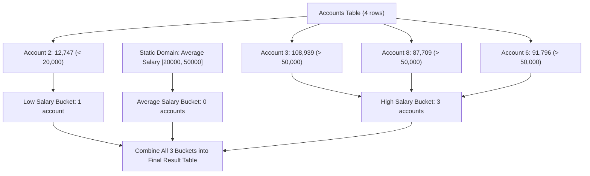

# Guided Example: Count Salary Categories

We trace disjoint interval partitioning, static domain preservation, and non-empty category aggregation on representative bank account records:

- **Input:**
  $$\text{Accounts} = \begin{pmatrix}
  \text{account\_id} & \text{income} \\
  3 & 108939 \\
  2 & 12747 \\
  8 & 87709 \\
  6 & 91796
  \end{pmatrix}$$
- **Required Output:**
  $$\begin{pmatrix}
  \text{category} & \text{accounts\_count} \\
  \text{Low Salary} & 1 \\
  \text{Average Salary} & 0 \\
  \text{High Salary} & 3
  \end{pmatrix}$$

This instance demonstrates partitioning salary values into three predefined buckets, ensuring categories with zero matching accounts are explicitly preserved in the result relation, and avoiding omitted group rows in $\mathcal{O}(n)$ time.

---

## 1. Instance & Teaching Goal

We are given an `Accounts` table containing customer `account_id` and their `income`. We must report the number of bank accounts for each of the following three salary categories:
1. **Low Salary:** All salaries strictly less than $\$20{,}000$ ($\text{income} < 20000$).
2. **Average Salary:** All salaries in the inclusive range $[\$20{,}000, \$50{,}000]$ ($20000 \le \text{income} \le 50000$).
3. **High Salary:** All salaries strictly greater than $\$50{,}000$ ($\text{income} > 50000$).

The result table must include all three categories in any order. If a category contains no accounts, it must be reported with an `accounts_count` of $0$.

In the provided dataset:
- Account 2: income $12{,}747 < 20{,}000 \implies$ **Low Salary** (count: 1).
- Accounts 3, 8, 6: incomes $108{,}939$, $87{,}709$, $91{,}796 > 50{,}000 \implies$ **High Salary** (count: 3).
- No account has an income between $\$20{,}000$ and $\$50{,}000$.
- Standard `GROUP BY` on a conditional expression would completely drop the `"Average Salary"` category from the result because no rows match that condition.
- The required output must explicitly include `"Average Salary"` with count $0$.

The teaching goal is to understand **domain completeness in relational aggregation**:
1. Why dynamic grouping fails to generate rows for empty partitions.
2. How defining a static domain relation or independent category queries ensures all categories are represented.
3. Classifying rows into mutually exclusive, exhaustive partitions.

---

## 2. Conceptual Foundation & Invariants

### Static Domain Expansion & Disjoint Interval Aggregation Theorem

> **Static Domain Expansion & Disjoint Interval Aggregation Theorem.**
> 1. *Disjoint Interval Partitioning:* The non-negative real numbers $[0, \infty)$ are partitioned into three pairwise disjoint, mutually exhaustive intervals:
>    $$I_{\text{low}} = [0, 20000), \quad I_{\text{avg}} = [20000, 50000], \quad I_{\text{high}} = (50000, \infty)$$
>    Every account income belongs to exactly one interval.
> 2. *Static Domain Obligation:* The output domain $\Omega$ is fixed:
>    $$\Omega = \{\text{"Low Salary"}, \; \text{"Average Salary"}, \; \text{"High Salary"}\}$$
>    A valid query must output $|\Omega| = 3$ rows irrespective of whether the sample data contains representatives for each category.
> 3. *Partition Counts:* For each category $C \in \Omega$ with associated interval $I_C$:
>    $$\text{count}(C) = \sum_{a \in \text{Accounts}} \mathbf{1}_{\{\text{income}(a) \in I_C\}}$$
>    If no accounts satisfy the condition, the sum over an empty set evaluates to $0$.
> 4. *Complexity:* Evaluating each account's interval membership requires a single pass over the table in $\mathcal{O}(n)$ time and $\mathcal{O}(1)$ auxiliary space.

---

## 3. Step-by-Step Worked Execution

We trace the classification of the four accounts:

---

### Step 1: Initialize Static Buckets
Define the target output buckets with zero counts:
- `Low Salary`: $0$
- `Average Salary`: $0$
- `High Salary`: $0$

---

### Step 2: Classify Each Account
- **Account 3:** $\text{income} = 108{,}939$.
  - Test $108939 < 20000$: False.
  - Test $20000 \le 108939 \le 50000$: False.
  - Test $108939 > 50000$: **True** $\implies$ increment `High Salary`.
  - Buckets: Low = $0$, Avg = $0$, High = $1$.

- **Account 2:** $\text{income} = 12{,}747$.
  - Test $12747 < 20000$: **True** $\implies$ increment `Low Salary`.
  - Buckets: Low = $1$, Avg = $0$, High = $1$.

- **Account 8:** $\text{income} = 87{,}709$.
  - Test $87709 > 50000$: **True** $\implies$ increment `High Salary`.
  - Buckets: Low = $1$, Avg = $0$, High = $2$.

- **Account 6:** $\text{income} = 91{,}796$.
  - Test $91796 > 50000$: **True** $\implies$ increment `High Salary`.
  - Buckets: Low = $1$, Avg = $0$, High = $3$.

---

### Step 3: Emit Complete Result Relation
- Every category in $\Omega$ is reported with its final tally:
  - `"Low Salary"`: $1$
  - `"Average Salary"`: $0$
  - `"High Salary"`: $3$

---

## 4. Complete Execution Trace

| Account ID | Income | Interval Condition | Assigned Category | Running Low Count | Running Avg Count | Running High Count |
|:---:|:---:|:---:|:---:|:---:|:---:|:---:|
| - | - | *Initial State* | - | 0 | 0 | 0 |
| 3 | 108,939 | $> 50000$ | High Salary | 0 | 0 | 1 |
| 2 | 12,747 | $< 20000$ | Low Salary | 1 | 0 | 1 |
| 8 | 87,709 | $> 50000$ | High Salary | 1 | 0 | 2 |
| 6 | 91,796 | $> 50000$ | High Salary | 1 | 0 | **3** |
| **Output Table** | - | - | - | **1** | **0** | **3** |

---

## 5. Algorithmic Correctness

**Soundness.** Every account is placed into exactly one bucket based on mutually exclusive mathematical intervals. No account is double-counted or omitted.

**Completeness.** By anchoring the three categories in the outer query schema (via static domain projection or union of category queries), categories with count zero are retained rather than filtered out.

---

## 6. Traps This Instance Exposes

- **The Missing Zero Category Trap:** In standard SQL, executing `SELECT CASE ... GROUP BY` only produces rows for category groups that actually exist in the table. Because no accounts fell in the $[\$20{,}000, \$50{,}000]$ range, such an approach returns only 2 rows instead of 3, failing the specification.
- **Boundary Inclusion:** The bounds must be strictly adhered to:
  - Low is strictly less than 20,000 ($< 20000$).
  - Average includes both 20,000 and 50,000 ($\ge 20000$ and $\le 50000$).
  - High is strictly greater than 50,000 ($> 50000$).
  An income of exactly $20{,}000$ or $50{,}000$ belongs to Average Salary.

---

## 7. Complexity Derivation

- **Time Complexity:** $\mathcal{O}(n)$, where $n$ is the number of rows in `Accounts`. Each row is evaluated against the partition predicates once.
- **Auxiliary Space Complexity:** $\mathcal{O}(1)$ auxiliary space beyond the 3-row output table.
