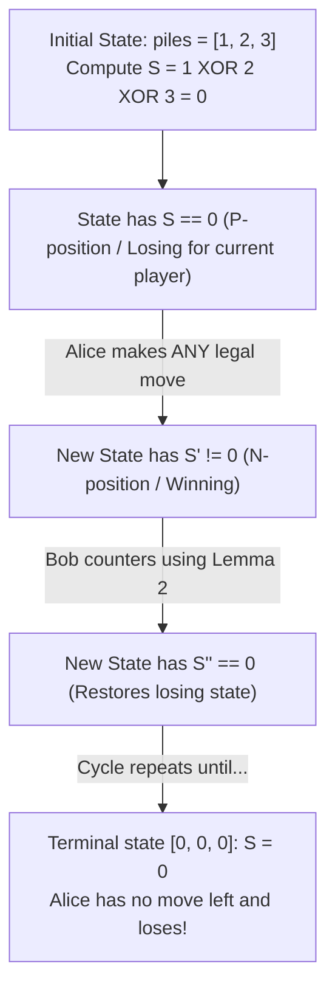

# Guided Example: Game of Nim

We trace bitwise XOR accumulation, impartial combinatorial game states, and Bouton's Nim-sum theorem on representative pile configurations:

- **Input:** `piles = [1, 2, 3]` (alongside `piles = [1]` and `piles = [1, 1]`)
- **Required Output:** `false` (and `true` for `[1]`, `false` for `[1, 1]`)

This instance demonstrates analyzing impartial combinatorial games under normal play convention, computing the bitwise XOR sum (Nim-sum) of pile sizes, proving why a non-zero Nim-sum guarantees a winning strategy for the first player, and determining the winner in $\mathcal{O}(n)$ time.

---

## 1. Instance & Teaching Goal

In the standard Game of Nim, two players (Alice and Bob) take turns with Alice moving first. On each turn, a player chooses any single pile and removes any positive number of stones (from 1 up to the total stones in that pile). The player who takes the last stone wins (i.e. a player unable to make a move loses). Both players play optimally.

For `piles = [1, 2, 3]`:
- Initial state: three piles of sizes 1, 2, and 3.
- Compute the bitwise XOR sum of all pile sizes:
  $$1 \oplus 2 \oplus 3$$
  - Binary representations:
    $$1 = 01_2, \quad 2 = 10_2, \quad 3 = 11_2$$
  - Column-wise XOR:
    - Most significant bit (bit 1): $0 \oplus 1 \oplus 1 = 0$
    - Least significant bit (bit 0): $1 \oplus 0 \oplus 1 = 0$
  - Nim-sum: $S = 00_2 = 0$.
- Because the Nim-sum is $0$, the initial position is a losing position for the first player (Alice).
- Regardless of which pile and how many stones Alice takes, the resulting Nim-sum becomes strictly positive ($S' \neq 0$). Bob can always counter by choosing a move that restores the Nim-sum to $0$.
- Consequently, Alice loses and Bob wins $\implies$ return `false`.

The teaching goal is to understand **Bouton's Nim-sum analysis**:
1. Mapping impartial multi-heap games to binary digit parity.
2. Proving that $S = 0$ is a kernel (terminal and absorbing losing positions).
3. Proving that any $S > 0$ can transition to $S' = 0$ by reducing a single pile.

---

## 2. Conceptual Foundation & Invariants

### Bouton's Nim-Sum & Impartial Game Invariant Theorem

> **Bouton's Nim-Sum & Impartial Game Invariant Theorem (1901).**
> 1. *Nim-Sum Definition:* Let a game state be defined by the multiset of pile sizes $\{x_1, x_2, \dots, x_n\}$. The Nim-sum $S$ is the bitwise XOR sum of all pile sizes:
>    $$S = x_1 \oplus x_2 \oplus \dots \oplus x_n = \bigoplus_{i=1}^n x_i$$
> 2. *Terminal State:* The game ends when all piles are empty ($x_i = 0$ for all $i$). At this terminal state, $S = 0 \oplus \dots \oplus 0 = 0$. The player whose turn it is has no valid move and loses.
> 3. *Lemma 1 (From Zero to Non-Zero):* From any state where $S = 0$, every valid move leaves a state with $S' \neq 0$.
>    - *Proof:* A move changes exactly one pile $x_k$ to $x'_k < x_k$. The new Nim-sum is:
>      $$S' = S \oplus x_k \oplus x'_k = 0 \oplus (x_k \oplus x'_k) = x_k \oplus x'_k$$
>      Since $x'_k \neq x_k$, $x_k \oplus x'_k \neq 0$. Thus $S' \neq 0$.
> 4. *Lemma 2 (From Non-Zero to Zero):* From any state where $S \neq 0$, there exists at least one legal move leaving $S' = 0$.
>    - *Proof:* Let $d$ be the most significant bit of $S$. There must be at least one pile $x_k$ whose $d$-th bit is $1$. Define $x'_k = x_k \oplus S$. Because the $d$-th bit of $S$ is $1$ and $S$ has no higher bits, $x'_k < x_k$. Replacing $x_k$ with $x'_k$ is a legal move, and the new Nim-sum is:
>      $$S' = S \oplus x_k \oplus x'_k = S \oplus x_k \oplus (x_k \oplus S) = 0$$
> 5. *Winning Strategy:* A player who receives a state with $S \neq 0$ can always transition to $S' = 0$. The opponent is forced to transition back to $S'' \neq 0$. Therefore:
>    $$\text{Alice Wins} \iff S = \bigoplus_{i=1}^n piles[i] \neq 0$$
> 6. *Complexity:* Computing the XOR sum of $n$ integers requires $\mathcal{O}(n)$ time and $\mathcal{O}(1)$ auxiliary space.

---

## 3. Step-by-Step Worked Execution

We trace the game starting from `piles = [1, 2, 3]`:

---

### Step 1: Compute Initial Nim-Sum
- Express pile sizes in binary:
  - $\text{pile}[0] = 1 = 001_2$
  - $\text{pile}[1] = 2 = 010_2$
  - $\text{pile}[2] = 3 = 011_2$
- Evaluate XOR sum:
  $$S = 1 \oplus 2 \oplus 3$$
  $$S = (001_2 \oplus 010_2) \oplus 011_2 = 011_2 \oplus 011_2 = 000_2 = 0$$
- Result: $S = 0$.

---

### Step 2: Analyze All Possible First Moves by Alice
Alice must choose one pile and reduce it:

1. **Option A: Reduce pile 0 ($1 \to 0$):**
   - New state: `[0, 2, 3]`.
   - New Nim-sum: $S' = 0 \oplus 2 \oplus 3 = 1 \neq 0$.
   - Bob can respond: Bob targets pile 2 ($3$). Desired new value: $3 \oplus S' = 3 \oplus 1 = 2$.
   - Bob reduces pile 2 from $3$ to $2$, leaving `[0, 2, 2]`.
   - New Nim-sum: $0 \oplus 2 \oplus 2 = 0$. Bob successfully restores $S = 0$.

2. **Option B: Reduce pile 1 ($2 \to 1$ or $2 \to 0$):**
   - If Alice leaves `[1, 1, 3]`: $S' = 1 \oplus 1 \oplus 3 = 3$.
   - Bob reduces pile 2 from $3$ to $0$, leaving `[1, 1, 0]` with $S'' = 0$.
   - If Alice leaves `[1, 0, 3]`: $S' = 1 \oplus 0 \oplus 3 = 2$.
   - Bob reduces pile 2 from $3$ to $1$, leaving `[1, 0, 1]` with $S'' = 0$.

3. **Option C: Reduce pile 2 ($3 \to 2$, $3 \to 1$, or $3 \to 0$):**
   - In every case, $S' \neq 0$, and Bob has a move reducing another pile to leave two equal remaining piles ($S'' = 0$).

In all possible branches, Alice faces an inevitable loss. Bob wins.

---

### Step 3: Determine Return Value
- Because $S = 0$, Alice does not have a winning strategy.
- Return `false`.

---

## 4. Complete Execution Trace

| Problem Instance | Pile Values | Binary Representation | Bitwise XOR Calculation | Nim-Sum $S$ | $S \neq 0$? | Predicted Winner |
|:---:|:---:|:---:|:---:|:---:|:---:|:---:|
| Single Pile | `[1]` | $1 = 01_2$ | $1$ | **1** | Yes | **Alice (`true`)** |
| Equal Pair | `[1, 1]` | $1 = 01_2, \; 1 = 01_2$ | $1 \oplus 1 = 0$ | **0** | No | **Bob (`false`)** |
| Case 0 | `[1, 2, 3]` | $01_2, \; 10_2, \; 11_2$ | $1 \oplus 2 \oplus 3 = 0$ | **0** | No | **Bob (`false`)** |
| Asymmetric 3-Pile | `[2, 4, 7]` | $010_2, \; 100_2, \; 111_2$ | $2 \oplus 4 \oplus 7 = 001_2 = 1$ | **1** | Yes | **Alice (`true`)** |

---

## 5. Algorithmic Correctness

**Soundness.** Under optimal play in an impartial combinatorial game with normal play convention, every position is either a previous-player-winning position ($P$-position) or a next-player-winning position ($N$-position). Bouton proved that the set of $P$-positions coincides exactly with states where the Nim-sum equals zero.

**Completeness.** Since the sum of pile sizes strictly decreases with every turn, the game is finite and acyclic. No draws can occur; exactly one player must win. Testing $S \neq 0$ correctly decides Alice's victory.

---

## 6. Traps This Instance Exposes

- **Overcomplicating with Minimax Search:** Using memoized minimax or game tree search across dynamic pile sizes is exponential and will encounter severe memory limits. The algebraic closed-form XOR reduction solves the game in linear time.
- **Misinterpreting Optimal Play:** Optimal play does not mean greedily taking the maximum number of stones. It means maintaining the zero-XOR invariant for the opponent.
- **Single Pile Base Case:** With a single pile of size $k > 0$, $S = k \neq 0$. Alice takes all $k$ stones on move 1 and immediately wins.

---

## 7. Complexity Derivation

- **Time Complexity:** $\mathcal{O}(n)$, where $n$ is the number of piles in `piles`. We perform a single pass calculating the cumulative XOR sum.
- **Auxiliary Space Complexity:** $\mathcal{O}(1)$ auxiliary space as only a single integer accumulator is maintained.
