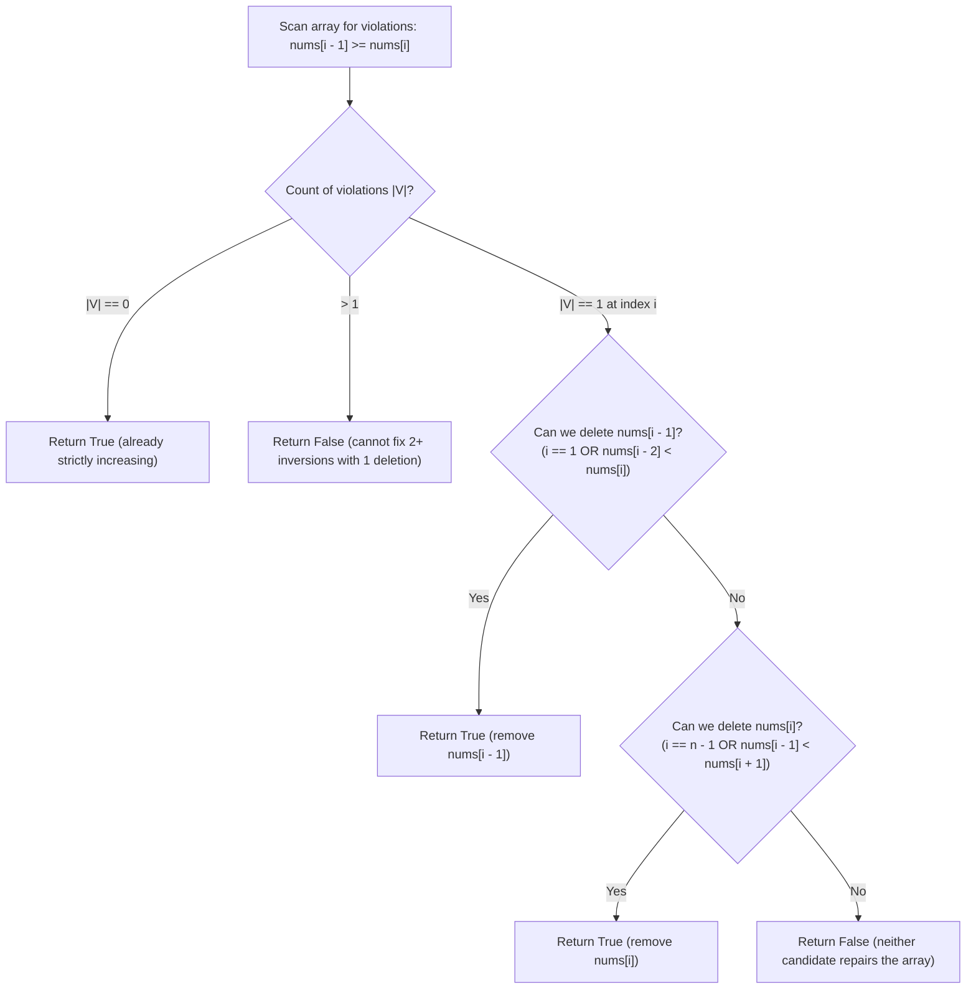

# Guided Example: Remove One Element to Make the Array Strictly Increasing

We trace local non-increasing inversion detection, dual-candidate boundary repair, and single-deletion validity on representative integer sequences:

- **Input:** `nums = [1, 2, 10, 5, 7]` (alongside `nums = [2, 3, 1, 2]`)
- **Required Output:** `true` (and `false` for `[2, 3, 1, 2]`)

This instance demonstrates identifying inversion points where $nums[i - 1] \ge nums[i]$, proving why at most one inversion can be resolved by a single element deletion, evaluating the two candidate deletions ($i - 1$ versus $i$), and deciding sequence monotonicity in $\mathcal{O}(n)$ time.

---

## 1. Instance & Teaching Goal

Given a 0-indexed integer array `nums`, we must determine whether the array can be made **strictly increasing** by removing **exactly one** element. An array is strictly increasing if $p[k - 1] < p[k]$ for all adjacent elements.

For `nums = [1, 2, 10, 5, 7]`:
- Comparing adjacent elements:
  - Index 1: $nums[0] = 1 < nums[1] = 2$ (valid).
  - Index 2: $nums[1] = 2 < nums[2] = 10$ (valid).
  - Index 3: $nums[2] = 10 \ge nums[3] = 5$ (**Violation!** $10 \ge 5$).
  - Index 4: $nums[3] = 5 < nums[4] = 7$ (valid).
- Exactly one adjacent inversion exists at index $i = 3$.
- To restore strict monotonicity, we have exactly two candidates for deletion:
  1. **Candidate A (Remove $nums[i - 1] = 10$):**
     - Splicing out $10$ connects $nums[i - 2] = 2$ directly to $nums[i] = 5$.
     - Test: is $2 < 5$? **Yes!**
     - The resulting array $[1, 2, 5, 7]$ is strictly increasing.
  2. **Candidate B (Remove $nums[i] = 5$):**
     - Splicing out $5$ connects $nums[i - 1] = 10$ directly to $nums[i + 1] = 7$.
     - Test: is $10 < 7$? **No!**
- Because Candidate A succeeds, removing the single element $10$ yields a strictly increasing array $\implies$ return `true`.

The teaching goal is to understand **local inversion repair**:
1. Why more than one inversion immediately renders repair by single deletion impossible.
2. The dual-candidate choice: when $nums[i - 1] \ge nums[i]$, the culprit must be either the high left neighbor ($i - 1$) or the low right neighbor ($i$).
3. Boundary edge cases ($i = 1$ or $i = n - 1$) where one side has no neighbor.

---

## 2. Conceptual Foundation & Invariants

### Local Inversion Disruption & Dual Repair Candidate Theorem

> **Local Inversion Disruption & Dual Repair Candidate Theorem.**
> 1. *Inversion Set:* Let $V$ be the set of indices where the strictly increasing property fails:
>    $$V = \{i \in \{1, 2, \dots, n - 1\} \mid nums[i - 1] \ge nums[i]\}$$
> 2. *Cardinality Constraint:*
>    - If $|V| > 1$: Removing any single element $nums[k]$ can repair at most one inversion condition. If there are 2 or more disjoint inversions, at least one violation must remain. Hence, if $|V| > 1$, the answer is definitively **False**.
>    - If $|V| = 0$: The array is already strictly increasing. Removing any element (e.g. the first or last) preserves strict monotonicity. The answer is **True**.
> 3. *Single Inversion Dual Candidates:* If $|V| = 1$ with violation at index $i$:
>    - The single deletion must alter the pair $(nums[i - 1], nums[i])$. Therefore, the deleted index must be either $i - 1$ or $i$.
>    - *Deleting $nums[i - 1]$:* Requires that $nums[i - 2] < nums[i]$. This is vacuously satisfied if $i - 1 = 0$ (i.e. $i = 1$).
>    - *Deleting $nums[i]$:* Requires that $nums[i - 1] < nums[i + 1]$. This is vacuously satisfied if $i = n - 1$.
>    - If either condition holds, the array can be repaired; otherwise, neither repair works and the answer is **False**.
> 4. *Complexity:* Scanning the array and checking neighbor boundaries takes $\mathcal{O}(n)$ time and $\mathcal{O}(1)$ auxiliary space.

---

## 3. Step-by-Step Worked Execution

We trace `nums = [1, 2, 10, 5, 7]` with length $n = 5$:

---

### Step 1: Scan Adjacent Pairs
- $i = 1$: $nums[0] = 1$, $nums[1] = 2$.
  - $1 < 2 \implies$ strictly increasing.
- $i = 2$: $nums[1] = 2$, $nums[2] = 10$.
  - $2 < 10 \implies$ strictly increasing.
- $i = 3$: $nums[2] = 10$, $nums[3] = 5$.
  - $10 \ge 5 \implies$ **Inversion detected!**
  - Record violation index $i = 3$. Increment violation count to $1$.
- $i = 4$: $nums[3] = 5$, $nums[4] = 7$.
  - $5 < 7 \implies$ strictly increasing.

Total violations: $1$ (at $i = 3$).

---

### Step 2: Evaluate Repair Candidates for $i = 3$
Since $|V| = 1$, test the two candidate deletions:

1. **Test Deleting $nums[i - 1] = nums[2] = 10$:**
   - Predecessor index: $i - 2 = 1$.
   - Predecessor value: $nums[1] = 2$.
   - Successor value: $nums[3] = 5$.
   - Check condition: $nums[1] < nums[3] \implies 2 < 5$.
   - **Satisfied!** Removing $10$ bridges $2$ and $5$ seamlessly.
   - Spliced sequence: $[1, 2, 5, 7]$ is strictly increasing.

2. Since Candidate A succeeds, we need not check further.
- Conclude: `true`.

---

### Step 3: Comparative Trace on Unrepairable Instance `[2, 3, 1, 2]`
For contrast, trace `nums = [2, 3, 1, 2]` ($n = 4$):
- $i = 1$: $nums[0]=2 < nums[1]=3$ (ok).
- $i = 2$: $nums[1]=3 \ge nums[2]=1$ (Inversion 1 at $i = 2$).
- $i = 3$: $nums[2]=1 < nums[3]=2$ (ok).
- Here $|V| = 1$ at $i = 2$. Let us test both candidates:
  - Candidate A (remove $nums[1] = 3$):
    - Check $nums[i - 2] < nums[i] \implies nums[0] < nums[2] \implies 2 < 1$ (**False**).
    - Resulting array: $[2, 1, 2]$ has $2 \ge 1$. Fails!
  - Candidate B (remove $nums[2] = 1$):
    - Check $nums[i - 1] < nums[i + 1] \implies nums[1] < nums[3] \implies 3 < 2$ (**False**).
    - Resulting array: $[2, 3, 2]$ has $3 \ge 2$. Fails!
- Neither candidate repairs the array $\implies$ return `false`.

---

## 4. Complete Execution Trace

| Array Instance | Pairs $(nums[i-1], nums[i])$ | Inversions $V$ | Candidate A: Remove $nums[i-1]$ | Candidate B: Remove $nums[i]$ | Decision |
|:---:|:---:|:---:|:---:|:---:|:---:|
| `[1, 2, 10, 5, 7]` | $(1, 2), (2, 10), (10, 5)^*, (5, 7)$ | $\{3\}$ | $nums[1] < nums[3] \implies 2 < 5$ (**Valid**) | $nums[2] < nums[4] \implies 10 < 7$ (Invalid) | **`true`** |
| `[2, 3, 1, 2]` | $(2, 3), (3, 1)^*, (1, 2)$ | $\{2\}$ | $nums[0] < nums[2] \implies 2 < 1$ (Invalid) | $nums[1] < nums[3] \implies 3 < 2$ (Invalid) | **`false`** |
| `[1, 1, 1]` | $(1, 1)^*, (1, 1)^*$ | $\{1, 2\}$ | Multiple inversions ($|V| = 2 > 1$) | Multiple inversions | **`false`** |
| `[1, 2, 3]` | $(1, 2), (2, 3)$ | $\emptyset$ | Already strictly increasing | Already strictly increasing | **`true`** |

---

## 5. Algorithmic Correctness

**Soundness.** A single element removal can only alter relationships between the removed element and its adjacent neighbors. If the condition $nums[i-2] < nums[i]$ or $nums[i-1] < nums[i+1]$ holds, the new joint is strictly increasing and no other inversions exist in the array.

**Completeness.** Any valid single deletion must remove either $nums[i-1]$ or $nums[i]$. Exhaustively checking both candidate bridge conditions guarantees that if any valid removal exists, it will be detected.

---

## 6. Traps This Instance Exposes

- **Deleting the Wrong Element:** In `[1, 2, 10, 5, 7]`, removing $5$ leaves $[1, 2, 10, 7]$ which still fails ($10 \ge 7$). Only testing both candidates avoids missing the valid removal.
- **Boundary Inversions at Ends:**
  - If $i = 1$, removing $nums[0]$ leaves $nums[1]$ at the start with no predecessor; this is always valid.
  - If $i = n - 1$, removing $nums[n - 1]$ leaves $nums[n - 2]$ at the end with no successor; this is always valid.
- **Multiple Duplicates:** In `[1, 1, 1]`, there are two separate inversions. Removing one element leaves $[1, 1]$, which is non-decreasing but **not** strictly increasing.

---

## 7. Complexity Derivation

- **Time Complexity:** $\mathcal{O}(n)$, where $n$ is the length of `nums`. We perform a single linear scan over the array to locate inversions.
- **Auxiliary Space Complexity:** $\mathcal{O}(1)$ auxiliary space as only indices and counters are tracked.
