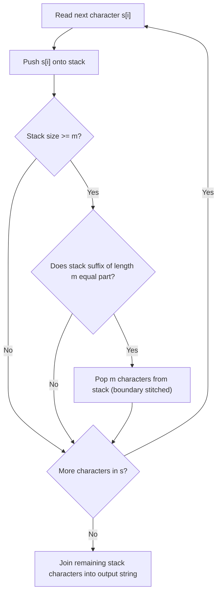

# Guided Example: Remove All Occurrences of a Substring

We trace character stream accumulation, stack suffix contraction, and boundary coalescence on representative string elimination instances:

- **Input:** `s = "daabcbaabcbc"`, `part = "abc"`
- **Required Output:** `"dab"`

This instance demonstrates modeling repeated leftmost substring deletion via a character stack, checking the suffix of length $m = |part|$ upon every character push, instantly collapsing newly formed occurrences at spliced boundaries, and obtaining the irreducible string in $\mathcal{O}(n \cdot m)$ time.

---

## 1. Instance & Teaching Goal

Given two strings `s` and `part`, we must repeatedly remove the **leftmost** occurrence of the substring `part` until no occurrence of `part` exists in `s`.

For `s = "daabcbaabcbc"` and `part = "abc"` ($m = 3$):
- Naively searching and re-splicing the string from scratch after every deletion incurs $\mathcal{O}(n^2)$ copying overhead.
- Instead, maintain a stack of characters. As characters from `s` are pushed one by one:
  - Whenever the stack size is at least $m$, inspect the top $m$ characters.
  - If the top $m$ characters match `part`, pop all $m$ characters.
  - Popping brings the characters preceding the removed instance directly adjacent to the characters following it, allowing newly spliced occurrences to be detected immediately.
- Pushing characters sequentially through `s` collapses three successive instances of `"abc"`:
  1. Characters up to index 4 form `"daabc"`; suffix `"abc"` collapses, leaving `"da"`.
  2. Subsequent pushes form `"dabaabc"`; suffix `"abc"` collapses, leaving `"daba"`.
  3. Pushing the remaining characters `"bc"` forms `"dababc"`; suffix `"abc"` collapses, leaving `"dab"`.
- The final reduced string is `"dab"`.

The teaching goal is to understand **stack-based confluent reduction**:
1. Why processing characters left-to-right in a stack faithfully implements the leftmost deletion rule.
2. How adjacent boundaries re-stitch automatically without re-scanning the entire prefix.
3. Establishing invariant termination without nested string allocations.

---

## 2. Conceptual Foundation & Invariants

### Stack Suffix Contraction & Boundary Stitching Theorem

> **Stack Suffix Contraction & Boundary Stitching Theorem.**
> 1. *Prefix Irreducibility Invariant:* Let $S_t$ denote the sequence of characters in the stack after processing $s[0 \dots t]$. At every step $t$, the stack $S_t$ contains **no** occurrence of $part$ as a contiguous substring.
> 2. *Suffix Matching Criterion:* When pushing character $s[t+1]$:
>    - If $|S_t| + 1 < m$, no occurrence of length $m = |part|$ can exist.
>    - If $|S_t| + 1 \ge m$, compare the suffix of length $m$ with $part$:
>      $$\text{Suffix}(S_{t+1}, m) \stackrel{?}{=} part$$
> 3. *Contraction Step:*
>    - If the suffix matches $part$, pop $m$ characters from the stack.
>    - The newly exposed top of the stack was part of an irreducible prefix. Any new occurrence of $part$ must involve the newly exposed suffix combined with subsequent characters.
> 4. *Equivalence to Leftmost Deletion:* Because characters are processed in ascending order of their original indices, the earliest completed instance of $part$ is detected and eliminated at the exact moment its final character is pushed. This strictly matches the leftmost deletion rule.
> 5. *Complexity:* Each character is pushed onto the stack once and popped at most once. Suffix comparison takes $\mathcal{O}(m)$ operations. Total time is $\mathcal{O}(n \cdot m)$ where $n = |s|$, requiring $\mathcal{O}(n)$ auxiliary space.

---

## 3. Step-by-Step Worked Execution

We trace `s = "daabcbaabcbc"` with `part = "abc"` ($m = 3$):

---

### Step-by-Step Pushes and Contractions

- **$i = 0$ ($s[0] = \text{'d'}$):**
  - Push `'d'`. Stack: `['d']`. Length $1 < 3$.

- **$i = 1$ ($s[1] = \text{'a'}$):**
  - Push `'a'`. Stack: `['d', 'a']`. Length $2 < 3$.

- **$i = 2$ ($s[2] = \text{'a'}$):**
  - Push `'a'`. Stack: `['d', 'a', 'a']`. Length 3.
  - Suffix: `"daa"` $\ne$ `"abc"`. Keep.

- **$i = 3$ ($s[3] = \text{'b'}$):**
  - Push `'b'`. Stack: `['d', 'a', 'a', 'b']`.
  - Suffix (last 3): `"aab"` $\ne$ `"abc"`. Keep.

- **$i = 4$ ($s[4] = \text{'c'}$):**
  - Push `'c'`. Stack: `['d', 'a', 'a', 'b', 'c']`.
  - Suffix (last 3): `"abc"` $==$ `"abc"`. **Match detected!**
  - **Pop 3 characters:** remove `'a', 'b', 'c'`.
  - Stack after contraction: `['d', 'a']`.

- **$i = 5$ ($s[5] = \text{'b'}$):**
  - Push `'b'`. Stack: `['d', 'a', 'b']`.
  - Suffix (last 3): `"dab"` $\ne$ `"abc"`. Keep.

- **$i = 6$ ($s[6] = \text{'a'}$):**
  - Push `'a'`. Stack: `['d', 'a', 'b', 'a']`.
  - Suffix: `"aba"` $\ne$ `"abc"`. Keep.

- **$i = 7$ ($s[7] = \text{'a'}$):**
  - Push `'a'`. Stack: `['d', 'a', 'b', 'a', 'a']`.
  - Suffix: `"baa"` $\ne$ `"abc"`. Keep.

- **$i = 8$ ($s[8] = \text{'b'}$):**
  - Push `'b'`. Stack: `['d', 'a', 'b', 'a', 'a', 'b']`.
  - Suffix: `"aab"` $\ne$ `"abc"`. Keep.

- **$i = 9$ ($s[9] = \text{'c'}$):**
  - Push `'c'`. Stack: `['d', 'a', 'b', 'a', 'a', 'b', 'c']`.
  - Suffix (last 3): `"abc"` $==$ `"abc"`. **Match detected!**
  - **Pop 3 characters:** remove `'a', 'b', 'c'`.
  - Stack after contraction: `['d', 'a', 'b', 'a']`.

- **$i = 10$ ($s[10] = \text{'b'}$):**
  - Push `'b'`. Stack: `['d', 'a', 'b', 'a', 'b']`.
  - Suffix: `"bab"` $\ne$ `"abc"`. Keep.

- **$i = 11$ ($s[11] = \text{'c'}$):**
  - Push `'c'`. Stack: `['d', 'a', 'b', 'a', 'b', 'c']`.
  - Suffix (last 3): `"abc"` $==$ `"abc"`. **Match detected!**
  - **Pop 3 characters:** remove `'a', 'b', 'c'`.
  - Stack after contraction: `['d', 'a', 'b']`.

---

### Step 2: Assemble Remaining Characters
- The stack contains `['d', 'a', 'b']`.
- Concatenating yields `"dab"`.

---

## 4. Complete Execution Trace

| Index $i$ | Character $s[i]$ | Stack After Push | Suffix of Length 3 | Match? | Action Taken | Stack After Action |
|:---:|:---:|:---:|:---:|:---:|:---:|:---:|
| 0 | `d` | `d` | - | No | None | `d` |
| 1 | `a` | `da` | - | No | None | `da` |
| 2 | `a` | `daa` | `daa` | No | None | `daa` |
| 3 | `b` | `daab` | `aab` | No | None | `daab` |
| 4 | `c` | `daabc` | `abc` | **Yes** | Pop 3 | `da` |
| 5 | `b` | `dab` | `dab` | No | None | `dab` |
| 6 | `a` | `daba` | `aba` | No | None | `daba` |
| 7 | `a` | `dabaa` | `baa` | No | None | `dabaa` |
| 8 | `b` | `dabaab` | `aab` | No | None | `dabaab` |
| 9 | `c` | `dabaabc` | `abc` | **Yes** | Pop 3 | `daba` |
| 10 | `b` | `dabab` | `bab` | No | None | `dabab` |
| 11 | `c` | `dababc` | `abc` | **Yes** | Pop 3 | `dab` |
| **End** | - | - | - | - | - | **`"dab"`** |

---

## 5. Algorithmic Correctness

**Soundness.** Every time $m$ characters are popped, they form an exact match with $part$. Characters before and after are reconnected without altering their relative sequential order.

**Completeness.** By mathematical induction, no instance of $part$ can exist entirely within the stack prior to a push. Any new instance of $part$ must terminate with the character currently pushed. Detecting and popping this suffix immediately guarantees that no occurrence is overlooked.

---

## 6. Traps This Instance Exposes

- **Cascading Boundary Collapses:** In `s = "axxxxyyyyb"` with `part = "xy"`, removing an interior `"xy"` causes outer `'x'` and `'y'` characters to touch, forming another `"xy"`. The stack handles this naturally because the popped boundary immediately exposes the preceding characters.
- **Repeated Substring Slicing:** Repeatedly calling string replace or find functions can take $\mathcal{O}(n^2)$ time in cases with many small deletions. The stack approach ensures each character is examined with bounded suffix comparisons.

---

## 7. Complexity Derivation

- **Time Complexity:** $\mathcal{O}(n \cdot m)$, where $n = |s|$ and $m = |part|$. Each character is pushed once and popped at most once. Suffix verification takes at most $m$ character comparisons per push.
- **Auxiliary Space Complexity:** $\mathcal{O}(n)$ auxiliary space to maintain the character stack.
