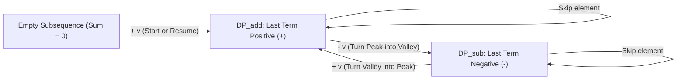

# Guided Example: Maximum Alternating Subsequence Sum

We trace dual-parity dynamic programming, alternating sign transitions, and peak-valley accumulation on representative numerical sequences:

- **Input:** `nums = [4, 2, 5, 3]` (alongside `nums = [5, 6, 7, 8]`)
- **Required Output:** `7` (and `8` for `[5, 6, 7, 8]`)

This instance demonstrates finding a subsequence that maximizes $x_0 - x_1 + x_2 - x_3 + \dots$, tracking parity states for whether the last included element was added or subtracted, proving why the optimal sequence always ends with an addition, and computing the optimal sum in $\mathcal{O}(n)$ time and $\mathcal{O}(1)$ auxiliary space.

---

## 1. Instance & Teaching Goal

The alternating sum of a 0-indexed sequence is defined as the sum of elements at even indices minus the sum of elements at odd indices:
$$\text{AlternatingSum}(x_0, x_1, \dots, x_{k-1}) = \sum_{j=0}^{k-1} (-1)^j x_j = x_0 - x_1 + x_2 - x_3 + \dots$$
Given an array `nums`, we want to select a subsequence that maximizes this alternating sum.

For `nums = [4, 2, 5, 3]`:
- Option 1: Pick single element $[4] \implies 4$.
- Option 2: Pick single element $[5] \implies 5$.
- Option 3: Pick $[4, 2, 5] \implies 4 - 2 + 5 = 7$.
- Option 4: Pick $[4, 2, 5, 3] \implies 4 - 2 + 5 - 3 = 4$.
- Notice that picking the valley $2$ costs $-2$, but unlocks the subsequent larger peak $+5$, yielding a net gain of $+3$, bringing the total to $4 + 3 = 7$.
- Adding $3$ at the end would subtract $3$, reducing the total to $4$. Hence the sequence terminates after $5$.
- Maximum alternating sum is $7$.

The teaching goal is to understand **parity-alternating dynamic programming**:
1. Factoring the alternating sign into two symmetric states: ending with an added element versus ending with a subtracted element.
2. Formulating $\mathcal{O}(1)$-space Bellman updates across a single linear scan.
3. Proving why non-negative values guarantee that the optimal sequence always ends with a positive term (odd length).

---

## 2. Conceptual Foundation & Invariants

### Parity-Alternating Dynamic Programming & Peak-Valley Invariant Theorem

> **Parity-Alternating Dynamic Programming & Peak-Valley Invariant Theorem.**
> 1. *Dual Parity States:* Let $DP_{\text{add}}[i]$ denote the maximum alternating sum of a non-empty subsequence chosen from $nums[0 \dots i]$ whose last term is added ($+$, i.e. an odd-length subsequence ending at an even 0-based index).
>    Let $DP_{\text{sub}}[i]$ denote the maximum alternating sum of a subsequence chosen from $nums[0 \dots i]$ whose last term is subtracted ($-$, i.e. an even-length subsequence ending at an odd 0-based index, initialized to $0$ for the empty subsequence).
> 2. *Bellman Recurrence Equations:* For each incoming element $v = nums[i]$:
>    $$\begin{aligned}
>    DP_{\text{add}} &\leftarrow \max(DP_{\text{add}}, \; DP_{\text{sub}} + v) \\
>    DP_{\text{sub}} &\leftarrow \max(DP_{\text{sub}}, \; DP_{\text{add}} - v)
>    \end{aligned}$$
> 3. *Optimality of Terminal Addition:* Since all array elements are positive ($nums[i] \ge 1$), appending an element to an even-length sequence adds a positive value ($+v$), whereas ending with a subtraction decreases the total sum. Therefore:
>    $$\max_{\text{subsequences}} \text{AlternatingSum} = DP_{\text{add}}$$
> 4. *Complexity:* The state requires only two running scalar values updated in a single pass, requiring $\mathcal{O}(n)$ time and $\mathcal{O}(1)$ auxiliary space.

---

## 3. Step-by-Step Worked Execution

We trace `nums = [4, 2, 5, 3]` with initial states $DP_{\text{add}} = 0$ and $DP_{\text{sub}} = 0$:

---

### Step 1: Process $nums[0] = 4$
- We can start a new subsequence with $+4$:
  $$DP_{\text{add}} = \max(0, \; 0 + 4) = 4$$
- Subtraction state:
  $$DP_{\text{sub}} = \max(0, \; 4 - 4) = 0$$
- States: $DP_{\text{add}} = 4, \; DP_{\text{sub}} = 0$.

---

### Step 2: Process $nums[1] = 2$
- Updating $DP_{\text{add}}$:
  $$DP_{\text{add}} = \max(4, \; 0 + 2) = 4$$
- Updating $DP_{\text{sub}}$ (subtracting $2$ from prior addition state $4$):
  $$DP_{\text{sub}} = \max(0, \; 4 - 2) = 2$$
- States: $DP_{\text{add}} = 4, \; DP_{\text{sub}} = 2$.
  *(Interpretation: $DP_{\text{sub}} = 2$ represents the subsequence $[4, 2]$ with sum $4 - 2 = 2$.)*

---

### Step 3: Process $nums[2] = 5$
- Updating $DP_{\text{add}}$ (adding $5$ to prior subtraction state $2$):
  $$DP_{\text{add}} = \max(4, \; 2 + 5) = 7$$
- Updating $DP_{\text{sub}}$:
  $$DP_{\text{sub}} = \max(2, \; 7 - 5) = 2$$
- States: $DP_{\text{add}} = 7, \; DP_{\text{sub}} = 2$.
  *(Interpretation: $DP_{\text{add}} = 7$ represents the subsequence $[4, 2, 5]$ with sum $4 - 2 + 5 = 7$.)*

---

### Step 4: Process $nums[3] = 3$
- Updating $DP_{\text{add}}$:
  $$DP_{\text{add}} = \max(7, \; 2 + 3) = 7$$
- Updating $DP_{\text{sub}}$ (subtracting $3$ from $7$):
  $$DP_{\text{sub}} = \max(2, \; 7 - 3) = 4$$
- States: $DP_{\text{add}} = 7, \; DP_{\text{sub}} = 4$.

---

### Step 5: Final Result
- The maximum alternating sum is $DP_{\text{add}} = 7$.

---

## 4. Complete Execution Trace

| Step $i$ | Element $v$ | Previous $(DP_{\text{add}}, DP_{\text{sub}})$ | New $DP_{\text{add}} = \max(DP_{\text{add}}, DP_{\text{sub}} + v)$ | New $DP_{\text{sub}} = \max(DP_{\text{sub}}, DP_{\text{add}} - v)$ | Best Subsequence Represented |
|:---:|:---:|:---:|:---:|:---:|:---:|
| 0 | 4 | $(0, 0)$ | $\max(0, 0 + 4) = 4$ | $\max(0, 4 - 4) = 0$ | $[4]$ |
| 1 | 2 | $(4, 0)$ | $\max(4, 0 + 2) = 4$ | $\max(0, 4 - 2) = 2$ | $[4, 2]$ (for sub) |
| 2 | 5 | $(4, 2)$ | $\max(4, 2 + 5) = \mathbf{7}$ | $\max(2, 7 - 5) = 2$ | $[4, 2, 5]$ |
| 3 | 3 | $(7, 2)$ | $\max(7, 2 + 3) = \mathbf{7}$ | $\max(2, 7 - 3) = 4$ | $[4, 2, 5]$ |
| **Output** | - | - | **7** | - | **`7`** |

---

## 5. Algorithmic Correctness

**Soundness.** Any valid alternating subsequence alternates between positive and negative coefficients. The two dynamic programming states exhaustively maintain the supremum alternating sum for odd and even sequence lengths at every step.

**Completeness.** By the principle of optimality, the optimal sequence ending at index $i$ must extend an optimal sequence ending before index $i$ of the opposite parity. Since both transition options (including or skipping $nums[i]$) are evaluated, no optimal configuration is missed.

---

## 6. Traps This Instance Exposes

- **Greedy Valley Trapping:** One might hesitate to subtract $2$ because subtracting reduces the current sum from $4$ down to $2$. However, enduring this local decrease of $2$ enables a subsequent gain of $+5$, producing a net positive increment of $+3$.
- **Strictly Increasing Sequences:** For `nums = [5, 6, 7, 8]`, any subtraction produces a net loss. The dynamic programming transitions naturally skip all subtractions, yielding $DP_{\text{add}} = 8$ (corresponding to selecting just the single maximum element $[8]$).

---

## 7. Complexity Derivation

- **Time Complexity:** $\mathcal{O}(n)$, where $n$ is the length of `nums`. Each element triggers constant-time arithmetic updates.
- **Auxiliary Space Complexity:** $\mathcal{O}(1)$ auxiliary space, requiring only two 64-bit integer variables.