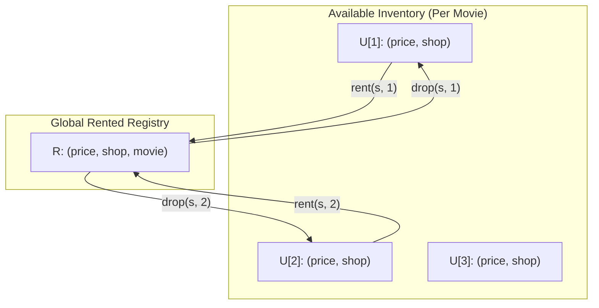

# Guided Example: Design Movie Rental System

We trace partitioned ordered index management, dual-state inventory tracking, and multi-key lexicographical ranking on representative movie rental operations:

- **Input Operations:**
  ```text
  MovieRentingSystem(3, [[0, 1, 5], [0, 2, 6], [0, 3, 7], [1, 1, 4], [1, 2, 7], [2, 1, 5]])
  search(1)
  rent(0, 1)
  rent(1, 2)
  report()
  drop(1, 2)
  search(2)
  ```
- **Required Output:** `[null, [1, 0, 2], null, null, [[0, 1], [1, 2]], null, [0, 1]]`

This instance demonstrates coordinating per-movie available inventory with a global rented registry, dynamically moving items between ordered sets upon rental and return, tie-breaking by price, shop ID, and movie ID, and serving top-5 queries in $\mathcal{O}(1)$ query time and $\mathcal{O}(\log N)$ update time.

---

## 1. Instance & Teaching Goal

We must design a movie rental service supporting:
1. `search(movie)`: Returns up to 5 cheapest shops stocking an **unrented** copy of `movie`, sorted by `price` ascending, then `shop` ID ascending.
2. `rent(shop, movie)`: Rents the movie from the given shop (marking it unavailable).
3. `drop(shop, movie)`: Returns a rented movie to the shop (marking it available).
4. `report()`: Returns up to 5 cheapest **rented** movies across the entire system, sorted by `price` ascending, then `shop` ID ascending, then `movie` ID ascending.

For the initial inventory of 6 entries across 3 shops:
- Shop 0 has: Movie 1 (price 5), Movie 2 (price 6), Movie 3 (price 7).
- Shop 1 has: Movie 1 (price 4), Movie 2 (price 7).
- Shop 2 has: Movie 1 (price 5).

The teaching goal is to understand **dual-state ordered index architecture**:
1. Partitioning available copies per movie into balanced search trees ordered by $(price, shop)$.
2. Consolidating all rented copies into a single global balanced search tree ordered by $(price, shop, movie)$.
3. Executing atomic state transitions between available and rented partitions in $\mathcal{O}(\log N)$ time.
4. Extracting the leading $k \le 5$ elements without full array sorting.

---

## 2. Conceptual Foundation & Invariants

### Dual-Index Ordered Set & Lexicographical Priority Invariant Theorem

> **Dual-Index Ordered Set & Lexicographical Priority Invariant Theorem.**
> 1. *Fixed Price Map:* For any valid pair $(shop, movie)$, the price $P[shop, movie]$ is fixed at initialization and queryable in $\mathcal{O}(1)$ time.
> 2. *Unrented Per-Movie Index ($U_m$):* For each movie $m$, maintain a balanced ordered set $U_m$ storing tuples:
>    $$(price, shop) \in U_m$$
>    ordered strictly by $price \uparrow$, breaking ties by $shop \uparrow$.
> 3. *Global Rented Index ($R$):* Maintain a single global balanced ordered set $R$ storing tuples:
>    $$(price, shop, movie) \in R$$
>    ordered strictly by $price \uparrow$, then $shop \uparrow$, then $movie \uparrow$.
> 4. *State Transitions:*
>    - $\text{rent}(s, m)$: Removes $(P[s, m], s)$ from $U_m$, and inserts $(P[s, m], s, m)$ into $R$.
>    - $\text{drop}(s, m)$: Removes $(P[s, m], s, m)$ from $R$, and inserts $(P[s, m], s)$ into $U_m$.
> 5. *Top-$K$ Retrieval:*
>    - `search(m)` inspects the first $\min(5, |U_m|)$ elements of $U_m$.
>    - `report()` inspects the first $\min(5, |R|)$ elements of $R$.
>    - Because $k \le 5$ is a fixed constant, both inspection queries run in $\mathcal{O}(1)$ time.
> 6. *Complexity:* Insertions and deletions in ordered sets take $\mathcal{O}(\log N)$ time, where $N$ is the total number of movie copies.



---

## 3. Step-by-Step Worked Execution

---

### Step 1: System Initialization
Given 6 entries, populate $P$ and initial unrented sets:
- **Price Map $P$:**
  - $(0, 1) \to 5$, $(0, 2) \to 6$, $(0, 3) \to 7$
  - $(1, 1) \to 4$, $(1, 2) \to 7$
  - $(2, 1) \to 5$
- **Unrented Sets:**
  - $U_1 = \{(4, 1), (5, 0), (5, 2)\}$ (Note tie-break: shop $0 < 2$)
  - $U_2 = \{(6, 0), (7, 1)\}$
  - $U_3 = \{(7, 0)\}$
- **Global Rented Set:**
  - $R = \emptyset$

---

### Step 2: `search(1)`
- Target: Find up to 5 cheapest shops with an available copy of Movie 1.
- Traverse $U_1$ in ascending order:
  1. First entry: $(4, 1) \implies \text{shop } 1$.
  2. Second entry: $(5, 0) \implies \text{shop } 0$.
  3. Third entry: $(5, 2) \implies \text{shop } 2$.
- Gather shop IDs: $[1, 0, 2]$.

---

### Step 3: `rent(0, 1)`
- Shop 0 rents Movie 1. Price is $P[0, 1] = 5$.
- Remove $(5, 0)$ from $U_1$.
  - Updated $U_1 = \{(4, 1), (5, 2)\}$.
- Insert $(5, 0, 1)$ into $R$.
  - Updated $R = \{(5, 0, 1)\}$.
- Return `null`.

---

### Step 4: `rent(1, 2)`
- Shop 1 rents Movie 2. Price is $P[1, 2] = 7$.
- Remove $(7, 1)$ from $U_2$.
  - Updated $U_2 = \{(6, 0)\}$.
- Insert $(7, 1, 2)$ into $R$.
  - Updated $R = \{(5, 0, 1), (7, 1, 2)\}$.
- Return `null`.

---

### Step 5: `report()`
- Target: Find up to 5 cheapest rented movies across all shops.
- Traverse $R$ in ascending order:
  1. Entry 1: $(5, 0, 1) \implies [\text{shop } 0, \text{movie } 1]$.
  2. Entry 2: $(7, 1, 2) \implies [\text{shop } 1, \text{movie } 2]$.
- Gather pairs: $[[0, 1], [1, 2]]$.

---

### Step 6: `drop(1, 2)`
- Customer returns Movie 2 to Shop 1. Price is $P[1, 2] = 7$.
- Remove $(7, 1, 2)$ from $R$.
  - Updated $R = \{(5, 0, 1)\}$.
- Insert $(7, 1)$ back into $U_2$.
  - Updated $U_2 = \{(6, 0), (7, 1)\}$.
- Return `null`.

---

### Step 7: `search(2)`
- Target: Find up to 5 cheapest shops with an available copy of Movie 2.
- Traverse $U_2$ in ascending order:
  1. First entry: $(6, 0) \implies \text{shop } 0$.
  2. Second entry: $(7, 1) \implies \text{shop } 1$ (the returned copy is available again!).
- Gather shop IDs: $[0, 1]$.

---

## 4. Complete Execution Trace

| Operation | Arguments | Mutated Sets | Result Returned |
|:---:|:---:|:---:|:---:|
| `MovieRentingSystem` | $n=3$, 6 entries | Populated $U_1, U_2, U_3$; $R = \emptyset$ | `null` |
| `search` | `movie = 1` | None (read $U_1$) | `[1, 0, 2]` |
| `rent` | `shop = 0, movie = 1` | $U_1 \setminus \{(5, 0)\}$; $R \cup \{(5, 0, 1)\}$ | `null` |
| `rent` | `shop = 1, movie = 2` | $U_2 \setminus \{(7, 1)\}$; $R \cup \{(7, 1, 2)\}$ | `null` |
| `report` | (none) | None (read $R$) | `[[0, 1], [1, 2]]` |
| `drop` | `shop = 1, movie = 2` | $R \setminus \{(7, 1, 2)\}$; $U_2 \cup \{(7, 1)\}$ | `null` |
| `search` | `movie = 2` | None (read $U_2$) | `[0, 1]` |

---

## 5. Algorithmic Correctness

**Soundness.** A movie copy exists in exactly one state: either available in its movie-specific set $U_m$, or rented in the global set $R$. Maintaining strict lexicographical ordering on keys guarantees that prefix iterators always return the uniquely lowest-cost entities with exact tie-breaking.

**Completeness.** Every operation performs a symmetric transfer between sets without loss of items or prices. Returning items preserves their original price and shop attributes.

---

## 6. Traps This Instance Exposes

- **Tie-Breaking Priority:** In `search(1)`, Shop 0 and Shop 2 both offer Movie 1 for price 5. Because $0 < 2$, Shop 0 must appear before Shop 2.
- **Reporting Tuple Schema:** `report()` must return pairs of $[shop, movie]$, not $[price, shop]$ or $[shop, price]$.
- **Constant-Time Top-5:** Scanning or sorting all rented movies on every `report()` call would yield $\mathcal{O}(N \log N)$ per call, causing Time Limit Exceeded. Using a self-balancing ordered structure yields $\mathcal{O}(1)$ top-5 extraction.

---

## 7. Complexity Derivation

- **Initialization:** $\mathcal{O}(N \log N)$, where $N$ is the number of movie entries, to populate the ordered sets.
- **`rent` and `drop` Operations:** $\mathcal{O}(\log N)$ per operation to remove from one ordered set and insert into another.
- **`search` and `report` Operations:** $\mathcal{O}(1)$ per operation, as they extract at most 5 elements from the head of an ordered set.
- **Auxiliary Space Complexity:** $\mathcal{O}(N)$ auxiliary space to store all movie copies across the sets and price dictionary.
