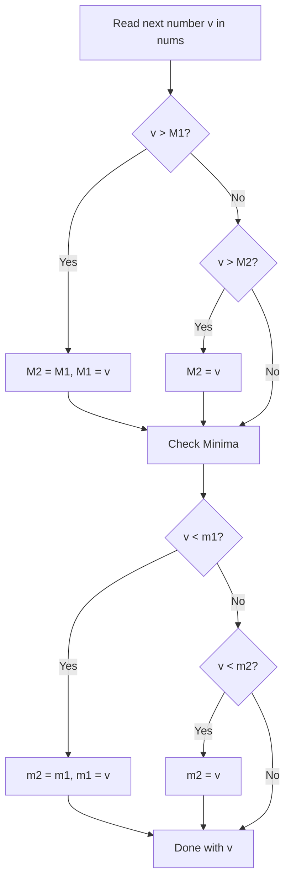

# Guided Example: Maximum Product Difference Between Two Pairs

We trace extremal order statistics selection, pairwise multiplication over positive integers, and single-pass bounding on representative array instances:

- **Input:** `nums = [5, 6, 2, 7, 4]` (alongside `nums = [4, 2, 5, 9, 7, 4, 8]`)
- **Required Output:** `34` (and `64` for `[4, 2, 5, 9, 7, 4, 8]`)

This instance demonstrates selecting four distinct indices $w, x, y, z$ to maximize $(nums[w] \cdot nums[x]) - (nums[y] \cdot nums[z])$, proving why the optimal solution decouples into the two largest and two smallest values, and performing the computation in $\mathcal{O}(n)$ time and $\mathcal{O}(1)$ auxiliary space.

---

## 1. Instance & Teaching Goal

Given an integer array `nums` of length at least 4 where each element is strictly positive, the product difference between two pairs $(nums[w], nums[x])$ and $(nums[y], nums[z])$ is defined as:
$$(nums[w] \cdot nums[x]) - (nums[y] \cdot nums[z])$$
We must choose four pairwise distinct indices $w, x, y, z$ to maximize this difference.

For `nums = [5, 6, 2, 7, 4]`:
- Elements in sorted order: $[2, 4, 5, 6, 7]$.
- The two largest values are $7$ and $6$, giving a maximum product:
  $$7 \cdot 6 = 42$$
- The two smallest values are $2$ and $4$, giving a minimum product:
  $$2 \cdot 4 = 8$$
- Subtracting the minimum product from the maximum product yields:
  $$42 - 8 = 34$$

The teaching goal is to understand **extremal order statistics decoupling**:
1. Why monotonicity over positive numbers allows independent maximization of the minuend and minimization of the subtrahend.
2. Proving that when $n \ge 4$, the top two and bottom two elements occupy disjoint index sets.
3. Tracking the two largest and two smallest numbers in a single $\mathcal{O}(n)$ linear pass without sorting.

---

## 2. Conceptual Foundation & Invariants

### Positive Quadruple Extremal Decomposition Theorem

> **Positive Quadruple Extremal Decomposition Theorem.**
> 1. *Monotonic Decoupling:* Let $nums$ be an array of positive integers ($nums[i] > 0$) of size $n \ge 4$. For any choice of four distinct indices $w, x, y, z$:
>    $$\Delta(w, x, y, z) = (nums[w] \cdot nums[x]) - (nums[y] \cdot nums[z])$$
>    Because the two terms are separated by subtraction and all values are positive, $\Delta$ is maximized when the first term is maximized and the second term is minimized simultaneously.
> 2. *Order Statistics Identification:*
>    - Let $M_1 \ge M_2$ denote the two largest elements in $nums$ ($nums_{(n-1)}$ and $nums_{(n-2)}$).
>    - Let $m_1 \le m_2$ denote the two smallest elements in $nums$ ($nums_{(0)}$ and $nums_{(1)}$).
> 3. *Index Disjointness:* Because $n \ge 4$, the index set of the two smallest elements $\{0, 1\}$ and the two largest elements $\{n-2, n-1\}$ are completely disjoint:
>    $$\{0, 1\} \cap \{n-2, n-1\} = \emptyset$$
>    Therefore, the four chosen elements can always be drawn from four distinct indices.
> 4. *Optimal Difference:*
>    $$\max_{w, x, y, z} \Delta = (M_1 \cdot M_2) - (m_1 \cdot m_2)$$
> 5. *Complexity:* The values $M_1, M_2, m_1, m_2$ can be identified during a single linear scan in $\mathcal{O}(n)$ time and $\mathcal{O}(1)$ auxiliary space.

---

## 3. Step-by-Step Worked Execution

We trace `nums = [5, 6, 2, 7, 4]` using a single pass tracking $M_1, M_2$ (initialized to $-\infty$) and $m_1, m_2$ (initialized to $+\infty$):

---

### Step-by-Step Extremal Updates

- **Index 0 ($v = 5$):**
  - Maxima: $5 > -\infty \implies M_2 = -\infty, \; M_1 = 5$.
  - Minima: $5 < \infty \implies m_2 = \infty, \; m_1 = 5$.
  - Current: $M = (5, -\infty), \; m = (5, \infty)$.

- **Index 1 ($v = 6$):**
  - Maxima: $6 > 5 \implies M_2 = 5, \; M_1 = 6$.
  - Minima: $6 > 5$, but $6 < \infty \implies m_2 = 6, \; m_1 = 5$.
  - Current: $M = (6, 5), \; m = (5, 6)$.

- **Index 2 ($v = 2$):**
  - Maxima: $2 < 5$, no change to $M$.
  - Minima: $2 < 5 \implies m_2 = 5, \; m_1 = 2$.
  - Current: $M = (6, 5), \; m = (2, 5)$.

- **Index 3 ($v = 7$):**
  - Maxima: $7 > 6 \implies M_2 = 6, \; M_1 = 7$.
  - Minima: $7 > 5$, no change to $m$.
  - Current: $M = (7, 6), \; m = (2, 5)$.

- **Index 4 ($v = 4$):**
  - Maxima: $4 < 6$, no change to $M$.
  - Minima: $4 > 2$, but $4 < 5 \implies m_2 = 4, \; m_1 = 2$.
  - Current: $M = (7, 6), \; m = (2, 4)$.

---

### Step 2: Compute Products and Difference
1. Maximum product:
   $$M_1 \cdot M_2 = 7 \cdot 6 = 42$$
2. Minimum product:
   $$m_1 \cdot m_2 = 2 \cdot 4 = 8$$
3. Maximum difference:
   $$\Delta = 42 - 8 = 34$$

---

## 4. Complete Execution Trace

| Step $i$ | Value $v$ | Largest Pair $(M_1, M_2)$ | Smallest Pair $(m_1, m_2)$ | Action / Update |
|:---:|:---:|:---:|:---:|:---:|
| 0 | 5 | $(5, -\infty)$ | $(5, +\infty)$ | Initialized with first element |
| 1 | 6 | $(6, 5)$ | $(5, 6)$ | 6 becomes top max, 2nd min |
| 2 | 2 | $(6, 5)$ | $(2, 5)$ | 2 becomes top min |
| 3 | 7 | $(7, 6)$ | $(2, 5)$ | 7 becomes top max |
| 4 | 4 | $(7, 6)$ | $(2, 4)$ | 4 becomes 2nd min |
| **Final** | - | **(7, 6)** | **(2, 4)** | **$(7 \times 6) - (2 \times 4) = 34$** |

---

## 5. Algorithmic Correctness

**Soundness.** All numbers in `nums` are strictly positive. Since $f(x, y) = x \cdot y$ is strictly increasing in each variable over $\mathbb{R}^+$, the maximal product of two elements from a finite set is uniquely achieved by the two largest elements, and the minimal product by the two smallest.

**Completeness.** The four positions are mutually distinct whenever $n \ge 4$. If elements share duplicate values (as in `[4, 2, 5, 9, 7, 4, 8]` where $4$ appears twice), the duplicate values occupy distinct array indices, maintaining strict index validity.

---

## 6. Traps This Instance Exposes

- **Duplicate Extreme Values:** When an array contains duplicate minimum or maximum values (e.g. `[4, 4, ...]` or `[9, 9, ...]`), the algorithm must allow $M_1 = M_2$ or $m_1 = m_2$ without deduplication, because they come from different indices.
- **Unnecessary Sorting:** Sorting the entire array requires $\mathcal{O}(n \log n)$ time. Maintaining four running variables evaluates the exact same result in a single $\mathcal{O}(n)$ scan.

---

## 7. Complexity Derivation

- **Time Complexity:** $\mathcal{O}(n)$, where $n$ is the length of `nums`. Each element undergoes at most four scalar comparisons.
- **Auxiliary Space Complexity:** $\mathcal{O}(1)$ auxiliary space, requiring only four numerical accumulator variables.
