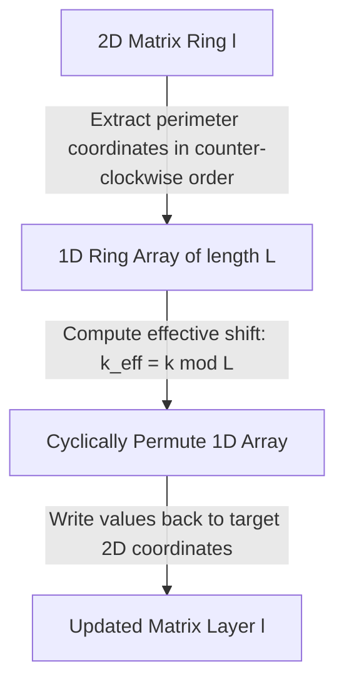

# Guided Example: Cyclically Rotating a Grid

We trace concentric layer unrolling, modular displacement reduction, and counter-clockwise cycle permutation on representative matrix instances:

- **Input:** `grid = [[40, 10], [30, 20]], k = 1` (alongside a $4 \times 4$ multi-layer grid with $k = 2$)
- **Required Output:** `[[10, 20], [40, 30]]`

This instance demonstrates decomposing a 2D matrix into independent concentric rectangular rings, flattening each ring into a 1D circular array along the counter-clockwise perimeter, reducing the rotation count modulo the perimeter length $k \pmod L$, and rewriting shifted elements back to their destination coordinates in $\mathcal{O}(m \cdot n)$ time.

---

## 1. Instance & Teaching Goal

Given an $m \times n$ matrix where both dimensions are even, and an integer $k$, we must rotate the matrix cyclically in a counter-clockwise direction by $k$ positions layer by layer.

For the $2 \times 2$ matrix `grid = [[40, 10], [30, 20]]` with $k = 1$:
- The matrix contains a single layer ($l = 0$).
- Cells along the counter-clockwise perimeter starting from $(0, 0)$:
  - $(0, 0) = 40$ (moves down along left column)
  - $(1, 0) = 30$ (moves right along bottom row)
  - $(1, 1) = 20$ (moves up along right column)
  - $(0, 1) = 10$ (moves left along top row)
- Rotating by 1 position counter-clockwise shifts each element forward by 1 along this cycle:
  - $40$ moves to $(1, 0)$
  - $30$ moves to $(1, 1)$
  - $20$ moves to $(0, 1)$
  - $10$ moves to $(0, 0)$
- Resulting grid:
  $$\begin{bmatrix} 10 & 20 \\ 40 & 30 \end{bmatrix}$$

The teaching goal is to understand **concentric ring decomposition and modular cycling**:
1. Partitioning an $m \times n$ grid into $\min(m, n)/2$ disjoint rectangular rings.
2. Parameterizing perimeter paths in counter-clockwise orientation.
3. Applying modular reduction $k_{\text{eff}} = k \pmod L$ to prevent redundant full cycles.
4. Performing 1D rotation and 2D scatter in optimal linear time.

---

## 2. Conceptual Foundation & Invariants

### Concentric Perimeter Flattening & Modular Shift Invariant Theorem

> **Concentric Perimeter Flattening & Modular Shift Invariant Theorem.**
> 1. *Concentric Ring Partition:* For an $m \times n$ grid with even dimensions, every cell $(r, c)$ belongs to exactly one concentric ring $l = \min(r, m - 1 - r, c, n - 1 - c)$, where $0 \le l < \min(m, n)/2$.
> 2. *Perimeter Length:* A rectangular ring at depth $l$ has height $h_l = m - 2l$ and width $w_l = n - 2l$. Its perimeter consists of:
>    $$L_l = 2(h_l + w_l - 2) = 2(m - 2l - 1) + 2(n - 2l - 1)$$
>    cells.
> 3. *Counter-Clockwise Traversal Order:* Flatten ring $l$ into a 1D sequence of coordinates $\mathcal{C}_l$:
>    - Left edge (downward): $(r, l)$ for $r = l \dots m - 1 - l$
>    - Bottom edge (rightward): $(m - 1 - l, c)$ for $c = l + 1 \dots n - 1 - l$
>    - Right edge (upward): $(r, n - 1 - l)$ for $r = m - 2 - l \dots l$
>    - Top edge (leftward): $(l, c)$ for $c = n - 2 - l \dots l + 1$
> 4. *Modular Shift Equivalence:* Rotating counter-clockwise by $k$ positions along a closed ring of size $L_l$ is identical to a shift of:
>    $$k_{\text{eff}} = k \pmod{L_l}$$
>    The value originally at coordinate $\mathcal{C}_l[j]$ is placed at coordinate $\mathcal{C}_l[(j + k_{\text{eff}}) \pmod{L_l}]$.
> 5. *Independence:* Each ring rotates independently; no elements cross ring boundaries.

---

## 3. Step-by-Step Worked Execution

We trace `grid = [[40, 10], [30, 20]], k = 1`:
- Dimensions: $m = 2, n = 2$.
- Number of layers: $\min(2, 2) / 2 = 1$ layer ($l = 0$).

---

### Step 1: Extract Ring Coordinates and Values
Ring $l = 0$ boundaries: $r \in [0, 1], c \in [0, 1]$.
- Height $h_0 = 2$, Width $w_0 = 2$.
- Perimeter length:
  $$L_0 = 2(2 + 2 - 2) = 4$$
- Traverse perimeter counter-clockwise:
  1. Down left: $(0, 0) \to 40$
  2. Down left: $(1, 0) \to 30$
  3. Right bottom: $(1, 1) \to 20$
  4. Up right: $(0, 1) \to 10$
- Coordinate list $\mathcal{C}_0 = [(0, 0), (1, 0), (1, 1), (0, 1)]$.
- Value list $\mathcal{V}_0 = [40, 30, 20, 10]$.

---

### Step 2: Compute Modular Shift
- Total rotations: $k = 1$.
- Effective shift:
  $$k_{\text{eff}} = 1 \pmod 4 = 1$$

---

### Step 3: Compute Destination Coordinates
Each element at 1D index $j$ moves to destination index $(j + 1) \pmod 4$:

1. $j = 0$ (Value $40$, source $(0, 0)$):
   $$\text{Dest index} = (0 + 1) \pmod 4 = 1 \implies \text{Coordinate } \mathcal{C}_0[1] = (1, 0)$$
2. $j = 1$ (Value $30$, source $(1, 0)$):
   $$\text{Dest index} = (1 + 1) \pmod 4 = 2 \implies \text{Coordinate } \mathcal{C}_0[2] = (1, 1)$$
3. $j = 2$ (Value $20$, source $(1, 1)$):
   $$\text{Dest index} = (2 + 1) \pmod 4 = 3 \implies \text{Coordinate } \mathcal{C}_0[3] = (0, 1)$$
4. $j = 3$ (Value $10$, source $(0, 1)$):
   $$\text{Dest index} = (3 + 1) \pmod 4 = 0 \implies \text{Coordinate } \mathcal{C}_0[0] = (0, 0)$$

---

### Step 4: Scatter Values to Grid
- Write $10$ to $(0, 0)$.
- Write $20$ to $(0, 1)$.
- Write $40$ to $(1, 0)$.
- Write $30$ to $(1, 1)$.

Final matrix:
$$\begin{bmatrix} 10 & 20 \\ 40 & 30 \end{bmatrix}$$

---

## 4. Complete Execution Trace

| 1D Index $j$ | Source Coordinate | Source Value | Shift Calculation | Target Index | Target Coordinate | Final Placed Value |
|:---:|:---:|:---:|:---:|:---:|:---:|:---:|
| 0 | $(0, 0)$ | 40 | $(0 + 1) \pmod 4$ | 1 | $(1, 0)$ | 40 |
| 1 | $(1, 0)$ | 30 | $(1 + 1) \pmod 4$ | 2 | $(1, 1)$ | 30 |
| 2 | $(1, 1)$ | 20 | $(2 + 1) \pmod 4$ | 3 | $(0, 1)$ | 20 |
| 3 | $(0, 1)$ | 10 | $(3 + 1) \pmod 4$ | 0 | $(0, 0)$ | 10 |

---

## 5. Algorithmic Correctness

**Soundness.** Rotating each ring by $k_{\text{eff}} = k \pmod{L_l}$ produces identical configurations to rotating $k$ times one step at a time, because cyclically shifting a circular sequence of size $L$ by $L$ steps is an identity automorphism.

**Completeness.** Every cell in the grid belongs to exactly one concentric layer. Processing all $\min(m, n)/2$ layers independently ensures every cell is rotated exactly once without overlap or omissions.

---

## 6. Traps This Instance Exposes

- **Per-Layer Modulus Variation:** Inner layers have smaller perimeters than outer layers ($L_0 > L_1 > \dots$). Therefore, $k \pmod{L_l}$ must be evaluated **separately** for each ring, never with a global modulus.
- **Directional Orientation:** Counter-clockwise motion requires moving down the left column, right along the bottom, up the right column, and left across the top. Reversing the traversal results in clockwise rotation.

---

## 7. Complexity Derivation

- **Time Complexity:** $\mathcal{O}(m \cdot n)$, where $m$ and $n$ are the matrix dimensions. Each cell is extracted into a 1D buffer and written back to the matrix exactly once.
- **Auxiliary Space Complexity:** $\mathcal{O}(m + n)$ auxiliary space to store the coordinate and value buffers for the largest perimeter layer.
