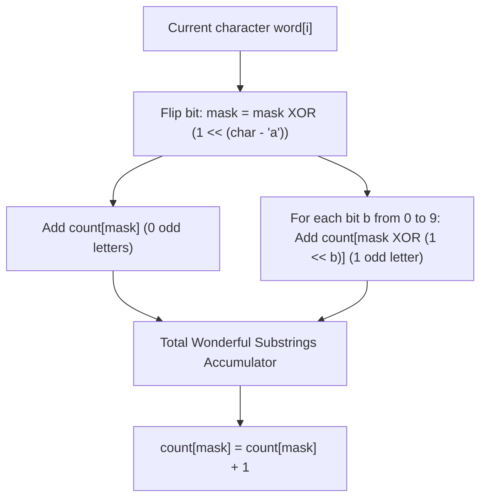

# Guided Example: Number of Wonderful Substrings

We trace prefix parity bitmasking, Hamming distance neighborhood accumulation, and $\mathbb{F}_2^{10}$ vector space representation on representative string instances:

- **Input:** `word = "aba"` (alongside `word = "aabb"`)
- **Required Output:** `4` (and `9` for `"aabb"`)

This instance demonstrates encoding the odd/even character parity of the alphabet $\{'a', \dots, 'j'\}$ as a 10-bit integer, querying prefix masks that differ by at most 1 bit (Hamming weight $\le 1$), and counting all qualifying substrings in $\mathcal{O}(N \cdot |\Sigma|)$ time and $\mathcal{O}(2^{|\Sigma|})$ auxiliary space.

---

## 1. Instance & Teaching Goal

A string is called **wonderful** if at most one letter appears an odd number of times (i.e. either zero letters or exactly one letter has odd frequency). We are given a string `word` consisting only of the first 10 lowercase English letters: `'a'` through `'j'`.

For `word = "aba"`:
- Substrings of length 1:
  - `"a"` at $[0..0]$: `'a'` appears 1 time (1 odd) $\implies$ wonderful.
  - `"b"` at $[1..1]$: `'b'` appears 1 time (1 odd) $\implies$ wonderful.
  - `"a"` at $[2..2]$: `'a'` appears 1 time (1 odd) $\implies$ wonderful.
- Substrings of length 2:
  - `"ab"` at $[0..1]$: `'a'` appears 1, `'b'` appears 1 (2 odd) $\implies$ not wonderful.
  - `"ba"` at $[1..2]$: `'b'` appears 1, `'a'` appears 1 (2 odd) $\implies$ not wonderful.
- Substrings of length 3:
  - `"aba"` at $[0..2]$: `'a'` appears 2, `'b'` appears 1 (1 odd) $\implies$ wonderful.
- Total count: $3 + 0 + 1 = 4$.

The teaching goal is to understand **prefix parity hashing and unit Hamming search**:
1. Mapping character counts modulo 2 to a compact 10-bit state mask.
2. Formulating substring parity as prefix mask XOR: $P(j..i) = M_i \oplus M_{j-1}$.
3. Decomposing the "at most one odd letter" condition into exact identity ($M_{j-1} = M_i$) and single-bit flip transitions ($M_{j-1} = M_i \oplus 2^b$).
4. Achieving linear $\mathcal{O}(N \cdot 10)$ running time using a static table of size $2^{10} = 1024$.

---

## 2. Conceptual Foundation & Invariants

### Prefix Parity Bitmask & Unit Hamming Neighborhood Invariant Theorem

> **Prefix Parity Bitmask & Unit Hamming Neighborhood Invariant Theorem.**
> 1. *Binary Parity Vector:* Let $\Sigma = \{0, 1, \dots, 9\}$ represent the characters `'a'` through `'j'`. For any prefix $word[0..i]$, define the parity mask:
>    $$M_i = \sum_{c \in \Sigma} (\text{count}(c, 0..i) \pmod 2) \cdot 2^c \in \{0, 1, \dots, 2^{10} - 1\}$$
> 2. *Prefix Substring Relation:* The parity of character frequencies in the substring $word[j..i]$ is given by the bitwise XOR:
>    $$P(j..i) = M_i \oplus M_{j-1} \quad (\text{with } M_{-1} = 0)$$
> 3. *Wonderful Condition:* The substring $word[j..i]$ is wonderful if and only if the Hamming weight $\|P(j..i)\|_H \le 1$:
>    - Case 0 (zero odd characters): $P(j..i) = 0 \iff M_{j-1} = M_i$.
>    - Case 1 (exactly one odd character $b$): $P(j..i) = 2^b \iff M_{j-1} = M_i \oplus 2^b$ for some $b \in \{0, \dots, 9\}$.
> 4. *Neighborhood Query:* For each current prefix mask $M_i$, the number of valid starting indices $j \le i$ is:
>    $$\text{count}[M_i] + \sum_{b=0}^{9} \text{count}[M_i \oplus 2^b]$$
>    where $\text{count}[m]$ records the frequency of prefix mask $m$ observed prior to index $i$.
> 5. *Complexity:* The alphabet size is constant ($|\Sigma| = 10$). Each character evaluation performs 1 bitwise update and 11 constant-time array lookups.

---

## 3. Step-by-Step Worked Execution

We trace `word = "aba"`:
- Letters map to bit positions: `'a' \to 0` ($2^0 = 1$), `'b' \to 1` ($2^1 = 2$).
- Prefix mask state initialized to $0$ (empty prefix before index 0).
- Frequency table `count` initialized with `count[0] = 1`, all other entries $0$.
- Running total initialized to $0$.

---

### Prefix 0: Character `'a'` ($i = 0$)
1. Bit flip: Character `'a'` corresponds to bit 0 ($2^0 = 1$).
   $$M_0 = 0 \oplus 1 = 1 \quad (\text{binary } 0000000001_2)$$
2. Case 0 (even parity, $M_{j-1} = 1$):
   $$\text{count}[1] = 0$$
3. Case 1 (one odd parity, $M_{j-1} = 1 \oplus 2^b$):
   - $b = 0$: $1 \oplus 1 = 0 \implies \text{count}[0] = 1$ (substring `"a"` at $[0..0]$).
   - $b = 1$: $1 \oplus 2 = 3 \implies \text{count}[3] = 0$.
   - $b = 2 \dots 9$: All other lookups are $0$.
4. Add to total: $+1$ (Total = $1$).
5. Update frequency table: $\text{count}[1] \leftarrow 1$.

---

### Prefix 1: Character `'b'` ($i = 1$)
1. Bit flip: Character `'b'` corresponds to bit 1 ($2^1 = 2$).
   $$M_1 = 1 \oplus 2 = 3 \quad (\text{binary } 0000000011_2)$$
2. Case 0 (even parity, $M_{j-1} = 3$):
   $$\text{count}[3] = 0$$
3. Case 1 (one odd parity, $M_{j-1} = 3 \oplus 2^b$):
   - $b = 0$: $3 \oplus 1 = 2 \implies \text{count}[2] = 0$.
   - $b = 1$: $3 \oplus 2 = 1 \implies \text{count}[1] = 1$ (substring `"b"` at $[1..1]$).
   - $b = 2 \dots 9$: All other lookups are $0$.
4. Add to total: $+1$ (Total = $1 + 1 = 2$).
5. Update frequency table: $\text{count}[3] \leftarrow 1$.

---

### Prefix 2: Character `'a'` ($i = 2$)
1. Bit flip: Character `'a'` corresponds to bit 0 ($2^0 = 1$).
   $$M_2 = 3 \oplus 1 = 2 \quad (\text{binary } 0000000010_2)$$
2. Case 0 (even parity, $M_{j-1} = 2$):
   $$\text{count}[2] = 0$$
3. Case 1 (one odd parity, $M_{j-1} = 2 \oplus 2^b$):
   - $b = 0$: $2 \oplus 1 = 3 \implies \text{count}[3] = 1$ (substring `"a"` at $[2..2]$, matching prefix mask $3$).
   - $b = 1$: $2 \oplus 2 = 0 \implies \text{count}[0] = 1$ (substring `"aba"` at $[0..2]$, matching prefix mask $0$).
   - $b = 2 \dots 9$: All other lookups are $0$.
4. Add to total: $+2$ (Total = $2 + 2 = 4$).
5. Update frequency table: $\text{count}[2] \leftarrow 1$.

Final total: **4**.

---

## 4. Complete Execution Trace

| Step $i$ | Character | Running Mask $M_i$ | Exact Match (`count[M]`) | 1-Bit Neighbors Found | New Substrings Discovered | Cumulative Wonderful Substrings |
|:---:|:---:|:---:|:---:|:---:|:---:|:---:|
| - | - | $0$ | - | - | Empty prefix seeded | $0$ |
| 0 | `'a'` | $1$ | $0$ | $M \oplus 1 = 0 \implies 1$ | `"a"` ($[0..0]$) | **1** |
| 1 | `'b'` | $3$ | $0$ | $M \oplus 2 = 1 \implies 1$ | `"b"` ($[1..1]$) | **2** |
| 2 | `'a'` | $2$ | $0$ | $M \oplus 1 = 3 \implies 1$, $M \oplus 2 = 0 \implies 1$ | `"a"` ($[2..2]$), `"aba"` ($[0..2]$) | **4** |

---

## 5. Algorithmic Correctness

**Soundness.** For any interval $[j..i]$, the parity of every letter $c \in \Sigma$ is odd if and only if bit $c$ in $M_i \oplus M_{j-1}$ is 1. Checking whether $M_i \oplus M_{j-1} \in \{0\} \cup \{2^0, 2^1, \dots, 2^9\}$ exhaustively verifies whether the substring contains at most one character with odd frequency.

**Completeness.** Initializing $\text{count}[0] = 1$ guarantees that any qualifying prefix $[0..i]$ (where $M_{-1} = 0$) is counted. Because the algorithm inspects every prefix index $i \in [0, N-1]$, every valid pair $(j, i)$ is counted exactly once at the moment its endpoint $i$ is reached.

---

## 6. Traps This Instance Exposes

- **Base Prefix Initialization:** Forgetting to set $\text{count}[0] = 1$ causes all wonderful prefixes starting at index 0 to be missed.
- **64-bit Integer Overflow:** In strings of length $N = 10^5$, the total count of wonderful substrings can reach $\approx N(N+1)/2 \approx 5 \times 10^9$, which exceeds the 32-bit signed integer limit ($2^{31}-1 \approx 2.14 \times 10^9$). The accumulator must use 64-bit integers.
- **Alphabet Bounds:** The alphabet is strictly restricted to the 10 characters `'a'` through `'j'`. Iterating through 26 characters would needlessly multiply the inner loop constant factor.

---

## 7. Complexity Derivation

- **Time Complexity:** $\mathcal{O}(N \cdot |\Sigma|)$, where $N$ is the length of `word` and $|\Sigma| = 10$. For each of the $N$ characters, we perform 1 bitwise operation and 11 array lookups.
- **Auxiliary Space Complexity:** $\mathcal{O}(2^{|\Sigma|}) = \mathcal{O}(1024) = \mathcal{O}(1)$ auxiliary space for the fixed-size frequency table.
