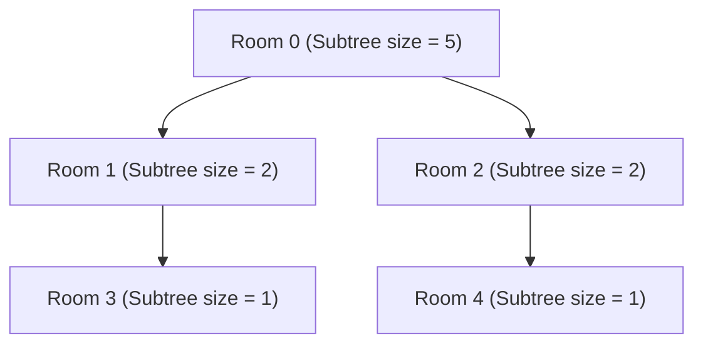

# Guided Example: Count Ways to Build Rooms in an Ant Colony

We trace the tree Hook Length formula, subtree size postorder accumulation, and modular inverse multinomial reduction on representative colony structures:

- **Input:** `prevRoom = [-1, 0, 0, 1, 2]` (5 rooms)
- **Required Output:** `6`

This instance demonstrates counting topological sorts (valid building orders) of an out-tree rooted at node 0, reducing tree-wide multinomial interleavings to a closed-form product $\frac{n!}{\prod |T_u|} \pmod{10^9 + 7}$ in $\mathcal{O}(n)$ time.

---

## 1. Instance & Teaching Goal

The ant colony consists of $n = 5$ rooms labeled $0$ through $4$:
- Room $0$ is the underground entrance (`prevRoom[0] = -1`), built first.
- Room $1$ connects to room $0$ (`prevRoom[1] = 0`).
- Room $2$ connects to room $0$ (`prevRoom[2] = 0`).
- Room $3$ connects to room $1$ (`prevRoom[3] = 1`).
- Room $4$ connects to room $2$ (`prevRoom[4] = 2`).

A room can only be built after its parent room has already been constructed. Any valid building sequence must begin with room $0$. Moreover, room $1$ must precede room $3$, and room $2$ must precede room $4$. However, rooms from the left branch $\{1, 3\}$ and right branch $\{2, 4\}$ may be interleaved in any valid relative order:
- $[0, 1, 3, 2, 4]$
- $[0, 1, 2, 3, 4]$
- $[0, 1, 2, 4, 3]$
- $[0, 2, 4, 1, 3]$
- $[0, 2, 1, 4, 3]$
- $[0, 2, 1, 3, 4]$

Total valid construction orders: **6**.

The teaching goal is to understand **tree linear extensions and hook-length factorization**:
1. Formulating the recursive multinomial branching rule at each node.
2. Observing the global telescopic cancellation that reduces recursive DP to the ratio $\frac{n!}{\prod |T_u|}$.
3. Computing subtree sizes via post-order depth-first traversal in $\mathcal{O}(n)$ time.
4. Applying Fermat's Little Theorem for modular division under prime modulo $10^9 + 7$.

---

## 2. Conceptual Foundation & Invariants

### Tree Hook Length Formula & Subtree Multinomial Independence Theorem

> **Tree Hook Length Formula & Subtree Multinomial Independence Theorem.**
> 1. *Recursive Interleaving:* For any node $u$ with disjoint child subtrees $T_{v_1}, T_{v_2}, \dots, T_{v_k}$, the root $u$ must appear strictly before all members of its subtree $T_u$. The valid internal orders of each child subtree can be interleaved arbitrarily, yielding:
>    $$\text{ways}(u) = \binom{|T_u| - 1}{|T_{v_1}|, |T_{v_2}|, \dots, |T_{v_k}|} \times \prod_{i=1}^k \text{ways}(v_i)$$
>    where $\binom{|T_u| - 1}{|T_{v_1}|, \dots, |T_{v_k}|} = \frac{(|T_u| - 1)!}{\prod_{i=1}^k |T_{v_i}|!}$.
> 2. *Telescopic Collapse:* Expanding the product across all nodes in the tree, every intermediate numerator $(|T_v| - 1)!$ divides into the denominator $|T_v|!$ contributed by its parent, leaving:
>    $$\frac{(|T_v| - 1)!}{|T_v|!} = \frac{1}{|T_v|}$$
>    Consequently, all factorials cancel except for the top numerator $(|T_{\text{root}}| - 1)! = (n - 1)!$. Since root $0$ is fixed at index 1 of the $n$ positions, the total number of permutations is:
>    $$\text{ways}(0) = \frac{n!}{\prod_{u=0}^{n-1} |T_u|}$$
> 3. *Probabilistic Interpretation:* In a uniform random permutation of the $n$ nodes, the probability that node $u$ appears before all other $|T_u| - 1$ descendants in its subtree is exactly $\frac{1}{|T_u|}$. Because subtrees are hierarchically nested or disjoint, these events are mutually independent.
> 4. *Modular Arithmetic:* Under modulo $M = 10^9 + 7$, modular division is performed via multiplication by modular inverses:
>    $$\text{ways}(0) \equiv n! \times \prod_{u=0}^{n-1} |T_u|^{M-2} \pmod{M}$$

---

## 3. Step-by-Step Worked Execution

We trace `prevRoom = [-1, 0, 0, 1, 2]` with $n = 5$ and modulo $M = 10^9 + 7$:

### Step 1: Compute Subtree Sizes via Post-Order Traversal
- **Leaf nodes:**
  - Room $3$ has no children: $|T_3| = 1$.
  - Room $4$ has no children: $|T_4| = 1$.
- **Intermediate nodes:**
  - Room $1$ has child $\{3\}$: $|T_1| = 1 + |T_3| = 1 + 1 = 2$.
  - Room $2$ has child $\{4\}$: $|T_2| = 1 + |T_4| = 1 + 1 = 2$.
- **Root node:**
  - Room $0$ has children $\{1, 2\}$:
    $$|T_0| = 1 + |T_1| + |T_2| = 1 + 2 + 2 = 5$$

All subtree sizes:
$$|T| = [5, 2, 2, 1, 1]$$

---

### Step 2: Compute Numerator ($n!$)
For $n = 5$:
$$5! = 5 \times 4 \times 3 \times 2 \times 1 = 120$$

---

### Step 3: Compute Subtree Size Denominator Product
$$\prod_{u=0}^{4} |T_u| = |T_0| \times |T_1| \times |T_2| \times |T_3| \times |T_4|$$
$$\prod_{u=0}^{4} |T_u| = 5 \times 2 \times 2 \times 1 \times 1 = 20$$

---

### Step 4: Evaluate Closed-Form Quotient
$$\text{ways}(0) = \frac{120}{20} = 6$$

Taking $6 \pmod{10^9 + 7}$ yields **6**.

---

## 4. Complete Execution Trace

| Node $u$ | Parent `prevRoom[u]` | Children | Subtree Size $|T_u|$ | Modular Inverse $|T_u|^{-1} \pmod M$ | Running Product Modulo $M$ |
|:---:|:---:|:---:|:---:|:---:|:---:|
| - | - | - | - | Initial: $n! = 5! = 120$ | $120$ |
| 0 | -1 | $\{1, 2\}$ | $5$ | $5^{-1} \equiv 400000003$ | $120 \times 5^{-1} \equiv 24$ |
| 1 | 0 | $\{3\}$ | $2$ | $2^{-1} \equiv 500000004$ | $24 \times 2^{-1} \equiv 12$ |
| 2 | 0 | $\{4\}$ | $2$ | $2^{-1} \equiv 500000004$ | $12 \times 2^{-1} \equiv 6$ |
| 3 | 1 | $\emptyset$ | $1$ | $1^{-1} \equiv 1$ | $6 \times 1^{-1} \equiv 6$ |
| 4 | 2 | $\emptyset$ | $1$ | $1^{-1} \equiv 1$ | $6 \times 1^{-1} \equiv 6$ |

Final result: **6**.

---

## 5. Algorithmic Correctness

**Soundness.** Every valid order must satisfy the partial order: $u \prec v$ whenever $u$ is an ancestor of $v$. The Hook Length formula counts exactly the linear extensions of tree-posets. By induction on tree height, the multinomial coefficient at each node partitions remaining positions without violating parent-child precedence.

**Completeness.** Since the graph is a directed tree rooted at 0 with every edge directed away from 0, the poset has no cycles and a unique minimum element. The formula exhaustively enumerates all topological sorts.

---

## 6. Traps This Instance Exposes

- **Deep Recursion Limit:** For chain graphs where $n = 10^5$, a naive recursive DFS exceeds Python's default call stack recursion limit. An iterative topological post-order traversal (or increasing recursion depth) is required.
- **Multinomial Factorial Recomputation:** Computing separate factorial permutations $\binom{|T_u|-1}{|T_{v_1}|, \dots}$ for each node individually can cause redundant calculations if factorials are not precomputed or if the simplified Hook Length form $\frac{n!}{\prod |T_u|}$ is overlooked.

---

## 7. Complexity Derivation

- **Time Complexity:** $\mathcal{O}(n \log M)$ or $\mathcal{O}(n)$ with precomputed factorials and inverse factorials. Computing tree sizes takes $\mathcal{O}(n)$ post-order work; computing modular inverses takes $\mathcal{O}(n \log M)$ using Fermat's Little Theorem or $\mathcal{O}(n)$ using linear inverse precomputation.
- **Auxiliary Space Complexity:** $\mathcal{O}(n)$ to store adjacency lists, subtree sizes, and parent pointers.