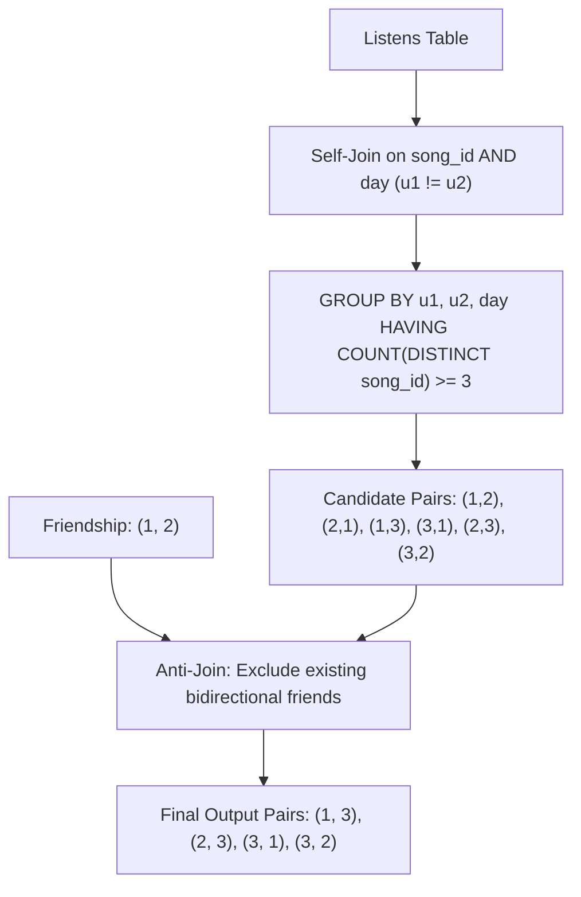

# Guided Example: Leetcodify Friends Recommendations

We trace same-day co-listening joins, distinct song threshold aggregation, and bilateral friendship exclusion on representative streaming records:

- **Input:**
  - `Listens`:
    - User 1: songs 10, 11, 12 on `2021-03-15`
    - User 2: songs 10, 11, 12 on `2021-03-15`
    - User 3: songs 10, 11, 12 on `2021-03-15`
    - User 4: songs 10, 11, 13 on `2021-03-15`
    - User 5: songs 10, 11, 12 on `2021-03-16`
  - `Friendship`:
    - `(user1_id = 1, user2_id = 2)`
- **Required Output:**
  ```text
  +---------+----------------+
  | user_id | recommended_id |
  +---------+----------------+
  | 1       | 3              |
  | 2       | 3              |
  | 3       | 1              |
  | 3       | 2              |
  +---------+----------------+
  ```

This instance demonstrates identifying pairs of non-friend users who listened to at least 3 distinct songs together on the exact same calendar day, emitting mutual bilateral recommendation pairs.

---

## 1. Instance & Teaching Goal

Five users log listening events:
- Users $1, 2, 3$ each listen to the exact same triplet of songs $\{10, 11, 12\}$ on `2021-03-15`.
- User $4$ listens to $\{10, 11, 13\}$ on `2021-03-15`. Comparing User $4$ with Users $1, 2, 3$, they share only $\{10, 11\}$ (2 songs), which falls short of the required threshold of 3.
- User $5$ listens to $\{10, 11, 12\}$ on `2021-03-16`. Although the song set matches, the calendar day differs (`2021-03-16` vs. `2021-03-15`), contributing 0 co-listening events.
- Existing friendship: User 1 and User 2 are already recorded as friends in `Friendship`.

Candidate qualifying user pairs with $\ge 3$ shared songs on the same day:
1. $(1, 2)$ and $(2, 1)$: 3 shared songs on `2021-03-15`. **Disqualified** because $(1, 2) \in \text{Friendship}$.
2. $(1, 3)$ and $(3, 1)$: 3 shared songs on `2021-03-15`. **Qualified** (not friends).
3. $(2, 3)$ and $(3, 2)$: 3 shared songs on `2021-03-15`. **Qualified** (not friends).

The teaching goal is to understand **equi-join intersection and relational anti-membership filtering**:
1. Joining the `Listens` log with itself on matching `song_id` and `day` with distinct user identifiers.
2. Aggregating by user pair and calendar date to count distinct shared songs ($\ge 3$).
3. Excluding pairs that already maintain bidirectional friendship records.
4. Ensuring symmetric dual-direction output $(A, B)$ and $(B, A)$ without duplicate rows.

---

## 2. Conceptual Foundation & Invariants

### Same-Day Shared Item Cardinality & Bilateral Non-Friendship Projection Theorem

> **Same-Day Shared Item Cardinality & Bilateral Non-Friendship Projection Theorem.**
> 1. *Temporal Co-occurrence Join:* Let $L(u, s, d)$ denote a listening record of user $u$ hearing song $s$ on date $d$. The set of shared song occurrences between distinct users $u_1 \neq u_2$ on date $d$ is:
>    $$S(u_1, u_2, d) = \{s \mid L(u_1, s, d) \land L(u_2, s, d)\}$$
> 2. *Cardinality Threshold Criterion:* A candidate recommendation link exists on date $d$ if and only if:
>    $$|S(u_1, u_2, d)| \ge 3$$
> 3. *Bilateral Friendship Exclusion:* Let $F$ denote the undirected friendship graph where $(u_1, u_2) \in F \iff (u_1, u_2) \in \text{Friendship} \lor (u_2, u_1) \in \text{Friendship}$. A candidate pair $(u_1, u_2)$ is valid if and only if:
>    $$(u_1, u_2) \notin F$$
> 4. *Symmetric Projection:* If $(u_1, u_2)$ satisfies the threshold and non-friendship criteria, symmetry implies $(u_2, u_1)$ satisfies them identically. The result set is the union of all distinct directed pairs $(u_1, u_2)$ across all qualifying dates.



---

## 3. Step-by-Step Worked Execution

We trace the candidate pairs and evaluations:

### Step 1: Self-Join Matching Songs and Dates
Examining date `2021-03-15`:
- Users $1, 2, 3$ all listened to songs $10, 11, 12$:
  - Shared songs between $1$ and $2$: $\{10, 11, 12\} \implies$ count = $3$.
  - Shared songs between $1$ and $3$: $\{10, 11, 12\} \implies$ count = $3$.
  - Shared songs between $2$ and $3$: $\{10, 11, 12\} \implies$ count = $3$.
- User $4$ listened to $\{10, 11, 13\}$:
  - Shared songs between $4$ and $1$: $\{10, 11\} \implies$ count = $2 < 3$.
  - Shared songs between $4$ and $2$: $\{10, 11\} \implies$ count = $2 < 3$.
  - Shared songs between $4$ and $3$: $\{10, 11\} \implies$ count = $2 < 3$.

Examining date `2021-03-16`:
- Only User $5$ has records on this date. No co-listening exists with other users on `2021-03-16`.

Candidate pairs meeting $\ge 3$ threshold:
$$\{(1, 2), (2, 1), (1, 3), (3, 1), (2, 3), (3, 2)\}$$

---

### Step 2: Friendship Anti-Join Filter
Examine the `Friendship` table:
- Recorded friendship: `(1, 2)`.
- Undirected friendship pairs to exclude: `(1, 2)` and `(2, 1)`.

Filtering candidates:
- Pair $(1, 2)$: Excluded (in $F$).
- Pair $(2, 1)$: Excluded (in $F$).
- Pair $(1, 3)$: Retained ($(1, 3) \notin F$).
- Pair $(3, 1)$: Retained ($(3, 1) \notin F$).
- Pair $(2, 3)$: Retained ($(2, 3) \notin F$).
- Pair $(3, 2)$: Retained ($(3, 2) \notin F$).

---

### Step 3: Projection of Distinct Result Rows
Final qualifying recommendations:
- `user_id = 1, recommended_id = 3`
- `user_id = 2, recommended_id = 3`
- `user_id = 3, recommended_id = 1`
- `user_id = 3, recommended_id = 2`

---

## 4. Complete Evaluation Matrix

| Pair $(u_1, u_2)$ | Date | Shared Distinct Songs | Count $\ge 3$? | Already Friends in $F$? | Recommendation Status |
|:---:|:---:|:---:|:---:|:---:|:---:|
| $(1, 2)$ / $(2, 1)$ | `2021-03-15` | $\{10, 11, 12\}$ | Yes (3) | Yes (Table entry `1, 2`) | **Rejected (Friends)** |
| $(1, 3)$ / $(3, 1)$ | `2021-03-15` | $\{10, 11, 12\}$ | Yes (3) | No | **Accepted** |
| $(2, 3)$ / $(3, 2)$ | `2021-03-15` | $\{10, 11, 12\}$ | Yes (3) | No | **Accepted** |
| $(1, 4)$ / $(4, 1)$ | `2021-03-15` | $\{10, 11\}$ | No (2) | No | **Rejected (Count < 3)** |
| $(2, 4)$ / $(4, 2)$ | `2021-03-15` | $\{10, 11\}$ | No (2) | No | **Rejected (Count < 3)** |
| $(3, 4)$ / $(4, 3)$ | `2021-03-15` | $\{10, 11\}$ | No (2) | No | **Rejected (Count < 3)** |
| $(1, 5)$ / $(5, 1)$ | None | $\emptyset$ (different days) | No (0) | No | **Rejected (Dates differ)** |

---

## 5. Algorithmic Correctness

**Soundness.** Every emitted pair $(u_1, u_2)$ has verified co-listening of at least 3 distinct songs on a single matching date, and neither $(u_1, u_2)$ nor $(u_2, u_1)$ exists in the `Friendship` relation.

**Completeness.** Grouping by `(u1, u2, day)` exhaustively captures all date-specific intersection sets. De-duplicating over all dates ensures a pair qualifying across multiple dates is emitted exactly once.

---

## 6. Traps This Instance Exposes

- **Duplicate Song Listens:** A user might listen to the same song multiple times on the same date. The threshold requires 3 *distinct* songs, necessitating `COUNT(DISTINCT song_id) >= 3` rather than `COUNT(song_id) >= 3`.
- **Directionality of Friendship:** The `Friendship` table stores each friendship once, meaning if `user1_id = 1` and `user2_id = 2`, the exclusion must check both `(u1 = 1 AND u2 = 2)` and `(u1 = 2 AND u2 = 1)`.
- **Cross-Date Accumulation:** Songs listened to on different days cannot be summed together toward the threshold of 3; the grouping key must include the calendar date `day`.

---

## 7. Complexity Derivation

- **Time Complexity:** $\mathcal{O}(L \log L + |F|)$ where $L$ is the number of rows in `Listens` and $|F|$ is the number of rows in `Friendship`. Indexing on `(day, song_id)` enables linear-time hash/merge joins for co-listening matching.
- **Auxiliary Space Complexity:** $\mathcal{O}(L + |F|)$ to materialize intermediate co-listening groups and hash sets for friendship lookups.
