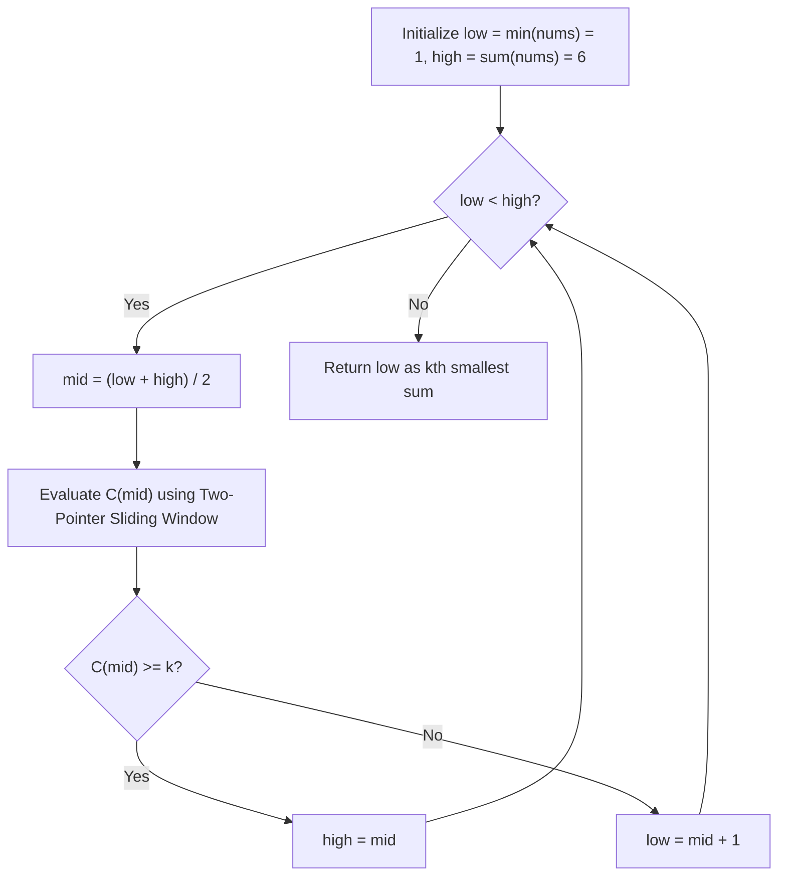

# Guided Example: Kth Smallest Subarray Sum

We trace binary search over the monotonic sum domain with sliding-window counting on a representative array:

- **Input:** `nums = [2, 1, 3]`, `k = 4`
- **Sorted Subarray Sums:** `[1, 2, 3, 3, 4, 6]`
- **Required Output:** `3`

This instance demonstrates binary search on the answer space combined with a two-pointer sliding window to count subarrays whose sum does not exceed a candidate threshold.

---

## 1. Instance & Teaching Goal

The array has length $n = 3$, generating $\frac{3 \times 4}{2} = 6$ non-empty contiguous subarrays:
1. `[2]` $\implies$ sum = $2$
2. `[1]` $\implies$ sum = $1$
3. `[3]` $\implies$ sum = $3$
4. `[2, 1]` $\implies$ sum = $3$
5. `[1, 3]` $\implies$ sum = $4$
6. `[2, 1, 3]` $\implies$ sum = $6$

Sorted order of sums:
$$[1, 2, 3, 3, 4, 6]$$
The $k = 4$-th element in this sorted sequence is $3$.

The teaching goal is to understand **parametric search coupled with two-pointer prefix counting**:
1. Defining the search range $[\min(nums), \sum nums]$.
2. Formulating the counting function $C(S) =$ number of subarrays with sum $\le S$.
3. Leveraging non-negativity of array values so that subarray sums expand monotonically with the right pointer and shrink monotonically with the left pointer.
4. Counting valid subarrays ending at each index in $\mathcal{O}(1)$ amortized steps.
5. Locating the minimum value $S$ satisfying $C(S) \ge k$.

---

## 2. Conceptual Foundation & Invariants

### Monotonic Subarray Sum & Sliding Window Bisection Invariant Theorem

> **Monotonic Subarray Sum & Sliding Window Bisection Invariant Theorem.**
> 1. *Non-Negative Monotonicity:* Since $nums[i] \ge 0$, for any fixed left index $L$, the subarray sum $\sum_{i=L}^R nums[i]$ is non-decreasing with respect to $R$. Conversely, for any fixed right index $R$, the sum is non-increasing with respect to $L$.
> 2. *Sliding Window Counting:* For a candidate threshold $S$, maintain window $[L, R]$ with running sum $W = \sum_{i=L}^R nums[i]$. When extending $R$, if $W > S$, increment $L$ until $W \le S$. The number of valid subarrays ending at $R$ with sum $\le S$ is precisely:
>    $$\Delta(R) = R - L + 1$$
>    Total valid subarrays is:
>    $$C(S) = \sum_{R=0}^{n-1} (R - L(R) + 1)$$
> 3. *Order Homomorphism & Bisection:* The counting function $C(S)$ is monotonically non-decreasing in $S$:
>    $$S_1 \le S_2 \implies C(S_1) \le C(S_2)$$
>    The $k$-th smallest subarray sum is the unique integer $S^*$ satisfying:
>    $$S^* = \min \{S \mid C(S) \ge k\}$$

---

## 3. Step-by-Step Worked Execution

Search bounds:
- $\text{low} = \min(nums) = 1$
- $\text{high} = \sum nums = 2 + 1 + 3 = 6$
- Target rank: $k = 4$

---

### Iteration 1: Test Candidate $S = 3$
- $\text{mid} = \lfloor(1 + 6) / 2\rfloor = 3$.
- Evaluate $C(3)$ with two pointers $L = 0, R$:
  - $R = 0, nums[0] = 2$:
    - Window sum $= 2 \le 3$.
    - Valid subarrays ending at $R = 0$: $[2]$.
    - Count increment: $0 - 0 + 1 = 1$. Total $C(3) = 1$.
  - $R = 1, nums[1] = 1$:
    - Window sum $= 2 + 1 = 3 \le 3$.
    - Valid subarrays ending at $R = 1$: $[2, 1], [1]$.
    - Count increment: $1 - 0 + 1 = 2$. Total $C(3) = 1 + 2 = 3$.
  - $R = 2, nums[2] = 3$:
    - Window sum $= 3 + 3 = 6 > 3$. Shrink from left:
      - Remove $nums[0] = 2 \implies$ sum $= 4 > 3, L = 1$.
      - Remove $nums[1] = 1 \implies$ sum $= 3 \le 3, L = 2$.
    - Valid subarrays ending at $R = 2$: $[3]$.
    - Count increment: $2 - 2 + 1 = 1$. Total $C(3) = 3 + 1 = 4$.

Since $C(3) = 4 \ge k = 4$, candidate $S = 3$ is feasible.
Update upper bound: $\text{high} = 3$. Active search interval becomes $[1, 3]$.

---

### Iteration 2: Test Candidate $S = 2$
- $\text{mid} = \lfloor(1 + 3) / 2\rfloor = 2$.
- Evaluate $C(2)$ with two pointers $L = 0, R$:
  - $R = 0, nums[0] = 2$:
    - Window sum $= 2 \le 2$. Count increment: $0 - 0 + 1 = 1$. Total $C(2) = 1$.
  - $R = 1, nums[1] = 1$:
    - Window sum $= 2 + 1 = 3 > 2$. Shrink from left:
      - Remove $nums[0] = 2 \implies$ sum $= 1 \le 2, L = 1$.
    - Count increment: $1 - 1 + 1 = 1$. Total $C(2) = 1 + 1 = 2$.
  - $R = 2, nums[2] = 3$:
    - Window sum $= 1 + 3 = 4 > 2$. Shrink from left:
      - Remove $nums[1] = 1 \implies$ sum $= 3 > 2, L = 2$.
      - Remove $nums[2] = 3 \implies$ sum $= 0 \le 2, L = 3$.
    - Count increment: $2 - 3 + 1 = 0$. Total $C(2) = 2$.

Since $C(2) = 2 < k = 4$, candidate $S = 2$ is strictly too small.
Update lower bound: $\text{low} = \text{mid} + 1 = 3$. Active search interval becomes $[3, 3]$.

---

### Termination
The search interval $[\text{low}, \text{high}] = [3, 3]$ has converged.
The 4th smallest subarray sum is $3$.

---

## 4. Complete Bisection Trace

| Step | Search Interval $[\text{low}, \text{high}]$ | Midpoint $S$ | Window Evaluations | $C(S)$ | Comparison with $k = 4$ | Next Interval |
|:---:|:---:|:---:|:---:|:---:|:---:|:---:|
| 1 | $[1, 6]$ | $3$ | $R=0 (+1), R=1 (+2), R=2 (+1)$ | $4$ | $4 \ge 4$ (Feasible) | $[1, 3]$ |
| 2 | $[1, 3]$ | $2$ | $R=0 (+1), R=1 (+1), R=2 (+0)$ | $2$ | $2 < 4$ (Too small) | $[3, 3]$ |
| 3 | $[3, 3]$ | — | Interval collapsed | — | Converged | Return $3$ |

---

## 5. Algorithmic Correctness

**Soundness.** Because array elements are non-negative, the window contraction loop is monotonic: each element is added to the window at most once and removed at most once, computing $C(S)$ exactly in $\mathcal{O}(n)$ time.

**Completeness.** Binary search over a discrete monotonic function guaranteed to have a transition point finds the minimal feasible value in $\mathcal{O}(\log(\sum nums))$ steps. The minimal value $S^*$ where $C(S^*) \ge k$ must be the actual sum of at least one subarray.

---

## 6. Traps This Instance Exposes

- **Duplicate Subarray Sums:** In this example, the sum $3$ occurs twice (`[3]` and `[2, 1]`). The algorithm does not collapse duplicate values; the cumulative count $C(S)$ counts every occurrence, correctly mapping rank $4$ to $3$.
- **Off-by-One on Empty Windows:** When an individual element exceeds $S$, the left pointer $L$ advances beyond $R$ ($L = R + 1$), yielding $R - L + 1 = 0$, naturally contributing zero subarrays for that endpoint.
- **Array Value Non-Negativity:** The two-pointer sliding window property requires $nums[i] \ge 0$. If negative numbers were present, prefix sums would not be monotonic, invalidating the single-pass sliding window.

---

## 7. Complexity Derivation

- **Time Complexity:**
  - Bisection steps: $\mathcal{O}(\log(\sum nums))$.
  - Per bisection step: $\mathcal{O}(n)$ via sliding window.
  - Overall time: $\mathcal{O}(n \log(\sum nums))$.
- **Auxiliary Space Complexity:** $\mathcal{O}(1)$ beyond the input array, as only two pointers and running sum accumulators are tracked.