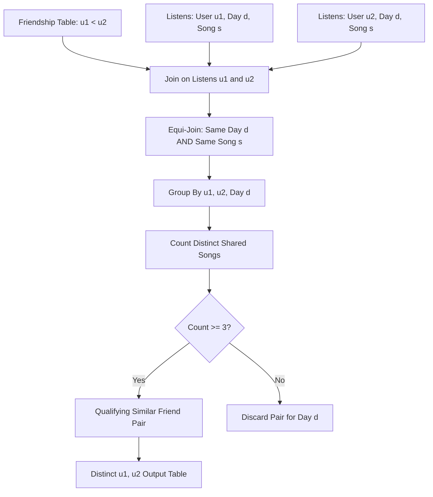

# Guided Example: Leetcodify Similar Friends

## 1. Problem Understanding

The task is to identify all unique pairs of users $(u_1, u_2)$ who are registered friends and share a strong mutual musical taste by listening to at least three identical, distinct songs on the very same calendar day.

### Relational Schema & Conditions
1. **Listens Table**: Records listening events `(user_id, song_id, day)`.
   - A single user may listen to the same song multiple times on the same day; therefore, duplicate rows must be handled by deduplicating songs per user-day pair (`COUNT(DISTINCT song_id)`).
2. **Friendship Table**: Records confirmed friendships `(user1_id, user2_id)`.
   - Friendship pairs are canonicalized such that $u_1 < u_2$.
3. **Similarity Criteria**:
   - **Friendship Requirement**: $(u_1, u_2) \in \text{Friendship}$.
   - **Temporal Concurrency**: The songs must be listened to on the **exact same day** $d$.
   - **Diversity Threshold**: The number of distinct songs listened to by both $u_1$ and $u_2$ on date $d$ must satisfy:
     $$|\{s : (u_1, s, d) \in \text{Listens}\} \cap \{s : (u_2, s, d) \in \text{Listens}\}| \ge 3$$
4. **Output Format**:
   - The result table reports `(user1_id, user2_id)` with $u_1 < u_2$, deduplicated across all days.

---

## 2. Key Invariant & Theoretical Guarantee

### Relational Equi-Join & Daily Song Intersect Cardinality Invariant Theorem
*Let $L(u, d) = \{s \in \mathbb{N} : (u, s, d) \in \text{Listens}\}$ denote the finite set of distinct songs user $u$ listened to on date $d$. A pair of users $(u_1, u_2)$ belongs to the final output if and only if:*
$$u_1 < u_2 \quad \land \quad (u_1, u_2) \in \text{Friendship} \quad \land \quad \exists d \text{ such that } |L(u_1, d) \cap L(u_2, d)| \ge 3$$

*Proof*:
1. **Necessity**: Any valid output row requires friendship by definition. Since similarity requires at least three shared songs on one day, there must exist at least one calendar date $d$ where the mutual set intersection $L(u_1, d) \cap L(u_2, d)$ contains $\ge 3$ distinct song identifiers.
2. **Sufficiency**: If an active friendship $(u_1, u_2)$ shares $\ge 3$ distinct songs on date $d$, joining `Listens` instances on $(d, s)$ for $u_1$ and $u_2$ produces $\ge 3$ distinct song keys for that $(u_1, u_2, d)$ bucket. Projecting to distinct $(u_1, u_2)$ emits the pair exactly once into the result set, satisfying all constraints.

---

## 3. Step-by-Step Walkthrough (Sample Instance)

### Input Data

#### `Friendship` Table
| `user1_id` | `user2_id` |
| :---: | :---: |
| 1 | 2 |
| 2 | 4 |
| 2 | 5 |

#### `Listens` Table
| `user_id` | `song_id` | `day` |
| :---: | :---: | :---: |
| 1 | 10 | 2021-03-15 |
| 1 | 11 | 2021-03-15 |
| 1 | 12 | 2021-03-15 |
| 2 | 10 | 2021-03-15 |
| 2 | 11 | 2021-03-15 |
| 2 | 12 | 2021-03-15 |
| 3 | 10 | 2021-03-15 |
| 3 | 11 | 2021-03-15 |
| 3 | 12 | 2021-03-15 |
| 4 | 10 | 2021-03-15 |
| 4 | 11 | 2021-03-15 |
| 4 | 13 | 2021-03-15 |
| 5 | 10 | 2021-03-16 |
| 5 | 11 | 2021-03-16 |
| 5 | 12 | 2021-03-16 |

---

### Candidate Friendship Evaluation

We evaluate every friendship entry $(u_1, u_2) \in \text{Friendship}$:

#### Candidate 1: Pair $(1, 2)$
- **Friendship status**: Present in `Friendship` table ($1 < 2$).
- **Daily listening comparison**:
  - On `2021-03-15`:
    - $L(1, \text{2021-03-15}) = \{10, 11, 12\}$
    - $L(2, \text{2021-03-15}) = \{10, 11, 12\}$
    - Intersection: $\{10, 11, 12\} \cap \{10, 11, 12\} = \{10, 11, 12\}$
    - Cardinality: $|L(1, \text{2021-03-15}) \cap L(2, \text{2021-03-15})| = 3$.
- **Evaluation**: Condition $3 \ge 3$ is met on `2021-03-15`.
- **Verdict**: **Qualifies**.

#### Candidate 2: Pair $(2, 4)$
- **Friendship status**: Present in `Friendship` table ($2 < 4$).
- **Daily listening comparison**:
  - On `2021-03-15`:
    - $L(2, \text{2021-03-15}) = \{10, 11, 12\}$
    - $L(4, \text{2021-03-15}) = \{10, 11, 13\}$
    - Intersection: $\{10, 11, 12\} \cap \{10, 11, 13\} = \{10, 11\}$
    - Cardinality: $|L(2, \text{2021-03-15}) \cap L(4, \text{2021-03-15})| = 2$.
- **Evaluation**: Condition $2 \ge 3$ is false. No other dates exist for user 4.
- **Verdict**: **Disqualified**.

#### Candidate 3: Pair $(2, 5)$
- **Friendship status**: Present in `Friendship` table ($2 < 5$).
- **Daily listening comparison**:
  - User 2 listened to $\{10, 11, 12\}$ on `2021-03-15`. User 5 has zero listens on `2021-03-15`.
  - User 5 listened to $\{10, 11, 12\}$ on `2021-03-16`. User 2 has zero listens on `2021-03-16`.
  - On any single day $d$, $|L(2, d) \cap L(5, d)| = 0$.
- **Evaluation**: Mutual songs were consumed on disjoint days; same-day intersection is empty.
- **Verdict**: **Disqualified**.

---

### Non-Friend Counterexample: Pair $(1, 3)$
- Both user 1 and user 3 listened to $\{10, 11, 12\}$ on `2021-03-15`.
- However, $(1, 3) \notin \text{Friendship}$.
- **Verdict**: **Excluded** before or during join evaluation.

---

### Summary Table of Pair Analysis

| User Pair $(u_1, u_2)$ | Friends? | Date $d$ | Shared Distinct Songs | Count $\ge 3$? | Status |
| :---: | :---: | :---: | :---: | :---: | :---: |
| $(1, 2)$ | Yes | 2021-03-15 | $\{10, 11, 12\}$ | $3 \ge 3$ (True) | **Selected** |
| $(2, 4)$ | Yes | 2021-03-15 | $\{10, 11\}$ | $2 \ge 3$ (False) | Discarded |
| $(2, 5)$ | Yes | Disjoint | $\emptyset$ | $0 \ge 3$ (False) | Discarded |
| $(1, 3)$ | No | 2021-03-15 | $\{10, 11, 12\}$ | Disqualified by friendship | Discarded |

---

## 4. Final Result

| `user1_id` | `user2_id` |
| :---: | :---: |
| 1 | 2 |

---

## 5. Complexity Derivation

Let $F$ be the number of rows in `Friendship` and $L$ the number of rows in `Listens`. Deduplicating the listening events to one row per `(user_id, song_id, day)` triple costs $O(L)$ hashing work and yields at most $L$ distinct triples. Each of the $F$ friendship rows is then matched against the daily song sets of both endpoints, and intersecting two sets of size at most $k$ is bounded by $k$, so each pair is decided in $O(k)$ expected time. The same-day grouping then reduces every qualifying pair to a single output row.

- **Time Complexity:** $O(L + F \cdot k)$ expected, where $k$ is the largest number of distinct songs a single user hears on one day; with an indexed equi-join on `(day, song_id)` the engine performs the pairing in $O(L)$ probe work per side and the group-by aggregation in $O(L)$.
- **Auxiliary Space Complexity:** $O(L)$ for the deduplicated listening triples (the hash-join build side) plus $O(F)$ for the accepted pair set, both proportional to the input size rather than to the number of candidate pairs.
