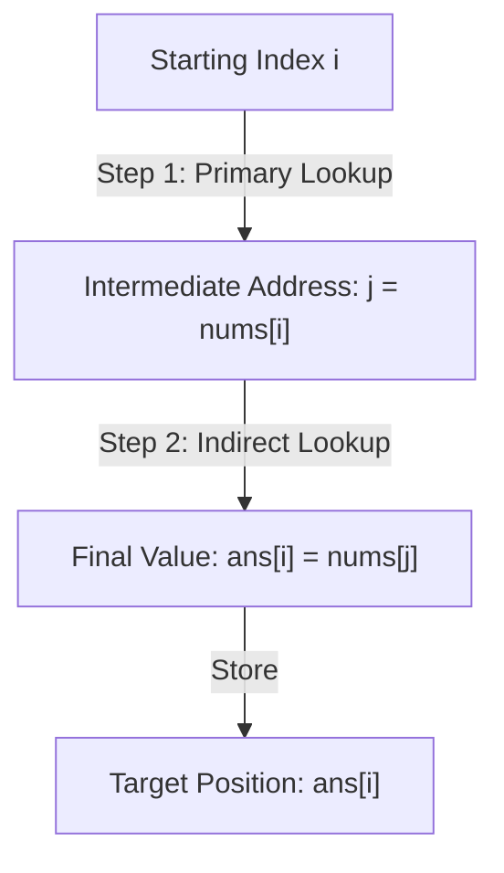

# Guided Example: Build Array from Permutation

We trace the step-by-step composition of a zero-based permutation with itself on a representative array instance:

- **Input:** `nums = [0, 2, 1, 5, 3, 4]`
- **Required Output:** `[0, 1, 2, 4, 5, 3]`

This instance is chosen because it demonstrates all three fundamental behaviors of permutation self-composition: a fixed point ($0 \to 0$), a 2-cycle transposition ($1 \leftrightarrow 2$), and an odd 3-cycle ($3 \to 5 \to 4 \to 3$).

---

## 1. Instance & Teaching Goal

Given a zero-based permutation `nums` of length $N$, we must construct an array `ans` of length $N$ where:

$$\text{ans}[i] = nums[nums[i]] \quad \text{for all } 0 \le i < N$$

For `nums = [0, 2, 1, 5, 3, 4]`:
- Length $N = 6$. The elements are a permutation of $\{0, 1, 2, 3, 4, 5\}$.
- Each value $nums[i]$ serves a dual role: first as a stored data value at index $i$, and second as an address pointing to another cell within the same array.

The teaching goal is to understand **functional self-composition on finite permutations**:
1. Visualizing the array as a directed functional graph where each index $i$ has an outgoing edge to $nums[i]$.
2. Evaluating the composed map $\sigma^2(i) = \sigma(\sigma(i))$ by following two directed edges from each starting node.
3. Avoiding read-after-write hazards: why naive in-place assignment `nums[i] = nums[nums[i]]` destroys unprocessed source values, and how out-of-place creation or modular encoding resolves this dependency.

---

## 2. Conceptual Foundation & Invariants

### Permutation Self-Composition Theorem

> **Permutation Self-Composition Theorem.**
> 1. *Valid Index Guarantee:* Because `nums` is a permutation of $\{0, 1, \dots, N-1\}$, every value $nums[i]$ satisfies $0 \le nums[i] \le N-1$. Thus the nested lookup $nums[nums[i]]$ is mathematically well-defined and guaranteed to never trigger an out-of-bounds access.
> 2. *Functional Graph Decomposition:* Any finite permutation decomposes uniquely into disjoint directed cycles. For any index $i$ residing in a cycle of length $L$:
>    - If $L = 1$ (fixed point, $nums[i] = i$): $\text{ans}[i] = nums[nums[i]] = nums[i] = i$.
>    - If $L = 2$ (transposition): following two edges returns to the starting node, so $\text{ans}[i] = i$.
>    - If $L \ge 3$: following two edges advances two positions along the cycle.
> 3. *Order Preservation Invariant:* Evaluating positions $i \in \{0, \dots, N-1\}$ and placing results into a fresh destination array ensures no intermediate write perturbs subsequent lookups.

---

## 3. Step-by-Step Worked Execution

We trace each index $i \in \{0, 1, 2, 3, 4, 5\}$ for `nums = [0, 2, 1, 5, 3, 4]`:

---

### Evaluation at Index 0
- Index $i = 0$.
- Step 1: Read intermediate index: $j = nums[0] = 0$.
- Step 2: Read target value: $nums[j] = nums[0] = 0$.
- Result: $\text{ans}[0] = 0$. (Fixed point: node 0 points to itself).

---

### Evaluation at Index 1
- Index $i = 1$.
- Step 1: Read intermediate index: $j = nums[1] = 2$.
- Step 2: Read target value: $nums[j] = nums[2] = 1$.
- Result: $\text{ans}[1] = 1$. (Transposition: 2-step traversal $1 \to 2 \to 1$).

---

### Evaluation at Index 2
- Index $i = 2$.
- Step 1: Read intermediate index: $j = nums[2] = 1$.
- Step 2: Read target value: $nums[j] = nums[1] = 2$.
- Result: $\text{ans}[2] = 2$. (Transposition: 2-step traversal $2 \to 1 \to 2$).

---

### Evaluation at Index 3
- Index $i = 3$.
- Step 1: Read intermediate index: $j = nums[3] = 5$.
- Step 2: Read target value: $nums[j] = nums[5] = 4$.
- Result: $\text{ans}[3] = 4$. (Part of 3-cycle: $3 \to 5 \to 4 \to 3$).

---

### Evaluation at Index 4
- Index $i = 4$.
- Step 1: Read intermediate index: $j = nums[4] = 3$.
- Step 2: Read target value: $nums[j] = nums[3] = 5$.
- Result: $\text{ans}[4] = 5$. (Part of 3-cycle: $4 \to 3 \to 5$).

---

### Evaluation at Index 5
- Index $i = 5$.
- Step 1: Read intermediate index: $j = nums[5] = 4$.
- Step 2: Read target value: $nums[j] = nums[4] = 3$.
- Result: $\text{ans}[5] = 3$. (Part of 3-cycle: $5 \to 4 \to 3$).

---

### Assembly of Result
Combining the evaluated entries yields the constructed array:

$$\text{ans} = [0, 1, 2, 4, 5, 3]$$

---

## 4. Complete Execution Trace

| Index $i$ | Source Value $nums[i]$ | Target Index $j = nums[i]$ | Indirect Value $nums[j]$ | Appended to $\text{ans}$ | Cycle Classification |
|---|---|---|---|---|---|
| 0 | 0 | 0 | 0 | `ans[0] = 0` | 1-cycle (Fixed Point) |
| 1 | 2 | 2 | 1 | `ans[1] = 1` | 2-cycle ($1 \leftrightarrow 2$) |
| 2 | 1 | 1 | 2 | `ans[2] = 2` | 2-cycle ($2 \leftrightarrow 1$) |
| 3 | 5 | 5 | 4 | `ans[3] = 4` | 3-cycle ($3 \to 5 \to 4$) |
| 4 | 3 | 3 | 5 | `ans[4] = 5` | 3-cycle ($4 \to 3 \to 5$) |
| 5 | 4 | 4 | 3 | `ans[5] = 3` | 3-cycle ($5 \to 4 \to 3$) |

We contrast the input permutation $\sigma$ with the squared permutation $\sigma^2$:

| Array Position | 0 | 1 | 2 | 3 | 4 | 5 |
|---|---|---|---|---|---|---|
| Input $\sigma(i)$ | 0 | 2 | 1 | 5 | 3 | 4 |
| Output $\sigma^2(i)$ | 0 | 1 | 2 | 4 | 5 | 3 |
| Trajectory under $\sigma$ | $0 \to 0$ | $1 \to 2$ | $2 \to 1$ | $3 \to 5$ | $4 \to 3$ | $5 \to 4$ |
| Trajectory under $\sigma^2$ | $0 \to 0$ | $1 \to 1$ | $2 \to 2$ | $3 \to 4$ | $4 \to 5$ | $5 \to 3$ |

---

## 5. Algorithmic Correctness

**Soundness.** For each index $i \in \{0, \dots, N-1\}$, the value stored into $\text{ans}[i]$ is precisely obtained by evaluating $nums[j]$ where $j = nums[i]$. Because all reads are performed on the immutable input array, every output cell satisfies the exact definition $\text{ans}[i] = nums[nums[i]]$ without any read corruption.

**Completeness.** Every index from $0$ to $N-1$ is visited exactly once in order. Since $N$ items are produced for a permutation of size $N$, the resulting array has matching dimensions and full element coverage.

---

## 6. Traps This Instance Exposes

- **In-Place Overwrite Hazard:** Attempting to mutate `nums` in place via `nums[i] = nums[nums[i]]` corrupts later evaluations. For instance, updating index 1 overwrites `nums[1]` with `1`. Later, when computing position 2 ($nums[nums[2]] = nums[1]$), the read would fetch the newly written `1` instead of the original value `2`, resulting in an incorrect answer.
- **Quotient-Remainder In-Place Encoding:** To achieve $\mathcal{O}(1)$ auxiliary space without memory allocation, one can encode both old and new values in each integer using $nums[i] \leftarrow nums[i] + N \cdot (nums[nums[i]] \bmod N)$. Extracting the final result requires integer division by $N$. However, building a separate list comprehension is simpler, idiomatic, and leaves the caller's input intact.
- **Cycle Independence:** An algorithm need not detect or traverse permutation cycles explicitly. Two consecutive array lookups evaluate $\sigma^2(i)$ directly in $\mathcal{O}(1)$ time per element regardless of cycle lengths.

---

## 7. Complexity Derivation

- **Time Complexity:** $\mathcal{O}(N)$, where $N = \text{len}(nums)$. Each of the $N$ positions requires exactly two constant-time array index lookups and one append operation.
- **Auxiliary Space Complexity:** $\mathcal{O}(1)$ auxiliary space beyond the $\mathcal{O}(N)$ memory allocated for the returned result array.
