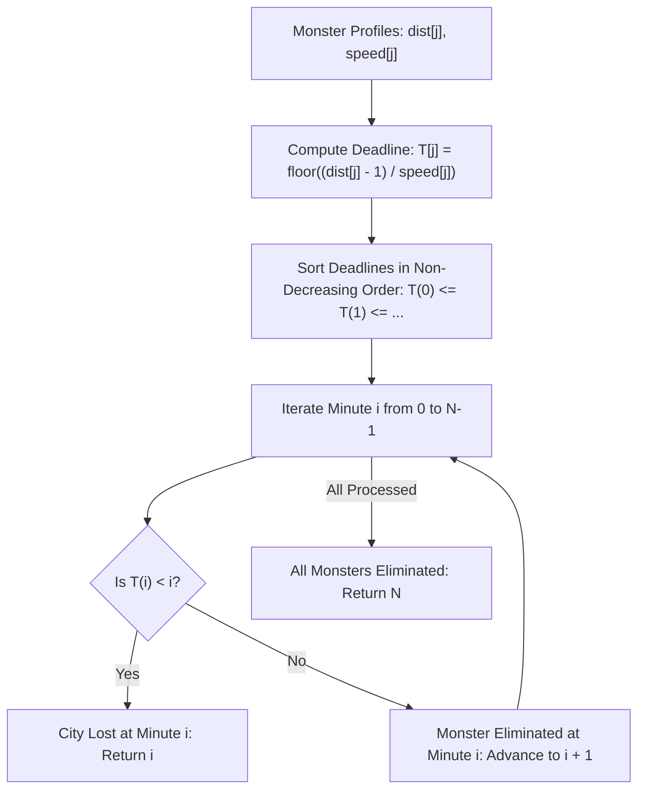

# Guided Example: Eliminate Maximum Number of Monsters

We trace earliest-deadline greedy scheduling and arrival time discretization on representative monster defense instances:

- **Primary Input:** `dist = [1, 3, 4]`, `speed = [1, 1, 1]`
- **Required Output:** `3`
- **Secondary Input (Defeat Boundary):** `dist = [1, 1, 2, 3]`, `speed = [1, 1, 1, 1]`
- **Required Output:** `1`

This instance demonstrates translating continuous motion into discrete integer firing deadlines, proving greedy Earliest Deadline First (EDF) optimality, and establishing the exact boundary condition where the city is lost.

---

## 1. Instance & Teaching Goal

We defend a city located at coordinate $0$ against $N$ monsters. Each monster $j$ begins at initial distance $\text{dist}[j]$ and moves toward the city at constant speed $\text{speed}[j]$ kilometers per minute.
- The weapon fires at integer minutes $t = 0, 1, 2, \dots$.
- Each shot eliminates exactly one monster.
- If any monster reaches the city (distance $\le 0$) at or before minute $t$ and has not been eliminated, the city is lost immediately before the minute-$t$ shot can fire.

The teaching goal is to understand **Earliest Deadline First (EDF) scheduling under unit-time resource constraints**:
1. Transforming distance-speed pairs into precise discrete elimination deadlines.
2. Formulating why exact arrival at minute $t$ precludes a shot at minute $t$, requiring the floor formula $\lfloor(d - 1) / s\rfloor$.
3. Proving by an exchange argument that sorting monsters by deadline achieves the maximum possible eliminations.
4. Detecting the earliest insurmountable bottleneck in $\mathcal{O}(N \log N)$ time.

---

## 2. Conceptual Foundation & Invariants

### Earliest Deadline First (EDF) Scheduling Theorem

> **Earliest Deadline First (EDF) Scheduling Theorem.**
> 1. *Continuous Arrival Time:* A monster at distance $d$ moving at speed $s$ arrives at continuous real time $\tau = d / s$.
> 2. *Discrete Elimination Deadline:* The weapon fires only at integer timestamps $t \in \{0, 1, 2, \dots\}$. A shot at minute $t$ successfully eliminates a monster if and only if the monster arrives strictly after minute $t$, which means:
>    $$t < \frac{d}{s} \iff t \cdot s < d \iff t \cdot s \le d - 1 \iff t \le \left\lfloor \frac{d - 1}{s} \right\rfloor$$
>    The integer $T_j = \lfloor(d_j - 1) / s_j\rfloor$ is therefore the strict latest integer minute at which monster $j$ can be safely destroyed.
> 3. *Greedy Exchange Invariant:* Suppose an optimal schedule eliminates $K$ monsters, but does not eliminate them in non-decreasing order of deadline. Swapping any inversion where a less urgent monster (larger deadline) is shot before a more urgent monster (smaller deadline) cannot violate feasibility, because moving an urgent monster earlier only improves its safety margin.
> 4. *Defeat Criterion:* After sorting deadlines in non-decreasing order $T_{(0)} \le T_{(1)} \le \dots \le T_{(N-1)}$, monster $(i)$ must be eliminated at minute $i$. If $T_{(i)} < i$, it is impossible to eliminate $(i+1)$ monsters within the first $i$ slots $\{0, 1, \dots, i-1\}$ by the Pigeonhole Principle. The maximum achievable score is precisely $i$.

---

## 3. Step-by-Step Worked Execution

---

### Trace 1: Successful Defense (`dist = [1, 3, 4]`, `speed = [1, 1, 1]`)

#### Step 1: Deadline Derivation
For each monster, we evaluate $T_j = \lfloor(d_j - 1) / s_j\rfloor$:
- Monster 0: $\text{dist} = 1, \text{speed} = 1 \implies T_0 = \lfloor(1 - 1) / 1\rfloor = \lfloor 0 / 1 \rfloor = 0$.
- Monster 1: $\text{dist} = 3, \text{speed} = 1 \implies T_1 = \lfloor(3 - 1) / 1\rfloor = \lfloor 2 / 1 \rfloor = 2$.
- Monster 2: $\text{dist} = 4, \text{speed} = 1 \implies T_2 = \lfloor(4 - 1) / 1\rfloor = \lfloor 3 / 1 \rfloor = 3$.

#### Step 2: Sorting Deadlines
The sorted deadline array is:

$$\text{times} = [0, 2, 3]$$

#### Step 3: Minute-by-Minute Verification
- **Minute $i = 0$:** Target monster has deadline $T_{(0)} = 0$.
  - Comparison: $T_{(0)} \ge 0 \implies 0 \ge 0$ (Feasible).
  - Action: Fire shot at $t = 0$. Monster 0 is eliminated.
- **Minute $i = 1$:** Target monster has deadline $T_{(1)} = 2$.
  - Comparison: $T_{(1)} \ge 1 \implies 2 \ge 1$ (Feasible).
  - Action: Fire shot at $t = 1$. Monster 1 is eliminated.
- **Minute $i = 2$:** Target monster has deadline $T_{(2)} = 3$.
  - Comparison: $T_{(2)} \ge 2 \implies 3 \ge 2$ (Feasible).
  - Action: Fire shot at $t = 2$. Monster 2 is eliminated.

All $N = 3$ monsters are destroyed. Final output: **3**.

---

### Trace 2: Bottleneck Defeat (`dist = [1, 1, 2, 3]`, `speed = [1, 1, 1, 1]`)

#### Step 1: Deadline Derivation
- Monster 0: $\lfloor(1 - 1) / 1\rfloor = 0$.
- Monster 1: $\lfloor(1 - 1) / 1\rfloor = 0$.
- Monster 2: $\lfloor(2 - 1) / 1\rfloor = 1$.
- Monster 3: $\lfloor(3 - 1) / 1\rfloor = 2$.

#### Step 2: Sorting Deadlines
$$\text{times} = [0, 0, 1, 2]$$

#### Step 3: Minute-by-Minute Verification
- **Minute $i = 0$:** Target has deadline $T_{(0)} = 0$.
  - $0 \ge 0 \implies$ Monster 0 eliminated at $t = 0$.
- **Minute $i = 1$:** Target has deadline $T_{(1)} = 0$.
  - Comparison: $T_{(1)} < i \implies 0 < 1$.
  - Breach: Monster 1 arrived at $t = 1.0$ and reached the city before the minute-1 shot could be dispatched.
  - Result: The city is lost. Exactly $1$ monster was eliminated. Final output: **1**.

---

## 4. Complete Execution Trace

We tabulate the arrival dynamics and deadline assignments for both instances:

| Instance | Monster Index | Initial Distance $d$ | Speed $s$ | Real Arrival Time $d/s$ | Integer Deadline $\lfloor(d-1)/s\rfloor$ |
|---|---|---|---|---|---|
| Primary | 0 | 1 | 1 | 1.0 min | **0** |
| Primary | 1 | 3 | 1 | 3.0 min | **2** |
| Primary | 2 | 4 | 1 | 4.0 min | **3** |
| Secondary | 0 | 1 | 1 | 1.0 min | **0** |
| Secondary | 1 | 1 | 1 | 1.0 min | **0** |
| Secondary | 2 | 2 | 1 | 2.0 min | **1** |
| Secondary | 3 | 3 | 1 | 3.0 min | **2** |

Next, we trace the greedy simulation loop across sorted firing slots:

| Firing Minute $i$ | Target Deadline $T_{(i)}$ | Feasibility Check ($T_{(i)} \ge i$) | Monster Eliminated? | Total Eliminated | Status |
|---|---|---|---|---|---|
| 0 | 0 | $0 \ge 0$ (True) | Yes (Monster 0) | 1 | Weapon recharges |
| 1 | 2 | $2 \ge 1$ (True) | Yes (Monster 1) | 2 | Weapon recharges |
| 2 | 3 | $3 \ge 2$ (True) | Yes (Monster 2) | 3 | All targets cleared |

---

## 5. Algorithmic Correctness

**Soundness.** Suppose an index $i$ is encountered where $T_{(i)} < i$. By the sorting order, the first $i + 1$ monsters all have deadlines $T_{(k)} \le T_{(i)} < i$. That is, all $i + 1$ monsters must be eliminated during the integer minutes $\{0, 1, \dots, i - 1\}$. Because only one shot can occur per minute, at most $i$ monsters can be destroyed before minute $i$. Thus, at least one of these $i + 1$ monsters is guaranteed to reach the city. Returning $i$ is sound because no schedule can eliminate more than $i$ monsters.

**Completeness.** If $T_{(i)} \ge i$ holds for all $0 \le i < N$, the schedule eliminates monster $(i)$ at minute $i$ before its deadline expires. Hence all $N$ monsters are destroyed, achieving the maximal possible score of $N$.

---

## 6. Traps This Instance Exposes

- **Exact-Minute Arrival Trap:** If a monster arrives at continuous time $\tau = 2.0$, can it be shot at minute $2$? No. The problem statement dictates that arrival at minute $t$ triggers loss before the shot fires. The deadline formula $\lfloor(d - 1) / s\rfloor$ correctly yields $\lfloor(2 - 1) / 1\rfloor = 1$, avoiding the invalid shot at minute $2$.
- **Floating-Point Inaccuracies:** Evaluating continuous arrival times $d / s$ with floating-point arithmetic can introduce rounding errors on edge cases (such as $d = 10^5, s = 3$). Using integer arithmetic `(d - 1) // s` ensures exact floor division without precision hazards.
- **Flawed Greedy Metrics:** Sorting by distance alone fails when a distant monster moves at extreme velocity. Sorting by speed alone fails when a slow monster begins adjacent to the city. The ratio $(d - 1) / s$ is the unique necessary and sufficient priority metric.

---

## 7. Complexity Derivation

- **Time Complexity:** $\mathcal{O}(N \log N)$ where $N$ is the number of monsters. Computing all $N$ deadlines takes $\mathcal{O}(N)$ time, sorting takes $\mathcal{O}(N \log N)$ time, and the linear validation scan takes $\mathcal{O}(N)$ time.
- **Auxiliary Space Complexity:** $\mathcal{O}(N)$ to store the array of $N$ computed integer deadlines.
