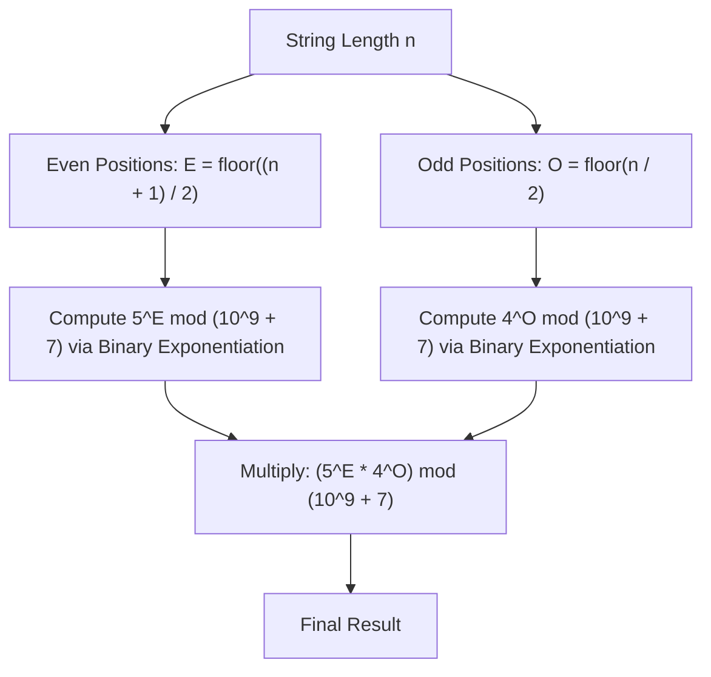

# Guided Example: Count Good Numbers

We trace the mathematical counting of valid digit strings and logarithmic modular exponentiation on representative instances:

- **Primary Input:** `n = 4`
- **Required Output:** `400`
- **Small Input (Boundary):** `n = 1`
- **Required Output:** `5`
- **Large Input (Scale):** `n = 50`
- **Required Output:** `564908303`

This instance demonstrates applying the product rule of combinatorics across independent positional constraints, separating odd and even index cardinality, and computing large powers modulo $10^9 + 7$ via binary exponentiation in $\mathcal{O}(\log n)$ time.

---

## 1. Instance & Teaching Goal

A digit string of length $n$ is indexed from $0$ to $n - 1$. The string is defined to be **good** if:
1. Digits at **even indices** ($0, 2, 4, \dots$) are **even**: $\{0, 2, 4, 6, 8\}$ (5 distinct choices).
2. Digits at **odd indices** ($1, 3, 5, \dots$) are **prime**: $\{2, 3, 5, 7\}$ (4 distinct choices).

For $n = 4$:
- Index 0 (even): 5 choices (`0, 2, 4, 6, 8`)
- Index 1 (odd): 4 choices (`2, 3, 5, 7`)
- Index 2 (even): 5 choices (`0, 2, 4, 6, 8`)
- Index 3 (odd): 4 choices (`2, 3, 5, 7`)
- By the combinatorial product rule: $5 \times 4 \times 5 \times 4 = 25 \times 16 = 400$.

The teaching goal is to understand **combinatorial factorization and logarithmic modular exponentiation**:
1. Partitioning a sequence of length $n$ into even and odd index subsets without full generation.
2. Deriving closed-form exponent counts: $\lceil n / 2 \rceil$ for even positions, $\lfloor n / 2 \rfloor$ for odd positions.
3. Evaluating $5^{\lceil n / 2 \rceil} \cdot 4^{\lfloor n / 2 \rfloor} \pmod{10^9 + 7}$ using repeated squaring (binary exponentiation) to support $n$ up to $10^{15}$.

---

## 2. Conceptual Foundation & Invariants

### Good String Combinatorial Partition Theorem

> **Good String Combinatorial Partition Theorem.**
> 1. *Independent Positional Independence:* The choice of digit at any position $i \in \{0, \dots, n-1\}$ has zero dependency on the digits chosen at any other position $j \neq i$. By the multiplication principle of elementary combinatorics, the total number of valid strings is the product of the number of choices available at each individual index.
> 2. *Index Parity Counting:* For any integer $n \ge 1$:
>    - Number of even indices in $[0, n-1]$: $E(n) = \lfloor (n + 1) / 2 \rfloor$.
>    - Number of odd indices in $[0, n-1]$: $O(n) = \lfloor n / 2 \rfloor$.
>    - Verification: $E(n) + O(n) = n$.
> 3. *Closed-Form Formulation:* Let $M = 10^9 + 7$. The total count of good digit strings is:
>    $$\mathcal{G}(n) = \left( 5^{E(n)} \cdot 4^{O(n)} \right) \pmod M$$
> 4. *Binary Exponentiation Invariant:* For any base $a$ and exponent $e$, the value $a^e \pmod M$ is evaluated in $\lfloor \log_2 e \rfloor + 1$ squarings and multiplications by the identity:
>    $$a^e = \begin{cases} 1 & \text{if } e = 0 \\ (a^{e/2})^2 \pmod M & \text{if } e \text{ is even} \\ a \cdot (a^{(e-1)/2})^2 \pmod M & \text{if } e \text{ is odd} \end{cases}$$

---

## 3. Step-by-Step Worked Execution

---

### Execution for $n = 4$

#### Step 1: Cardinality Partition
- $E(4) = \lfloor(4 + 1) / 2\rfloor = \lfloor 5 / 2 \rfloor = 2$ even positions (indices 0 and 2).
- $O(4) = \lfloor 4 / 2 \rfloor = 2$ odd positions (indices 1 and 3).

#### Step 2: Power Evaluation
- $5^{E(4)} = 5^2 = 25$.
- $4^{O(4)} = 4^2 = 16$.

#### Step 3: Product and Modulo
- Product: $25 \times 16 = 400$.
- Modulo: $400 \pmod{10^9 + 7} = 400$.
- Final answer: **400**.

---

### Execution for $n = 50$

#### Step 1: Cardinality Partition
- $E(50) = \lfloor 51 / 2 \rfloor = 25$.
- $O(50) = \lfloor 50 / 2 \rfloor = 25$.

#### Step 2: Binary Exponentiation for $5^{25} \pmod{10^9 + 7}$
Binary representation of $25 = 16 + 8 + 1 = 11001_2$.
- $5^1 \equiv 5$
- $5^2 \equiv 25$
- $5^4 \equiv 625$
- $5^8 \equiv 625^2 = 390625$
- $5^{16} \equiv 390625^2 \equiv 152587890625 \equiv 587890638 \pmod{10^9 + 7}$
- Combine active bits: $5^{25} = 5^{16} \cdot 5^8 \cdot 5^1 \pmod{10^9 + 7} \equiv 298075306$.

#### Step 3: Binary Exponentiation for $4^{25} \pmod{10^9 + 7}$
Binary representation of $25 = 11001_2$.
- Following the same repeated squaring yields: $4^{25} \pmod{10^9 + 7} \equiv 755866160$.

#### Step 4: Final Modular Product
$$\mathcal{G}(50) = (298075306 \times 755866160) \pmod{10^9 + 7} = 564908303$$

---

## 4. Complete Execution Trace

We trace index distributions across representative string lengths:

| Length $n$ | Even Positions $E(n)$ | Odd Positions $O(n)$ | Expression Before Modulo | Final Value $\pmod{10^9 + 7}$ |
|---|---|---|---|---|
| 1 | 1 | 0 | $5^1 \cdot 4^0 = 5 \cdot 1$ | **5** |
| 2 | 1 | 1 | $5^1 \cdot 4^1 = 5 \cdot 4$ | **20** |
| 3 | 2 | 1 | $5^2 \cdot 4^1 = 25 \cdot 4$ | **100** |
| 4 | 2 | 2 | $5^2 \cdot 4^2 = 25 \cdot 16$ | **400** |
| 5 | 3 | 2 | $5^3 \cdot 4^2 = 125 \cdot 16$ | **2000** |
| 50 | 25 | 25 | $5^{25} \cdot 4^{25} = 20^{25}$ | **564908303** |

We tabulate the repeated squaring trace for $5^{25} \pmod{10^9 + 7}$:

| Exponent Bit Power | Multiplier Value $5^{2^k} \pmod M$ | Included in Product? (Bit in $25 = 11001_2$) | Running Cumulative Product |
|---|---|---|---|
| $2^0 = 1$ | 5 | Yes ($1$) | 5 |
| $2^1 = 2$ | 25 | No ($0$) | 5 |
| $2^2 = 4$ | 625 | No ($0$) | 5 |
| $2^3 = 8$ | 390625 | Yes ($1$) | $5 \times 390625 = 1953125$ |
| $2^4 = 16$ | 587890638 | Yes ($1$) | $1953125 \times 587890638 \equiv 298075306$ |

---

## 5. Algorithmic Correctness

**Soundness.** Because the condition for a digit string being good specifies independent, uncoupled restrictions on individual character positions, no cross-index interaction occurs. For every even index, the set of allowed digits $\{0, 2, 4, 6, 8\}$ has size 5; for every odd index, the set of allowed digits $\{2, 3, 5, 7\}$ has size 4. Multiplying these independent counts exactly equals the number of combinations. Performing modular arithmetic at every intermediate multiplication preserves the residue modulo $10^9 + 7$ by the fundamental properties of ring arithmetic.

**Completeness.** Every possible digit configuration of length $n$ that satisfies the rules is accounted for because the Cartesian product of the positional candidate sets enumerates all compliant tuples without omission.

---

## 6. Traps This Instance Exposes

- **Leading Zero Misconception:** In decimal number problems, leading zeroes are often prohibited. Here, the problem specifies a *digit string*, so `'0'` is a valid character at index 0. Excluding `'0'` at index 0 would drop the even-digit count from 5 to 4, generating an incorrect answer.
- **Large Input Magnitude:** Constraints permit $n$ up to $10^{15}$. A naive linear loop multiplying $n$ times will exceed the time limit by several orders of magnitude ($\approx 10^{15}$ operations). Binary exponentiation handles $n = 10^{15}$ in $\approx 50$ operations.
- **Exponent Off-by-One:** When $n$ is odd, integer division `n // 2` gives the odd positions, not the even positions. Using `(n + 1) // 2` for 5 and `n // 2` for 4 correctly assigns the extra digit to the even positions.

---

## 7. Complexity Derivation

- **Time Complexity:** $\mathcal{O}(\log n)$. Computing $5^{\lceil n/2 \rceil} \pmod M$ and $4^{\lfloor n/2 \rfloor} \pmod M$ using binary modular exponentiation requires at most $2 \times \lceil \log_2 n \rceil$ multiplications.
- **Auxiliary Space Complexity:** $\mathcal{O}(1)$ as only integer arithmetic registers are utilized.
