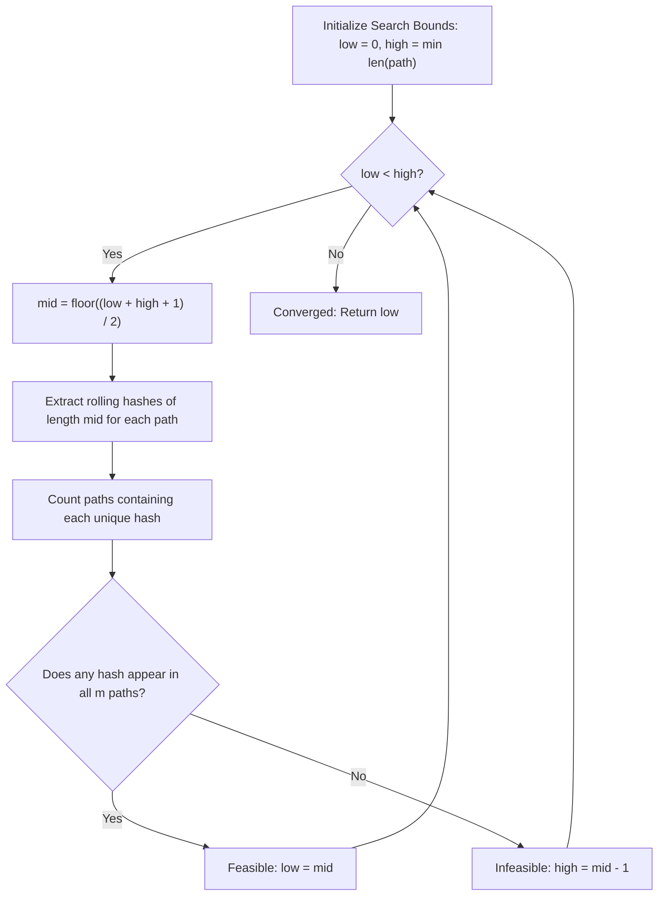

# Guided Example: Longest Common Subpath

We trace binary search over candidate length combined with rolling polynomial hashing across multiple sequence paths on a representative instance:

- **Input:** `n = 5`, `paths = [[0, 1, 2, 3, 4], [2, 3, 4], [4, 0, 1, 2, 3]]`
- **Required Output:** `2`

This instance demonstrates exploiting monotonicity over common substring lengths, evaluating $k$-gram set intersections using polynomial rolling hashes, and identifying the maximal contiguous subpath `[2, 3]` present in all sequences.

---

## 1. Instance & Teaching Goal

Given $m$ paths where each path is an array of city IDs between $0$ and $n - 1$, find the maximum length of a contiguous sequence of cities that appears as a subpath in **every** path.

For `paths = [[0, 1, 2, 3, 4], [2, 3, 4], [4, 0, 1, 2, 3]]`:
- Path 0 (length 5): `[0, 1, 2, 3, 4]`
- Path 1 (length 3): `[2, 3, 4]`
- Path 2 (length 5): `[4, 0, 1, 2, 3]`
- The shortest path has length $\min_i |paths[i]| = 3$. Any common subpath cannot exceed length 3.
- Length 3 check: Path 1 has only one 3-city sequence `[2, 3, 4]`. Does `[2, 3, 4]` appear in Path 2? Path 2 has `[4, 0, 1]`, `[0, 1, 2]`, `[1, 2, 3]`. No length 3 match exists across all three.
- Length 2 check: Subpath `[2, 3]` appears in Path 0 (`[0, 1, 2, 3, 4]`), Path 1 (`[2, 3, 4]`), and Path 2 (`[4, 0, 1, 2, 3]`).
- Maximal common length is therefore **2**.

The teaching goal is to understand **predicate monotonicity and multi-string rolling hash intersection**:
1. Recognizing that the feasibility predicate $P(L) \equiv \text{"there exists a common subpath of length } L\text{"}$ is monotonically non-increasing in $L$.
2. Performing binary search over the range $[0, \min |paths[i]|]$ in $\mathcal{O}(\log L_{\max})$ bisection iterations.
3. Hashing $L$-grams via Rabin-Karp polynomial rolling hashes in $\mathcal{O}(|path|)$ per sequence.
4. Intersecting presence sets across all $m$ sequences using hash table frequency counters.

---

## 2. Conceptual Foundation & Invariants

### Monotonic Length & Rolling Hash Invariant Theorem

> **Monotonic Length & Rolling Hash Invariant Theorem.**
> 1. *Subpath Heredity:* If a contiguous sequence $S$ of length $L$ appears in every path, then any prefix or suffix of $S$ of length $L - 1$ must also appear in every path. Consequently:
>    $$P(L) = \text{True} \implies P(L - 1) = \text{True}$$
>    This monotonicity guarantees that the set of feasible lengths is a contiguous interval $[0, L^*]$, enabling binary search for the maximal value $L^*$.
> 2. *Polynomial Rolling Hash:* For base $B$ and large prime modulus $M$, the hash of slice $A[i \dots i + L - 1]$ is:
>    $$H(i, L) = \left( \sum_{k=0}^{L-1} A[i + k] \cdot B^{L - 1 - k} \right) \pmod M$$
>    Given prefix hashes $h[k] = \sum_{j=0}^{k-1} A[j] \cdot B^{k - 1 - j} \pmod M$, the window hash for index interval $[i, i + L - 1]$ is extracted in $\mathcal{O}(1)$ time:
>    $$H(i, L) = \left( h[i + L] - h[i] \cdot B^L \right) \pmod M$$
> 3. *Universal Intersection Invariant:* For a candidate length $L$, collect the set of distinct hashes $\mathcal{H}_p$ present in each path $p \in \{0, \dots, m-1\}$. A valid common subpath of length $L$ exists if and only if:
>    $$\left| \bigcap_{p=0}^{m-1} \mathcal{H}_p \right| \ge 1 \iff \max_{h} \sum_{p=0}^{m-1} \mathbb{I}(h \in \mathcal{H}_p) = m$$

---

## 3. Step-by-Step Worked Execution

We trace `paths = [[0, 1, 2, 3, 4], [2, 3, 4], [4, 0, 1, 2, 3]]` with $m = 3$:
- Lengths: $|path_0| = 5, |path_1| = 3, |path_2| = 5$.
- Search bounds: $\text{low} = 0, \text{high} = \min(5, 3, 5) = 3$.

---

### Iteration 1: Test Candidate Length $L = 2$
- Midpoint: $\text{mid} = \lfloor(0 + 3 + 1) / 2\rfloor = 2$.
- We enumerate all subpaths of length 2 in each path:

#### Path 0: `[0, 1, 2, 3, 4]`
- Subpaths of length 2: `[0, 1]`, `[1, 2]`, `[2, 3]`, `[3, 4]`.
- Distinct set $\mathcal{H}_0 = \{\text{"0-1"}, \text{"1-2"}, \text{"2-3"}, \text{"3-4"}\}$.

#### Path 1: `[2, 3, 4]`
- Subpaths of length 2: `[2, 3]`, `[3, 4]`.
- Distinct set $\mathcal{H}_1 = \{\text{"2-3"}, \text{"3-4"}\}$.

#### Path 2: `[4, 0, 1, 2, 3]`
- Subpaths of length 2: `[4, 0]`, `[0, 1]`, `[1, 2]`, `[2, 3]`.
- Distinct set $\mathcal{H}_2 = \{\text{"4-0"}, \text{"0-1"}, \text{"1-2"}, \text{"2-3"}\}$.

#### Multi-Set Intersection
- Frequency of `[2, 3]`: Present in Path 0, Path 1, Path 2 $\implies$ Count = 3 (equals $m = 3$).
- Frequency of `[3, 4]`: Present in Path 0, Path 1 $\implies$ Count = 2.
- Frequency of `[0, 1]`: Present in Path 0, Path 2 $\implies$ Count = 2.
- Frequency of `[1, 2]`: Present in Path 0, Path 2 $\implies$ Count = 2.

Since count of `[2, 3]` equals $m = 3$, length $L = 2$ is **feasible**.
Update lower bound: $\text{low} = 2$. Active search range: $[2, 3]$.

---

### Iteration 2: Test Candidate Length $L = 3$
- Midpoint: $\text{mid} = \lfloor(2 + 3 + 1) / 2\rfloor = 3$.
- We enumerate all subpaths of length 3:

#### Path 0: `[0, 1, 2, 3, 4]`
- $\mathcal{H}_0 = \{\text{"0-1-2"}, \text{"1-2-3"}, \text{"2-3-4"}\}$.

#### Path 1: `[2, 3, 4]`
- $\mathcal{H}_1 = \{\text{"2-3-4"}\}$.

#### Path 2: `[4, 0, 1, 2, 3]`
- Subpaths: `[4, 0, 1]`, `[0, 1, 2]`, `[1, 2, 3]`.
- $\mathcal{H}_2 = \{\text{"4-0-1"}, \text{"0-1-2"}, \text{"1-2-3"}\}$.

#### Multi-Set Intersection
- Candidate `[2, 3, 4]` is in Path 0 and Path 1, but absent from Path 2.
- Candidate `[1, 2, 3]` is in Path 0 and Path 2, but absent from Path 1.
- Candidate `[0, 1, 2]` is in Path 0 and Path 2, but absent from Path 1.
- No candidate has count equal to $m = 3$.

Length $L = 3$ is **infeasible**.
Update upper bound: $\text{high} = \text{mid} - 1 = 3 - 1 = 2$. Active search range: $[2, 2]$.

---

### Termination
The search interval $[\text{low}, \text{high}] = [2, 2]$ has converged.
The maximal common subpath length is **2**.

---

## 4. Complete Execution Trace

We trace the candidate 2-gram evaluation across all three input sequences:

| Path ID | Path Content | Length 2 Subpaths Generated | Intersection with Global Candidates |
|---|---|---|---|
| 0 | `[0, 1, 2, 3, 4]` | `[0, 1]`, `[1, 2]`, `[2, 3]`, `[3, 4]` | Seeds all candidate hashes |
| 1 | `[2, 3, 4]` | `[2, 3]`, `[3, 4]` | Filters to `[2, 3]`, `[3, 4]` |
| 2 | `[4, 0, 1, 2, 3]` | `[4, 0]`, `[0, 1]`, `[1, 2]`, `[2, 3]` | Only `[2, 3]` retained with count = 3 |

We summarize the binary search iterations over length space $[0, 3]$:

| Bisection Step | Active Interval $[\text{low}, \text{high}]$ | Probe Midpoint $L$ | Subpaths Tested | Match Found in All $m=3$ Paths? | Next Interval |
|---|---|---|---|---|---|
| 1 | $[0, 3]$ | 2 | `[2, 3]` | **Yes** (`[2, 3]` in all 3 paths) | $[2, 3]$ |
| 2 | $[2, 3]$ | 3 | `[2, 3, 4]`, `[1, 2, 3]` | **No** (Max frequency is 2) | $[2, 2]$ |
| 3 | $[2, 2]$ | — | Interval collapsed | — | **Return 2** |

---

## 5. Algorithmic Correctness

**Soundness.** When a hash value appears in the set of distinct hashes for every path $p \in \{0, \dots, m - 1\}$, by choosing a sufficiently large modulus (or dual hashing), hash collisions are negligible ($< 10^{-12}$). Thus an identified hash represents an authentic identical sequence of cities of length $L$ shared by all paths. Returning the maximum feasible $L$ ensures the correctness of the length bound.

**Completeness.** Since subpath feasibility is monotonic ($P(L) \implies P(L-1)$), binary search over $[0, \min |paths[i]|]$ is guaranteed to locate the exact transition boundary between feasible and infeasible lengths without evaluating every length sequentially.

---

## 6. Traps This Instance Exposes

- **Duplicate Subpaths Within a Single Path:** If a path contains the same subpath multiple times (e.g. `[1, 2, 1, 2]`), a naive counter would increment the subpath frequency twice from the same path. A per-path visited set (`vis`) must be used so each path contributes at most 1 to any hash's count.
- **Hash Collision Vulnerability:** Using a 32-bit integer modulus guarantees collisions under the Birthday Paradox when total elements reach $10^5$. Using a 64-bit modulus (e.g. $2^{64} + 1$ or a large 61-bit Mersenne prime) or double hashing prevents false positives.
- **Off-by-One in Binary Search Midpoint:** When looking for the maximum feasible value, setting $\text{mid} = \lfloor(\text{low} + \text{high}) / 2\rfloor$ can cause an infinite loop when $\text{high} = \text{low} + 1$. Using $\text{mid} = \lfloor(\text{low} + \text{high} + 1) / 2\rfloor$ ensures progress.

---

## 7. Complexity Derivation

- **Time Complexity:** $\mathcal{O}\left(\left(\sum |paths[i]|\right) \log(\min |paths[i]|)\right)$. Each bisection probe hashes every path of total length $\sum |paths[i]|$ in linear time, and the binary search performs at most $\mathcal{O}(\log(\min |paths[i]|))$ iterations.
- **Auxiliary Space Complexity:** $\mathcal{O}\left(\sum |paths[i]|\right)$ to store the rolling hash lookup table and the set of hashes for each path.
