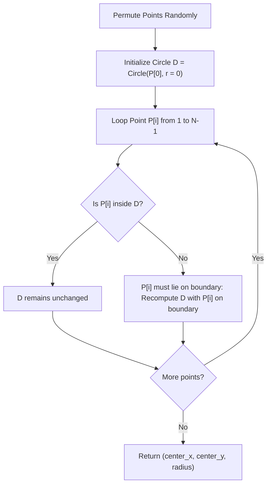

# Guided Example: Erect the Fence II

We trace Welzl's randomized incremental algorithm for the Minimum Enclosing Circle (MEC) problem on representative geometric point sets:

- **Primary Input:** `trees = [[1, 2], [2, 2], [4, 2]]`
- **Required Output:** `[2.50000, 2.00000, 1.50000]`
- **Planar Triangle Input:** `trees = [[0, 0], [4, 0], [0, 3]]`
- **Required Output:** `[2.00000, 1.50000, 2.50000]`

This instance demonstrates incremental disk expansion, boundary point determination (1, 2, or 3 points defining the minimal disk), and backward analysis proving linear expected running time $\mathcal{O}(N)$.

---

## 1. Instance & Teaching Goal

Given a collection of 2D tree coordinates `trees`, determine the circle with the smallest possible radius that encloses all trees (points lying on or inside the circle boundary). Return its center $(x, y)$ and radius $r$.

For `trees = [[1, 2], [2, 2], [4, 2]]`:
- Points are collinear along the line $y = 2$: $P_1 = (1, 2)$, $P_2 = (2, 2)$, $P_3 = (4, 2)$.
- The extreme points are $(1, 2)$ and $(4, 2)$ separated by distance $3.0$.
- The unique minimum enclosing circle has diameter segment connecting $(1, 2)$ and $(4, 2)$:
  - Center: $((1 + 4) / 2, (2 + 2) / 2) = (2.5, 2.0)$.
  - Radius: $3.0 / 2 = 1.5$.
- Intermediate point $(2, 2)$ has distance $|2.0 - 2.5| = 0.5 \le 1.5$, strictly contained within the interior.

The teaching goal is to understand **Welzl's randomized incremental construction**:
1. Uniqueness of the Minimum Enclosing Circle for any finite non-empty point set in $\mathbb{R}^2$.
2. Boundary property: The MEC of a point set is uniquely determined by at most 3 points on its boundary.
3. Incremental update: If point $P_i$ lies outside the current MEC of $\{P_1, \dots, P_{i-1}\}$, then $P_i$ must lie on the boundary of the new MEC.
4. Achieving expected $\mathcal{O}(N)$ time through random permutation and backwards analysis.

---

## 2. Conceptual Foundation & Invariants

### Minimum Enclosing Circle & Welzl's Invariant Theorem

> **Minimum Enclosing Circle & Welzl's Invariant Theorem.**
> 1. *Existence and Uniqueness:* For any bounded point set $S \subset \mathbb{R}^2$, there exists a unique disk $\mathcal{D}(S)$ of minimal radius containing all points in $S$.
> 2. *Boundary Basis:* The boundary $\partial \mathcal{D}(S)$ contains at least 2 points (if they form a diameter) or at least 3 points (forming an acute triangle).
> 3. *Subproblem Invariant:* Let $\mathcal{D}(P, R)$ denote the MEC of points $P$ with points $R \subseteq P$ forced to lie on the boundary ($|R| \le 3$).
>    - Base Case $|R| = 3$: $\mathcal{D}(P, R)$ is the unique circumcircle through the 3 points of $R$.
>    - Base Case $|P| = 0$ or $|R| = 2$: The diameter circle between the 2 boundary points (if it contains all remaining constraints).
>    - Recursive Step: For $p \in P \setminus R$, if $p \in \mathcal{D}(P \setminus \{p\}, R)$, then $\mathcal{D}(P, R) = \mathcal{D}(P \setminus \{p\}, R)$. Otherwise, $p$ must be on the boundary, so $\mathcal{D}(P, R) = \mathcal{D}(P \setminus \{p\}, R \cup \{p\})$.
> 4. *Backwards Analysis Complexity:* In a random permutation, point $P_i$ has probability at most $3 / i$ of lying on the boundary of $\mathcal{D}(\{P_1, \dots, P_i\})$. The expected number of recursive calls is linear:
>    $$\mathbb{E}[T(N)] = \mathcal{O}(N)$$

---

## 3. Step-by-Step Worked Execution

We trace `trees = [[1, 2], [2, 2], [4, 2]]`:
- Let points be labeled $P_0 = (1, 2)$, $P_1 = (2, 2)$, $P_2 = (4, 2)$.

---

### Step 1: Initialize with $P_0 = (1, 2)$
- Initial candidate circle $\mathcal{D}_0$: centered at $(1, 2)$ with radius $r = 0.0$.
- Interior verification: Contains $P_0$.

---

### Step 2: Insert Point $P_1 = (2, 2)$
- Evaluate distance from $P_1$ to center $(1, 2)$:
  $$\text{dist}(P_1, \mathcal{D}_0) = \sqrt{(2 - 1)^2 + (2 - 2)^2} = 1.0 > r_0 = 0.0$$
- $P_1$ lies outside $\mathcal{D}_0$. Point $P_1$ must belong to the boundary of the new circle.
- Subproblem: Find MEC of $\{P_0, P_1\}$ with $P_1$ on boundary.
  - Reset $\mathcal{D}$ to circle with boundary $\{P_1\}$: Center $(2, 2), r = 0.0$.
  - Check $P_0 = (1, 2)$: distance $= 1.0 > 0.0$.
  - $P_0$ must also be on the boundary.
  - Compute 2-point diameter circle between $P_0 = (1, 2)$ and $P_1 = (2, 2)$:
    $$\text{Center} = \left(\frac{1 + 2}{2}, \frac{2 + 2}{2}\right) = (1.5, 2.0), \quad \text{Radius} = \frac{1.0}{2} = 0.5$$
- Updated circle $\mathcal{D}_1$: Center $(1.5, 2.0)$, radius $r = 0.5$.

---

### Step 3: Insert Point $P_2 = (4, 2)$
- Evaluate distance from $P_2$ to current center $(1.5, 2.0)$:
  $$\text{dist}(P_2, \mathcal{D}_1) = \sqrt{(4 - 1.5)^2 + (2 - 2)^2} = 2.5 > r_1 = 0.5$$
- $P_2$ lies strictly outside $\mathcal{D}_1$. Point $P_2$ must lie on the boundary of the MEC.
- Subproblem: Find MEC of $\{P_0, P_1, P_2\}$ with $P_2$ on boundary:
  - Check prior points against 2-point diameter circles with $P_2$:
    - Diameter of $(P_1, P_2)$: Center $(3.0, 2.0), r = 1.0$. Does it contain $P_0 = (1, 2)$? Distance from $(1, 2)$ to $(3, 2)$ is $2.0 > 1.0$. (Violated).
    - Diameter of $(P_0, P_2)$:
      $$\text{Center} = \left(\frac{1 + 4}{2}, \frac{2 + 2}{2}\right) = (2.5, 2.0), \quad \text{Radius} = \frac{4 - 1}{2} = 1.5$$
    - Does it contain $P_1 = (2, 2)$?
      $$\text{Distance} = \sqrt{(2 - 2.5)^2 + (2 - 2)^2} = 0.5 \le 1.5 \quad (\text{Valid})$$
- All points $\{P_0, P_1, P_2\}$ are enclosed by the diameter circle of $(P_0, P_2)$.
- Final configuration: Center $(2.5, 2.0)$, radius $r = 1.5$.

---

## 4. Complete Execution Trace

We record the state transitions as each point is incrementally integrated:

| Point Processed | Coordinates | Current Disk Center | Current Radius | Distance to Center | Enclosed? | Updated Disk Center & Radius |
|---|---|---|---|---|---|---|
| $P_0$ | $(1.0, 2.0)$ | $(1.0, 2.0)$ | $0.0$ | $0.0$ | Yes (Seed) | Center: $(1.0, 2.0)$, $r = 0.0$ |
| $P_1$ | $(2.0, 2.0)$ | $(1.0, 2.0)$ | $0.0$ | $1.0$ | **No** (Violated) | Center: $(1.5, 2.0)$, $r = 0.5$ |
| $P_2$ | $(4.0, 2.0)$ | $(1.5, 2.0)$ | $0.5$ | $2.5$ | **No** (Violated) | Center: $(2.5, 2.0)$, $r = 1.5$ |

We compare candidate diameter pairs for the final 3-point configuration:

| Boundary Candidate Pair | Center Formula | Radius | Encloses Excluded Point? | Outcome |
|---|---|---|---|---|
| $\{P_0, P_1\}$ | $((1+2)/2, 2.0) = (1.5, 2.0)$ | $0.5$ | $P_2$: dist $= 2.5 > 0.5$ | Infeasible |
| $\{P_1, P_2\}$ | $((2+4)/2, 2.0) = (3.0, 2.0)$ | $1.0$ | $P_0$: dist $= 2.0 > 1.0$ | Infeasible |
| $\{P_0, P_2\}$ | $((1+4)/2, 2.0) = (2.5, 2.0)$ | $1.5$ | $P_1$: dist $= 0.5 \le 1.5$ | **Optimal MEC** |

---

## 5. Algorithmic Correctness

**Soundness.** A point $P_i$ that falls strictly outside $\mathcal{D}(\{P_1, \dots, P_{i-1}\})$ cannot be enclosed by any circle of radius smaller than or equal to the current radius. By convexity, $P_i$ must lie on the boundary of the enlarged MEC. Constraining the search space by placing newly violating points into the boundary set $R$ strictly preserves the true minimal enclosing boundary.

**Completeness.** Since the maximum number of boundary points in 2D Euclidean space is 3 (or 2 for a diametric pair), the recursion depth is strictly bounded by 3. When $|R| = 3$, the circumcircle is unique and fully determined. Thus, all possible enclosing configurations are exhausted correctly.

---

## 6. Traps This Instance Exposes

- **Collinear Degeneracy:** When 3 points are collinear (as in this instance along $y = 2$), the circumcircle formula has divisor $2(ax(by - cy) + \dots) = 0$. The algorithm must detect collinearity and fallback to evaluating the pairwise diameter circles.
- **Floating-Point Tolerances:** Testing whether a point lies on or inside a circle requires an epsilon tolerance (e.g. $\varepsilon = 10^{-9}$) to prevent numerical instability from triggering false boundary recalculations.
- **Deterministic Worst-Case Trap:** Without shuffling, an adversary can order points such that every new point violates the current circle, degrading performance to $\mathcal{O}(N^3)$. Randomly shuffling points guarantees expected $\mathcal{O}(N)$ runtime.

---

## 7. Complexity Derivation

- **Time Complexity:** Expected $\mathcal{O}(N)$, where $N$ is the number of points. In Welzl's algorithm with a randomized order, the $i$-th point triggers a boundary update with probability at most $3/i$, yielding expected time $\sum_{i=1}^N \mathcal{O}(1) + \frac{3}{i} \mathcal{O}(i) = \mathcal{O}(N)$.
- **Auxiliary Space Complexity:** $\mathcal{O}(N)$ recursion stack depth and point storage.
