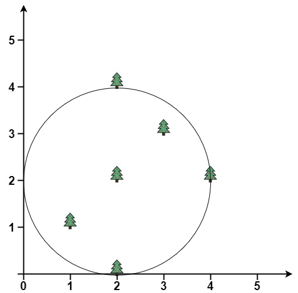
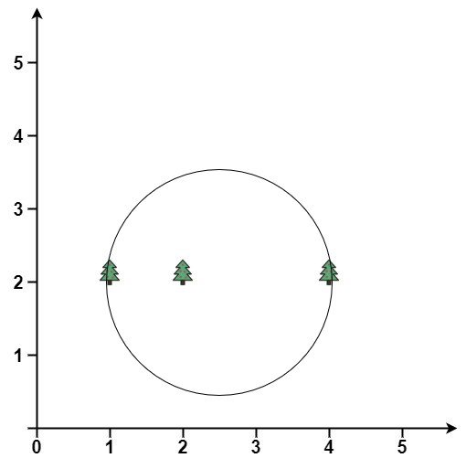

## Description

You are given a 2D integer array `trees` where $\text{trees}[i] = [x_{i}, y_{i}]$ represents the location of the $$i^{\text{th}}$$ tree in the garden.

You are asked to fence the entire garden using the minimum length of rope possible. The garden is well-fenced only if **all the trees are enclosed** and the rope used **forms a perfect circle**. A tree is considered enclosed if it is inside or on the border of the circle.

More formally, you must form a circle using the rope with a center `(x, y)` and radius `r` where all trees lie inside or on the circle and `r` is **minimum**.

Return *the center and radius of the circle as a length 3 array *`[x, y, r]`*.* Answers within $10^{-5}$ of the actual answer will be accepted.
### Function Contract

- Refer to method signature.

### Examples
#### Example 1

**

**

- **Input:** $trees = [[1,1],[2,2],[2,0],[2,4],[3,3],[4,2]]$
- **Output:** `[2.00000,2.00000,2.00000]`
- **Explanation:** The fence will have center = (2, 2) and radius = 2
#### Example 2

**

**

- **Input:** $trees = [[1,2],[2,2],[4,2]]$
- **Output:** `[2.50000,2.00000,1.50000]`
- **Explanation:** The fence will have center = (2.5, 2) and radius = 1.5
### Constraints

- $1 \le \text{trees.length} \le 3000$

- $\text{trees}[i].length = 2$

- $0 \le x_{i}, y_{i} \le 3000$