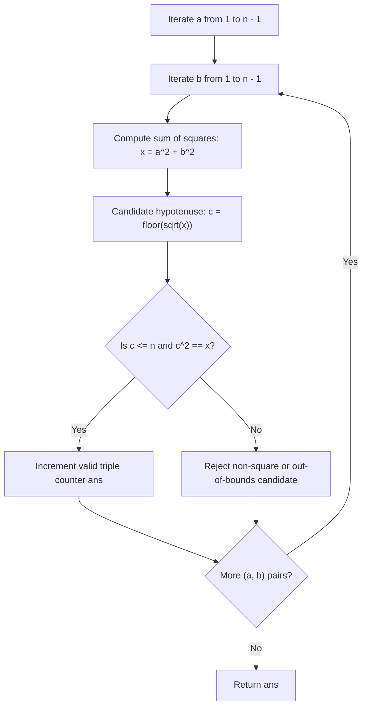

# Guided Example: Count Square Sum Triples

We trace exhaustive enumeration and perfect square verification for Pythagorean triples on representative bounded integer ranges:

- **Primary Input:** `n = 5`
- **Required Output:** `2`
- **Expanded Input:** `n = 10`
- **Required Output:** `4`

This instance demonstrates verifying the Pythagorean relation $a^2 + b^2 = c^2$ within integer limits $1 \le a, b, c \le n$, accounting for ordered symmetry between legs $(a, b)$ and $(b, a)$, and testing integer square roots without cubic brute force.

---

## 1. Instance & Teaching Goal

A **square sum triple** $(a, b, c)$ is a triple of positive integers such that:

$$a^2 + b^2 = c^2 \quad \text{with } 1 \le a, b, c \le n$$

For $n = 5$:
- Candidates for $(a, b)$ range over $\{1, 2, 3, 4\}$.
- $3^2 + 4^2 = 9 + 16 = 25 = 5^2 \implies (3, 4, 5)$ is valid.
- $4^2 + 3^2 = 16 + 9 = 25 = 5^2 \implies (4, 3, 5)$ is valid.
- Since $(a, b, c)$ is an ordered triple and $a \neq b$, both $(3, 4, 5)$ and $(4, 3, 5)$ count distinctly.
- Total count for $n = 5$ is **2**.

For $n = 10$:
- In addition to $(3, 4, 5)$ and $(4, 3, 5)$, their scaled multiples $(6, 8, 10)$ and $(8, 6, 10)$ satisfy $6^2 + 8^2 = 36 + 64 = 100 = 10^2 \le 10^2$.
- Total count for $n = 10$ is **4**.

The teaching goal is to understand **ordered Pythagorean enumeration and quadratic search space reduction**:
1. Eliminating the third loop over $c$ by deriving $c = \lfloor\sqrt{a^2 + b^2}\rfloor$ directly in $\mathcal{O}(1)$ time.
2. Checking perfect square integrity: validating $c \le n$ and $c^2 = a^2 + b^2$.
3. Distinguishing ordered pairs: recognizing that $(a, b, c)$ and $(b, a, c)$ are distinct when $a \neq b$.

---

## 2. Conceptual Foundation & Invariants

### Bounded Pythagorean Triple Invariant Theorem

> **Bounded Pythagorean Triple Invariant Theorem.**
> 1. *Strict Hypotenuse Dominance:* For any positive integers $a, b \ge 1$:
>    $$c = \sqrt{a^2 + b^2} > \max(a, b)$$
>    Consequently, if $c \le n$, both $a$ and $b$ are strictly bounded by $a \le n - 1$ and $b \le n - 1$.
> 2. *Exact Integral Root Determination:* For any fixed pair of legs $(a, b)$, let $x = a^2 + b^2$. The value $c$ is a positive integer if and only if:
>    $$\lfloor\sqrt{x}\rfloor^2 = x$$
>    If this condition holds and $\lfloor\sqrt{x}\rfloor \le n$, the unique valid hypotenuse is $c = \lfloor\sqrt{x}\rfloor$.
> 3. *Order Multiplicity:* For any primitive or scaled Pythagorean triple with legs $a \neq b$, both permutations $(a, b, c)$ and $(b, a, c)$ satisfy the equation and represent distinct coordinate tuples.
> 4. *Complexity Reduction:* Rather than iterating over all $n^3$ triples $(a, b, c)$, iterating over pairs $(a, b) \in [1, n-1]^2$ with an $\mathcal{O}(1)$ root check reduces time complexity from $\mathcal{O}(n^3)$ to $\mathcal{O}(n^2)$ with $\mathcal{O}(1)$ auxiliary space.

---

## 3. Step-by-Step Worked Execution

We trace all leg pairs $(a, b) \in [1, 4]^2$ for $n = 5$:

---

### Step 1: Scan for $a = 1$
- $b = 1: x = 1^2 + 1^2 = 2 \implies c = \lfloor\sqrt{2}\rfloor = 1$, $1^2 = 1 \neq 2$ (Invalid).
- $b = 2: x = 1^2 + 2^2 = 5 \implies c = \lfloor\sqrt{5}\rfloor = 2$, $2^2 = 4 \neq 5$ (Invalid).
- $b = 3: x = 1^2 + 3^2 = 10 \implies c = \lfloor\sqrt{10}\rfloor = 3$, $3^2 = 9 \neq 10$ (Invalid).
- $b = 4: x = 1^2 + 4^2 = 17 \implies c = \lfloor\sqrt{17}\rfloor = 4$, $4^2 = 16 \neq 17$ (Invalid).

---

### Step 2: Scan for $a = 2$
- $b = 1: x = 4 + 1 = 5 \implies c = 2$, $4 \neq 5$ (Invalid).
- $b = 2: x = 4 + 4 = 8 \implies c = 2$, $4 \neq 8$ (Invalid).
- $b = 3: x = 4 + 9 = 13 \implies c = 3$, $9 \neq 13$ (Invalid).
- $b = 4: x = 4 + 16 = 20 \implies c = 4$, $16 \neq 20$ (Invalid).

---

### Step 3: Scan for $a = 3$
- $b = 1: x = 9 + 1 = 10 \implies$ (Invalid).
- $b = 2: x = 9 + 4 = 13 \implies$ (Invalid).
- $b = 3: x = 9 + 9 = 18 \implies$ (Invalid).
- $b = 4: x = 3^2 + 4^2 = 9 + 16 = 25$.
  - Candidate $c = \lfloor\sqrt{25}\rfloor = 5$.
  - Verification: $c = 5 \le n = 5$ and $5^2 = 25 == x$ (True).
  - Valid triple found: **$(3, 4, 5)$**. Counter: $\text{ans} = 1$.

---

### Step 4: Scan for $a = 4$
- $b = 1: x = 16 + 1 = 17 \implies$ (Invalid).
- $b = 2: x = 16 + 4 = 20 \implies$ (Invalid).
- $b = 3: x = 4^2 + 3^2 = 16 + 9 = 25$.
  - Candidate $c = \lfloor\sqrt{25}\rfloor = 5$.
  - Verification: $c = 5 \le 5$ and $5^2 = 25 == x$ (True).
  - Valid triple found: **$(4, 3, 5)$**. Counter: $\text{ans} = 2$.
- $b = 4: x = 16 + 16 = 32 \implies c = 5, 25 \neq 32$ (Invalid).

---

### Final Result
Total square sum triples within $n = 5$: **2**.

---

## 4. Complete Execution Trace

We record all evaluations across leg combinations for $n = 5$:

| $a$ | $b$ | $x = a^2 + b^2$ | $c = \lfloor\sqrt{x}\rfloor$ | $c^2 == x$? | $c \le n = 5$? | Valid Triple Formed | Cumulative Count |
|---|---|---|---|---|---|---|---|
| 1 | 1..4 | 2, 5, 10, 17 | 1, 2, 3, 4 | No | Yes | None | 0 |
| 2 | 1..4 | 5, 8, 13, 20 | 2, 2, 3, 4 | No | Yes | None | 0 |
| 3 | 1..3 | 10, 13, 18 | 3, 3, 4 | No | Yes | None | 0 |
| 3 | 4 | 25 | 5 | **Yes** | **Yes** | **(3, 4, 5)** | **1** |
| 4 | 1..2 | 17, 20 | 4, 4 | No | Yes | None | 1 |
| 4 | 3 | 25 | 5 | **Yes** | **Yes** | **(4, 3, 5)** | **2** |
| 4 | 4 | 32 | 5 | No | Yes | None | 2 |

We compare the growth of valid triples across small values of $n$:

| Upper Bound $n$ | Total Pairs Evaluated $(n-1)^2$ | Valid Triples Identified | Distinct $(a, b, c)$ Triples |
|---|---|---|---|
| 4 | 9 | 0 | None |
| 5 | 16 | 2 | $(3, 4, 5), (4, 3, 5)$ |
| 9 | 64 | 2 | $(3, 4, 5), (4, 3, 5)$ |
| 10 | 81 | 4 | Add $(6, 8, 10), (8, 6, 10)$ |
| 13 | 144 | 6 | Add $(5, 12, 13), (12, 5, 13)$ |

---

## 5. Algorithmic Correctness

**Soundness.** A triple $(a, b, c)$ is incremented if and only if $a, b \in [1, n-1]$, $c = \lfloor\sqrt{a^2 + b^2}\rfloor \le n$, and $c^2 = a^2 + b^2$. These criteria are algebraic invariants directly defining a square sum triple. Because $a, b \ge 1$, we have $c = \sqrt{a^2 + b^2} > \max(a, b) \ge 1$, ensuring $c \ge 1$.

**Completeness.** Any square sum triple $(a, b, c)$ with $1 \le a, b, c \le n$ must satisfy $a < c \le n$ and $b < c \le n$, which implies $a \in [1, n-1]$ and $b \in [1, n-1]$. Iterating over all pairs $(a, b) \in [1, n-1] \times [1, n-1]$ guarantees that every valid configuration is examined.

---

## 6. Traps This Instance Exposes

- **Ordered vs. Unordered Pairs:** The problem requires counting ordered triples $(a, b, c)$. A common error is enforcing $a < b$ to avoid duplicate computation and forgetting to multiply by 2 (or iterating $b$ from 1 to $n-1$).
- **Floating-Point Imprecision with `sqrt`:** In languages with floating-point roundoff, computing $\sqrt{x}$ can yield values like $4.999999999$, which truncates to integer $4$ rather than $5$. Testing $c^2 == x$ directly protects against roundoff.
- **Overlooking Leg-Hypotenuse Bounds:** Because $c > a$ and $c > b$, neither leg can equal $n$. Constraining loop ranges to $1 \le a < n$ and $1 \le b < n$ avoids examining impossible configurations.

---

## 7. Complexity Derivation

- **Time Complexity:** $\mathcal{O}(n^2)$. The nested loops over $a$ and $b$ execute $(n - 1)^2$ iterations. Within each iteration, computing $x = a^2 + b^2$, taking the integer square root, and squaring $c$ takes $\mathcal{O}(1)$ time.
- **Auxiliary Space Complexity:** $\mathcal{O}(1)$. Only a counter and intermediate scalar integer variables are retained in memory.
