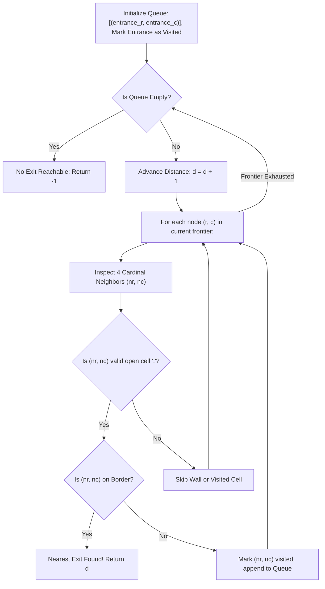

# Guided Example: Nearest Exit from Entrance in Maze

We trace level-order Breadth-First Search (BFS) for unweighted shortest paths and boundary exit detection on representative grid instances:

- **Primary Input:** `maze = [["+","+",".","+"],[".",".",".","+"],["+","+","+","."]]`, `entrance = [1, 2]`
- **Required Output:** `1`
- **Boundary Entrance Input:** `maze = [["+","+","+"],[".",".","."],["+","+","+"]]`, `entrance = [1, 0]`
- **Required Output:** `2`

This instance demonstrates level-by-level frontier expansion in grid graphs, enforcing that the starting entrance cell cannot serve as its own exit, and terminating immediately upon reaching the first valid boundary coordinate.

---

## 1. Instance & Teaching Goal

We are given an $m \times n$ grid `maze` containing empty spaces `'.'` and impassable walls `'+'`, and a starting coordinate `entrance = [r, c]`.
- An **exit** is defined as an empty cell located on the outer border of the grid ($r = 0$, $r = m - 1$, $c = 0$, or $c = n - 1$) that is **not** the entrance itself.
- Movement proceeds in 4 cardinal directions (up, down, left, right) between adjacent empty cells.

For `maze = [["+","+",".","+"],[".",".",".","+"],["+","+","+","."]]` with `entrance = [1, 2]`:
- Dimensions: $m = 3, n = 4$.
- Entrance: $(1, 2)$, which is in the interior ($1 \neq 0, 2$ and $2 \neq 0, 3$).
- From $(1, 2)$, adjacent cardinal neighbors are:
  - Up: $(0, 2)$ is `'.'`. Since $r = 0$, this cell is on the top border. Because $(0, 2) \neq (1, 2)$, it is a valid exit reachable in exactly 1 step.
  - Left: $(1, 1)$ is `'.'`.
  - Right: $(1, 3)$ is `'+'` (wall).
  - Down: $(2, 2)$ is `'+'` (wall).
- The nearest exit is at $(0, 2)$, requiring **1** step.

The teaching goal is to understand **unweighted shortest path search with multiple boundary targets**:
1. Utilizing Breadth-First Search (BFS) to explore cells in non-decreasing order of distance.
2. In-place marking or visited tracking to guarantee that each cell is queued at most once.
3. Distinguishing the entrance from valid exit conditions, specifically when the entrance itself is located on a border cell.

---

## 2. Conceptual Foundation & Invariants

### Shortest Path BFS Level-Order Invariant Theorem

> **Shortest Path BFS Level-Order Invariant Theorem.**
> 1. *Unit-Cost Graph Metric:* The maze forms an unweighted undirected graph $G = (V, E)$ where vertices are empty cells and edges connect cardinally adjacent open spaces. All edge weights equal $1$.
> 2. *Monotonic Distance Frontiers:* BFS maintains a queue of frontiers $\mathcal{F}_0, \mathcal{F}_1, \mathcal{F}_2, \dots$ where frontier $\mathcal{F}_d$ contains all vertices at shortest path distance $d$ from the entrance:
>    $$v \in \mathcal{F}_d \iff \text{dist}(\text{entrance}, v) = d$$
>    The queue maintains the non-decreasing distance invariant: if $u$ is dequeued before $v$, then $\text{dist}(u) \le \text{dist}(v)$.
> 3. *First-Hit Optimality:* The first vertex $v$ discovered that satisfies the exit predicate:
>    $$\text{is\_exit}(r, c) \equiv (r \in \{0, m-1\} \lor c \in \{0, n-1\}) \land (r, c) \neq \text{entrance}$$
>    is guaranteed to have the minimal distance among all reachable exits.
> 4. *Acyclicity via Visited Marking:* Marking cells as visited (`'+'`) at the moment they are placed into the queue prevents redundant queueing, guaranteeing $\mathcal{O}(m \cdot n)$ total operations.

---

## 3. Step-by-Step Worked Execution

---

### Execution Trace 1: Primary Instance (`entrance = [1, 2]`)

Grid representation with row/column indices:
- Row 0: `['+', '+', '.', '+']`
- Row 1: `['.', '.', '.', '+']`  $\leftarrow$ Entrance at column 2
- Row 2: `['+', '+', '+', '.']`

#### Step 1: Initialization ($d = 0$)
- Queue: `[(1, 2)]`.
- Mark entrance as visited: `maze[1][2] = '+'`.
- Distance counter: $\text{ans} = 0$.

#### Step 2: Expand Frontier at Distance 1 ($\text{ans} = 1$)
Pop $(1, 2)$ from queue. Test 4 cardinal neighbors:
1. **Up $(-1, 0)$:** $(1 - 1, 2) = (0, 2)$.
   - Within bounds ($0 \le 0 < 3, 0 \le 2 < 4$).
   - Cell status: `maze[0][2] == '.'` (Open path).
   - Exit check: Row index is $0$ (Top border of grid).
   - Coordinate check: $(0, 2) \neq (1, 2)$ (Not entrance).
   - Condition satisfied: $(0, 2)$ is a valid boundary exit.
   - Immediate Return: **1**.

---

### Execution Trace 2: Boundary Entrance (`entrance = [1, 0]`)

Grid representation:
- Row 0: `['+', '+', '+']`
- Row 1: `['.', '.', '.']`  $\leftarrow$ Entrance at column 0 (Border cell!)
- Row 2: `['+', '+', '+']`

#### Step 1: Initialization ($d = 0$)
- Queue: `[(1, 0)]`.
- Mark visited: `maze[1][0] = '+'`.

#### Step 2: Expand Frontier at Distance 1 ($\text{ans} = 1$)
Pop $(1, 0)$. Test 4 neighbors:
- Up: $(0, 0)$ is `'+'` (Wall).
- Down: $(2, 0)$ is `'+'` (Wall).
- Left: $(1, -1)$ (Out of bounds).
- Right: $(1, 1)$ is `'.'`.
  - Is $(1, 1)$ on border? Row 1 $\notin \{0, 2\}$, Col 1 $\notin \{0, 2\}$ (Interior cell, not exit).
  - Mark visited `maze[1][1] = '+'`, enqueue `(1, 1)`.
- Frontier 1 complete: Queue contains `[(1, 1)]`.

#### Step 3: Expand Frontier at Distance 2 ($\text{ans} = 2$)
Pop $(1, 1)$. Test 4 neighbors:
- Up: $(0, 1)$ is `'+'`.
- Down: $(2, 1)$ is `'+'`.
- Left: $(1, 0)$ is `'+'` (Already visited).
- Right: $(1, 2)$ is `'.'`.
  - Border check: Column index $2 = n - 1$ (Right border of grid!).
  - Exit check: $(1, 2) \neq (1, 0)$ (Not entrance).
  - Condition satisfied: $(1, 2)$ is a valid boundary exit.
  - Return: **2**.

---

## 4. Complete Execution Trace

We trace the step-by-step state transitions for the primary maze:

| Step $d$ | Dequeued Cell | Neighbor Evaluated | Cell Type | On Border? | Not Entrance? | Action Taken |
|---|---|---|---|---|---|---|
| 0 | Setup | $(1, 2)$ | `'.'` | Interior | — | Seed queue, mark visited |
| 1 | $(1, 2)$ | $(0, 2)$ (Up) | `'.'` | **Yes** ($r = 0$) | **Yes** | **Exit Discovered! Return 1** |
| 1 | $(1, 2)$ | $(1, 1)$ (Left) | `'.'` | No | Yes | Skipped due to early return |
| 1 | $(1, 2)$ | $(1, 3)$ (Right) | `'+'` | Yes | Yes | Wall ignored |
| 1 | $(1, 2)$ | $(2, 2)$ (Down) | `'+'` | Yes | Yes | Wall ignored |

We compare BFS frontier properties between the two test instances:

| Test Case | Entrance $(r, c)$ | Entrance on Border? | Shortest Distance to Valid Exit | Discovered Exit $(r, c)$ | Traversed Path |
|---|---|---|---|---|---|
| Primary | $(1, 2)$ | No | **1** | $(0, 2)$ | $(1, 2) \to (0, 2)$ |
| Boundary | $(1, 0)$ | **Yes** (Left border) | **2** | $(1, 2)$ | $(1, 0) \to (1, 1) \to (1, 2)$ |

---

## 5. Algorithmic Correctness

**Soundness.** BFS explores nodes in non-decreasing order of path length. The first cell encountered that satisfies the exit predicate has minimal distance from the entrance. Checking that the discovered cell is on the border and distinct from the entrance strictly enforces the problem's definition of an exit.

**Completeness.** Since all four cardinal transitions are evaluated for each reachable open cell and cycle prevention is ensured by marking cells immediately upon queue insertion, BFS explores all reachable components. If the queue empties without encountering an exit, no valid exit exists, and returning `-1` is complete.

---

## 6. Traps This Instance Exposes

- **Entrance Boundary Trap:** When the entrance begins on a border cell (e.g. `entrance = [1, 0]`), evaluating whether the entrance is on the boundary must not prematurely terminate with answer 0. The entrance itself is explicitly disqualified from being its own exit.
- **Late Visited Marking:** Marking cells as visited when they are *dequeued* instead of when *enqueued* allows multiple paths to enqueue the same vertex repeatedly, causing exponential queue explosion and Time Limit Exceeded on open grids.
- **Missing Negative Return:** If all boundary exits are walled off or disconnected, the queue exhausts naturally. The algorithm must return `-1` to signal unreachable exits.

---

## 7. Complexity Derivation

- **Time Complexity:** $\mathcal{O}(m \cdot n)$, where $m$ and $n$ are grid row and column counts. Each cell is enqueued and dequeued at most once, and each cell explores at most 4 cardinal neighbors.
- **Auxiliary Space Complexity:** $\mathcal{O}(m \cdot n)$ in the worst case to store the BFS queue frontier.
