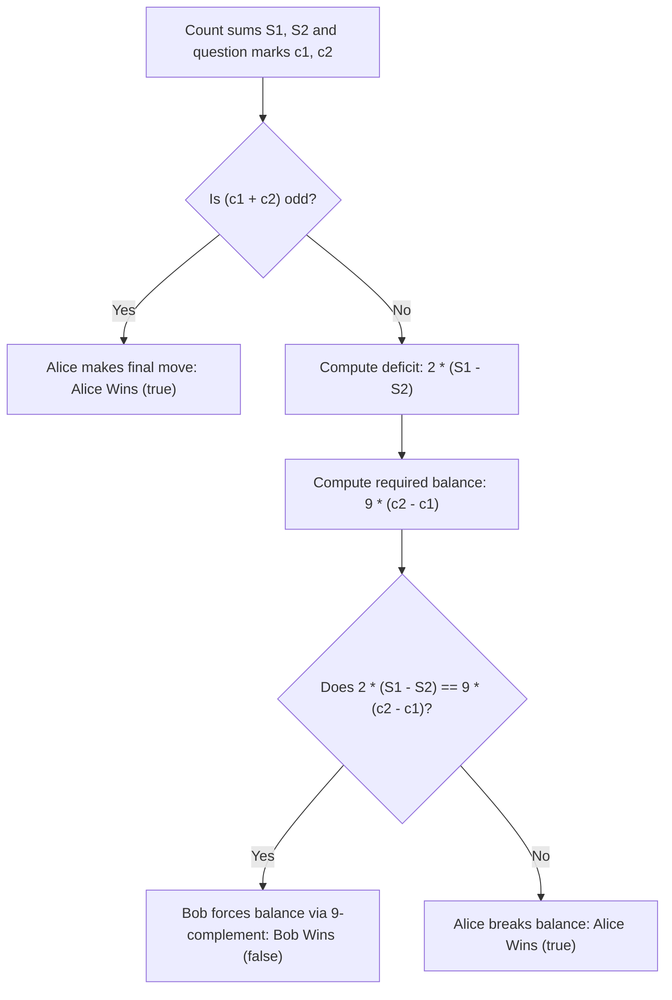

# Guided Example: Sum Game

We trace combinatorial game theory, pairing strategies, and invariant balancing for Alice and Bob on representative string instances:

- **Primary Input:** `num = "25??"`
- **Required Output:** `true` (Alice wins)
- **Balanced Input:** `num = "?3295???"`
- **Required Output:** `false` (Bob wins)
- **No-Move Input (Baseline):** `num = "5023"`
- **Required Output:** `false` (Bob wins)

This instance demonstrates analyzing symmetric two-player games with perfect information, establishing the complementary $9$-sum pairing invariant, and characterizing the exact algebraic condition under which Bob can force equality.

---

## 1. Instance & Teaching Goal

Alice and Bob play a game on a numeric string `num` of even length $n$.
- Some characters are digits `'0'` through `'9'`, and others are question marks `'?'`.
- Alice moves first; players alternate turns.
- In each turn, a player replaces a `'?'` with any digit from `'0'` to `'9'`.
- The game ends when no `'?'` remain.
- **Victory Condition:** Let $S_1$ be the sum of digits in the first half ($[0 \dots n/2 - 1]$) and $S_2$ be the sum of digits in the second half ($[n/2 \dots n - 1]$).
  - If $S_1 = S_2$, **Bob wins** (return `false`).
  - If $S_1 \neq S_2$, **Alice wins** (return `true`).

For `num = "25??"`:
- Left half: `"25"`, sum $S_1 = 2 + 5 = 7$, question marks $c_1 = 0$.
- Right half: `"??"`, sum $S_2 = 0$, question marks $c_2 = 2$.
- Total question marks is 2 (an even number). Alice picks a `'?'` and replaces it with digit $d_1$. Bob must fill the remaining `'?'` with $d_2$.
- Can Bob guarantee $S_1 = S_2 \iff 7 = d_1 + d_2$?
  - If Alice chooses $d_1 = 9$, the minimum possible sum for the right half is $9 + 0 = 9 > 7$.
  - If Alice chooses $d_1 = 0$, the maximum possible sum for the right half is $0 + 9 = 9$, but to reach $7$, Bob would need $d_2 = 7$. However, Alice simply plays $d_1 = 9$, making the sum at least 9, which immediately exceeds 7!
  - Bob cannot prevent $S_1 \neq S_2$. Alice wins (`true`).

The teaching goal is to understand **complementary pairing strategies in impartial sum games**:
1. Parity dominance: Why an odd number of total `'?'` guarantees Alice can always force inequality on the final move.
2. The $9$-sum pairing principle: How Bob neutralizes pairs of `'?'` on the same side by answering Alice's choice $d$ with $9 - d$.
3. Cross-side pairing: How Bob neutralizes one `'?'` on the left against one `'?'` on the right by copying Alice's move.
4. Deriving the exact algebraic invariant: $2(S_1 - S_2) = 9(c_2 - c_1)$.

---

## 2. Conceptual Foundation & Invariants

### Complementary $9$-Sum Game Theorem

> **Complementary $9$-Sum Game Theorem.**
> 1. *Odd Parity Victory:* If the total number of question marks $c_1 + c_2$ is odd, Alice makes the final move. When only one `'?'` remains, the difference $|S_1 - S_2|$ has at most one value that achieves equality. Alice can choose any of the other 9 digits to ensure $S_1 \neq S_2$. Thus, Alice wins whenever $(c_1 + c_2) \pmod 2 = 1$.
> 2. *Cross-Side Symmetry:* If Alice plays digit $d$ on a left `'?'`, Bob can play $d$ on a right `'?'`. This leaves both $S_1$ and $S_2$ incremented by $d$, preserving $S_1 - S_2$. Hence, matching pairs of `'?'` on opposite sides cancel out.
> 3. *Same-Side Complementarity:* If all remaining `'?'` are on one side (say the right side, so $c_2 > c_1$), there are an even number $k = c_2 - c_1$ of excess question marks on that side. Whenever Alice chooses digit $d \in \{0, \dots, 9\}$, Bob can always choose $9 - d \in \{0, \dots, 9\}$ on another `'?'` on that same side.
>    Each pair of question marks on that side is thus forced by Bob to sum to exactly:
>    $$d + (9 - d) = 9$$
>    The total sum added by Bob and Alice to the excess question marks over $k / 2$ pairs is identically:
>    $$\Delta = 9 \cdot \frac{c_2 - c_1}{2}$$
> 4. *Bob's Unique Winning Condition:* Bob wins if and only if the existing deficit $S_1 - S_2$ exactly matches the inevitable sum contribution:
>    $$S_1 - S_2 = 9 \cdot \frac{c_2 - c_1}{2} \iff 2(S_1 - S_2) = 9(c_2 - c_1)$$
>    If this condition fails, Alice can deviate to break the required balance, securing victory.

---

## 3. Step-by-Step Worked Execution

---

### Analysis of Primary Instance: `num = "25??"`

#### Step 1: Compute Parameters
- Length $n = 4$. Halves are $[0..1]$ and $[2..3]$.
- Left half `"25"`: $S_1 = 2 + 5 = 7$, $c_1 = 0$.
- Right half `"??"`: $S_2 = 0$, $c_2 = 2$.

#### Step 2: Parity Check
- Total `'?'`: $c_1 + c_2 = 0 + 2 = 2$ (Even). Alice cannot immediately win by parity.

#### Step 3: Evaluate Algebraic Invariant
- Deficit: $S_1 - S_2 = 7 - 0 = 7$.
- Excess question marks on right: $c_2 - c_1 = 2 - 0 = 2$.
- Required sum from excess:
  $$\frac{9 \times (c_2 - c_1)}{2} = \frac{9 \times 2}{2} = 9$$
- Comparison: $S_1 - S_2 = 7 \neq 9$.
- Since $7 \neq 9$, the condition fails. Alice can play $d_1 = 9$; then the right side sum becomes at least $9 > 7$. Bob can never reduce the sum.
- Result: Alice wins (**true**).

---

### Analysis of Balanced Instance: `num = "?3295???"`

#### Step 1: Compute Parameters
- Length $n = 8$. Halves of length 4:
  - Left half `"?329"`: $S_1 = 3 + 2 + 9 = 14$, $c_1 = 1$.
  - Right half `"5???"`: $S_2 = 5$, $c_2 = 3$.

#### Step 2: Parity Check
- $c_1 + c_2 = 1 + 3 = 4$ (Even).

#### Step 3: Evaluate Algebraic Invariant
- Deficit: $S_1 - S_2 = 14 - 5 = 9$.
- Excess question marks on right: $c_2 - c_1 = 3 - 1 = 2$.
- Required sum from excess:
  $$\frac{9 \times (c_2 - c_1)}{2} = \frac{9 \times 2}{2} = 9$$
- Comparison: $S_1 - S_2 = 9 == 9$.
- The condition holds! For the 1 pair of opposing `'?'`, Bob copies Alice's play. For the remaining 2 `'?'` on the right, Bob plays $9 - d$ against Alice's $d$, forcing their sum to be exactly 9.
- Final sums: $S_1 = 14 + d$, $S_2 = 5 + d + 9 = 14 + d \implies S_1 = S_2$.
- Result: Bob wins (**false**).

---

## 4. Complete Execution Trace

We trace game outcomes across representative string configurations:

| String `num` | Left Sum $S_1$ | Right Sum $S_2$ | Left `'?'` $c_1$ | Right `'?'` $c_2$ | Total `'?'` | $2(S_1 - S_2) == 9(c_2 - c_1)$? | Winner |
|---|---|---|---|---|---|---|---|
| `"5023"` | 5 | 5 | 0 | 0 | 0 | $2(0) == 9(0)$ (True) | **Bob (`false`)** |
| `"25??"` | 7 | 0 | 0 | 2 | 2 | $2(7) \neq 9(2) \implies 14 \neq 18$ | **Alice (`true`)** |
| `"?3295???"` | 14 | 5 | 1 | 3 | 4 | $2(9) == 9(2) \implies 18 == 18$ | **Bob (`false`)** |
| `"???"` | 0 | 0 | 1 | 2 | 3 | Odd count ($3 \pmod 2 = 1$) | **Alice (`true`)** |

We contrast Alice's versus Bob's optimal strategies under even parity:

| Game State | Bob's Strategy | Alice's Strategy | Expected Outcome |
|---|---|---|---|
| $2(S_1 - S_2) = 9(c_2 - c_1)$ | Play complement $9 - d$ on same side, or copy $d$ on opposite side | Any choice is matched by Bob's complement | Sums equalize, Bob wins (`false`) |
| $2(S_1 - S_2) > 9(c_2 - c_1)$ | Cannot compensate for left excess | Play $9$ on left or $0$ on right to widen deficit | $S_1 > S_2$, Alice wins (`true`) |
| $2(S_1 - S_2) < 9(c_2 - c_1)$ | Cannot prevent right overshoot | Play $9$ on right or $0$ on left to exceed $S_1$ | $S_2 > S_1$, Alice wins (`true`) |

---

## 5. Algorithmic Correctness

**Soundness.** If $c_1 + c_2$ is odd, Alice makes the final move into a single remaining cell; she can examine the required digit $r = |S_1 - S_2|$ and pick any $d \neq r$, making equality impossible. If $c_1 + c_2$ is even and $2(S_1 - S_2) \neq 9(c_2 - c_1)$, Alice can choose extreme values ($0$ or $9$) on whichever side pulls the total sum strictly away from Bob's reach. Thus returning `true` when these conditions hold is mathematically sound.

**Completeness.** When $(c_1 + c_2)$ is even and $2(S_1 - S_2) = 9(c_2 - c_1)$, Bob has a deterministic pairing response for every move Alice makes: copying cross-side moves and playing $9 - d$ for same-side moves. This guarantees $S_1 = S_2$ at the end of the game regardless of Alice's strategy. Returning `false` in this exact case covers all winning states for Bob.

---

## 6. Traps This Instance Exposes

- **Greedy Minimax Simulation Trap:** Attempting to run dynamic programming or minimax game tree search over all question mark replacements fails because each `'?'` has 10 choices, yielding $\mathcal{O}(10^k)$ state combinations. The game admits an exact closed-form solution.
- **Opposing Side Cancellation:** Failing to cancel pairs of `'?'` across opposite halves obscures the net deficit. Only the difference $c_2 - c_1$ matters for the final imbalance.
- **Integer Division Pitfall:** Writing `(s1 - s2) == 9 * (cnt2 - cnt1) // 2` without checking divisibility or multiplying by 2 can lead to false positives due to integer truncation (e.g. $7 // 2 = 3$). Using $2(S_1 - S_2) == 9(c_2 - c_1)$ avoids fractional rounding errors.

---

## 7. Complexity Derivation

- **Time Complexity:** $\mathcal{O}(n)$, where $n$ is the length of `num`. A single pass counts question marks and sums initial digits for the two halves.
- **Auxiliary Space Complexity:** $\mathcal{O}(1)$. Only four integer accumulators ($S_1, S_2, c_1, c_2$) are maintained.
