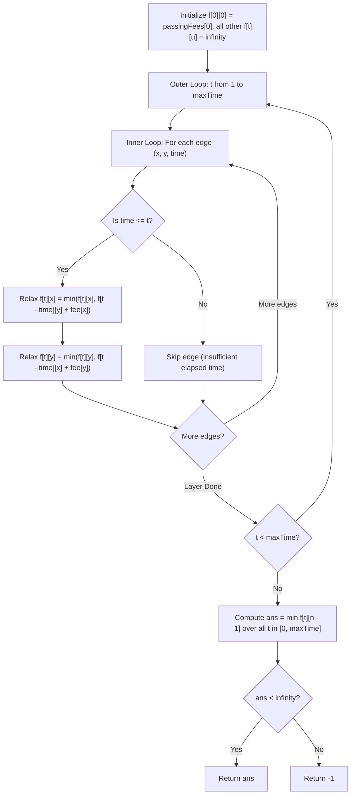

# Guided Example: Minimum Cost to Reach Destination in Time

We trace 2D dynamic programming over expanded time-state graphs and Pareto-optimal cost-time trade-offs on representative road network instances:

- **Primary Input:** `maxTime = 30`, `edges = [[0,1,10],[1,2,10],[2,5,10],[0,3,1],[3,4,10],[4,5,15]]`, `passingFees = [5, 1, 2, 20, 20, 3]`
- **Required Output:** `11`
- **Infeasible Time Input:** `maxTime = 25`, `edges = [[0,1,10],[1,2,10],[2,5,10]]`, `passingFees = [5, 1, 2, 3]`
- **Required Output:** `-1`

This instance demonstrates solving constrained shortest path problems where edge weights are two-dimensional (time and cost), expanding states by time step $t \in [0, \text{maxTime}]$, and evaluating transitions across bidirectional edges.

---

## 1. Instance & Teaching Goal

We navigate a network of $n$ cities indexed from $0$ to $n - 1$.
- We start at city $0$ at time $0$ and must reach city $n - 1$.
- Total journey time cannot exceed `maxTime`.
- Entering city $i$ incurs a fee $\text{passingFees}[i]$. The initial city $0$ fee is also paid.
- We seek the minimum total fee across all valid paths completing within `maxTime`.

For `maxTime = 30`, with cities $\{0, 1, 2, 3, 4, 5\}$ and fees `[5, 1, 2, 20, 20, 3]`:
- Path A: $0 \xrightarrow{10} 1 \xrightarrow{10} 2 \xrightarrow{10} 5$
  - Cumulative Time: $10 + 10 + 10 = 30 \le 30$ (Feasible).
  - Total Fee: $\text{fee}(0) + \text{fee}(1) + \text{fee}(2) + \text{fee}(5) = 5 + 1 + 2 + 3 = 11$.
- Path B: $0 \xrightarrow{1} 3 \xrightarrow{10} 4 \xrightarrow{15} 5$
  - Cumulative Time: $1 + 10 + 15 = 26 \le 30$ (Feasible).
  - Total Fee: $\text{fee}(0) + \text{fee}(3) + \text{fee}(4) + \text{fee}(5) = 5 + 20 + 20 + 3 = 48$.
- Path B is faster (26 min vs 30 min) but significantly more expensive (48 vs 11).
- The minimal fee compliant with the time ceiling is **11**.

The teaching goal is to understand **dynamic programming on expanded time-layered state spaces**:
1. Why standard Dijkstra fails when cost and time conflict (a path may be slower but cheaper).
2. Defining the 2D DP state $f[t][u]$: minimal fee to reach city $u$ in exact elapsed time $t$.
3. Ensuring strictly acyclic state transitions by iterating over time $t = 1 \dots \text{maxTime}$ since edge travel times are positive ($t_e \ge 1$).
4. Aggregating $\min_{0 \le t \le \text{maxTime}} f[t][n - 1]$ to identify the global minimum cost.

---

## 2. Conceptual Foundation & Invariants

### Time-Expanded State DP Invariant Theorem

> **Time-Expanded State DP Invariant Theorem.**
> 1. *Layered State Definition:* Let $f[t][u]$ denote the minimum cumulative passing fee paid to be present at city $u$ at elapsed time $t$, with $0 \le t \le \text{maxTime}$ and $0 \le u < n$.
> 2. *Base Case Invariant:* At time $t = 0$, the traveler is located at city $0$ having paid the initial entry fee:
>    $$f[0][0] = \text{passingFees}[0], \quad f[0][u] = \infty \quad (\forall u \neq 0)$$
> 3. *Monotonic Time Recurrence:* Because all edge travel times satisfy $t_e \ge 1$, an edge traversal from $v$ to $u$ arriving at time $t$ must depart from $v$ at time $t - t_e < t$. The state transition is:
>    $$f[t][u] = \min_{(u, v, t_e) \in E, t_e \le t} \left( f[t - t_e][v] + \text{passingFees}[u] \right)$$
> 4. *DAG Structure:* Because $t - t_e < t$, there are no zero-weight cycles in time space. Advancing outer loop time $t$ from $1$ to $\text{maxTime}$ ensures all dependency values $f[t - t_e][v]$ are fully finalized before computing layer $t$.
> 5. *Global Optimum:* The minimum fee to reach destination $n - 1$ within time `maxTime` is:
>    $$\text{ans} = \min_{0 \le t \le \text{maxTime}} f[t][n - 1]$$
>    If this minimum equals $\infty$, the destination is unreachable within `maxTime`, returning $-1$.

---

## 3. Step-by-Step Worked Execution

We trace `maxTime = 30`, destination city 5, fees `[5, 1, 2, 20, 20, 3]`:

---

### Step 1: Initialization at $t = 0$
- $f[0][0] = 5$.
- All other $f[0][u] = \infty$ for $u \in \{1, 2, 3, 4, 5\}$.

---

### Step 2: Key Time Transitions $t = 1 \dots 11$
- At $t = 1$:
  - Edge $(0, 3, 1)$: $f[1][3] = f[0][0] + \text{fee}(3) = 5 + 20 = 25$.
- At $t = 10$:
  - Edge $(0, 1, 10)$: $f[10][1] = f[0][0] + \text{fee}(1) = 5 + 1 = 6$.
- At $t = 11$:
  - Edge $(3, 4, 10)$: departs from city 3 at $t = 1$.
  - $f[11][4] = f[1][3] + \text{fee}(4) = 25 + 20 = 45$.

---

### Step 3: Key Time Transitions $t = 20 \dots 26$
- At $t = 20$:
  - Edge $(1, 2, 10)$: departs from city 1 at $t = 10$.
  - $f[20][2] = f[10][1] + \text{fee}(2) = 6 + 2 = 8$.
- At $t = 26$:
  - Edge $(4, 5, 15)$: departs from city 4 at $t = 11$.
  - $f[26][5] = f[11][4] + \text{fee}(5) = 45 + 3 = 48$.
  - Candidate solution found at $t = 26$ with cost $48$.

---

### Step 4: Key Time Transition $t = 30$
- At $t = 30$:
  - Edge $(2, 5, 10)$: departs from city 2 at $t = 20$.
  - $f[30][5] = f[20][2] + \text{fee}(5) = 8 + 3 = 11$.
  - Superior solution found at $t = 30$ with cost $11 < 48$.

---

### Step 5: Termination and Minimum Extraction
Evaluating all time slots for destination city 5:
- $t < 26$: $f[t][5] = \infty$.
- $t = 26$: $f[26][5] = 48$.
- $t = 30$: $f[30][5] = 11$.
- Minimum fee: $\min(48, 11) = 11$.

---

## 4. Complete Execution Trace

We record arrival milestones across critical time steps:

| Time $t$ | Edge Used $(u \to v)$ | Travel Time | Prior State $(t - \text{time}, u)$ | New State $(t, v)$ | Cumulative Fee Calculation | Resulting State Fee |
|---|---|---|---|---|---|---|
| 0 | Origin | 0 | — | $(0, 0)$ | Initial seed | $f[0][0] = 5$ |
| 1 | $0 \to 3$ | 1 | $(0, 0) = 5$ | $(1, 3)$ | $5 + 20$ | $f[1][3] = 25$ |
| 10 | $0 \to 1$ | 10 | $(0, 0) = 5$ | $(10, 1)$ | $5 + 1$ | $f[10][1] = 6$ |
| 11 | $3 \to 4$ | 10 | $(1, 3) = 25$ | $(11, 4)$ | $25 + 20$ | $f[11][4] = 45$ |
| 20 | $1 \to 2$ | 10 | $(10, 1) = 6$ | $(20, 2)$ | $6 + 2$ | $f[20][2] = 8$ |
| 26 | $4 \to 5$ | 15 | $(11, 4) = 45$ | $(26, 5)$ | $45 + 3$ | $f[26][5] = 48$ |
| 30 | $2 \to 5$ | 10 | $(20, 2) = 8$ | $(30, 5)$ | $8 + 3$ | **$f[30][5] = 11$** |

We contrast the two candidate trajectories reaching destination city 5:

| Trajectory Route | Intermediate Nodes | Total Time Required | Time Within Limit ($\le 30$)? | Itemized Fees Paid | Total Cost | Status |
|---|---|---|---|---|---|---|
| High-Fee Route | $0 \to 3 \to 4 \to 5$ | $1 + 10 + 15 = 26$ | Yes ($26 \le 30$) | $5 + 20 + 20 + 3$ | 48 | Suboptimal |
| Low-Fee Route | $0 \to 1 \to 2 \to 5$ | $10 + 10 + 10 = 30$ | Yes ($30 \le 30$) | $5 + 1 + 2 + 3$ | **11** | **Optimal** |

---

## 5. Algorithmic Correctness

**Soundness.** For each city $u$ and time $t$, $f[t][u]$ is computed strictly by taking the minimum over all valid inbound edges from an already finalized state at time $t - t_e$. Since fees are non-negative and all additions reflect actual passing fees of entered cities, no fictitious low-cost paths can be introduced. Any recorded cost corresponds to an authentic, realizable walk in the graph.

**Completeness.** Since edge travel times are strictly positive ($t_e \ge 1$), advancing time layer-by-layer topological-orders the underlying state space. All paths requiring at most $\text{maxTime}$ are explored, so no cheaper valid route can be missed.

---

## 6. Traps This Instance Exposes

- **Greedy Dijkstra Pitfall:** Running standard Dijkstra with fees as edge weights ignores elapsed time, potentially picking a cheap path that exceeds $\text{maxTime}$. Running Dijkstra with time as weights ignores fees, picking the fastest path (cost 48) while missing the feasible cheaper route (cost 11). Expanding states by time is necessary.
- **Multigraph Edges:** Multiple edges may connect the same pair of cities with different times. The DP naturally handles multiple edges because each edge is considered independently during the inner loop relaxation.
- **Bidirectional Relaxation:** Because roads are bidirectional, each edge $(x, y, t)$ can relax both $x \to y$ and $y \to x$. Both directions must be updated using $f[t - t_e]$.

---

## 7. Complexity Derivation

- **Time Complexity:** $\mathcal{O}(T \cdot E)$, where $T = \text{maxTime}$ and $E$ is the number of edges. The outer loop runs $T$ iterations; each iteration relaxes all $E$ bidirectional edges in constant time.
- **Auxiliary Space Complexity:** $\mathcal{O}(T \cdot n)$ to maintain the 2D dynamic programming table of dimensions $(\text{maxTime} + 1) \times n$.