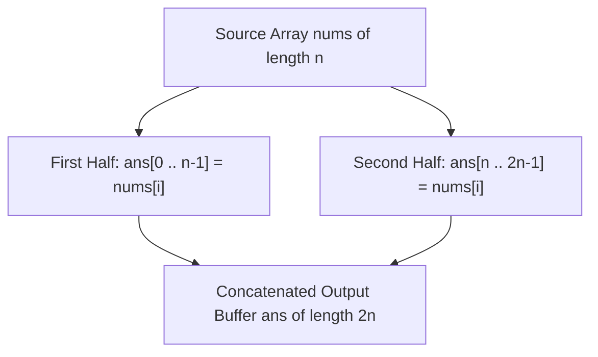

# Guided Example: Concatenation of Array

We trace sequence self-concatenation and periodic modular index mapping on representative integer array instances:

- **Primary Input:** `nums = [1, 2, 1]`
- **Required Output:** `[1, 2, 1, 1, 2, 1]`
- **Four-Element Input:** `nums = [1, 3, 2, 1]`
- **Required Output:** `[1, 3, 2, 1, 1, 3, 2, 1]`

This instance demonstrates duplicating an ordered sequence of length $n$ to form a periodic array of length $2n$, proving index periodicity under the congruence relation $j \equiv i \pmod n$, and analyzing linear memory layouts.

---

## 1. Instance & Teaching Goal

Given an integer array `nums` of length $n$, we must construct an array `ans` of length $2n$ such that:

$$\text{ans}[i] = nums[i] \quad \text{and} \quad \text{ans}[i + n] = nums[i] \quad \text{for all } 0 \le i < n$$

For `nums = [1, 2, 1]`:
- Length $n = 3$. Output array length is $2n = 6$.
- First segment ($0 \le i < 3$):
  - $\text{ans}[0] = nums[0] = 1$
  - $\text{ans}[1] = nums[1] = 2$
  - $\text{ans}[2] = nums[2] = 1$
- Second segment ($3 \le i < 6$ with $j = i - 3$):
  - $\text{ans}[3] = nums[3 - 3] = nums[0] = 1$
  - $\text{ans}[4] = nums[4 - 3] = nums[1] = 2$
  - $\text{ans}[5] = nums[5 - 3] = nums[2] = 1$
- Concatenated result: `[1, 2, 1, 1, 2, 1]`.

The teaching goal is to understand **periodic sequence duplication and modulo index arithmetic**:
1. Mapping the target indices $k \in \{0, \dots, 2n - 1\}$ back to the source array using the modular rule $nums[k \bmod n]$.
2. Understanding memory layout and allocation: creating contiguous buffers of size $2n$ versus concatenating list objects.
3. Establishing invariant preservation during array replication.

---

## 2. Conceptual Foundation & Invariants

### Periodic Array Concatenation Theorem

> **Periodic Array Concatenation Theorem.**
> 1. *Periodic Congruence Formulation:* For any target index $k \in \{0, 1, \dots, 2n - 1\}$, the assigned value is uniquely determined by modular reduction:
>    $$\text{ans}[k] = nums[k \bmod n]$$
>    This is mathematically equivalent to the piecewise specification:
>    $$\text{ans}[k] = \begin{cases} nums[k] & \text{if } 0 \le k < n \\ nums[k - n] & \text{if } n \le k < 2n \end{cases}$$
> 2. *Contiguous Memory Layout:* Concatenation preserves element ordering in each block:
>    $$\text{ans}[0 \dots 2n - 1] = nums[0 \dots n - 1] \mathbin{\Vert} nums[0 \dots n - 1]$$
>    where $\mathbin{\Vert}$ denotes sequence concatenation.
> 3. *Independence of Source and Destination:* Because `ans` is instantiated as a newly allocated memory buffer, populating `ans` introduces no mutation side-effects onto `nums`.

---

## 3. Step-by-Step Worked Execution

We trace `nums = [1, 2, 1]` with $n = 3$ across all target positions $k \in \{0, 1, 2, 3, 4, 5\}$:

---

### Step 1: Evaluate First Half ($k = 0 \dots 2$)
- Target $k = 0$: $k \bmod 3 = 0 \implies \text{ans}[0] = nums[0] = 1$.
- Target $k = 1$: $k \bmod 3 = 1 \implies \text{ans}[1] = nums[1] = 2$.
- Target $k = 2$: $k \bmod 3 = 2 \implies \text{ans}[2] = nums[2] = 1$.
- State after first pass: `ans = [1, 2, 1, _, _, _]`.

---

### Step 2: Evaluate Second Half ($k = 3 \dots 5$)
- Target $k = 3$: $k \bmod 3 = 0 \implies \text{ans}[3] = nums[0] = 1$.
- Target $k = 4$: $k \bmod 3 = 1 \implies \text{ans}[4] = nums[1] = 2$.
- Target $k = 5$: $k \bmod 3 = 2 \implies \text{ans}[5] = nums[2] = 1$.
- State after second pass: `ans = [1, 2, 1, 1, 2, 1]`.

---

### Step 3: Final Assembly
Both halves are identical copies of `nums`. The finalized array is:

$$\text{ans} = [1, 2, 1, 1, 2, 1]$$

---

## 4. Complete Execution Trace

We record each target position's address translation for `nums = [1, 2, 1]`:

| Output Index $k$ | Half Segment | Formula Applied | Source Index $k \bmod 3$ | Value Retrieved | Value Written |
|---|---|---|---|---|---|
| 0 | First Half | $nums[0]$ | 0 | 1 | `ans[0] = 1` |
| 1 | First Half | $nums[1]$ | 1 | 2 | `ans[1] = 2` |
| 2 | First Half | $nums[2]$ | 2 | 1 | `ans[2] = 1` |
| 3 | Second Half | $nums[3 - 3]$ | 0 | 1 | `ans[3] = 1` |
| 4 | Second Half | $nums[4 - 3]$ | 1 | 2 | `ans[4] = 2` |
| 5 | Second Half | $nums[5 - 3]$ | 2 | 1 | `ans[5] = 1` |

We contrast single versus concatenated sequence metrics across test instances:

| Test Case | Input `nums` | Input Length $n$ | Output Length $2n$ | First Block $[0 \dots n-1]$ | Second Block $[n \dots 2n-1]$ |
|---|---|---|---|---|---|
| Primary | `[1, 2, 1]` | 3 | 6 | `[1, 2, 1]` | `[1, 2, 1]` |
| Secondary | `[1, 3, 2, 1]` | 4 | 8 | `[1, 3, 2, 1]` | `[1, 3, 2, 1]` |

---

## 5. Algorithmic Correctness

**Soundness.** By the definition of concatenation, the resulting list consists of elements of `nums` from index $0$ to $n-1$, immediately followed by elements of `nums` from index $0$ to $n-1$. Each index $k \in [0, 2n-1]$ receives value $nums[k \bmod n]$, precisely satisfying both requirements $\text{ans}[i] = nums[i]$ and $\text{ans}[i + n] = nums[i]$.

**Completeness.** Exactly $2n$ elements are populated, fully filling the destination buffer without uninitialized gaps or out-of-bounds access.

---

## 6. Traps This Instance Exposes

- **In-Place Modification Hazard:** Appending elements into `nums` while iterating over `nums` using an unconstrained loop can cause an infinite loop if the loop boundary dynamically recalculates `len(nums)`. Pre-allocating a new array of size $2n$ or using list concatenation `nums + nums` avoids iteration hazards.
- **Index Out-of-Bounds:** Assuming the second segment starts at index $n - 1$ instead of $n$ leads to an off-by-one overwrite of the last element of the first half.
- **Shallow Reference Duplication:** In multi-dimensional arrays, copying references rather than deep values can link sub-elements; for primitive 1D integer arrays, direct element copying is safe.

---

## 7. Complexity Derivation

- **Time Complexity:** $\mathcal{O}(n)$, where $n = \text{len}(nums)$. Copying $n$ elements twice requires exactly $2n$ memory transfers.
- **Auxiliary Space Complexity:** $\mathcal{O}(1)$ beyond the $\mathcal{O}(n)$ memory allocated for the returned array of length $2n$.
