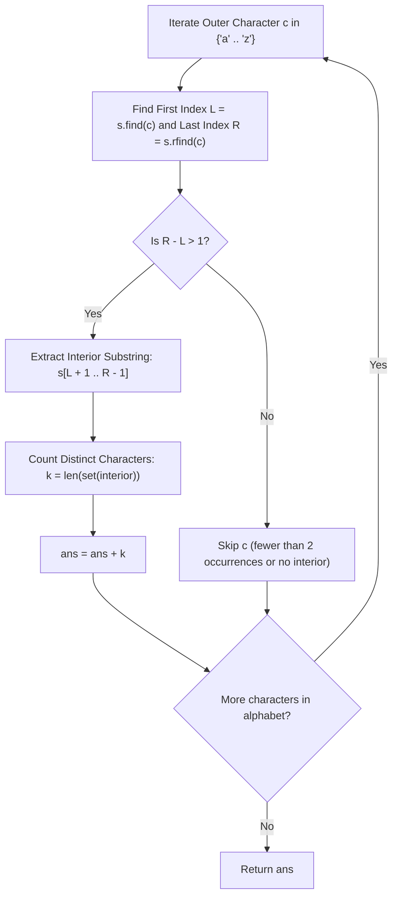

# Guided Example: Unique Length-3 Palindromic Subsequences

We trace outer-character boundary pinning and interior alphabet projection for length-3 palindromes on representative string instances:

- **Primary Input:** `s = "aabca"`
- **Required Output:** `3`
- **Interleaved Input:** `s = "bbcbaba"`
- **Required Output:** `4`

This instance demonstrates exploiting the structural symmetry of length-3 palindromes ($c \cdot m \cdot c$), identifying extreme outer boundaries ($L = \text{first}(c), R = \text{last}(c)$) to maximize candidate intermediate characters, and counting unique character sets in $\mathcal{O}(|\Sigma| \cdot n)$ time.

---

## 1. Instance & Teaching Goal

Given a string `s` of lowercase English letters, determine the number of **unique** palindromes of length 3 that appear as subsequences of `s`.
- A palindrome of length 3 reads identically forward and backward: it has the form $c \cdot m \cdot c$, where $c$ is the outer character and $m$ is the middle character (which may equal $c$).
- Duplicate subsequences count only once: the set of distinct length-3 palindromic strings is what is enumerated.

For `s = "aabca"` of length 5:
- Index 0: `'a'`
- Index 1: `'a'`
- Index 2: `'b'`
- Index 3: `'c'`
- Index 4: `'a'`

Outer character candidate `'a'`:
- First occurrence: index $L = 0$.
- Last occurrence: index $R = 4$.
- The substring between these extreme boundaries is $s[1 \dots 3] = \text{"abc"}$.
- Distinct characters in this interior: `{'a', 'b', 'c'}`.
- Corresponding length-3 palindromes: `"aaa"` (subsequence indices $(0, 1, 4)$), `"aba"` ($(0, 2, 4)$), and `"aca"` ($(0, 3, 4)$).
- Count for `'a'`: 3.

Other characters:
- `'b'` appears only at index 2 ($L = R = 2$). No interior characters exist. Count: 0.
- `'c'` appears only at index 3 ($L = R = 3$). Count: 0.
- Total unique palindromes: $3 + 0 + 0 = 3$.

The teaching goal is to understand **extreme-boundary projection and alphabet-driven decomposition**:
1. Factoring the problem by the outer character $c \in \{'a', \dots, 'z'\}$.
2. Proving that choosing the earliest $L$ and latest $R$ for character $c$ strictly subsumes all possible middle characters for any other pair of occurrences of $c$.
3. Reducing the counting problem for each letter to the cardinality of the unique character set in the range $(L, R)$.

---

## 2. Conceptual Foundation & Invariants

### Extreme Boundary Subsumption Theorem

> **Extreme Boundary Subsumption Theorem.**
> 1. *Palindromic Form:* Every length-3 palindrome is uniquely identified by the ordered pair of characters $(c, m) \in \Sigma \times \Sigma$, representing the string $c \cdot m \cdot c$.
> 2. *Extreme Index Invariant:* For any fixed character $c \in \Sigma$, let:
>    $$L(c) = \min \{i \mid s[i] = c\}, \quad R(c) = \max \{j \mid s[j] = c\}$$
>    If $c$ appears fewer than 2 times, $R(c) - L(c) \le 1$, and no length-3 palindrome with outer character $c$ can exist.
> 3. *Maximal Interior Reach:* For any two occurrences of $c$ at indices $i < j$, the interval of available middle positions is $[i + 1, j - 1]$. Since $L(c) \le i < j \le R(c)$, we have:
>    $$[i + 1, j - 1] \subseteq [L(c) + 1, R(c) - 1]$$
>    Therefore, the set of distinct characters that can serve as the middle character $m$ for outer letter $c$ is precisely:
>    $$\mathcal{M}(c) = \{s[k] \mid L(c) < k < R(c)\}$$
> 4. *Global Cardinality:* Because palindromes with different outer characters $c_1 \neq c_2$ are trivially distinct ($c_1 \cdot m_1 \cdot c_1 \neq c_2 \cdot m_2 \cdot c_2$), the total count of unique palindromes is the disjoint sum:
>    $$\text{Total} = \sum_{c \in \Sigma, R(c) - L(c) > 1} |\mathcal{M}(c)|$$

---

## 3. Step-by-Step Worked Execution

---

### Execution on Primary String: `s = "aabca"`

Length $n = 5$. Alphabet scan over active characters:

#### 1. Outer Character `'a'`
- First index: $L = 0$.
- Last index: $R = 4$.
- Distance check: $R - L = 4 - 0 = 4 > 1$ (Valid).
- Interior interval: $[0 + 1 \dots 4 - 1] = [1 \dots 3]$.
- Interior characters: $s[1] = \text{'a'}, s[2] = \text{'b'}, s[3] = \text{'c'}$.
- Set of unique middle characters: $\mathcal{M}(\text{'a'}) = \{\text{'a'}, \text{'b'}, \text{'c'}\}$.
- Size: $|\mathcal{M}(\text{'a'})| = 3$.
- Generated palindromes: `"aaa"`, `"aba"`, `"aca"`.
- Running total: $\text{ans} = 3$.

#### 2. Outer Character `'b'`
- First index: $L = 2$.
- Last index: $R = 2$.
- $R - L = 0 \le 1$.
- No palindromes possible with outer character `'b'`.

#### 3. Outer Character `'c'`
- First index: $L = 3$.
- Last index: $R = 3$.
- $R - L = 0 \le 1$.
- No palindromes possible with outer character `'c'`.

#### 4. All Other Alphabet Characters
- Absent from `s`. $L = -1$. Skipped.

#### Result
Total unique length-3 palindromes: **3**.

---

### Execution on Interleaved String: `s = "bbcbaba"`

Indices:
- 0: `'b'`, 1: `'b'`, 2: `'c'`, 3: `'b'`, 4: `'a'`, 5: `'b'`, 6: `'a'`

#### 1. Outer Character `'a'`
- First index: $L = 4$.
- Last index: $R = 6$.
- Interior: $s[5 \dots 5] = \text{"b"}$.
- Distinct middle characters: `{'b'}` $\implies$ palindrome `"aba"`.
- Count: $+1$.

#### 2. Outer Character `'b'`
- First index: $L = 0$.
- Last index: $R = 5$.
- Interior: $s[1 \dots 4] = \text{"bcba"}$.
- Distinct middle characters: `{'b', 'c', 'a'}` $\implies$ palindromes `"bbb"`, `"bcb"`, `"bab"`.
- Count: $+3$.

#### 3. Outer Character `'c'`
- First index: $L = 2$, Last: $R = 2 \implies R - L = 0$. Count: 0.

#### Result
Total unique palindromes: $1 + 3 = \mathbf{4}$.

---

## 4. Complete Execution Trace

We trace the boundary indices and distinct middle character collections for `s = "aabca"`:

| Outer Character $c$ | First Index $L(c)$ | Last Index $R(c)$ | Boundary Spread $R - L$ | Interior Slice $s[L+1 \dots R-1]$ | Distinct Middles $\mathcal{M}(c)$ | Subsequence Palindromes |
|---|---|---|---|---|---|---|
| `'a'` | 0 | 4 | 4 | `"abc"` | `{'a', 'b', 'c'}` | `"aaa"`, `"aba"`, `"aca"` |
| `'b'` | 2 | 2 | 0 | `""` | $\emptyset$ | None |
| `'c'` | 3 | 3 | 0 | `""` | $\emptyset$ | None |
| `'d'` .. `'z'` | -1 | -1 | 0 | `""` | $\emptyset$ | None |

We compare results across sample test strings:

| String $s$ | Distinct Letters Present | Active Outer Characters | Unique Palindromes Formed | Output Count |
|---|---|---|---|---|
| `"aabca"` | `{'a', 'b', 'c'}` | `'a'` | `"aaa"`, `"aba"`, `"aca"` | **3** |
| `"bbcbaba"` | `{'a', 'b', 'c'}` | `'a'`, `'b'` | `"aba"`, `"bbb"`, `"bcb"`, `"bab"` | **4** |
| `"ckafkodfc"` | `{'a', 'c', 'd', 'f', 'k', 'o'}` | `'c'`, `'k'`, `'f'` | Multiple | **4** |

---

## 5. Algorithmic Correctness

**Soundness.** For any outer character $c$ and middle character $m \in \mathcal{M}(c)$, there exist indices $L < k < R$ such that $s[L] = c$, $s[k] = m$, and $s[R] = c$. The subsequence $(L, k, R)$ forms the string $c \cdot m \cdot c$, which is a valid length-3 palindrome. Because each pair $(c, m)$ is counted exactly once by using a set, no duplicate palindromes are counted.

**Completeness.** Suppose a length-3 palindrome $c \cdot m \cdot c$ exists in $s$ via indices $i < k < j$. Then $s[i] = c$ implies $L(c) \le i < k$, and $s[j] = c$ implies $k < j \le R(c)$. Thus $L(c) < k < R(c)$, meaning $m = s[k]$ belongs to the interior slice $s[L(c)+1 \dots R(c)-1]$ and is captured by $\mathcal{M}(c)$. No valid palindrome can be omitted.

---

## 6. Traps This Instance Exposes

- **Duplicate Subsequence Index Combinations:** In `s = "aabca"`, the palindrome `"aaa"` can be formed by indices $(0, 1, 4)$. If there were another `'a'`, multiple triples could form `"aaa"`. The problem asks for the count of *unique string values*, not unique index combinations. Counting set cardinality `len(set(...))` naturally deduplicates duplicate subsequences.
- **Middle Character Matching Outer Character:** A palindrome like `"aaa"` has outer character `'a'` and middle character `'a'`. The algorithm correctly handles this because an interior `'a'` is treated like any other character in the set.
- **Narrow Boundary Separation:** When $R = L + 1$, the two occurrences are immediately adjacent (e.g. `"aa"`). There are zero intermediate positions between them ($R - L = 1 \ngtr 1$), so no length-3 palindrome can be formed using this boundary pair.

---

## 7. Complexity Derivation

- **Time Complexity:** $\mathcal{O}(|\Sigma| \cdot n)$, where $|\Sigma| = 26$ is the lowercase English alphabet size and $n = \text{len}(s)$. For each of the 26 characters, scanning to find the first and last occurrence takes $\mathcal{O}(n)$, and taking the set of the interior takes $\mathcal{O}(n)$, yielding $\mathcal{O}(26 \cdot n) = \mathcal{O}(n)$ total time.
- **Auxiliary Space Complexity:** $\mathcal{O}(|\Sigma|) = \mathcal{O}(1)$ auxiliary space to store the set of distinct interior characters and boundary pointers.
