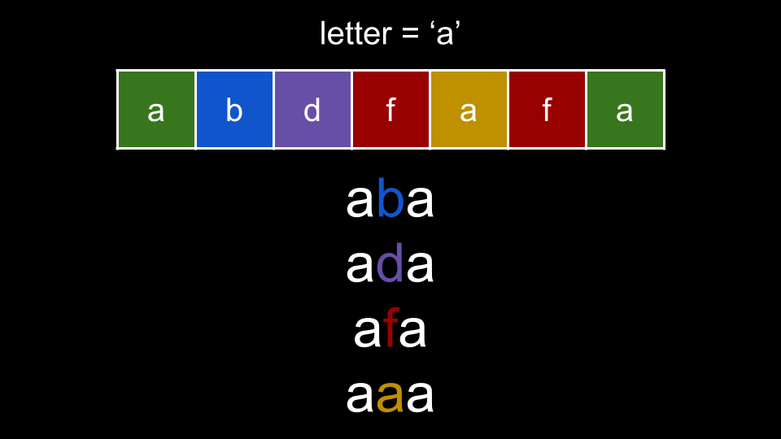

[TOC]

## Solution

---

### Approach 1: Count Letters In-Between

**Intuition**

There is only one possible form a palindrome with length 3 can take. The first and last character must be the same, and the character in the middle can be anything (including the same character as the first/last character).

The important thing to notice here is that the first and last characters must be the same. To solve this problem, we can focus on each letter of the alphabet `letter` and treat it as the first and last character. Then, we find how many characters we can put in between them to form a palindrome.

There may be many occurrences of a given `letter` in `s`. Which ones should we choose? We should choose the first occurrence of `letter` in `s` to be the first character in our palindrome, and the last occurrence of `letter` in `s` to be the last character in our palindrome. Why?

The problem wants us to find subsequences - so when we look for a character to put as the middle character in the palindrome, this character must also be in between our two occurrences in `s`. Thus, by choosing the first and last occurrence, we are maximizing the number of characters in between, and thus maximizing the number of potential palindromes we could form.

For each **unique** `letter` in `s`, we find `i` as the first index where `letter` occurs and `j` as the final index where `letter` occurs. Next, we look at all the characters between indices `i` and `j` (the range of `[i + 1, j - 1]`) and count how many **unique** letters there are. Each of these unique letters can form a palindrome by being between two `letter`.


<br>

How do we find the count of **unique** letters? We will use a hash set since hash sets do not record duplicates. We iterate over each index `k` between `i` and `j` and add $s[k]$ to our hash set `between`. Once finished, we can add the size of `between` to our answer. We repeat this process for every unique `letter` that appears in `s`. We can also use a hash set to find all the unique letters that appear in `s`.

**Algorithm**

1. Create `letters`, a hash set of all letters in `s`.
2. Initialize $ans = 0$.
3. Iterate over each `letter` in `letters`:
- Calculate `i` as the first index in which `letter` appears in `s` and `j` as the final index in which `letter` appears in `s`:
- Initialize $i = -1$ and $j = 0$. Iterate over each index `k` in `s`. If $s[k] = letter$, set $i = k$ if $i = -1$, and set $j = k$.
- Initialize a hash set `between`.
- Iterate `k` over the indices between `i` and `j`:
- Add $s[k]$ to `between`.
- Add the length of `between` to `ans`.
4. Return `ans`.

**Implementation**

```python
class Solution:
    def countPalindromicSubsequence(self, s: str) -> int:
        letters = set(s)
        ans = 0

        for letter in letters:
            i, j = s.index(letter), s.rindex(letter)
            between = set()

            for k in range(i + 1, j):
                between.add(s[k])

            ans += len(between)

        return ans
```

> Bonus Python 1-liner:

```python
class Solution:
    def countPalindromicSubsequence(self, s: str) -> int:
        return sum([len(set(s[s.index(letter)+1:s.rindex(letter)])) for letter in set(s)])
```

**Complexity Analysis**

Given $n$ as the length of `s`,

* Time complexity: $O(n)$

    To create `letters`, we use $O(n)$ time to iterate over `s`.

    Next, we iterate over each `letter` in `letters`. Because `s` only contains lowercase letters of the English alphabet, there will be no more than 26 iterations.

    At each iteration, we iterate over `s` to find `i` and `j`, which costs $O(n)$. Next, we iterate between `i` and `j`, which could cost $O(n)$ in the worst-case scenario.

    Overall, each iteration costs $O(n)$. This gives us a time complexity of $O(26n) = O(n)$

* Space complexity: $O(1)$

    `letters` and `between` cannot grow beyond a size of 26, since `s` only contains letters of the English alphabet.

<br/>

---

### Approach 2: Pre-Compute First and Last Indices

**Intuition**

We can slightly optimize the previous approach by pre-computing the indices `i` and `j` for each `letter`.

In the first approach, it costs $O(n)$ to calculate `i` and `j`. While this does not affect the time complexity, it does add a large constant factor to our runtime. In this approach, we will spend $O(n)$ once, then be able to retrieve `i` and `j` for every letter in $O(1)$.

Let `first` be an array of length `26`, where $\text{first}[c]$ represents the first index the character `c` appears in `s`. Similarly, let `last` be an array of length `26`, where $\text{last}[c]$ represents the last index the character `c` appears in `s`. Because we need integer indices, we will map each character to its position in the alphabet.

- $'a' = 0$.
- $'b' = 1$.
- ...
- $'z' = 25$.

We will calculate the arrays `first` and `last` prior to calculating the answer. To indicate if a letter appears in `s` at all, we will initialize `first` to have values of `-1`, which would be overridden if a letter appears in `s`.

> To calculate `first` and `last`, we use a similar process from the previous approach. We iterate over `s` and for each $s[i]$, if $first[s[i]] = -1$, we set $first[s[i]] = i$. We always set $last[s[i]] = i$.

Once we have `first` and `last`, we can iterate over each position in the alphabet `i`. We first check if this character appears in `s` at all, which we can do by checking if $\text{first}[i] = -1$. If `i` appears in `s`, we reference $\text{first}[i]$ and $\text{last}[i]$ to get the first and last indices.

We then perform the same process from the previous approach - declare a hash set `between`, iterate between the first and last indices, add each character to `between`, and finally add the length of `between` to our answer.

We repeat this process for each position `i` in the alphabet from `0` until `26`.

**Algorithm**

1. Initialize `first` and `last` as arrays of length `26` with values `-1`.
2. Iterate `i` over the indices of `s`:
- Calculate the current alphabet position as $curr = s[i] - 'a'$.
- If $\text{first}[curr] = -1$, set $\text{first}[curr] = i$.
- Set $\text{last}[curr] = i$.
3. Initialize $ans = 0$.
4. Iterate over each alphabet position `i` from `0` until `26`:
- If $\text{first}[i] = -1$, continue to the next iteration.
- Initialize a hash set `between`.
- Iterate `j` over the indices between $\text{first}[i]$ and $\text{last}[i]$:
- Add $s[j]$ to `between`.
- Add the length of `between` to `ans`.
5. Return `ans`.

**Implementation**

```python
class Solution:
    def countPalindromicSubsequence(self, s: str) -> int:
        first = [-1] * 26
        last = [-1] * 26

        for i in range(len(s)):
            curr = ord(s[i]) - ord("a")
            if first[curr] == -1:
                first[curr] = i

            last[curr] = i

        ans = 0
        for i in range(26):
            if first[i] == -1:
                continue

            between = set()
            for j in range(first[i] + 1, last[i]):
                between.add(s[j])

            ans += len(between)

        return ans
```

**Complexity Analysis**

Given $n$ as the length of `s`,

* Time complexity: $O(n)$

    First, we calculate `first` and `last` by iterating over `s`, which costs $O(n)$.

    Next, we iterate over 26 alphabet positions. At each iteration, we iterate `j` over some indices, which in the worst-case scenario would cost $O(n)$. Overall, each of the 26 iterations cost $O(n)$, giving us a time complexity of $O(26n) = O(n)$.

* Space complexity: $O(1)$

    `first`, `last`, and `between` all use constant space since `s` only contains letters in the English alphabet.

<br/>

---