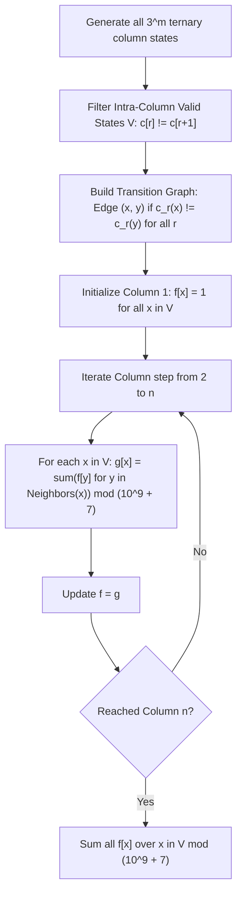

# Guided Example: Painting a Grid With Three Different Colors

We trace ternary column bitmasking, profile dynamic programming, and compatible state transitions on representative grid coloring instances:

- **Primary Input:** `m = 1`, `n = 2`
- **Required Output:** `6`
- **Unit Cell Input (Baseline):** `m = 1`, `n = 1`
- **Required Output:** `3`
- **Two-Row Input (Scale):** `m = 2`, `n = 2`
- **Required Output:** `18`

This instance demonstrates encoding grid columns as base-3 integer bitmasks, validating intra-column vertical color inequality, constructing an adjacency graph of inter-column compatibility, and executing linear column-by-column DP in $\mathcal{O}(n \cdot 3^{2m})$ time.

---

## 1. Instance & Teaching Goal

We are given an $m \times n$ grid and 3 distinct colors: Red ($0$), Green ($1$), and Blue ($2$). We must paint each cell such that no two adjacent cells (horizontally or vertically sharing an edge) have the same color. We return the number of valid colorings modulo $10^9 + 7$.

For $m = 1, n = 2$ (a $1 \times 2$ grid with cells $(0, 0)$ and $(0, 1)$):
- Cell $(0, 0)$ can be painted in any of the 3 colors: Red, Green, or Blue (3 choices).
- Adjacent cell $(0, 1)$ cannot have the same color as $(0, 0)$, leaving $3 - 1 = 2$ choices.
- Total valid colorings: $3 \times 2 = 6$.
- The 6 valid configurations are: `(R, G)`, `(R, B)`, `(G, R)`, `(G, B)`, `(B, R)`, `(B, G)`.

For $m = 2, n = 2$ (a $2 \times 2$ grid):
- A single column of length 2 has $3 \times 2 = 6$ valid vertical colorings:
  $(0, 1), (0, 2), (1, 0), (1, 2), (2, 0), (2, 1)$.
- When pairing column 1 with column 2, each state has 3 compatible neighbor states. For example, column $(0, 1)$ can be followed by $(1, 0), (1, 2),$ or $(2, 0)$.
- Total valid colorings: $6 \times 3 = 18$.

The teaching goal is to understand **profile (column-based) state compression DP**:
1. Exploiting the small row constraint ($m \le 5$) by representing each column as a ternary state $x \in [0, 3^m - 1]$.
2. Separating intra-column validity (vertical adjacency constraint) from inter-column transition validity (horizontal adjacency constraint).
3. Compiling an explicit transition digraph between valid states.
4. Propagating probability/count vectors column-by-column across $n$ steps.

---

## 2. Conceptual Foundation & Invariants

### Column Profile Ternary Invariant Theorem

> **Column Profile Ternary Invariant Theorem.**
> 1. *Ternary State Representation:* With 3 available colors $\{0, 1, 2\}$ and $m$ rows, any column configuration $\mathbf{c} = (c_0, c_1, \dots, c_{m-1}) \in \{0, 1, 2\}^m$ is bijectively mapped to an integer $x \in [0, 3^m - 1]$ via the base-3 polynomial:
>    $$x = \sum_{r=0}^{m-1} c_r \cdot 3^r$$
> 2. *Intra-Column Validity:* A column state $x$ is internally valid if and only if no two adjacent vertical rows share the same color:
>    $$\mathcal{V} = \{x \in [0, 3^m - 1] \mid c_r \neq c_{r+1} \text{ for all } 0 \le r < m - 1\}$$
>    The number of valid vertical columns is $|\mathcal{V}| = 3 \cdot 2^{m-1}$. For $m = 5$, $|\mathcal{V}| = 3 \cdot 16 = 48 \ll 243$.
> 3. *Inter-Column Compatibility:* Two valid states $x, y \in \mathcal{V}$ can be placed in adjacent columns if and only if they differ at every row index:
>    $$x \sim y \iff c_r(x) \neq c_r(y) \quad \text{for all } 0 \le r < m$$
> 4. *Markovian DP Recurrence:* Let $f_k[x]$ denote the number of valid colorings of a subgrid of dimensions $m \times k$ whose rightmost column has state $x$. Then:
>    $$f_1[x] = 1 \quad (\forall x \in \mathcal{V}), \qquad f_{k+1}[x] = \sum_{y \in \mathcal{V}, y \sim x} f_k[y] \pmod{10^9 + 7}$$

---

## 3. Step-by-Step Worked Execution

We trace the execution for $m = 2, n = 2$:
- Maximum state value: $3^2 = 9$.
- Ternary representations: $c_0 + 3 \cdot c_1$.

---

### Step 1: Identify Intra-Column Valid States $\mathcal{V}$
A valid state must have $c_0 \neq c_1$:
- $0 = (0, 0)_3 \implies c_0 = c_1 = 0$ (Invalid)
- $1 = (1, 0)_3 \implies c_0 = 1, c_1 = 0$ (Valid)
- $2 = (2, 0)_3 \implies c_0 = 2, c_1 = 0$ (Valid)
- $3 = (0, 1)_3 \implies c_0 = 0, c_1 = 1$ (Valid)
- $4 = (1, 1)_3 \implies c_0 = c_1 = 1$ (Invalid)
- $5 = (2, 1)_3 \implies c_0 = 2, c_1 = 1$ (Valid)
- $6 = (0, 2)_3 \implies c_0 = 0, c_1 = 2$ (Valid)
- $7 = (1, 2)_3 \implies c_0 = 1, c_1 = 2$ (Valid)
- $8 = (2, 2)_3 \implies c_0 = c_1 = 2$ (Invalid)

Valid state set: $\mathcal{V} = \{1, 2, 3, 5, 6, 7\}$ of size $|\mathcal{V}| = 3 \times 2^{2-1} = 6$.

---

### Step 2: Construct Compatibility Graph
Two states $x = (c_0, c_1)$ and $y = (d_0, d_1)$ are compatible ($x \sim y$) iff $c_0 \neq d_0$ and $c_1 \neq d_1$.
For state $3 = (0, 1)$:
- Candidates must have $d_0 \in \{1, 2\}$ and $d_1 \in \{0, 2\}$.
- Candidate $(1, 0) = 1$ (Valid, $1 \neq 0$): **Compatible**.
- Candidate $(2, 0) = 2$ (Valid, $2 \neq 0$): **Compatible**.
- Candidate $(1, 2) = 7$ (Valid, $1 \neq 2$): **Compatible**.
- Candidate $(2, 2) = 8$: Invalid vertical state.
- Neighbor set of state 3: $\mathcal{N}(3) = \{1, 2, 7\}$ (Degree 3).

By color symmetry, every valid state in $\mathcal{V}$ has degree exactly 3.

---

### Step 3: Column 1 Initialization ($k = 1$)
For each $x \in \mathcal{V}$:
$$f_1[x] = 1 \quad (\forall x \in \{1, 2, 3, 5, 6, 7\})$$
Sum of ways for column 1: $1 \times 6 = 6$.

---

### Step 4: Propagate to Column 2 ($k = 2$)
For each state $x \in \mathcal{V}$, sum $f_1[y]$ over its 3 neighbors:
$$f_2[x] = \sum_{y \in \mathcal{N}(x)} f_1[y] = 1 + 1 + 1 = 3$$
Every valid state has $f_2[x] = 3$.

---

### Step 5: Final Aggregate
$$\text{Total Ways} = \sum_{x \in \mathcal{V}} f_2[x] = 6 \times 3 = 18$$
Output: **18**.

---

## 4. Complete Execution Trace

We enumerate the 6 valid column states for $m = 2$ and their transition neighborhoods:

| State ID $x$ | Ternary Tuple $(c_0, c_1)$ | Row 0 Color | Row 1 Color | Compatible Neighbor States $\mathcal{N}(x)$ | Degree $\lvert \mathcal{N}(x) \rvert$ |
|---|---|---|---|---|---|
| 1 | $(1, 0)_3$ | Green ($1$) | Red ($0$) | $\{3, 5, 6\} \equiv \{(0, 1), (2, 1), (0, 2)\}$ | 3 |
| 2 | $(2, 0)_3$ | Blue ($2$) | Red ($0$) | $\{3, 5, 7\} \equiv \{(0, 1), (2, 1), (1, 2)\}$ | 3 |
| 3 | $(0, 1)_3$ | Red ($0$) | Green ($1$) | $\{1, 2, 7\} \equiv \{(1, 0), (2, 0), (1, 2)\}$ | 3 |
| 5 | $(2, 1)_3$ | Blue ($2$) | Green ($1$) | $\{1, 6, 7\} \equiv \{(1, 0), (0, 2), (1, 2)\}$ | 3 |
| 6 | $(0, 2)_3$ | Red ($0$) | Blue ($2$) | $\{1, 2, 5\} \equiv \{(1, 0), (2, 0), (2, 1)\}$ | 3 |
| 7 | $(1, 2)_3$ | Green ($1$) | Blue ($2$) | $\{2, 3, 5\} \equiv \{(2, 0), (0, 1), (2, 1)\}$ | 3 |

We trace DP vector progression across grid dimensions:

| Grid Dimensions $(m \times n)$ | Valid Column States $\lvert \mathcal{V} \rvert$ | Column 1 Ways | Column 2 Ways | Column 3 Ways | Total Colorings $\pmod{10^9 + 7}$ |
|---|---|---|---|---|---|
| $1 \times 1$ | 3 | 3 | — | — | **3** |
| $1 \times 2$ | 3 | 3 | $3 \times 2 = 6$ | — | **6** |
| $2 \times 2$ | 6 | 6 | $6 \times 3 = 18$ | — | **18** |
| $2 \times 3$ | 6 | 6 | 18 | $18 \times 3 = 54$ | **54** |
| $3 \times 2$ | 12 | 12 | $12 \times 5 = 60$ | — | **60** |

---

## 5. Algorithmic Correctness

**Soundness.** A coloring is valid if and only if each column is internally valid and every adjacent pair of columns is mutually compatible. Because states are restricted to $\mathcal{V}$, all vertical adjacency constraints are satisfied. Because DP transitions only permit edges $(y, x)$ where $c_r(y) \neq c_r(x)$ for all $r$, all horizontal adjacency constraints are satisfied. All counted configurations are strictly valid.

**Completeness.** Since the DP table tracks counts for every possible valid column pattern and sums over all compatible predecessor configurations, the law of total combinations guarantees that every valid $m \times n$ coloring is counted.

---

## 6. Traps This Instance Exposes

- **Base-3 Encoding Overhead:** Generating all $3^m$ integers and testing compatibility naively at every column step leads to an inefficient $\mathcal{O}(n \cdot 3^{2m})$ runtime. Precomputing the set of valid states $\mathcal{V}$ reduces the active state count from $3^5 = 243$ to just $3 \cdot 2^4 = 48$, making the DP transition table size $48 \times 48 = 2304$ lookups per column.
- **Color Symmetry Equivalence:** While one could use chromatic polynomials, dynamic programming with explicit adjacency tables is robust, simple, and naturally accommodates modulo arithmetic without fractional polynomial evaluations.
- **Modulo at Every Addition:** Summing combinations across 1000 columns can cause integer overflow if intermediate accumulations are not reduced modulo $10^9 + 7$.

---

## 7. Complexity Derivation

- **Time Complexity:** $\mathcal{O}(3^m + |\mathcal{V}|^2 \cdot n)$, where $|\mathcal{V}| = 3 \cdot 2^{m-1} \le 48$. Precomputing valid states takes $\mathcal{O}(m \cdot 3^m)$ time. Precomputing transitions takes $\mathcal{O}(m \cdot |\mathcal{V}|^2)$ time. The $n - 1$ DP column steps take $\mathcal{O}(n \cdot |\mathcal{V}|^2)$ time, which for $m = 5, n = 1000$ requires at most $\approx 2.3 \times 10^6$ operations.
- **Auxiliary Space Complexity:** $\mathcal{O}(3^m + |\mathcal{V}|^2)$ to store the valid states set, adjacency graph, and current DP state vectors.