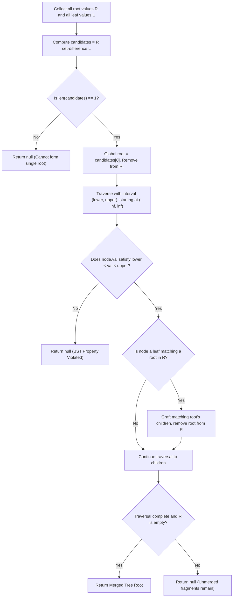

# Guided Example: Merge BSTs to Create Single BST

We trace root-to-leaf topological matching, bounded interval grafting, and BST validity verification on representative tree collections:

- **Primary Input:** `trees = [[[2, 1]], [[3, 2, 5]], [[5, 4]]]`
- **Required Output:** `[3, 2, 5, 1, null, 4]` (Single valid BST with root 3)
- **Violation Input:** `trees = [[[5, 3, 8]], [[3, 2, 6]]]`
- **Required Output:** `null` (Violates global BST invariant)

This instance demonstrates identifying the unique global root via in-degree analysis on tree node values, grafting subtrees onto matching leaf values, propagating valid value intervals $(\text{lower}, \text{upper})$, and detecting range violations and unmerged forest fragments.

---

## 1. Instance & Teaching Goal

We are given $n$ binary search trees (BSTs), where each tree consists of at most 3 nodes (a root and at most two children). In one operation, we can choose two trees where a leaf in the first tree has the same value as the root of the second tree, and replace the leaf with the entire second tree. We must determine if all $n$ trees can be merged into a single, valid BST containing all nodes.

For `trees = [[[2, 1]], [[3, 2, 5]], [[5, 4]]]`:
- Tree 1: Root `2`, left leaf `1`.
- Tree 2: Root `3`, left leaf `2`, right leaf `5`.
- Tree 3: Root `5`, left leaf `4`.
- Leaf values present across all trees: $\{1, 2, 4, 5\}$.
- Root values: $\{2, 3, 5\}$.
- Root `3` does not appear as a leaf in any tree. Roots `2` and `5` appear as leaves in Tree 2.
- Candidate global root: Tree 2 (root `3`).
- Graft Tree 1 (root `2`) onto leaf `2` of Tree 2.
- Graft Tree 3 (root `5`) onto leaf `5` of Tree 2.
- Merged tree: Root `3`, left subtree rooted at `2` with child `1`, right subtree rooted at `5` with child `4`.
- In-order traversal of merged tree: $[1, 2, 3, 4, 5]$ (strictly increasing).
- All 3 trees are consumed. Valid BST created.

The teaching goal is to understand **topological tree assembly and global BST interval validation**:
1. Applying the in-degree theorem: In any merged tree of $n$ components, exactly $n - 1$ roots must be absorbed into leaves, leaving exactly 1 unique global root.
2. In-situ grafting: Replacing leaves with matching root structures in $\mathcal{O}(1)$ time using hash table lookups.
3. Propagating validity intervals: Verifying that every node satisfies $\text{lower} < \text{node.val} < \text{upper}$.
4. Detecting cycles and disconnected components by ensuring all $n$ trees are emptied from the lookup table.

---

## 2. Conceptual Foundation & Invariants

### BST Grafting & Global Root Invariant Theorem

> **BST Grafting & Global Root Invariant Theorem.**
> 1. *Global Root Uniqueness:* Let $\mathcal{R} = \{\text{tree.val} \mid \text{tree} \in trees\}$ be the set of root values and $\mathcal{L} = \{\text{leaf.val}\}$ be the set of all leaf values across all trees. A valid single merged tree exists only if:
>    $$|\mathcal{R} \setminus \mathcal{L}| = 1$$
>    The unique element $r^* \in \mathcal{R} \setminus \mathcal{L}$ is the only possible root of the final tree. If $|\mathcal{R} \setminus \mathcal{L}| \neq 1$, either multiple disjoint trees exist or a directed cycle of dependencies prevents a single root.
> 2. *Interval-Bounded Grafting Invariant:* When traversing from the global root $r^*$ initialized with allowable range $(-\infty, \infty)$, every node $u$ must satisfy:
>    $$\text{lower}(u) < u.\text{val} < \text{upper}(u)$$
>    - When moving to left child: $(\text{lower}, \text{upper}) \leftarrow (\text{lower}, u.\text{val})$.
>    - When moving to right child: $(\text{lower}, \text{upper}) \leftarrow (u.\text{val}, \text{upper})$.
> 3. *Leaf-Grafting Equivalence:* If an active leaf node $u$ has $u.\text{val} \in \mathcal{R}$, we replace $u$'s null children with the children of the matching root and remove $u.\text{val}$ from $\mathcal{R}$.
> 4. *Forest Exhaustion:* The merged tree is complete and fully connected if and only if $\mathcal{R}$ is completely exhausted ($|\mathcal{R}| = 0$) and no interval violation is detected.

---

## 3. Step-by-Step Worked Execution

---

### Execution Trace 1: Primary Valid Instance

#### Step 1: Root and Leaf Categorization
- Tree 1: Root `2`, Leaves `[1]`.
- Tree 2: Root `3`, Leaves `[2, 5]`.
- Tree 3: Root `5`, Leaves `[4]`.
- $\mathcal{R} = \{2, 3, 5\}$.
- $\mathcal{L} = \{1, 2, 4, 5\}$.
- Candidates: $\mathcal{R} \setminus \mathcal{L} = \{3\}$.
- Exactly 1 candidate found: Root `3`. Remove `3` from roots map: $\mathcal{R}_{\text{rem}} = \{2, 5\}$.

#### Step 2: Initialize Traversal from Root 3
- Stack: `[(node(3), -inf, inf)]`.

#### Step 3: Process Root 3
- Check interval: $-\infty < 3 < \infty$ (Valid).
- Node 3 has children: left child `2`, right child `5`.
- Push right child `5` with interval $(3, \infty)$.
- Push left child `2` with interval $(-\infty, 3)$.

#### Step 4: Process Node 2 with Interval $(-\infty, 3)$
- Check interval: $-\infty < 2 < 3$ (Valid).
- Node 2 is currently a leaf in Tree 2 and $2 \in \mathcal{R}_{\text{rem}}$.
- Graft Tree 1 onto node 2:
  - Node 2 gains left child `1` (from Tree 1).
  - Remove 2 from roots: $\mathcal{R}_{\text{rem}} = \{5\}$.
- Push left child `1` with interval $(-\infty, 2)$.

#### Step 5: Process Node 1 with Interval $(-\infty, 2)$
- Check interval: $-\infty < 1 < 2$ (Valid).
- Node 1 is a leaf, $1 \notin \mathcal{R}_{\text{rem}}$. No graft.

#### Step 6: Process Node 5 with Interval $(3, \infty)$
- Check interval: $3 < 5 < \infty$ (Valid).
- Node 5 is a leaf and $5 \in \mathcal{R}_{\text{rem}}$.
- Graft Tree 3 onto node 5:
  - Node 5 gains left child `4` (from Tree 3).
  - Remove 5 from roots: $\mathcal{R}_{\text{rem}} = \emptyset$.
- Push left child `4` with interval $(3, 5)$.

#### Step 7: Process Node 4 with Interval $(3, 5)$
- Check interval: $3 < 4 < 5$ (Valid).
- Leaf node, no further grafts.

#### Step 8: Final Validation
- Stack empty.
- Remaining roots: $\mathcal{R}_{\text{rem}} = \emptyset$ (All 3 trees consumed).
- Result: Return valid merged tree with root **3**.

---

### Execution Trace 2: Subtree Range Violation (`trees = [[[5, 3, 8]], [[3, 2, 6]]]`)

- Tree 1: Root `5`, leaves `[3, 8]`.
- Tree 2: Root `3`, leaves `[2, 6]`.
- $\mathcal{R} = \{5, 3\}, \mathcal{L} = \{3, 8, 2, 6\}$.
- Candidate: $\mathcal{R} \setminus \mathcal{L} = \{5\}$.
- Root `5` has left child `3` with interval $(-\infty, 5)$.
- At node `3`: $3 \in \mathcal{R}$. Graft Tree 2 onto node 3:
  - Node 3 acquires right child `6`.
  - Propagated interval for right child of 3: $(3, 5)$.
- Inspect right child `6`:
  - Required interval: $3 < 6 < 5$.
  - Evaluation: $6 < 5$ is **False**!
  - Node 6 in the left subtree of 5 violates the fundamental BST invariant.
- Immediate Return: **null**.

---

## 4. Complete Execution Trace

We trace component tracking for the primary instance:

| Processing Phase | Node Inspected | Allowable Range $(\text{lower}, \text{upper})$ | In Range? | Leaf Matching in $\mathcal{R}$? | Graft Action Taken | Remaining Roots in $\mathcal{R}$ |
|---|---|---|---|---|---|---|
| Init | `3` | $(-\infty, \infty)$ | Yes | No (Internal) | Seed global root | $\{2, 5\}$ |
| Step 1 | `2` | $(-\infty, 3)$ | Yes | **Yes** ($2 \in \mathcal{R}$) | Attach left child `1` | $\{5\}$ |
| Step 2 | `1` | $(-\infty, 2)$ | Yes | No | Terminal leaf | $\{5\}$ |
| Step 3 | `5` | $(3, \infty)$ | Yes | **Yes** ($5 \in \mathcal{R}$) | Attach left child `4` | $\emptyset$ |
| Step 4 | `4` | $(3, 5)$ | Yes | No | Terminal leaf | $\emptyset$ |

We compare candidate root outcomes across test cases:

| Input Trees | Distinct Roots $\mathcal{R}$ | Distinct Leaves $\mathcal{L}$ | $\mathcal{R} \setminus \mathcal{L}$ | Grafting Outcome | Final Status |
|---|---|---|---|---|---|
| `[2,1], [3,2,5], [5,4]` | $\{2, 3, 5\}$ | $\{1, 2, 4, 5\}$ | $\{3\}$ (Size 1) | All intervals valid | **Valid BST (Root 3)** |
| `[5,3,8], [3,2,6]` | $\{5, 3\}$ | $\{2, 3, 6, 8\}$ | $\{5\}$ (Size 1) | Child 6 exceeds upper bound 5 | **Invalid (null)** |
| `[2,1,3], [3,2]` | $\{2, 3\}$ | $\{1, 2, 3\}$ | $\emptyset$ (Cycle) | No candidate root | **Invalid (null)** |

---

## 5. Algorithmic Correctness

**Soundness.** A tree is a valid BST if and only if every node's value falls strictly between the ancestor-imposed bounds $(\text{lower}, \text{upper})$. By verifying this inequality for every node (including grafted descendants) and verifying that all input trees are consumed, the procedure guarantees that the output structure is a connected, cycle-free, strictly increasing BST.

**Completeness.** Any valid merging must possess exactly one root that was not grafted into a leaf. If there are zero or multiple such roots, no single tree can be formed. By testing the unique candidate root and exploring all required grafts deterministically, all feasible merger plans are examined without omitting any valid solution.

---

## 6. Traps This Instance Exposes

- **Local vs. Global BST Property:** Each input tree is locally a BST, but their union may fail globally (e.g. Tree 2 having child `6` placed under the left subtree of `5`). Propagating $(\text{lower}, \text{upper})$ bounds from the root downward is essential to catch global range violations.
- **Disconnected Forests / Cycles:** If two trees form a mutual dependency cycle (e.g. root A has leaf B, root B has leaf A), neither root is in $\mathcal{R} \setminus \mathcal{L}$. Even if a valid BST is formed from a subset of trees, failing to check `len(roots) == 0` at the end would falsely accept disconnected leftover trees.
- **Duplicate Leaf Values:** If two different trees have a leaf with the same value $v$, grafting root $v$ into one leaf leaves the other leaf unfulfilled, creating duplicate values in the BST. Checking unique root consumption ensures structural integrity.

---

## 7. Complexity Derivation

- **Time Complexity:** $\mathcal{O}(N)$, where $N$ is the total number of nodes across all $n$ trees (with $N \le 3n$). Collecting roots and leaves takes $\mathcal{O}(N)$ time, and the depth-first traversal visits each node at most once.
- **Auxiliary Space Complexity:** $\mathcal{O}(N)$ to maintain the hash map of roots and the traversal recursion/stack buffer.