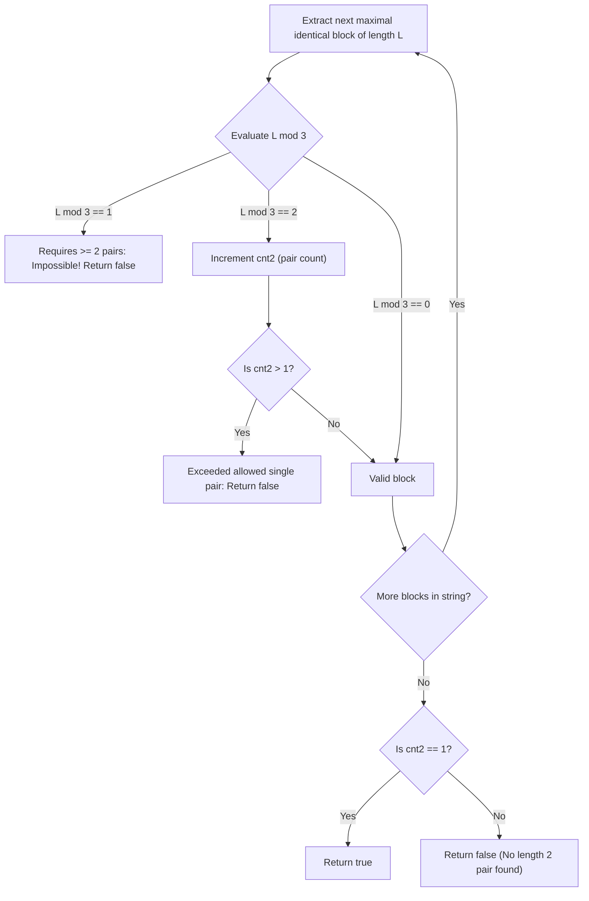

# Guided Example: Check if String Is Decomposable Into Value-Equal Substrings

We trace run-length grouping, modular partition constraints, and exact single-pair enforcement on representative digit strings:

- **Primary Input:** `s = "00011111222"`
- **Required Output:** `true`
- **Zero-Pair Input (Missing Length 2):** `s = "000111000"`
- **Required Output:** `false`
- **Invalid Remainder Input:** `s = "01110"`
- **Required Output:** `false`

This instance demonstrates decomposing homogeneous run-length blocks into triplets and pairs, deriving the algebraic impossibility of $L \equiv 1 \pmod 3$, and verifying the global condition that exactly one length-2 block exists.

---

## 1. Instance & Teaching Goal

A string is defined as **decomposable** into value-equal substrings if it can be partitioned into contiguous non-empty substrings such that:
1. **Exactly one** substring has length $2$ and consists of identical characters.
2. **All other** substrings have length $3$ and consist of identical characters.

For `s = "00011111222"`:
- Run-length blocks of identical adjacent characters:
  - Block 1: `"000"`, character `'0'`, length $L = 3$.
  - Block 2: `"11111"`, character `'1'`, length $L = 5$.
  - Block 3: `"222"`, character `'2'`, length $L = 3$.
- Block 1 ($L = 3$): Decomposes into one triplet: `"000"` ($3 \times 1$). Contributes zero 2s.
- Block 2 ($L = 5$): Decomposes into one triplet and one pair: `"111"` and `"11"` ($3 \times 1 + 2$). Contributes exactly one 2.
- Block 3 ($L = 3$): Decomposes into one triplet: `"222"` ($3 \times 1$). Contributes zero 2s.
- Total length-2 substrings across all blocks: exactly **1**.
- Result: **true**.

The teaching goal is to understand **isolated run-length partitioning and Frobenius coin constraints**:
1. Why different adjacent characters cannot share a substring, isolating the partition problem to each maximal homogeneous block.
2. Characterizing block length modulo 3:
   - $L \equiv 0 \pmod 3$: Partitionable purely into triplets ($3k$).
   - $L \equiv 2 \pmod 3$: Requires at least one pair ($3k + 2$).
   - $L \equiv 1 \pmod 3$: Requires at least two pairs ($3(k - 1) + 2 + 2$), which immediately violates the single-pair rule.
3. Establishing the necessary and sufficient condition: zero blocks with $L \equiv 1 \pmod 3$, and exactly one block with $L \equiv 2 \pmod 3$.

---

## 2. Conceptual Foundation & Invariants

### Run-Length Modular Decomposition Theorem

> **Run-Length Modular Decomposition Theorem.**
> 1. *Block Isolation Invariant:* Because every valid substring must contain identical characters, a valid substring cannot cross the boundary between two different characters. Thus, any valid decomposition of $s$ induces an independent decomposition for each maximal run-length block $B_i$ of length $L_i$.
> 2. *Integer Representation by $\{2, 3\}$:* Each block of length $L$ must be expressed as:
>    $$L = 3 \cdot a + 2 \cdot b \quad (a \ge 0, b \ge 0)$$
>    where $\sum b$ over all blocks must equal exactly $1$.
> 3. *Modular Residue Classification:*
>    - **Case $L \equiv 0 \pmod 3$:** $L = 3k$. Can be formed with $b = 0$ (all triplets).
>    - **Case $L \equiv 2 \pmod 3$:** $L = 3k + 2$. Can be formed with $b = 1$ (one pair, $k$ triplets).
>    - **Case $L \equiv 1 \pmod 3$:** To satisfy $3a + 2b \equiv 1 \pmod 3$, we must have $2b \equiv 1 \pmod 3 \implies -b \equiv 1 \pmod 3 \implies b \equiv 2 \pmod 3$. Thus $b \ge 2$, requiring at least two pairs within this single block.
> 4. *Global Decidability Criterion:* A string $s$ is decomposable if and only if:
>    - No block satisfies $L \equiv 1 \pmod 3$.
>    - Exactly one block satisfies $L \equiv 2 \pmod 3$.

---

## 3. Step-by-Step Worked Execution

---

### Primary Instance: `s = "00011111222"`

Length $n = 11$. Initialize pair counter $\text{cnt2} = 0$.

#### Block 1: Indices $[0 \dots 2]$ (`"000"`)
- Character: `'0'`.
- Length: $L_1 = 3 - 0 = 3$.
- Check residue: $3 \bmod 3 = 0$.
- Contribution to $\text{cnt2}$: $0$.
- Running pair count: $\text{cnt2} = 0$.

#### Block 2: Indices $[3 \dots 7]$ (`"11111"`)
- Character: `'1'`.
- Length: $L_2 = 8 - 3 = 5$.
- Check residue: $5 \bmod 3 = 2$.
- Remainder is 2: Requires one length-2 pair.
- Increment pair count: $\text{cnt2} = 0 + 1 = 1$.
- Check excess: $\text{cnt2} = 1 \le 1$ (Allowed).

#### Block 3: Indices $[8 \dots 10]$ (`"222"`)
- Character: `'2'`.
- Length: $L_3 = 11 - 8 = 3$.
- Check residue: $3 \bmod 3 = 0$.
- Contribution to $\text{cnt2}$: $0$.
- Running pair count: $\text{cnt2} = 1$.

#### Final Verification
- Entire string processed.
- Final pair count: $\text{cnt2} = 1$.
- Condition $\text{cnt2} == 1$ holds.
- Final Output: **true**.

---

### Secondary Instance: `s = "000111000"`

- Block 1: `"000"`, $L = 3 \implies 3 \bmod 3 = 0 \implies \text{cnt2} = 0$.
- Block 2: `"111"`, $L = 3 \implies 3 \bmod 3 = 0 \implies \text{cnt2} = 0$.
- Block 3: `"000"`, $L = 3 \implies 3 \bmod 3 = 0 \implies \text{cnt2} = 0$.
- Termination: String consumed, but $\text{cnt2} = 0 \neq 1$. No length-2 pair exists.
- Final Output: **false**.

---

### Infeasible Remainder Instance: `s = "01110"`

- Block 1: `"0"`, $L = 1 \implies 1 \bmod 3 = 1$.
- Immediately triggers rule: $L \equiv 1 \pmod 3$ requires at least two pairs.
- Early exit: **false**.

---

## 4. Complete Execution Trace

We trace block evaluations across different input strings:

| String $s$ | Block Substring | Character | Block Length $L$ | $L \bmod 3$ | Effect on Pair Count | Running $\text{cnt2}$ |
|---|---|---|---|---|---|---|
| `"00011111222"` | `"000"` | `'0'` | 3 | 0 | None ($+0$) | 0 |
| `"00011111222"` | `"11111"` | `'1'` | 5 | **2** | Single pair ($+1$) | **1** |
| `"00011111222"` | `"222"` | `'2'` | 3 | 0 | None ($+0$) | 1 |
| `"000111000"` | `"000"`, `"111"`, `"000"` | Various | 3, 3, 3 | 0, 0, 0 | None ($+0$) | 0 (Fails: no pair) |
| `"01110"` | `"0"` | `'0'` | 1 | **1** | Requires $\ge 2$ pairs | Early exit (`false`) |

We summarize the mathematical feasibility of individual block lengths:

| Block Length $L$ | $L \bmod 3$ | Minimal Form $3a + 2b$ | Pairs $b$ Required | Feasible within 1-Pair Budget? |
|---|---|---|---|---|
| 1 | 1 | Cannot be represented ($1 < 2$) | $\ge 2$ ($2 \times 2 = 4 > 1$) | **Never** |
| 2 | 2 | $3(0) + 2(1)$ | 1 | Yes (Consumes budget) |
| 3 | 0 | $3(1) + 2(0)$ | 0 | Yes (Zero pairs used) |
| 4 | 1 | $3(0) + 2(2)$ | 2 | **Never** (Exceeds budget) |
| 5 | 2 | $3(1) + 2(1)$ | 1 | Yes (Consumes budget) |
| 6 | 0 | $3(2) + 2(0)$ | 0 | Yes (Zero pairs used) |

---

## 5. Algorithmic Correctness

**Soundness.** Since characters differ across block boundaries, no valid substring can span multiple blocks. Therefore, the global counts of length-2 and length-3 substrings equal the sums of the local counts within individual blocks. A block of length $L$ can contribute $b$ length-2 substrings if and only if $L - 2b$ is a non-negative multiple of 3. If $L \equiv 1 \pmod 3$, $b \ge 2$, which immediately makes the global requirement $\sum b = 1$ impossible. If $L \equiv 2 \pmod 3$, $b$ must be at least 1. Requiring $\text{cnt2} == 1$ at termination guarantees exactly one length-2 substring exists.

**Completeness.** Two-pointer traversal parses the string into maximal homogeneous blocks in $\mathcal{O}(n)$ time. By testing all blocks against the necessary modular conditions, any decomposable string is accepted and any non-decomposable string is rejected.

---

## 6. Traps This Instance Exposes

- **Remainder 1 Block Trap:** An isolated character ($L = 1$) or block of length 4 cannot contribute a single pair. For $L = 4$, $4 = 2 + 2$, which forces two pairs. For $L = 1$, no partition into sizes 2 and 3 exists. Checking `(L % 3) == 1` catches both cases.
- **Multiple Remainder 2 Blocks:** Two blocks of length 2 or 5 would produce two length-2 substrings, violating the "exactly one" constraint. Tracking $\text{cnt2} > 1$ terminates early.
- **Complete String Consumed Without Pairs:** If all blocks have length divisible by 3 (e.g. `"000111"`), all substrings have length 3, leaving zero substrings of length 2. The final check `cnt2 == 1` correctly rejects this case.

---

## 7. Complexity Derivation

- **Time Complexity:** $\mathcal{O}(n)$, where $n$ is the length of `s`. The two-pointer scan visits each character exactly once to determine block lengths.
- **Auxiliary Space Complexity:** $\mathcal{O}(1)$. Only scalar indices ($i, j$) and a single integer counter ($\text{cnt2}$) are maintained.
