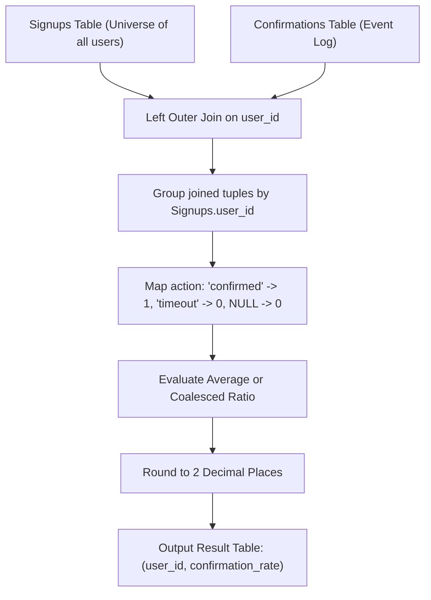

# Guided Example: Confirmation Rate

We trace relational left outer joins, indicator aggregation, and null-coalesced ratio evaluation on representative user confirmation datasets:

- **Primary Input:** `Signups` table with users $\{3, 7, 2, 6\}$ and `Confirmations` log
- **Required Output:** Confirmation rates: user 6 $\to 0.00$, user 3 $\to 0.00$, user 7 $\to 1.00$, user 2 $\to 0.50$

This instance demonstrates joining an entity dimension table with an optional activity fact table, handling users with zero activity via left outer joins without row loss, and computing conditional averages rounded to two decimal places.

---

## 1. Instance & Teaching Goal

We are given two relational tables:
1. `Signups`: Contains `user_id` (primary key) and `time_stamp`.
2. `Confirmations`: Contains `(user_id, time_stamp)` as primary key and an `action` enum (`'confirmed'` or `'timeout'`).

The **confirmation rate** of a user is defined as:

$$\text{confirmation\_rate} = \frac{\text{count of confirmed messages}}{\text{total count of requested confirmation messages}}$$

If a user requested zero confirmation messages, their rate is defined to be $0.00$. All rates must be rounded to two decimal places.

For the representative instance:
- User 6: Signed up, but has 0 records in `Confirmations`. Defined rate: **0.00**.
- User 3: Made 2 confirmation requests, both `'timeout'`. Ratio: $0 / 2 =$ **0.00**.
- User 7: Made 3 requests, all 3 `'confirmed'`. Ratio: $3 / 3 =$ **1.00**.
- User 2: Made 2 requests: 1 `'confirmed'`, 1 `'timeout'`. Ratio: $1 / 2 =$ **0.50**.

The teaching goal is to understand **left outer joins and conditional aggregation over optional event streams**:
1. Preventing inner join data loss: Why an inner join drops user 6 entirely.
2. Formulating indicator summation: Mapping `'confirmed'` to 1 and `'timeout'` or NULL to 0.
3. Handling division by zero: Coalescing empty or null counts to a default rate of 0.
4. Formatting precision: Rounding results to 2 decimal digits.

---

## 2. Conceptual Foundation & Invariants

### Relational Left-Join Rate Preservation Theorem

> **Relational Left-Join Rate Preservation Theorem.**
> 1. *Universe Preservation via Left Join:* Let $\mathcal{U}$ be the set of all signed-up users in `Signups`. An inner join $\text{Signups} \bowtie \text{Confirmations}$ retains only users $\mathcal{U}_{\text{active}} \subseteq \mathcal{U}$ who generated at least one confirmation request. To retain all registered users $\mathcal{U}$, we compute the Left Outer Join:
>    $$\mathcal{T} = \text{Signups} \leftouterjoin_{\text{Signups.user\_id} = \text{Confirmations.user\_id}} \text{Confirmations}$$
>    For any user $u \in \mathcal{U} \setminus \mathcal{U}_{\text{active}}$, $\mathcal{T}$ preserves a single row with null attributes for `Confirmations.action`.
> 2. *Conditional Indicator Projection:* Define the binary confirmation indicator $\mathbb{I}_{\text{conf}}$ for each joined tuple $t \in \mathcal{T}$:
>    $$\mathbb{I}_{\text{conf}}(t) = \begin{cases} 1 & \text{if } t.\text{action} = \text{'confirmed'} \\ 0 & \text{otherwise} \end{cases}$$
> 3. *Partitioned Rate Aggregation:* For each user group $u \in \mathcal{U}$:
>    - Let $N(u)$ be the number of confirmation requests logged.
>    - If $N(u) = 0$, $t.\text{action}$ is null, and the rate is defined as $0.00$.
>    - If $N(u) > 0$, the rate is $\frac{1}{N(u)} \sum_{t \in \mathcal{T}_u} \mathbb{I}_{\text{conf}}(t)$.
>    - Combining both cases using arithmetic average:
>      $$\text{rate}(u) = \text{round}\left(\text{avg}(\mathbb{I}_{\text{conf}}), 2\right)$$

---

## 3. Step-by-Step Worked Execution

We trace the join, grouping, and rate computation for all 4 users:

---

### Step 1: Compute Left Outer Join
Joining `Signups` with `Confirmations` on `user_id`:
- User 3 joins with 2 rows (`timeout`, `timeout`).
- User 7 joins with 3 rows (`confirmed`, `confirmed`, `confirmed`).
- User 2 joins with 2 rows (`confirmed`, `timeout`).
- User 6 joins with 1 row with `action = NULL`.

Total joined relation $\mathcal{T}$ contains $2 + 3 + 2 + 1 = 8$ rows.

---

### Step 2: Group by `user_id` and Evaluate Indicator

#### Group User 6 (No Requests)
- Joined rows: 1 row with `action = NULL`.
- Total confirmation requests: $0$.
- Confirmed requests: $0$.
- Confirmation rate: $\text{coalesce}(0 / 0, 0) = 0.00$.

#### Group User 3 (All Timeouts)
- Joined rows: 2 rows with `action = 'timeout'`.
- Indicator values: $[0, 0]$.
- Total requests: $2$.
- Confirmed requests: $0 + 0 = 0$.
- Confirmation rate: $0 / 2 = 0.00$.

#### Group User 7 (All Confirmed)
- Joined rows: 3 rows with `action = 'confirmed'`.
- Indicator values: $[1, 1, 1]$.
- Total requests: $3$.
- Confirmed requests: $1 + 1 + 1 = 3$.
- Confirmation rate: $3 / 3 = 1.00$.

#### Group User 2 (Mixed)
- Joined rows: 2 rows (`confirmed`, `timeout`).
- Indicator values: $[1, 0]$.
- Total requests: $2$.
- Confirmed requests: $1 + 0 = 1$.
- Confirmation rate: $1 / 2 = 0.50$.

---

### Step 3: Format and Round Output
Round each computed rate to 2 decimal places:
- User 6: `0.00`
- User 3: `0.00`
- User 7: `1.00`
- User 2: `0.50`

---

## 4. Complete Execution Trace

We trace the tuple values in the joined relation:

| `user_id` | Signup Timestamp | Confirmation Timestamp | `action` | Indicator $\mathbb{I}_{\text{conf}}$ | Is Valid Request? |
|---|---|---|---|---|---|
| 3 | `2020-03-21 10:16:13` | `2021-01-06 03:30:46` | `timeout` | 0 | Yes |
| 3 | `2020-03-21 10:16:13` | `2021-07-14 14:00:00` | `timeout` | 0 | Yes |
| 7 | `2020-01-04 13:57:59` | `2021-06-12 11:57:29` | `confirmed` | 1 | Yes |
| 7 | `2020-01-04 13:57:59` | `2021-06-13 12:58:28` | `confirmed` | 1 | Yes |
| 7 | `2020-01-04 13:57:59` | `2021-06-14 13:59:27` | `confirmed` | 1 | Yes |
| 2 | `2020-07-29 23:09:44` | `2021-01-22 00:00:00` | `confirmed` | 1 | Yes |
| 2 | `2020-07-29 23:09:44` | `2021-02-28 23:59:59` | `timeout` | 0 | Yes |
| 6 | `2020-12-09 10:39:37` | `NULL` | `NULL` | 0 | **No (0 requests)** |

We summarize the grouped aggregations per user:

| User ID | Total Requests Count | Confirmed Count | Raw Ratio Formula | Unrounded Ratio | Final Confirmation Rate |
|---|---|---|---|---|---|
| 6 | 0 | 0 | Defined for 0 requests | 0.0 | **0.00** |
| 3 | 2 | 0 | $0 / 2$ | 0.0 | **0.00** |
| 7 | 3 | 3 | $3 / 3$ | 1.0 | **1.00** |
| 2 | 2 | 1 | $1 / 2$ | 0.5 | **0.50** |

---

## 5. Algorithmic Correctness

**Soundness.** For any user with one or more confirmation requests, the confirmation rate is mathematically the sample mean of the binary indicator $\mathbb{I}_{\text{action} = \text{'confirmed'}}$. For any user with zero confirmation requests, preserving their presence via the left outer join and coalescing the null average to 0 strictly satisfies the problem specification. Rounding the result to 2 decimals preserves required numerical precision.

**Completeness.** Grouping by the unique primary key `Signups.user_id` guarantees that every user in the `Signups` table is represented exactly once in the output table, leaving no omitted users.

---

## 6. Traps This Instance Exposes

- **Inner Join Elimination Trap:** Using an inner join instead of a left outer join removes users who never requested confirmation messages (such as user 6). The specification explicitly mandates including users with zero requests and reporting a rate of `0.00`.
- **Division by Zero:** Computing $\text{sum}(\text{confirmed}) / \text{count}(*)$ without coalescing or handling empty sets causes division by zero or yields NULL instead of `0.00`.
- **Case Sensitivity of Enum:** The enum values `'confirmed'` and `'timeout'` are lowercase. Matching against `'Confirmed'` would treat all records as 0.

---

## 7. Complexity Derivation

- **Time Complexity:** $\mathcal{O}(S \log S + C \log C)$, where $S$ is the number of rows in `Signups` and $C$ is the number of rows in `Confirmations`. Joining indexed tables and grouping by `user_id` runs in quasi-linear time using hash join or sort-merge join.
- **Auxiliary Space Complexity:** $\mathcal{O}(S + C)$ intermediate memory for the hash join table and aggregation hash map.
