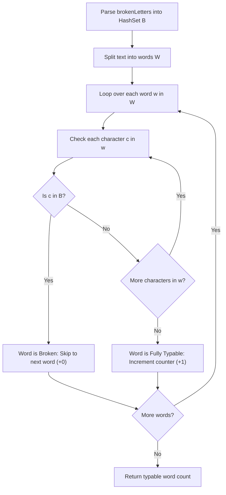

# Guided Example: Maximum Number of Words You Can Type

We trace string tokenization, set-membership filtering, and boolean predicate evaluation on representative keyboard typing instances:

- **Primary Input:** `text = "hello world"`, `brokenLetters = "ad"`
- **Required Output:** `1`
- **Multiple Match Input:** `text = "leet code"`, `brokenLetters = "lt"`
- **Required Output:** `1`
- **Total Block Input:** `text = "leet code"`, `brokenLetters = "e"`
- **Required Output:** `0`

This instance demonstrates tokenizing text into word sequences, storing broken characters in a constant-time hash set $\mathcal{B}$, verifying the universal non-membership condition $\forall c \in w, c \notin \mathcal{B}$, and accumulating valid word counts in $\mathcal{O}(|text| + |brokenLetters|)$ time.

---

## 1. Instance & Teaching Goal

A keyboard has some broken letter keys. We are given a string `text` of space-separated words and a string `brokenLetters` of distinct malfunctioning lowercase letters. A word can be fully typed if and only if none of its constituent characters are broken. We return the count of fully typable words.

For `text = "hello world"` with `brokenLetters = "ad"`:
- Broken set: $\mathcal{B} = \{\text{'a'}, \text{'d'}\}$.
- Words extracted by splitting on spaces: `["hello", "world"]`.
- Word 1: `"hello"`
  - Characters: `{'h', 'e', 'l', 'o'}`.
  - Intersect with $\mathcal{B}$: $\{\text{'h'}, \text{'e'}, \text{'l'}, \text{'o'}\} \cap \{\text{'a'}, \text{'d'}\} = \emptyset$.
  - All characters are functional $\implies$ Typable. (Count = 1).
- Word 2: `"world"`
  - Characters: `{'w', 'o', 'r', 'l', 'd'}`.
  - Intersect with $\mathcal{B}$: $\{\text{'w'}, \text{'o'}, \text{'r'}, \text{'l'}, \text{'d'}\} \cap \{\text{'a'}, \text{'d'}\} = \{\text{'d'}\} \neq \emptyset$.
  - Character `'d'` is broken $\implies$ Untypable. (Count = 1).
- Final count of typable words: **1**.

The teaching goal is to understand **predicate filtering over token streams**:
1. Mapping broken characters into a hash table or bitmask for $\mathcal{O}(1)$ query time.
2. Formulating word typability as disjointness between the word's character set and the broken character set.
3. Linear scanning through string tokens with early termination upon encountering the first broken key in a word.

---

## 2. Conceptual Foundation & Invariants

### Token Disjointness Invariant Theorem

> **Token Disjointness Invariant Theorem.**
> 1. *Character Set Disjointness:* Let $\mathcal{B} \subset \Sigma$ be the set of broken characters. For any word $w = (c_0, c_1, \dots, c_{k-1})$, define its character support as $\text{chars}(w) = \{c_0, \dots, c_{k-1}\}$. The word $w$ is fully typable if and only if:
>    $$\text{chars}(w) \cap \mathcal{B} = \emptyset \iff \bigwedge_{j=0}^{k-1} (c_j \notin \mathcal{B})$$
> 2. *Independence of Words:* Because words are delimited by whitespace and typing a word is a self-contained operation, the typability of word $w_i$ is completely independent of word $w_j$ ($i \neq j$).
> 3. *Additive Accumulation:* Let $\mathcal{W}$ be the sequence of words in `text`. The total number of typable words is the sum of the binary indicator:
>    $$\text{Total} = \sum_{w \in \mathcal{W}} \mathbb{I}(\text{chars}(w) \cap \mathcal{B} = \emptyset)$$
> 4. *Complexity Bound:* Checking membership in a hash set $\mathcal{B}$ of size $\le 26$ requires $\mathcal{O}(1)$ time. Examining every character in `text` exactly once guarantees linear $\mathcal{O}(N)$ execution time.

---

## 3. Step-by-Step Worked Execution

We trace `text = "hello world"` with `brokenLetters = "ad"`:

---

### Step 1: Precompute Broken Set
- String `brokenLetters = "ad"` converted to set:
  $$\mathcal{B} = \{\text{'a'}, \text{'d'}\}$$

---

### Step 2: Tokenize Text
- Splitting `"hello world"` by whitespace yields two tokens:
  1. $w_1 = \text{"hello"}$
  2. $w_2 = \text{"world"}$
- Initialize counter: $\text{ans} = 0$.

---

### Step 3: Evaluate Token 1 (`"hello"`)
- Character 0: `'h' \notin \mathcal{B}` (True)
- Character 1: `'e' \notin \mathcal{B}` (True)
- Character 2: `'l' \notin \mathcal{B}` (True)
- Character 3: `'l' \notin \mathcal{B}` (True)
- Character 4: `'o' \notin \mathcal{B}` (True)
- All characters functional. Word is typable.
- Increment counter: $\text{ans} = 0 + 1 = 1$.

---

### Step 4: Evaluate Token 2 (`"world"`)
- Character 0: `'w' \notin \mathcal{B}` (True)
- Character 1: `'o' \notin \mathcal{B}` (True)
- Character 2: `'r' \notin \mathcal{B}` (True)
- Character 3: `'l' \notin \mathcal{B}` (True)
- Character 4: `'d' \in \mathcal{B}` (False! Broken key `'d'` detected).
- Word cannot be typed. Early termination for this word.
- Counter remains: $\text{ans} = 1$.

---

### Step 5: Final Result
- All tokens evaluated.
- Output: **1**.

---

## 4. Complete Execution Trace

We trace character evaluations for each word in `text = "hello world"`:

| Word Index | Word Token | Character Tested | In Broken Set $\mathcal{B} = \{\text{'a'}, \text{'d'}\}$? | Can Word Be Typed? | Running Typable Count |
|---|---|---|---|---|---|
| 1 | `"hello"` | `'h'`, `'e'`, `'l'`, `'l'`, `'o'` | No broken letters | **Yes** | **1** |
| 2 | `"world"` | `'w'`, `'o'`, `'r'`, `'l'` | Functional | Testing | 1 |
| 2 | `"world"` | `'d'` | **Yes (Broken)** | **No** | 1 |

We compare typable word counts across sample configurations:

| Input Text | Broken Letters | Tokens Evaluated | Typable Words Found | Untypable Words | Output Count |
|---|---|---|---|---|---|
| `"hello world"` | `"ad"` | `["hello", "world"]` | `"hello"` | `"world"` (has `'d'`) | **1** |
| `"leet code"` | `"lt"` | `["leet", "code"]` | `"code"` | `"leet"` (has `'l'`, `'t'`) | **1** |
| `"leet code"` | `"e"` | `["leet", "code"]` | None | `"leet"`, `"code"` (both have `'e'`) | **0** |
| `"one two three"` | `""` | `["one", "two", "three"]` | All three | None | **3** |

---

## 5. Algorithmic Correctness

**Soundness.** A word is counted if and only if every character $c \in w$ is absent from $\mathcal{B}$. Because typing a word on a keyboard requires depressing each key in its spelling, any broken key present in the word prevents successful entry. The boolean check $\bigwedge_{c \in w} (c \notin \mathcal{B})$ exactly mirrors keyboard mechanics.

**Completeness.** Splitting on whitespace partitions the text into all constituent words. Inspecting every word and examining its characters ensures that every typable word is accounted for without omission.

---

## 6. Traps This Instance Exposes

- **Linear Lookup in Broken Letters:** Checking `c in brokenLetters` repeatedly using a string scan takes $\mathcal{O}(|\text{brokenLetters}|)$ per character. Converting `brokenLetters` into a hash set $\mathcal{B}$ guarantees $\mathcal{O}(1)$ lookups.
- **Empty Broken Letters:** If `brokenLetters = ""`, all words are typable. The set is empty, and every word passes without special-case logic.
- **Single Broken Key Multiple Occurrences:** A word with multiple broken letters (e.g. `"leet"` with broken `"lt"`) can be disqualified on the very first broken letter (`'l'`), allowing immediate short-circuiting.

---

## 7. Complexity Derivation

- **Time Complexity:** $\mathcal{O}(N + M)$, where $N = \text{len}(text)$ and $M = \text{len}(brokenLetters)$. Constructing the set of broken characters takes $\mathcal{O}(M)$ time, and iterating through all characters in `text` takes $\mathcal{O}(N)$ time.
- **Auxiliary Space Complexity:** $\mathcal{O}(|\Sigma|) = \mathcal{O}(1)$ auxiliary space to store the broken character set (at most 26 lowercase English letters).
