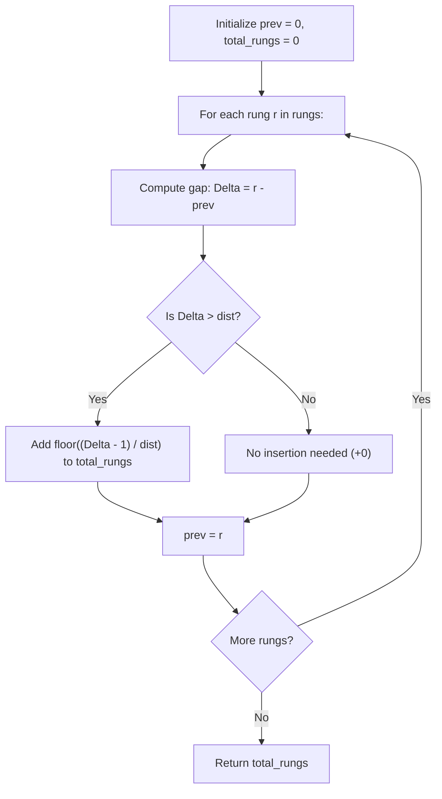

# Guided Example: Add Minimum Number of Rungs

We trace greedy jump intervals, gap discretization, and minimal rung placement on representative ladder climbing instances:

- **Primary Input:** `rungs = [1, 3, 5, 10]`, `dist = 2`
- **Required Output:** `2`
- **Ground Gap Input:** `rungs = [3, 4, 6, 7]`, `dist = 2`
- **Required Output:** `1`
- **Fully Reachable Input:** `rungs = [3, 6, 8, 10]`, `dist = 3`
- **Required Output:** `0`

This instance demonstrates analyzing distance gaps between consecutive ascending heights, establishing the exact quotient formula $\lfloor(\Delta - 1) / dist\rfloor$ for minimal intermediate support placement, and accumulating necessary insertions in $\mathcal{O}(N)$ time.

---

## 1. Instance & Teaching Goal

We climb a ladder starting at ground level (height $0$). We are given a strictly increasing integer array `rungs` representing existing rung heights, and an integer `dist` representing our maximum single upward reach.
- From height $h$, we can step to a rung at height $h'$ if and only if $h' - h \le dist$.
- We may insert new rungs at any positive integer height.
- We seek the **minimum** number of rungs required to ascend to the final rung.

For `rungs = [1, 3, 5, 10]` with `dist = 2`:
- Sequence of heights from ground: $[0, 1, 3, 5, 10]$.
- Gap 1: $0 \to 1$. Difference $\Delta = 1 \le 2 \implies 0$ rungs needed.
- Gap 2: $1 \to 3$. Difference $\Delta = 2 \le 2 \implies 0$ rungs needed.
- Gap 3: $3 \to 5$. Difference $\Delta = 2 \le 2 \implies 0$ rungs needed.
- Gap 4: $5 \to 10$. Difference $\Delta = 5 > 2$.
  - Maximum jump is 2. Stepping from 5 to 10 requires traversing a gap of 5.
  - Intermediate rungs can be placed at $5 + 2 = 7$ and $7 + 2 = 9$.
  - From 9, the final rung 10 is at distance $1 \le 2$, reachable in one step.
  - Total rungs added: **2**.

The teaching goal is to understand **greedy gap bridging and integer ceiling/floor duality**:
1. Recognizing that greedy placement at maximal stride $h + dist$ is strictly optimal for minimizing intermediate insertions.
2. Deriving the closed-form count of required insertions across an interval $[a, b]$: $\lfloor(b - a - 1) / dist\rfloor$.
3. Accounting for the implicit initial base position at height $0$.

---

## 2. Conceptual Foundation & Invariants

### Maximal Stride Gap Decomposition Theorem

> **Maximal Stride Gap Decomposition Theorem.**
> 1. *Independent Gap Additivity:* Because heights are strictly increasing and ascending requires traversing each interval $[r_{i-1}, r_i]$ in sequence, insertions inside one gap do not affect the minimum insertions required in any other disjoint gap. The total minimum insertions is the sum of local gap requirements:
>    $$\text{Total} = \sum_{i=1}^N \text{req}(r_{i-1}, r_i) \quad (\text{with } r_0 = 0)$$
> 2. *Greedy Stride Optimality:* To span a gap of length $\Delta = b - a$, each jump advances by at most $dist$. The minimum number of steps $S$ needed to cover distance $\Delta$ is:
>    $$S = \left\lceil \frac{\Delta}{dist} \right\rceil$$
> 3. *Intermediate Insertion Count:* A path consisting of $S$ steps utilizes $S - 1$ intermediate nodes. Therefore, the minimum number of rungs to insert is:
>    $$\text{req}(a, b) = S - 1 = \left\lceil \frac{\Delta}{dist} \right\rceil - 1 = \left\lfloor \frac{\Delta - 1}{dist} \right\rfloor = \left\lfloor \frac{b - a - 1}{dist} \right\rfloor$$
>    - If $\Delta \le dist$, $\Delta - 1 < dist \implies \lfloor(\Delta - 1) / dist\rfloor = 0$ (no rungs needed).
>    - If $\Delta$ is an exact multiple of $dist$ (e.g. $\Delta = 2 \cdot dist$), $\lfloor(2 \cdot dist - 1) / dist\rfloor = 1$ rung needed.
> 4. *Complexity:* Computing the formula for each of the $N$ adjacent intervals takes $\mathcal{O}(1)$ time, achieving $\mathcal{O}(N)$ overall runtime.

---

## 3. Step-by-Step Worked Execution

We trace `rungs = [1, 3, 5, 10]` with `dist = 2`:

---

### Step 1: Initialize Ground State
- Starting height: $\text{prev} = 0$.
- Running counter: $\text{total\_rungs} = 0$.

---

### Step 2: Gap 1 (Ground to Rung 1)
- Target: $r_1 = 1$.
- Gap: $\Delta = 1 - 0 = 1$.
- Evaluation: $\lfloor(1 - 1) / 2\rfloor = \lfloor 0 / 2 \rfloor = 0$.
- Rungs added: $+0$. Running total: $0$.
- Update position: $\text{prev} = 1$.

---

### Step 3: Gap 2 (Rung 1 to Rung 3)
- Target: $r_2 = 3$.
- Gap: $\Delta = 3 - 1 = 2$.
- Evaluation: $\lfloor(2 - 1) / 2\rfloor = \lfloor 1 / 2 \rfloor = 0$.
- Rungs added: $+0$. Running total: $0$.
- Update position: $\text{prev} = 3$.

---

### Step 4: Gap 3 (Rung 3 to Rung 5)
- Target: $r_3 = 5$.
- Gap: $\Delta = 5 - 3 = 2$.
- Evaluation: $\lfloor(2 - 1) / 2\rfloor = \lfloor 1 / 2 \rfloor = 0$.
- Rungs added: $+0$. Running total: $0$.
- Update position: $\text{prev} = 5$.

---

### Step 5: Gap 4 (Rung 5 to Rung 10)
- Target: $r_4 = 10$.
- Gap: $\Delta = 10 - 5 = 5$.
- Evaluation:
  $$\left\lfloor \frac{5 - 1}{2} \right\rfloor = \left\lfloor \frac{4}{2} \right\rfloor = 2$$
- Action: Insert 2 rungs (e.g. at heights 7 and 9).
- Rungs added: $+2$. Running total: $0 + 2 = 2$.
- Update position: $\text{prev} = 10$.

---

### Final Result
All rungs reached. Total rungs inserted: **2**.

---

## 4. Complete Execution Trace

We trace the step-by-step gap analysis for the primary instance:

| Gap Index | Start Height $a$ | End Height $b$ | Distance Gap $\Delta = b - a$ | Stride Limit `dist` | Formula $\lfloor(\Delta - 1)/dist\rfloor$ | Rungs Added | Cumulative Rungs |
|---|---|---|---|---|---|---|---|
| 1 | 0 (Ground) | 1 | 1 | 2 | $\lfloor 0 / 2 \rfloor = 0$ | 0 | 0 |
| 2 | 1 | 3 | 2 | 2 | $\lfloor 1 / 2 \rfloor = 0$ | 0 | 0 |
| 3 | 3 | 5 | 2 | 2 | $\lfloor 1 / 2 \rfloor = 0$ | 0 | 0 |
| 4 | 5 | 10 | 5 | 2 | $\lfloor 4 / 2 \rfloor = 2$ | 2 | **2** |

We compare calculations across multiple ladder configurations:

| Input Rungs | `dist` | Gaps Evaluated | Gaps Requiring Additions | Inserted Rung Locations | Total Rungs |
|---|---|---|---|---|---|
| `[1, 3, 5, 10]` | 2 | $[1, 2, 2, 5]$ | Gap $5 \to 10$ ($\Delta = 5$) | Heights 7, 9 | **2** |
| `[3, 4, 6, 7]` | 2 | $[3, 1, 2, 1]$ | Gap $0 \to 3$ ($\Delta = 3$) | Height 2 | **1** |
| `[3, 6, 8, 10]` | 3 | $[3, 3, 2, 2]$ | None ($\Delta \le 3$ for all) | None | **0** |
| `[5]` | 2 | $[5]$ | Gap $0 \to 5$ ($\Delta = 5$) | Heights 2, 4 | **2** |

---

## 5. Algorithmic Correctness

**Soundness.** Suppose a gap of length $\Delta$ exists between adjacent rungs. If we insert $k$ intermediate rungs, the gap is partitioned into $k + 1$ consecutive steps. To satisfy the maximum reach constraint, every step must have length at most $dist$. Thus, $(k + 1) \cdot dist \ge \Delta$, which implies $k + 1 \ge \lceil \Delta / dist \rceil \iff k \ge \lceil \Delta / dist \rceil - 1 = \lfloor (\Delta - 1) / dist \rfloor$. Inserting exactly $\lfloor (\Delta - 1) / dist \rfloor$ rungs at coordinates $a + dist, a + 2 \cdot dist, \dots$ achieves feasibility while matching the mathematical lower bound.

**Completeness.** Iterating through every consecutive pair of rungs (including the transition from ground height 0) covers all necessary elevation changes. Summing the minimal independent insertions across all intervals yields the global minimum.

---

## 6. Traps This Instance Exposes

- **Missing the Ground Base ($h = 0$):** If `rungs = [3, 5]` and `dist = 2`, the first rung at height 3 cannot be reached from ground level 0 without adding a rung at height 2. Neglecting to check the gap from $0$ to $rungs[0]$ causes an undercount.
- **Off-by-One on Exact Multiples:** When $\Delta$ is an exact multiple of $dist$ (e.g. $\Delta = 4, dist = 2$), a naive division $\Delta // dist = 4 // 2 = 2$ would overestimate the needed rungs. From 0, jumping to 2 and then to 4 requires only *one* intermediate rung at 2. The formula $(\Delta - 1) // dist = 3 // 2 = 1$ correctly accounts for the landing step.
- **Step-by-Step Simulation TLE:** Simulating jumps one unit at a time using a while-loop can exceed the time limit when rungs reach $10^9$. Direct arithmetic division $\mathcal{O}(1)$ per gap is essential.

---

## 7. Complexity Derivation

- **Time Complexity:** $\mathcal{O}(N)$, where $N = \text{len}(rungs)$. A single pass computes the arithmetic difference and division for each consecutive pair in $\mathcal{O}(1)$ time.
- **Auxiliary Space Complexity:** $\mathcal{O}(1)$. Only two scalar height pointers and an accumulator sum are tracked.
