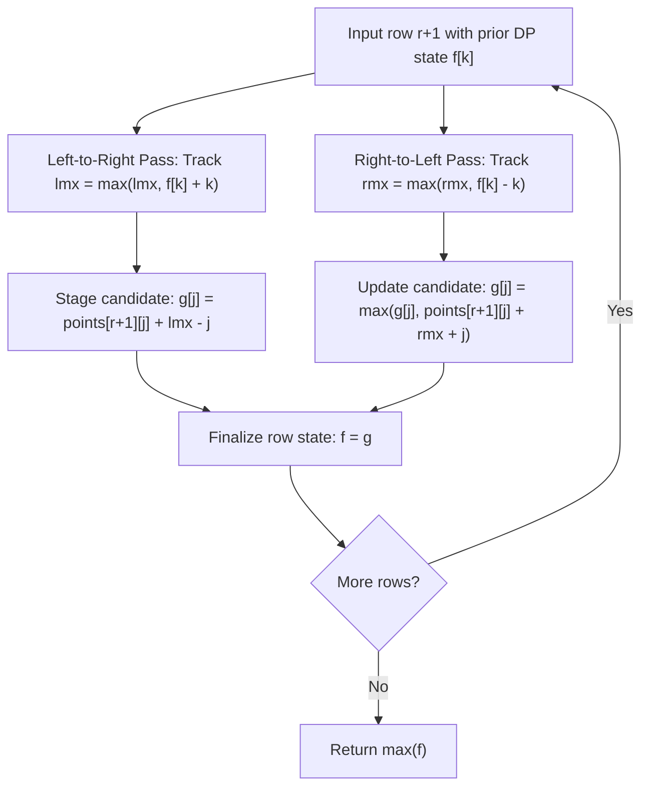

# Guided Example: Maximum Number of Points with Cost

We trace row-by-row dynamic programming, absolute difference cost optimization, and prefix/suffix sweep decomposition on representative grid instances:

- **Primary Input:** `points = [[1, 2, 3], [1, 5, 1], [3, 1, 1]]`
- **Required Output:** `9`
- **Two-Column Input:** `points = [[1, 5], [2, 3], [4, 2]]`
- **Required Output:** `11`

This instance demonstrates solving non-local row transitions under Manhattan coordinate penalties $|c_1 - c_2|$, decomposing the absolute value into separate directional sweeps ($k \le j$ and $k > j$), and optimizing quadratic transition time $\mathcal{O}(n^2)$ down to linear $\mathcal{O}(n)$ per row.

---

## 1. Instance & Teaching Goal

We are given an $m \times n$ integer matrix `points`. We must select exactly one cell $(r, c_r)$ from each row $r \in \{0, \dots, m - 1\}$ to maximize total score:

$$\text{Score} = \sum_{r=0}^{m-1} points[r][c_r] - \sum_{r=0}^{m-2} |c_r - c_{r+1}|$$

For `points = [[1, 2, 3], [1, 5, 1], [3, 1, 1]]`:
- Row 0 options: column 0 (value 1), column 1 (value 2), column 2 (value 3).
- Row 1 options: column 0 (value 1), column 1 (value 5), column 2 (value 1).
- Row 2 options: column 0 (value 3), column 1 (value 1), column 2 (value 1).

Consider the candidate column path $c_0 = 2, c_1 = 1, c_2 = 0$:
- Values collected: $points[0][2] = 3$, $points[1][1] = 5$, $points[2][0] = 3$.
- Transition costs:
  - Row 0 to 1: $|c_0 - c_1| = |2 - 1| = 1$.
  - Row 1 to 2: $|c_1 - c_2| = |1 - 0| = 1$.
- Net score: $(3 + 5 + 3) - (1 + 1) = 11 - 2 = 9$.
- Any other choice (such as remaining in column 1 for row 2, yielding $(3 + 5 + 1) - (1 + 0) = 8$) produces a strictly lower total.
- Maximum score: **9**.

The teaching goal is to understand **directional linear sweep optimization for distance penalties**:
1. Recognizing that naive DP takes $\mathcal{O}(m \cdot n^2)$, which fails when $m \times n = 10^5$.
2. Decomposing the absolute value penalty:
   - For left transitions ($k \le j$): $|j - k| = j - k \implies f[k] - (j - k) = (f[k] + k) - j$.
   - For right transitions ($k > j$): $|j - k| = k - j \implies f[k] - (k - j) = (f[k] - k) + j$.
3. Precomputing prefix running maxima of $f[k] + k$ and suffix running maxima of $f[k] - k$ to compute all transitions for an entire row in $\mathcal{O}(n)$ time.

---

## 2. Conceptual Foundation & Invariants

### Prefix/Suffix Distance Decomposition Theorem

> **Prefix/Suffix Distance Decomposition Theorem.**
> 1. *Base DP Formulation:* Let $f_r[j]$ denote the maximum points obtainable from rows $0$ through $r$ when choosing column $j$ in row $r$. The transition to row $r + 1$ is:
>    $$f_{r+1}[j] = points[r+1][j] + \max_{0 \le k < n} \left( f_r[k] - |j - k| \right)$$
> 2. *Decomposition by Relative Position:* Partition the column index space into left-or-equal ($k \le j$) and right ($k > j$):
>    $$\max_{0 \le k < n} \left( f_r[k] - |j - k| \right) = \max \left( \max_{k \le j} (f_r[k] + k) - j, \quad \max_{k \ge j} (f_r[k] - k) + j \right)$$
> 3. *Linear Sweeps:*
>    - **Left Sweep:** Maintain $\text{lmx}_j = \max_{0 \le k \le j} (f_r[k] + k)$.
>      Recurrence: $\text{lmx}_j = \max(\text{lmx}_{j-1}, f_r[j] + j)$.
>    - **Right Sweep:** Maintain $\text{rmx}_j = \max_{j \le k < n} (f_r[k] - k)$.
>      Recurrence: $\text{rmx}_j = \max(\text{rmx}_{j+1}, f_r[j] - j)$.
> 4. *Optimal Transition Evaluation:* For each destination column $j$:
>    $$f_{r+1}[j] = points[r+1][j] + \max(\text{lmx}_j - j, \text{rmx}_j + j)$$
>    Both sweeps together take $\mathcal{O}(n)$ time per row.

---

## 3. Step-by-Step Worked Execution

We trace `points = [[1, 2, 3], [1, 5, 1], [3, 1, 1]]` ($m = 3, n = 3$):

---

### Step 1: Initialize Row 0
- Prior state vector: $f = points[0] = [1, 2, 3]$.

---

### Step 2: Transition to Row 1 (`points[1] = [1, 5, 1]`)
From $f = [1, 2, 3]$:

#### Left-to-Right Sweep ($\text{lmx}_k = f[k] + k$)
- $k = 0: f[0] + 0 = 1 + 0 = 1 \implies \text{lmx} = 1$.
  - Target $j = 0: g[0] = points[1][0] + \text{lmx} - 0 = 1 + 1 - 0 = 2$.
- $k = 1: f[1] + 1 = 2 + 1 = 3 \implies \text{lmx} = \max(1, 3) = 3$.
  - Target $j = 1: g[1] = points[1][1] + \text{lmx} - 1 = 5 + 3 - 1 = 7$.
- $k = 2: f[2] + 2 = 3 + 2 = 5 \implies \text{lmx} = \max(3, 5) = 5$.
  - Target $j = 2: g[2] = points[1][2] + \text{lmx} - 2 = 1 + 5 - 2 = 4$.
- Intermediate $g = [2, 7, 4]$.

#### Right-to-Left Sweep ($\text{rmx}_k = f[k] - k$)
- $k = 2: f[2] - 2 = 3 - 2 = 1 \implies \text{rmx} = 1$.
  - Target $j = 2: g[2] = \max(4, 1 + 1 + 2) = \max(4, 4) = 4$.
- $k = 1: f[1] - 1 = 2 - 1 = 1 \implies \text{rmx} = \max(1, 1) = 1$.
  - Target $j = 1: g[1] = \max(7, 5 + 1 + 1) = \max(7, 7) = 7$.
- $k = 0: f[0] - 0 = 1 - 0 = 1 \implies \text{rmx} = \max(1, 1) = 1$.
  - Target $j = 0: g[0] = \max(2, 1 + 1 + 0) = \max(2, 2) = 2$.
- Final Row 1 state: $f = [2, 7, 4]$.

---

### Step 3: Transition to Row 2 (`points[2] = [3, 1, 1]`)
From $f = [2, 7, 4]$:

#### Left-to-Right Sweep ($\text{lmx}_k = f[k] + k$)
- $k = 0: 2 + 0 = 2 \implies \text{lmx} = 2$.
  - Target $j = 0: g[0] = 3 + 2 - 0 = 5$.
- $k = 1: 7 + 1 = 8 \implies \text{lmx} = \max(2, 8) = 8$.
  - Target $j = 1: g[1] = 1 + 8 - 1 = 8$.
- $k = 2: 4 + 2 = 6 \implies \text{lmx} = \max(8, 6) = 8$.
  - Target $j = 2: g[2] = 1 + 8 - 2 = 7$.
- Intermediate $g = [5, 8, 7]$.

#### Right-to-Left Sweep ($\text{rmx}_k = f[k] - k$)
- $k = 2: 4 - 2 = 2 \implies \text{rmx} = 2$.
  - Target $j = 2: g[2] = \max(7, 1 + 2 + 2) = \max(7, 5) = 7$.
- $k = 1: 7 - 1 = 6 \implies \text{rmx} = \max(2, 6) = 6$.
  - Target $j = 1: g[1] = \max(8, 1 + 6 + 1) = \max(8, 8) = 8$.
- $k = 0: 2 - 0 = 2 \implies \text{rmx} = \max(6, 2) = 6$.
  - Target $j = 0: g[0] = \max(5, 3 + 6 + 0) = \max(5, 9) = 9$.
- Final Row 2 state: $f = [9, 8, 7]$.

---

### Step 4: Optimal Score Extraction
- Global maximum: $\max(f) = \max(9, 8, 7) = 9$.
- Output: **9**.

---

## 4. Complete Execution Trace

We record DP state vectors after processing each row:

| Row $r$ | Row Values `points[r]` | Left Sweep Intermediate $g_{\text{left}}$ | Right Sweep Intermediate $g_{\text{right}}$ | Final Combined State $f_r$ | Row Best Score |
|---|---|---|---|---|---|
| 0 | `[1, 2, 3]` | — | — | `[1, 2, 3]` | 3 |
| 1 | `[1, 5, 1]` | `[2, 7, 4]` | `[2, 7, 4]` | `[2, 7, 4]` | 7 |
| 2 | `[3, 1, 1]` | `[5, 8, 7]` | `[9, 8, 7]` | `[9, 8, 7]` | **9** |

We contrast optimal versus suboptimal cell selections across the grid:

| Candidate Trajectory $(c_0, c_1, c_2)$ | Points Collected | Shift Costs Paid | Formula | Total Score | Evaluation |
|---|---|---|---|---|---|
| $(2, 1, 0)$ | $3 + 5 + 3 = 11$ | $|2-1| + |1-0| = 2$ | $11 - 2$ | **9** | **Optimal** |
| $(1, 1, 0)$ | $2 + 5 + 3 = 10$ | $|1-1| + |1-0| = 1$ | $10 - 1$ | 9 | Also Optimal |
| $(1, 1, 1)$ | $2 + 5 + 1 = 8$ | $|1-1| + |1-1| = 0$ | $8 - 0$ | 8 | Suboptimal |
| $(0, 1, 2)$ | $1 + 5 + 1 = 7$ | $|0-1| + |1-2| = 2$ | $7 - 2$ | 5 | Suboptimal |

---

## 5. Algorithmic Correctness

**Soundness.** For any column $j$, the optimal previous column $k^*$ either satisfies $k^* \le j$ or $k^* > j$. The left sweep evaluates $\max_{k \le j} (f[k] + k - j)$, which exactly equals $\max_{k \le j} (f[k] - |j - k|)$. The right sweep evaluates $\max_{k \ge j} (f[k] - k + j)$, which exactly equals $\max_{k \ge j} (f[k] - |j - k|)$. Taking the maximum over both sweeps computes $\max_k (f[k] - |j - k|)$ without approximation.

**Completeness.** Since all columns $j \in \{0, \dots, n-1\}$ are evaluated for every row, no possible path configuration is overlooked, ensuring the global maximum is reached.

---

## 6. Traps This Instance Exposes

- **Quadratic Transition TLE:** Testing all pairs $(j, k)$ at every row costs $\mathcal{O}(m \cdot n^2)$, requiring $\approx 10^{10}$ operations when $m = 10^5, n = 10^5$. Linear sweep optimization is mandatory.
- **Directional Sign Inversion:** Confusing the signs in $f[k] + k - j$ and $f[k] - k + j$ produces invalid cost penalties. The penalty is always negative: $|j - k| \ge 0$.
- **64-bit Accumulation:** With large arrays and positive values, cumulative sums can exceed 32-bit signed integers. 64-bit integer tracking is required.

---

## 7. Complexity Derivation

- **Time Complexity:** $\mathcal{O}(m \cdot n)$, where $m$ and $n$ are the matrix dimensions. For each of the $m$ rows, we perform one forward and one backward linear pass of size $n$, each requiring $\mathcal{O}(1)$ operations per cell.
- **Auxiliary Space Complexity:** $\mathcal{O}(n)$ auxiliary space to store the 1D DP vectors for the current and previous rows.