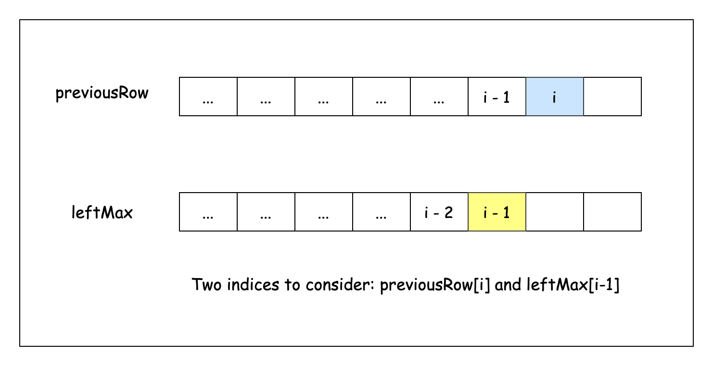
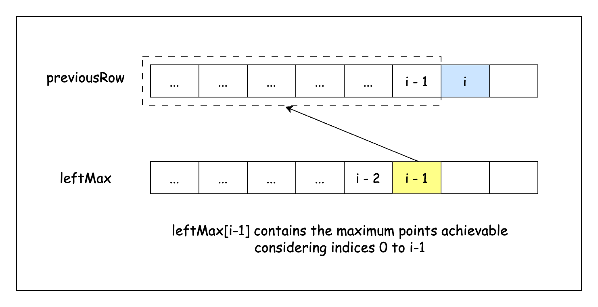
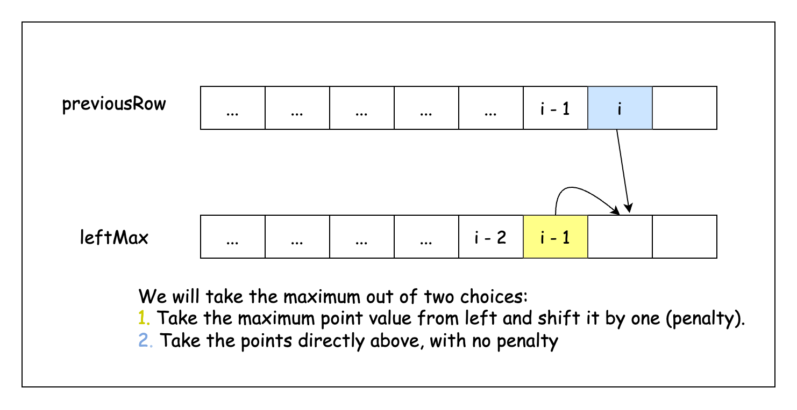

## Solution

---

### Overview

Our goal with this problem is to determine the maximum number of points we can get by picking one cell from each row of a given matrix.  The possible score for each row consist of two components:
1. The point value of the selected cell.
2. A penalty equal to the horizontal distance between the current cell and the selected cell in the previous row.

The problem constraints hint that an efficient solution is needed. Specifically, since the problem is constrained by $m \times n \leq 10 ^ 5$, we should aim for an $O(m \times n)$ solution.

In a brute-force approach, the idea would be to explore every possible combination of selecting one element from each row. Starting with the first row, we'd pick an element, then move to the next row and try every possible element there, repeating this process until we've chosen an element from each row. For each of these combinations, we would calculate the sum of the selected elements while also accounting for the cost incurred when switching columns between consecutive rows.

This approach involves using nested loops to compare every possible cell in each row, resulting in an exponential number of possibilities. As the number of rows and columns increases, the number of potential paths grows rapidly, making this method computationally infeasible for large grids. Instead, we need to optimize how we transition from one row to the next while keeping track of the maximum points we can accumulate.

Before attempting this problem, it may be helpful to solve related problems like "[121. Best Time to Buy and Sell Stock](https://leetcode.com/problems/best-time-to-buy-and-sell-stock/description/)" and "[1014. Best Sightseeing Pair](https://leetcode.com/problems/best-sightseeing-pair/description/)." These problems involve similar concepts of optimizing a series of decisions or transitions, which is a key aspect of solving the matrix points problem efficiently. Understanding the strategies used in those problems will build a foundation for approaching this one.

---

### Approach 1: Dynamic Programming

#### Intuition

Our goal is to create a solution that efficiently finds the maximum points possible while moving from the top row to the bottom row of the matrix. To do this, we initialize an array called `previousRow` with the values of the first row of the matrix. We can then operate off this array to build another array, `currentRow`. Each element in `currentRow` will represent the number of points we can gain by picking that cell, taking into account both the point value of the cell and the penalty for choosing it.

A straightforward approach to build `currentRow` would be to iterate over all cells in `previousRow` and apply the penalty for the horizontal distance:

```
// For the Xth and (X+1)th rows of the points matrix
currentRow[i] = max(previousRow[j] - abs(j - i) for j in range(n)) + points[X+1][i]
```

Since this approach directly checks every cell in `previousRow` for each cell in `currentRow`, it involves repeated and redundant calculations and has a time complexity of $O(n^2)$ for each row, where $n$ is the number of columns. Given that we need to repeat this process for every row, this solution would not meet the problem's constraints, especially for large matrices.

Instead of recalculating the possible scores from every cell in `previousRow` for each cell in `currentRow`, we can use two auxiliary arrays, `leftMax` and `rightMax`, to store the maximum possible contributions from the left and right, respectively. This allows us to simply compare these two precomputed values to determine the best score for each cell in `currentRow`.

To construct `leftMax`:
1. Set $\text{leftMax}[0]$ equal to $\text{previousRow}[0]$, as there are no values to its left.
2. For each subsequent index `i`, compute $\text{leftMax}[i]$ as the maximum of $\text{previousRow}[i]$ and $leftMax[i-1] - 1$. The subtraction accounts for the penalty incurred when moving horizontally to the next cell.

Have a look at this slideshow to better understand how each cell in `leftMax` is populated:







Similarly, construct `rightMax` by iterating from right to left.

With `leftMax` and `rightMax` prepared, we can compute the maximum points for each cell in `currentRow` using:

```
currentRow[i] = max(leftMax[i], rightMax[i]) + points[X+1][i]
```

This allows us to efficiently calculate the maximum points for each row in $O(n)$ time, making the overall time complexity $O(m \times n)$, where $m$ is the number of rows.

We apply this optimized process iteratively from the first row to the last row of the matrix. After processing all rows, the array `previousRow` will contain the maximum possible points for each cell in the last row. The final answer is the maximum value found in this array, which represents the highest score achievable while moving from the top to the bottom of the matrix.

#### Algorithm

- Set `rows` and `cols` as the number of rows and columns in the input matrix `points`.
- Create an array `previousRow`. Initialize it with values of the first row of the input matrix.
- Iterate from the `0`th to `rows-2`th row. For each `row`:
  - Initialize arrays:
- `leftMax`: for maximum points achievable from left to right.
- `rightMax`: for maximum points achievable from right to left.
- `currentRow`: for the maximum points achievable for each cell in the current row.
  - Set the first element of `leftMax` to the first element of `previousRow`.
  - Loop `col` from `1` to the end of `cols`:
- Set $\text{leftMax}[col]$ to the maximum of $leftMax[col - 1] - 1$ and $\text{previousRow}[col]$.
  - Set the last element of `rightMax` to the last element of `previousRow`.
  - Loop `col` from $cols - 2$ to `0`:
- Set $\text{rightMax}[col]$ to the maximum of $rightMax[col + 1] - 1$ and $\text{previousRow}[col]$.
  - Loop `col` from `0` to the end of `cols`:
- Calculate the maximum points for each cell in the current row:
      1. Take the value from `points` for the next row ($points[row + 1][col]$).
      2. Add the maximum of $\text{leftMax}[col]$ and $\text{rightMax}[col]$ to it.
- Set the calculated value to $\text{currentRow}[col]$.
  - Update `previousRow` to be `currentRow`.
- Initialize a variable `maxPoints` to store the overall maximum points.
- Loop through all values of `previousRow` and set `maxPoints` to the maximum.
- Return `maxPoints` as our answer.

#### Implementation

```python
class Solution:
    def maxPoints(self, points: List[List[int]]) -> int:
        rows, cols = len(points), len(points[0])
        previous_row = points[0]

        for row in range(1, rows):
            left_max = [0] * cols
            right_max = [0] * cols
            current_row = [0] * cols

            # Calculate left-to-right maximum
            left_max[0] = previous_row[0]
            for col in range(1, cols):
                left_max[col] = max(left_max[col - 1] - 1, previous_row[col])

            # Calculate right-to-left maximum
            right_max[-1] = previous_row[-1]
            for col in range(cols - 2, -1, -1):
                right_max[col] = max(right_max[col + 1] - 1, previous_row[col])

            # Calculate the current row's maximum points
            for col in range(cols):
                current_row[col] = points[row][col] + max(
                    left_max[col], right_max[col]
                )

            # Update previous_row for the next iteration
            previous_row = current_row

        # Find the maximum value in the last processed row
        return max(previous_row)
```

#### Complexity Analysis

Let $m$ and $n$ be the height and width of `points`.

- Time complexity: $O(m \cdot n)$

    The outer loop runs $m-1$ times. Inside it, two inner loops run $n-1$ times and another one runs $n$ times. Thus, the overall time complexity is $O((m-1) \cdot (n-1 + n-1 + n))$, which simplifies to $O(m \cdot n)$.

- Space complexity: $O(n)$

    We use four additional arrays, each of which takes $n$ space. All other variables take constant space.

    Thus, the space complexity is $O(4 \cdot n) = O(n)$.

---

### Approach 2: Dynamic Programming (Optimized)

#### Intuition

In the previous approach, we used auxiliary arrays to keep track of the maximum points achievable from the left and right directions. This time, we streamline the process by using the `previousRow` array itself as temporary storage for the left-side maximums and then update it with the right-side maximums in a single pass.

Thus, we will require two passes to do this.

1. First Pass: Left-to-Right Sweep
We begin by iterating through the row from left to right. As we move, we store the maximum points achievable from the left in the `previousRow` array. This step essentially builds the equivalent of the `leftMax` array directly within `previousRow`.

- At the start, `runningMax` is initialized to `0`. At the beginning of each iteration, `runningMax` will hold the maximum value that can be achieved from the left till `i-1`.
- For each cell `i`, we update `runningMax` to the maximum of $\text{previousRow}[i]$ and $runningMax - 1$, where the subtraction accounts for the horizontal distance penalty.

This process ensures that $\text{previousRow}[i]$ contains the maximum points that can be accumulated when moving from the left to the `i`th cell.

1. Second Pass: Right-to-Left Sweep
Next, we perform a second loop, this time iterating from right to left. This pass starts from the right and combines the results from the left-to-right pass with the maximum values from the right.

- We reset `runningMax` to `0` before starting this pass. Similar to the left-to-right pass, we update `runningMax` for each column.
- We take the maximum of the current $\text{previousRow}[col]$ (which now contains the best value from the left) and the new `runningMax` (best value from the right).
- We add $\text{row}[col]$ to this maximum, incorporating the points from the current cell in the current row.

After processing all rows, the array `previousRow` (which now holds the updated values) will contain the maximum points that can be accumulated for each cell in the last row of the matrix. The maximum value in this array is our final answer, representing the highest possible score from the top to the bottom of the matrix.

#### Algorithm

- Set `cols` as the number of columns in `points`.
- Create an array `previousRow` of size `cols`.
- Iterate through each `row` in the `points` matrix:
  - Initialize a variable `runningMax` to `0`.
  - Iterate `col` from `0` to `cols-1`:
- Update `runningMax` to the maximum of $runningMax - 1$ and $\text{previousRow}[col]$.
- Set $\text{previousRow}[col]$ equal to `runningMax`.
  - Now, iterate `col` in the reverse order:
- Update `runningMax` to the maximum of $runningMax - 1$ and $\text{previousRow}[col]$.
- Update $\text{previousRow}[col]$ by taking the maximum of its current value and `runningMax`, then add the current cell's value.
- Loop through all values of `previousRow` and set `maxPoints` to the maximum.
- Return `maxPoints`.

#### Implementation

```python
class Solution:
    def maxPoints(self, points: List[List[int]]) -> int:
        cols = len(points[0])
        previous_row = [0] * cols

        for row in points:
            # running_max holds the maximum value generated in the previous iteration of each loop
            running_max = 0

            # Left to right pass
            for col in range(cols):
                running_max = max(running_max - 1, previous_row[col])
                previous_row[col] = running_max

            running_max = 0
            # Right to left pass
            for col in range(cols - 1, -1, -1):
                running_max = max(running_max - 1, previous_row[col])
                previous_row[col] = (
                    max(previous_row[col], running_max) + row[col]
                )

        # Find maximum points in the last row
        return max(previous_row)
```

#### Complexity Analysis

Let $m$ and $n$ be the height and width of `points`.

* Time complexity: $O(m \cdot n)$

    The main loop iterates through each row of `points`. Inside this loop, the algorithm uses two nested loops, each iterating $n$ times. Overall, this takes $O(m \cdot n)$ time.

    The final loop to find the maximum points also iterates $n$ times.

    Thus, the total time complexity of the algorithm is $O(m \cdot n) +$\mathcal{O}(n)$= O(m \cdot n)$.

* Space complexity: $O(n)$

    The algorithm uses an array `previousRow` of length $n$. Thus, the space complexity of the algorithm is $O(n)$.

---