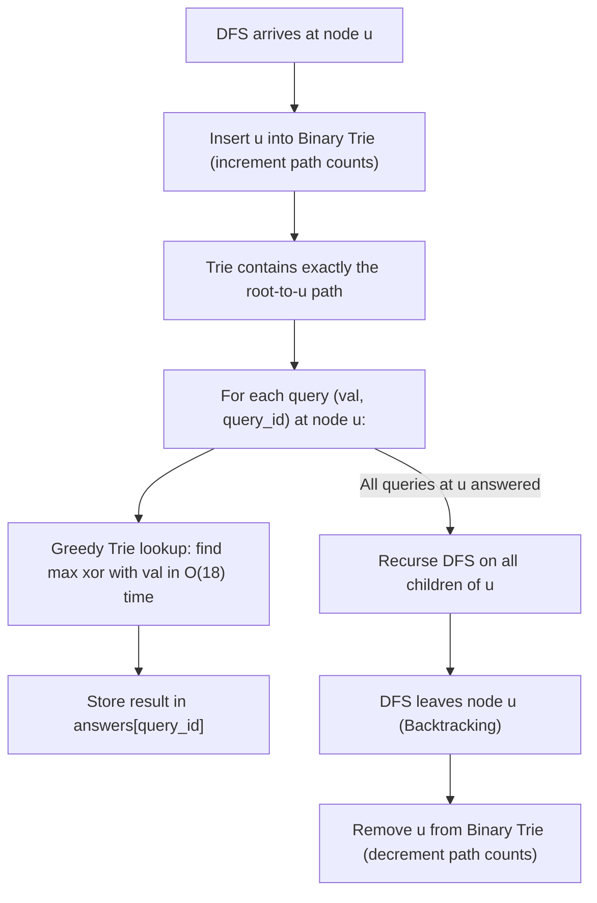

# Guided Example: Maximum Genetic Difference Query

We trace offline tree traversal, ancestor path persistence, and bitwise Trie maximum XOR queries on representative tree network instances:

- **Primary Input:** `parents = [-1, 0, 1, 1]`, `queries = [[0, 2], [3, 2], [2, 5]]`
- **Required Output:** `[2, 3, 7]`
- **Linear Chain Input:** `parents = [-1, 0, 1]`, `queries = [[2, 3], [1, 2]]`
- **Required Output:** `[3, 3]`

This instance demonstrates solving online path queries offline via Depth-First Search (DFS) backtracking, maintaining an active ancestor prefix tree (Binary Trie) with reference counts, and evaluating maximum bitwise XOR in $\mathcal{O}(W)$ time per query.

---

## 1. Instance & Teaching Goal

We are given a rooted tree of $n$ nodes ($0$ to $n - 1$) defined by an array `parents`, where `parents[i]` is the parent of node $i$ (and `-1` for the root). We are also given an array of queries, where each query $[node, val]$ asks for the maximum genetic difference $x \oplus val$ over all nodes $x$ on the unique path from the root to $node$.

For `parents = [-1, 0, 1, 1]` with `queries = [[0, 2], [3, 2], [2, 5]]`:
- Tree structure:
  - Root: Node 0
  - Child of 0: Node 1
  - Children of 1: Node 2, Node 3
- Query 0: $[node = 0, val = 2]$
  - Ancestor path to node 0: $\{0\}$.
  - Candidate XOR: $0 \oplus 2 = 2$. Maximum: **2**.
- Query 1: $[node = 3, val = 2]$
  - Ancestor path to node 3: $\{0, 1, 3\}$.
  - Candidate XORs:
    - $0 \oplus 2 = 2$ ($00_2 \oplus 10_2 = 10_2$)
    - $1 \oplus 2 = 3$ ($01_2 \oplus 10_2 = 11_2$)
    - $3 \oplus 2 = 1$ ($11_2 \oplus 10_2 = 01_2$)
  - Maximum XOR: **3** (attained at node 1).
- Query 2: $[node = 2, val = 5]$
  - Ancestor path to node 2: $\{0, 1, 2\}$.
  - Candidate XORs:
    - $0 \oplus 5 = 5$ ($000_2 \oplus 101_2 = 101_2$)
    - $1 \oplus 5 = 4$ ($001_2 \oplus 101_2 = 100_2$)
    - $2 \oplus 5 = 7$ ($010_2 \oplus 101_2 = 111_2$)
  - Maximum XOR: **7** (attained at node 2).
- Final output array: `[2, 3, 7]`.

The teaching goal is to understand **offline DFS batching and dynamic ancestor Tries**:
1. Eliminating redundant path traversals: Answering $Q$ queries online naively takes $\mathcal{O}(Q \cdot N)$, which is prohibitive when $N, Q \le 10^5$.
2. Organizing queries offline by target node: `queries_by_node[u]`.
3. Invariant maintenance during DFS: Inserting a node into a 0-1 Binary Trie upon arrival, answering all queries for that node, and removing the node upon backtracking.
4. Greedy XOR resolution: Traversing the Trie from most significant bit (MSB) to least significant bit (LSB) selecting the inverted bit whenever available.

---

## 2. Conceptual Foundation & Invariants

### Dynamic Ancestor Trie Invariant Theorem

> **Dynamic Ancestor Trie Invariant Theorem.**
> 1. *Ancestor Path Invariant:* During a standard depth-first search on a rooted tree, the stack of currently active nodes along the call trajectory forms precisely the set of ancestors of the current node $u$:
>    $$\text{Active}(u) = \{x \mid x \text{ lies on the simple path from root to } u\}$$
> 2. *Trie Reference Counting:* A binary prefix tree stores the binary representations of integers with fixed bit width $W = 18$ (since $N, val \le 2 \times 10^5 < 2^{18}$). Each node in the Trie maintains a reference counter `count`.
>    - Inserting $x$: Increment `count` along the 18-step path for $x$.
>    - Removing $x$: Decrement `count` along the 18-step path for $x$.
>    - A branch is active if and only if `count > 0`.
> 3. *Greedy Bitwise XOR Maximization:* To maximize $x \oplus val$, we inspect bit positions $b$ from $W - 1$ down to $0$. Let $d_b = (val \gg b) \mathbin{\&} 1$.
>    - The preferred branch is the inverted bit $p_b = d_b \oplus 1$.
>    - If the Trie node has a child along direction $p_b$ with $\text{count} > 0$, we traverse that branch and set the $b$-th bit of the result to $1$.
>    - Otherwise, we must follow direction $d_b$, contributing $0$ at bit $b$.
> 4. *Complexity:* Each insertion, deletion, and query takes strictly $\mathcal{O}(W)$ operations, achieving $\mathcal{O}((N + Q) \cdot W)$ total time.

---

## 3. Step-by-Step Worked Execution

We trace `parents = [-1, 0, 1, 1]` with bit-width $W = 3$ ($2^2, 2^1, 2^0$):

---

### Step 1: Query Grouping
- Node 0: Query 0 with $val = 2$ (`010`).
- Node 1: No queries.
- Node 2: Query 2 with $val = 5$ (`101`).
- Node 3: Query 1 with $val = 2$ (`010`).

---

### Step 2: DFS Enters Node 0
- Insert `0` (`000`): Trie now contains `[0]`.
- Answer queries for Node 0:
  - Query 0: $val = 2$ (`010`).
  - Bit 2 ($val = 0$): Preferred bit 1 (no active branch). Take branch 0.
  - Bit 1 ($val = 1$): Preferred bit 0. Active branch 0 exists! Take 0, bit 1 set to 1.
  - Bit 0 ($val = 0$): Preferred bit 1 (no active branch). Take branch 0.
  - Result for Query 0: $2$ (`010`). Store $\text{answers}[0] = 2$.
- Recurse to child: Node 1.

---

### Step 3: DFS Enters Node 1
- Insert `1` (`001`): Trie contains `{0, 1}`.
- Node 1 has no attached queries.
- Recurse to child: Node 2.

---

### Step 4: DFS Enters Node 2
- Insert `2` (`010`): Trie contains `{0, 1, 2}`.
- Answer queries for Node 2:
  - Query 2: $val = 5$ (`101`).
  - Bit 2 ($val = 1$): Preferred bit 0. Active branch 0 exists (`0, 1, 2` all start with 0). Take 0. Bit 2 set to 1 ($+4$).
  - Bit 1 ($val = 0$): Preferred bit 1. Node `2` (`010`) has bit 1 equal to 1! Take branch 1. Bit 1 set to 1 ($+2$).
  - Bit 0 ($val = 1$): Preferred bit 0. Node `2` has bit 0 equal to 0! Take branch 0. Bit 0 set to 1 ($+1$).
  - Result: $4 + 2 + 1 = 7$. Store $\text{answers}[2] = 7$.
- Node 2 is a leaf. Backtrack from Node 2:
  - Remove `2` from Trie.
  - Trie returns to `{0, 1}`.

---

### Step 5: DFS Enters Node 3
- Insert `3` (`011`): Trie contains `{0, 1, 3}`.
- Answer queries for Node 3:
  - Query 1: $val = 2$ (`010`).
  - Bit 2 ($val = 0$): Preferred bit 1 (no branch). Take 0.
  - Bit 1 ($val = 1$): Preferred bit 0. Nodes `0` and `1` have bit 1 as 0! Take branch 0. Bit 1 set to 1 ($+2$).
  - Bit 0 ($val = 0$): Preferred bit 1. Node `1` (`001`) and `3` (`011`) have bit 0 as 1! Take branch 1. Bit 0 set to 1 ($+1$).
  - Result: $2 + 1 = 3$. Store $\text{answers}[1] = 3$.
- Backtrack from Node 3:
  - Remove `3` from Trie.
- Backtrack from Node 1:
  - Remove `1` from Trie.
- Backtrack from Node 0:
  - Remove `0` from Trie.

---

### Final Output Assembly
$$\text{answers} = [2, 3, 7]$$

---

## 4. Complete Execution Trace

We record DFS state progression and Trie contents during query execution:

| Event | Node Visited | Trie Population | Active Queries Evaluated | Query Target $val$ | Best XOR Match Found | Result Recorded |
|---|---|---|---|---|---|---|
| Enter 0 | Node 0 | `{0}` | Query 0 | 2 | $0 \oplus 2 = 2$ | `answers[0] = 2` |
| Enter 1 | Node 1 | `{0, 1}` | None | — | — | — |
| Enter 2 | Node 2 | `{0, 1, 2}` | Query 2 | 5 | $2 \oplus 5 = 7$ | `answers[2] = 7` |
| Exit 2 | Node 2 | `{0, 1}` | — | — | Node 2 removed | — |
| Enter 3 | Node 3 | `{0, 1, 3}` | Query 1 | 2 | $1 \oplus 2 = 3$ | `answers[1] = 3` |
| Exit 3 | Node 3 | `{0, 1}` | — | — | Node 3 removed | — |
| Exit 1, 0 | Nodes 1, 0 | $\emptyset$ | — | — | Full cleanup | Completed |

We compare bit-level selections for Query 2 ($val = 5 = 101_2$) against active Trie $\{000_2, 001_2, 010_2\}$:

| Bit Position $b$ | Power $2^b$ | $val$ Bit | Preferred Bit | Available in Trie? | Branch Taken | Cumulative XOR Result |
|---|---|---|---|---|---|---|
| 2 | 4 | 1 | 0 | Yes (`0, 1, 2` all have bit 2 = 0) | 0 | $4$ |
| 1 | 2 | 0 | 1 | Yes (Node `2` has bit 1 = 1) | 1 | $4 + 2 = 6$ |
| 0 | 1 | 1 | 0 | Yes (Node `2` has bit 0 = 0) | 0 | $6 + 1 = 7$ |

---

## 5. Algorithmic Correctness

**Soundness.** At the moment DFS visits node $u$, every ancestor of $u$ has been inserted into the Trie, and no other nodes are present (descendants are not yet visited, and sibling subtrees have been removed upon backtracking). The Trie thus represents precisely the set of ancestors on the root-to-$u$ path. The greedy bitwise Trie traversal provably selects the maximal possible XOR value because choosing a 1 at bit $b$ outweighs all possible combinations of lower bits $\sum_{k=0}^{b-1} 2^k = 2^b - 1 < 2^b$.

**Completeness.** Since DFS visits every node and all queries associated with a node are answered while that node is active, every query is processed. Backtracking restores the Trie state cleanly, preventing cross-branch contamination.

---

## 6. Traps This Instance Exposes

- **Cross-Subtree Contamination:** Failing to remove node $u$ upon backtracking leaves $u$ in the Trie when traversing sibling subtrees, falsely allowing queries in one branch to use values from unrelated branches.
- **Trie Depth and Bit Width:** Values can reach $2 \times 10^5$. Using 16 or 17 bits can truncate the highest bit. Setting $W = 18$ ($2^{17} = 131072, 2^{18} = 262144$) is required to accommodate all valid inputs.
- **Reference Counting Necessity:** A simple boolean `is_present` flag on Trie nodes fails because multiple ancestors might share prefixes. Using an integer reference count incremented on insert and decremented on removal correctly tracks active prefix branches.

---

## 7. Complexity Derivation

- **Time Complexity:** $\mathcal{O}((N + Q) \cdot W)$, where $N$ is the number of nodes, $Q$ is the number of queries, and $W = 18$ is the bit length. Each node is inserted and removed from the Trie once ($2N \cdot W$ operations), and each query performs one Trie traversal ($Q \cdot W$ operations).
- **Auxiliary Space Complexity:** $\mathcal{O}(N \cdot W + Q)$ to store the Trie structure and the queries grouped by node.
