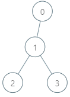
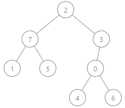

### 1. Description

There is a rooted tree consisting of `n` nodes numbered `0` to $n - 1$. Each node's number denotes its **unique genetic value** (i.e. the genetic value of node `x` is `x`). The **genetic difference** between two genetic values is defined as the **bitwise-****XOR** of their values. You are given the integer array `parents`, where $\text{parents}[i]$ is the parent for node `i`. If node `x` is the **root** of the tree, then $\text{parents}[x] = -1$.

You are also given the array `queries` where $\text{queries}[i] = [\text{node}_{i}, \text{val}_{i}]$. For each query `i`, find the **maximum genetic difference** between $\text{val}_{i}$ and $p_{i}$, where $p_{i}$ is the genetic value of any node that is on the path between $\text{node}_{i}$ and the root (including $\text{node}_{i}$ and the root). More formally, you want to maximize $\text{val}_{i} XOR p_{i}$.

Return *an array *`ans`* where *$\text{ans}[i]$* is the answer to the *$$i^{\text{th}}$$* query*.

### 2. Function Contract

**Inputs**

- `parents`: Input parameter (`List[int]`).
- `queries`: Input parameter (`List[List[int]]`).

**Return value**

- Returns `List[int]`.

### 3. Examples

#### Example 1

- **Input:** $parents = [-1,0,1,1], queries = [[0,2],[3,2],[2,5]]$
- **Output:** `[2,3,7]`
- **Explanation:** The queries are processed as follows:
- [0,2]: The node with the maximum genetic difference is 0, with a difference of 2 XOR 0 = 2.
- [3,2]: The node with the maximum genetic difference is 1, with a difference of 2 XOR 1 = 3.
- [2,5]: The node with the maximum genetic difference is 2, with a difference of 5 XOR 2 = 7.

#### Example 2

- **Input:** $parents = [3,7,-1,2,0,7,0,2], queries = [[4,6],[1,15],[0,5]]$
- **Output:** `[6,14,7]`
- **Explanation:** The queries are processed as follows:
- [4,6]: The node with the maximum genetic difference is 0, with a difference of 6 XOR 0 = 6.
- [1,15]: The node with the maximum genetic difference is 1, with a difference of 15 XOR 1 = 14.
- [0,5]: The node with the maximum genetic difference is 2, with a difference of 5 XOR 2 = 7.

### 4. Constraints

- $2 \le \text{parents.length} \le 10^{5}$

- $0 \le \text{parents}[i] \le \text{parents.length} - 1$ for every node `i` that is **not** the root.

- $\text{parents}[root] = -1$

- $1 \le \text{queries.length} \le 3 * 10^{4}$

- $0 \le \text{node}_{i} \le \text{parents.length} - 1$

- $0 \le \text{val}_{i} \le 2 * 10^{5}$
