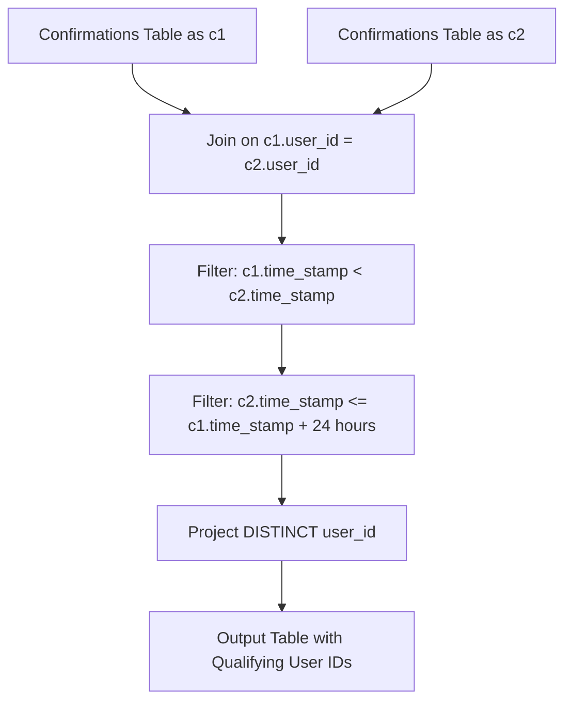

# Guided Example: Users That Actively Request Confirmation Messages

We trace temporal window filtering, relational self-joins, and timestamp interval arithmetic on representative confirmation request logs:

- **Primary Input:** `Confirmations` table containing request timestamps for users $\{2, 3, 6, 7\}$
- **Required Output:** Users qualifying within a 24-hour window: `[2, 3, 6]` (excluding user 7)

This instance demonstrates joining sequential event timestamps within an entity, defining sliding 24-hour window boundaries with inclusive endpoint semantics, and eliminating duplicate user IDs using relational projections.

---

## 1. Instance & Teaching Goal

We are given a `Confirmations` table tracking when users requested confirmation messages. We must find all user IDs who requested at least two confirmation messages within a 24-hour window ($t_2 - t_1 \le 24\text{ hours}$ with $t_1 < t_2$).
- Exactly 24 hours apart ($t_2 - t_1 = 86400\text{ seconds}$) is considered **within** the window.
- The request action (`'confirmed'` or `'timeout'`) does not affect eligibility; only timestamps matter.

For the representative instance:
- **User 2:**
  - Request 1: `2021-01-22 00:00:00`
  - Request 2: `2021-01-23 00:00:00`
  - Elapsed time: exactly 24 hours ($86400$ seconds $\le 86400$ seconds).
  - Condition holds $\implies$ **Included**.
- **User 3:**
  - Request 1: `2021-01-06 03:30:46`
  - Request 2: `2021-01-06 03:37:45`
  - Elapsed time: 6 minutes and 59 seconds ($419$ seconds $\le 86400$ seconds).
  - Condition holds $\implies$ **Included**.
- **User 6:**
  - Request 1: `2021-10-23 14:14:14`
  - Request 2: `2021-10-24 14:14:13`
  - Elapsed time: 23 hours, 59 minutes, 59 seconds ($86399$ seconds $\le 86400$ seconds).
  - Condition holds $\implies$ **Included**.
- **User 7:**
  - Request 1: `2021-06-12 11:57:29`
  - Request 2: `2021-06-13 11:57:30`
  - Elapsed time: 24 hours and 1 second ($86401$ seconds $> 86400$ seconds).
  - Condition fails $\implies$ **Excluded**.

The teaching goal is to understand **temporal window join constraints and duplicate projection**:
1. Formulating pairwise timestamp comparisons via self-join $c_1 \bowtie c_2$ on identical `user_id`.
2. Applying the asymmetric ordering predicate $c_1.\text{time\_stamp} < c_2.\text{time\_stamp}$ to avoid reflexive ($t = t$) and symmetric redundant pairings.
3. Defining the temporal interval boundary: $c_2.\text{time\_stamp} \le c_1.\text{time\_stamp} + 24\text{ hours}$.
4. Ensuring unique user output using relational projection $\pi_{\text{DISTINCT}}$.

---

## 2. Conceptual Foundation & Invariants

### Temporal Self-Join Window Invariant Theorem

> **Temporal Self-Join Window Invariant Theorem.**
> 1. *Temporal Pair Partitioning:* Let $\mathcal{T}(u) = \{t_1, t_2, \dots, t_k\}$ be the set of distinct confirmation timestamps for user $u$ sorted chronologically: $t_1 < t_2 < \dots < t_k$. User $u$ qualifies if and only if there exists at least one pair of indices $i < j$ such that:
>    $$0 < t_j - t_i \le 24 \text{ hours} = 86400 \text{ seconds}$$
> 2. *Adjacent Neighbor Sufficiency:* If any arbitrary pair $(t_i, t_j)$ with $j > i + 1$ satisfies $t_j - t_i \le 24\text{ hours}$, then because timestamps are non-decreasing:
>    $$t_{i+1} - t_i \le t_j - t_i \le 24 \text{ hours}$$
>    Hence, checking consecutive chronologically adjacent requests ($j = i + 1$) via window sorting or self-join is sufficient to identify qualifying users.
> 3. *Relational Self-Join Formulation:* In relational algebra, joining table $C$ with alias $C_1$ and $C_2$ produces all candidate pairs:
>    $$\sigma_{C_1.\text{time\_stamp} < C_2.\text{time\_stamp} \;\land\; C_2.\text{time\_stamp} \le C_1.\text{time\_stamp} + 24\text{h}} (C_1 \bowtie_{\text{user\_id}} C_2)$$
> 4. *Deduplication:* If a user requests three messages within 24 hours, multiple qualifying pairs are generated. Projecting with distinct semantics guarantees each valid user ID appears exactly once in the final result.

---

## 3. Step-by-Step Worked Execution

We trace the timestamp difference evaluation for each user in the dataset:

---

### Analysis of User 3
- Timestamps logged:
  - $t_1 = \text{2021-01-06 03:30:46}$
  - $t_2 = \text{2021-01-06 03:37:45}$
- Order check: $t_1 < t_2$ (Holds).
- Calculate difference:
  - Same date (`2021-01-06`), hour `03`.
  - Minute difference: $37 - 30 = 7$ minutes.
  - Second difference: $45 - 46 = -1$ second.
  - Total elapsed: $7 \times 60 - 1 = 419$ seconds (6 min 59 sec).
- Threshold check: $419\text{ s} \le 86400\text{ s}$ (True).
- User 3 **qualifies**.

---

### Analysis of User 7
- Timestamps logged:
  - $t_1 = \text{2021-06-12 11:57:29}$
  - $t_2 = \text{2021-06-13 11:57:30}$
- Order check: $t_1 < t_2$ (Holds).
- Calculate difference:
  - Next day (`2021-06-13` vs `2021-06-12`): exactly 24 hours difference would be `2021-06-13 11:57:29`.
  - Actual timestamp: `11:57:30` (1 second later than 24 hours).
  - Total elapsed: $86400 + 1 = 86401$ seconds.
- Threshold check: $86401\text{ s} \le 86400\text{ s}$ is **False**.
- User 7 **disqualified**.

---

### Analysis of User 2
- Timestamps logged:
  - $t_1 = \text{2021-01-22 00:00:00}$
  - $t_2 = \text{2021-01-23 00:00:00}$
- Order check: $t_1 < t_2$ (Holds).
- Calculate difference:
  - From Jan 22 midnight to Jan 23 midnight is exactly 1 day = 24 hours = 86400 seconds.
- Threshold check: $86400\text{ s} \le 86400\text{ s}$ (True, inclusive boundary).
- User 2 **qualifies**.

---

### Analysis of User 6
- Timestamps logged:
  - $t_1 = \text{2021-10-23 14:14:14}$
  - $t_2 = \text{2021-10-24 14:14:13}$
- Order check: $t_1 < t_2$ (Holds).
- Calculate difference:
  - Exactly 24 hours would be `2021-10-24 14:14:14`.
  - Actual timestamp is 1 second before 24 hours.
  - Elapsed: $86400 - 1 = 86399$ seconds.
- Threshold check: $86399\text{ s} \le 86400\text{ s}$ (True).
- User 6 **qualifies**.

---

### Final Output Set
Deduplicated qualifying users: $\{2, 3, 6\}$.

---

## 4. Complete Execution Trace

We record the pairwise self-join evaluation across all candidate user records:

| `user_id` | Earlier Timestamp $t_1$ | Later Timestamp $t_2$ | Elapsed Duration | Exact Seconds | $\le 86400\text{ s}$? | Status |
|---|---|---|---|---|---|---|
| 3 | `2021-01-06 03:30:46` | `2021-01-06 03:37:45` | 6m 59s | 419s | **Yes** | **Include user 3** |
| 7 | `2021-06-12 11:57:29` | `2021-06-13 11:57:30` | 24h 0m 1s | 86401s | **No** | Exclude user 7 |
| 2 | `2021-01-22 00:00:00` | `2021-01-23 00:00:00` | 24h 0m 0s | 86400s | **Yes** | **Include user 2** |
| 6 | `2021-10-23 14:14:14` | `2021-10-24 14:14:13` | 23h 59m 59s | 86399s | **Yes** | **Include user 6** |

We summarize user inclusion rationale across edge cases:

| User ID | Number of Requests | Boundary Proximity to 24h | Outcome | Explanation |
|---|---|---|---|---|
| 2 | 2 | Exact match ($= 24\text{h}$) | **Included** | Boundary is inclusive ($\le 24\text{h}$) |
| 3 | 2 | Well within ($< 7\text{min}$) | **Included** | Sub-hour interval |
| 6 | 2 | Near upper bound ($-1\text{s}$) | **Included** | Falls 1s inside window |
| 7 | 2 | Exceeds upper bound ($+1\text{s}$) | **Excluded** | Falls 1s outside window |

---

## 5. Algorithmic Correctness

**Soundness.** Every user in the output has at least two distinct records in `Confirmations` with timestamps $t_1 < t_2$ satisfying $t_2 \le t_1 + \text{INTERVAL '24 hours'}$. By the definition of the self-join predicate, only verified pairs satisfying the exact temporal constraint survive the filter. Projecting `DISTINCT user_id` ensures no user ID is duplicated.

**Completeness.** If a user requested two confirmation messages within 24 hours, their records generate a pair $(t_i, t_j)$ in the cross-product of that user's entries with $t_i < t_j$ and $t_j - t_i \le 24\text{ hours}$. The join condition captures all such pairs, guaranteeing that every qualifying user is identified.

---

## 6. Traps This Instance Exposes

- **Strict Inequality on 24 Hours:** Using strictly less than ($< 24\text{h}$) instead of less than or equal ($\le 24\text{h}$) incorrectly disqualifies user 2, whose requests are separated by exactly 86400 seconds. The problem explicitly states that two messages exactly 24 hours apart are considered within the window.
- **Reflexive Self-Join Match:** Forgetting to require $c_1.\text{time\_stamp} < c_2.\text{time\_stamp}$ allows a row to match itself ($t - t = 0 \le 24\text{h}$), falsely qualifying every user who has only a single request.
- **Duplicate Rows in Output:** If a user makes 5 requests within 2 hours, 10 distinct pairs will satisfy the join. Omitting `DISTINCT` would output the user ID multiple times.

---

## 7. Complexity Derivation

- **Time Complexity:** $\mathcal{O}(C \log C)$, where $C$ is the number of rows in `Confirmations`. Indexing or partitioning on `user_id` allows comparing adjacent timestamps in quasi-linear time.
- **Auxiliary Space Complexity:** $\mathcal{O}(C)$ intermediate storage for self-join matching or window function buffer.
